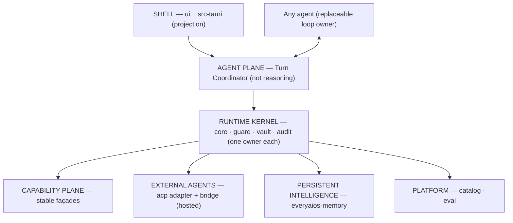

# 01 — System Architecture: Derived Overview

> **DERIVED DOCUMENT — see [`CORE.md`](CORE.md) first.** This file is a *derived overview* of the module
> story. `CORE.md` owns the planes, the primitives and the invariants; the topology diagram below is
> illustrative and must not be read as an authority competing with CORE §2. The plane map in
> `../DESKTOP-APP-SPEC.md` §4.3 is the deployment/ownership view; CORE §2 is the dependency rule.
> **Rewritten `P69.A14` (done 2026-09-20).**

---

> **Status:** Architecture Reference.
> **Core Architectural Principle:** EveryAIOS is the **durable agent operating plane** underneath, with a **cache-aware provider projection** above it, hosting **replaceable external agents** (CORE §1). It does not compete with Claude Code, OpenAI Codex, or OpenCode: it provides the durable desktop environment — Work, context projection, sandboxed Git worktrees, native Office primitives, tiered browsers, computer use, memory, and sole-Guard security — that any model or agent runs inside.

---

## 1.1 The 7 planes (CORE §2 is the authority)

Dependency rule, not a folder preference: plane *n* may depend on plane *n+1*, never the reverse, and **no plane may skip the kernel to reach an effect**.

| Plane | Modules | Role |
|---|---|---|
| **1 Shell** | `src-tauri` · `ui` | projection only — mutation only through the Work Gateway |
| **2 Agent plane** | `coordinator` (turn coordination) · `core-ai` · `core-agents` · `core-memory` (reasoning only) · `core-providers` · `core-search` · `core-tools` · `everyaios-engine` (pure policy) · `everyaios-blueprint` (declarative plans) | orchestration, NOT reasoning — the loop owner is the selected agent ([AGENT.md](AGENT.md)) |
| **3 Runtime kernel** | `everyaios-core` · `everyaios-types` · `everyaios-ipc` · `everyaios-guard` · `everyaios-vault` · `everyaios-audit` | one owner each (CORE §4) |
| **4 Capability plane** | `everyaios-browser` · `everyaios-cdp` · `everyaios-desktop` · `everyaios-office` · `everyaios-storage` · `everyaios-search` · `everyaios-codeintel` · `everyaios-script` · connectors · `everyaios-mcp` | stable façades; capability crates *request* effects, the kernel executor performs them |
| **5 External agents** | `everyaios-acp` (adapter + bridge) | hosted, not owned — lifecycle protocol, never a second kernel |
| **6 Persistent intelligence** | `everyaios-memory` | the persistent memory implementation; algorithms are strategies |
| **7 Platform** | `everyaios-catalog` · `everyaios-eval` | metadata + evaluation; catalog is not a route brain, eval is outside the runtime |

The canonical flow through these planes is CORE §5: Work → Run → Step → tool request → Capability → Authority (Guard) → Executor → Effect → Observation → Verification → Receipt → Event. Memory, UI, recovery and analytics are projections of the Event log.

---

## 1.2 The 4-Question Coupling Test (Coupling vs. Decoupling)

Every subsystem placement follows this test (derived from the ownership matrix, CORE §4):

1. **Does it enforce security boundaries, sandboxing, or audit integrity?**
   - $\to$ **RUNTIME KERNEL (`everyaios-guard`, `everyaios-vault`, `everyaios-audit`)**. Never rely on JavaScript or external agent runtimes for authorization, path validation, SSRF filtering, or secret storage (I10, I12).
2. **Does it guarantee durable state recovery, worktree consistency, or crash resilience?**
   - $\to$ **RUNTIME KERNEL (`everyaios-core` Work/Run/Step, `everyaios-storage`)**. Work outlives sessions, runs, agents, nodes and clients (I6).
3. **Is it a microsecond in-process calculation primitive?**
   - $\to$ **CAPABILITY PLANE in Rust (`everyaios-office` / IronCalc DAG, OOXML surgical XML patcher)**. Local spreadsheet recalculation (300+ Excel functions) and document patching execute in-process with zero network overhead.
4. **Is it an external LLM agent, SaaS integration, or browser instance?**
   - $\to$ **DECOUPLED AS OUT-OF-PROCESS SUBPROCESSES**. External agents (Claude Code, Codex, OpenCode) connect via ACP stdio; MCP servers connect via stdio JSON-RPC; Chrome runs out-of-process via CDP. EveryAIOS never re-implements external coding agent loops or prompts.

---

## 1.3 Module breakdown (function groups mapped to planes)

### Harness & swarm orchestration (planes 2 + 5)

- **Logic**: `crates/everyaios-acp`, `crates/everyaios-core/src/multirun.rs`, `worktrees.rs`, `packages/coordinator/src/chief.ts` (delegation policy). *`chat.ts` — the built-in turn loop — was **archived 2026-09-22** with the engine (`ARCH/archive/coordinator-loop/`, `P71.2c`).*
- **Submodules & Functions**:
  - `acp_client_server`: Bidirectional stdio JSON-RPC transport driving external agents.
  - `worktree_swarm_manager`: Isolated Git worktrees (`.everyaios/worktrees/task-<id>`) with serialized queue and disk headroom reservations.
  - `multirun_fanout_engine`: Fans one Work out to up to 5 Runs — each bound to an agent binding in its own worktree — and reduces them (keep-best / attributed fuse). Agent/run-centric, never a model list (I9: a strategy over Runs, not an execution kernel; ADR-0005: an external agent owns its own model).
  - `subagent_lifecycle_supervisor`: Enforces depth $\le 2$, concurrency $\le 6$, budget fences, and circuit breakers (I8: subagents are child Work/Runs).
- **Frontend UI**: `agents` screen, agent picker dropdown in `chat`, right-rail `diff` viewport (3-way merge resolver), `activity` tree.

### Agent registry, discovery & encrypted vault (plane 3)

- **Logic**: `crates/everyaios-vault`, `crates/everyaios-catalog`, `packages/core-providers`.
- **Submodules & Functions**:
  - `sqlcipher_vault`: AES-256 encrypted SQLite store for credentials, session keys, and secrets (I10: the only holder of key material).
  - `keyring_pool_manager`: Multi-key pools per provider with priority weights.
  - `rate_limit_failover_rotator`: Honest 429-only key rotation with exponential cooldown (`5s` to `300s`). 5xx server errors do not rotate.
  - `provider_wire_broker`: Native HTTP transports for OpenAI, Anthropic, Bedrock SigV4, Vertex, OpenCode Zen/Go/Free, and local keyless runtimes.
  - `catalog_discovery_engine`: 4-hour scheduled sync with `models.dev/api.json` (metadata only, not a route brain).
- **Frontend UI**: `settings` $\to$ Providers & Keys, `settings` $\to$ Local Models (hardware fit inspector), isolated `guard.html` unlock modal.

### Cockpit shell & context engineering (planes 1 + 2)

- **Logic**: `crates/everyaios-engine`, `src-tauri/src/` (the context passport in `acp_cmds.rs` is the live projection). *`packages/coordinator/src/prompt.ts` was **archived 2026-09-22** (`ARCH/archive/coordinator-loop/`, `P71.2c`).*
- **Submodules & Functions**:
  - `prompt_assembler`: 12-segment cache-affine prompt builder with `CACHE_BOUNDARY` markers (I16, I22: serializes Context, owns no policy).
  - `context_compaction_pipeline`: Trims volatile turns, enforces pass-by-ref handles (`refRegistry`), paginates large outputs (50KB cap) — strategies under [`CONTEXT.md`](CONTEXT.md) (I17–I20).
  - `streaming_telemetry_batcher`: 33ms batched token emission with TTFT and token cost tracking.
  - `tauri_ipc_gateway`: 40 native Tauri command modules bridging Rust to React.
- **Frontend UI**: Cockpit layout (`Layout.tsx`), `chat` screen with CoT rollups, 19 right-rail viewports with physical spring motion (CLS = 0).

### Governed MCP & capability marketplace (plane 4)

- **Logic**: `crates/everyaios-mcp`, `crates/everyaios-blueprint`.
- **Submodules & Functions**:
  - `mcp_client_transport`: JSON-RPC 2.0 client supporting stdio child processes and SSE.
  - `tool_schema_registry`: Discovers, parses, and normalizes tool schemas (derives from the kernel `ToolRegistry`, CORE §4).
  - `guard2_tool_interceptor`: Computes IEEE-754 argument hashes and validates Guard-2 tickets.
  - `marketplace_catalog`: Curated catalog of MCP servers with one-click install.
- **Frontend UI**: `connectors` screen, per-agent tool scoping drawer, manual tool test bench.

### Work-native primitives — Office, Browser, CUA (plane 4)

- **Logic**: `crates/everyaios-office`, `crates/everyaios-browser`, `crates/everyaios-desktop`.
- **Submodules & Functions**:
  - `ironcalc_spreadsheet_engine`: Embedded IronCalc 0.8.3 native Rust spreadsheet engine with full DAG formula evaluation (300+ functions) and live formula repair.
  - `ooxml_surgical_patcher`: Byte-preserving XML part patcher for DOCX, XLSX, and PPTX.
  - `pdf_document_runtime`: Form-filling with `pdf.js` annotation storage, lopdf text extraction, and redaction.
  - `tiered_browser_engine`: Lightpanda headless + Chrome CDP automation + Scrapling + CloakBrowser anti-bot stealth.
  - `desktop_operator_cua`: OS-level Computer Use Agent utilizing Windows Graphics Capture, A11y tree extraction, and Win32 `SendInput` (deliberately separate from the browser — [`DESKTOP.md`](DESKTOP.md)).
- **Frontend UI**: Right-rail `office-xlsx` (interactive spreadsheet grid), `office-docx`, `office-pdf`, `browse`, `desktop`.

### Durable work & memory (planes 3 + 6)

- **Logic**: `crates/everyaios-memory`, `crates/everyaios-storage`, `crates/everyaios-codeintel`.
- **Submodules & Functions**:
  - `durable_work_persistence`: Crash-resilient session ledger and task checkpoints (projections of the Event log, CORE §5).
  - **Four memory classes** (Context · Episodic · Knowledge · Procedural — [`MEMORY.md`](MEMORY.md)).
  - `actr_activation_engine`: ACT-R cognitive activation ($A_i = B_i + \sum W_j S_{ji}$) with power-law recency decay — a strategy, not kernel architecture (CORE §12).
  - `codeintel_repomap`: Tree-sitter AST symbol extractor and PageRank graph for token-compact repo mapping (evidence only — never writes, never executes).
- **Frontend UI**: `memory` screen, `projects` & `files` screens, right-rail `graph` (force-directed 2D/3D knowledge graph).

### Executive automations & 24/7 calendar daemon (plane 2)

- **Logic**: `packages/coordinator/src/scheduler.ts`, `crates/everyaios-core/src/automation_runtime.rs`.
- **Submodules & Functions**:
  - `heartbeat_cron_daemon`: 24/7 background scheduler evaluating 5-field cron expressions.
  - `lease_execution_supervisor`: Heartbeat lease model preventing OS sleep during active runs.
  - `calendar_sync_gateway`: Bidirectional iCal, Google Calendar, and Outlook sync with meeting prep workflows.
  - `deadletter_retry_handler`: Exponential backoff retries with dead-letter queue.
- **Frontend UI**: `automations` screen, `calendar` screen (Month/Week/Day view with AI time blocks), right-rail `terminal`.

### Security Guard & audit membrane (plane 3)

- **Logic**: `crates/everyaios-guard`, `crates/everyaios-audit`.
- **Submodules & Functions** (sole-Guard ownership per [`SECURITY.md`](SECURITY.md)):
  - `prompt_injection_firewall`: J6 `<user_document>` delimiter wrapping and "prompt-is-not-permission" invariant.
  - `ssrf_netfloor`: Zero-I/O network filter blocking RFC1918 private subnets and cloud metadata IP (`169.254.169.254`) — all outbound network crosses `netfloor` (I11).
  - `pathfloor_lexical_jail`: Strict directory boundary enforcement preventing path traversal — all writes cross `pathfloor` (I11).
  - `guard_ttl_ticket_authority`: Single-use, argument-bound authorization tickets carrying authorization provenance (CORE §5.1).
  - `os_sandbox_containment`: Multi-platform isolation (Windows Win32 Job Objects & Restricted Tokens, Linux `bubblewrap`, macOS Seatbelt) — a mechanism, not the architecture (I13).
  - `merkle_audit_chain`: Append-only execution log with SHA-256 Merkle tree verification (I5).
- **Frontend UI**: `guard` screen, `activity` audit log viewer, isolated Guard approval diff cards.

---

## 1.4 Data Layer Concurrency (SQLite WAL)

All local databases use **WAL (Write-Ahead Logging)** journal mode:
- Reads NEVER block (multiple readers concurrent with one writer).
- Single-writer at the DB level serialized via Rust mutex.
- Per-agent write queues drain into a FIFO merge queue before hitting the writer.
- `PRAGMA journal_mode=WAL; PRAGMA busy_timeout=5000;` set on every connection.
- Vault (SQLCipher) also uses WAL mode.
