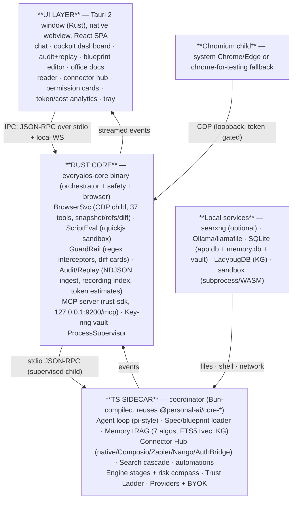
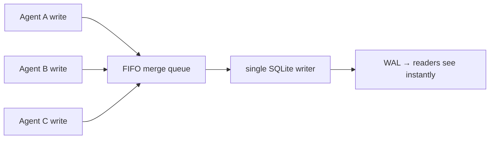

# 01 — System Architecture (Hybrid)

## 1.1 The map

## 1.2 Why this split (evidence)

- **Keep TS sidecar** — the asset: ~100 vitest test files already shipping the hard parts (memory algos, RAG, connectors, providers, engine stages, trust ladder). Rewriting = months with no new capability. (v2.0 §3; docs 03 §9, 04.)
- **Rust core for the new surfaces** — the research's most expensive-to-get-wrong pieces are all Rust-native and proven there: browser CDP control (BrowserOS `browseros-cdp`/`core`, 14K-LOC server), sandboxed script eval (rquickjs — BrowserOS `run` tool), security interceptors + audit (must not be in a dynamically-typed process), MCP serving (official `modelcontextprotocol/rust-sdk` — BrowserOS originally used `rmcp`; the official SDK now tracks the 2026-07-28 stateless spec), and the key-ring vault (keep secrets out of the LLM's reach, doc 19 §7). (Docs 33, 34 §2.)
- **One UI, one binary family** — the Tauri shell is the only GUI process; sidecar and browser are supervised children (doc 03 reconnect/resume; BrowserOS supervision patterns).

## 1.3 Processes & lifecycle

| Process | Parent | Starts | Dies | Restart policy |
|---|---|---|---|---|
| `everyaios-core` (Rust) | OS (tray) | app launch | app quit | — (the root) |
| `coordinator` (Bun-compiled sidecar) | everyaios-core | pre-spawned at boot (J16) | crash, idle, explicit stop | Supervisor: exponential backoff (1s→2s→4s→60s cap), circuit breaker after 5 crashes/10min, `reconnecting` state surfaced to UI (doc 03, v2.0 §4.3) |
| Chromium child | everyaios-core | on first browser use | idle sweep (session retention 60min default), explicit close | one-shot spawn; no auto-restart |

**Browser children are tiered (08 §8.8):** system Chrome/Edge = interactive default; **Lightpanda** (default) / **Obscura** (opt-in) = lightweight CDP tier for scrape/RAG at ~16× less memory; optional user-gated stealth engines (Camoufox via Playwright, CloakBrowser via CDP) for hard bot defenses. One CDP driver (`everyaios-cdp`), task tier picks the engine. Sessions/accounts live in the encrypted **Session Vault** (08 §8.9) with Trust-Ladder-gated access; challenges go through the handler tier (08 §8.10).
| Ollama / llamafile | everyaios-core (optional) | on local-model use | user stop | spawned only when a local model is selected |
| searxng instance | everyaios-core (optional) | on search use (if user-installed) | user stop | optional; primary path is public-instance cascade (core-search built) |

**Startup order:** everyaios-core boots (config, vault, SQLite) → UI window → sidecar pre-spawned at Tauri boot (hidden, ~200ms perceived cold start per J16) → browser on first browser tool. **Idle RSS:** measure & publish the real numbers — <30MB idle / <80MB warm are targets to verify, not promises (the Bun-compiled sidecar alone is ~93MB, J16); browser adds only when used. No service is loaded at boot unless needed (spec §6.5).

## 1.4 IPC contracts

1. **Tauri ⇄ everyaios-core**: Tauri commands + events (typed Rust structs; streaming via channels). Covers UI actions, permission-card responses, live token/cost streams.
2. **everyaios-core ⇄ coordinator**: **JSON-RPC over stdio** (the standard, robust child pattern — GenOffice watchdog, BrowserOS process-compose), with **length-prefixed framing** (`[u32 LE length][bytes]`) + bounded channels (doc 43 §2.2), an optional **UNIX-socket transport** at build time (zero port collision — doc 43 §1.2), and an **IPC payload budget** (tool result 50KB cap / ref-only for snapshots+office files — doc 42 §3.2, spec §4). Contract groups:
   - `agent.*` — start/stop session, stream turn, inject blueprint, spawn subagent, nudge cards
   - `memory.*` — retrieve (multi-signal), save, warm-set swap, morning-brief
   - `connector.*` — hub routing, connect/disconnect, usage meters
   - `search.*` / `research.*` — cascade + research tree
   - `tool.*` — permission check (sidecar asks core; core enforces GuardRail + returns allow/ask/deny)
   - `events.*` — audit rows, tool dispatches, token/cost deltas, status
3. **everyaios-core ⇄ Chromium**: CDP over WebSocket on loopback port (system Chrome `--remote-debugging-port=0` → read the actual port from DevToolsActivePort; token-gated). **Recording**: browser-side injected recorder posts NDJSON batches with `x-recording-tab-id/document-id/batch-id` headers to everyaios-core's ingest endpoint (BrowserOS contract, doc 33 §9).
4. **coordinator ⇄ providers**: HTTPS to BYOK endpoints via **key-ring manager** (ARCH/03) — the coordinator never holds raw keys; everyaios-core vault serves one resolved key per call through a sealed channel (v2.0 CES pattern, doc 19 §7).

## 1.5 Data flow — one agent turn

1. UI sends prompt → everyaios-core → sidecar.
2. Sidecar: load blueprint/agent config → build messages → **token budget check** (05) → resolve provider via **key-ring** (03) → stream LLM.
3. Loop: model emits tool call → sidecar normalizes (grammar extraction if weak model) → **permission check** → everyaios-core GuardRail (regex intercept; diff-card handshake for escalated ops) → execute (browser via CDP, files via core, connectors via hub) → **audit row + token estimate** (everyaios-core) → result (snip if stale/oversized) → loop.
4. Compaction triggers per Reasonix/BrowserOS ratios (05). Memory writes/retrievals per 07. Every step lands in the audit DB (06).

## 1.6 Security posture (summary — details in 06)

- Secrets live in the **Rust vault** (SQLCipher), never in the LLM context, never in the sidecar process memory longer than one call.
- All loopback listeners token-gated (MCP endpoint, CDP, ingest).
- All mutating OS/browser actions pass the **dual-guard** (deterministic regex + human diff-card click).
- Browser tabs are ownership-isolated: `mine | user | other-agent` (BrowserOS model, doc 33 §6).
- Audit is append-only and replayable.

---

## 1.7 Data Layer Concurrency (SQLite WAL)

All local databases use **WAL (Write-Ahead Logging)** journal mode:
- Reads NEVER block (multiple readers concurrent with one writer)
- Single-writer at the DB level (serialized via Rust mutex)
- Per-agent write queues drain into a FIFO merge queue before hitting the writer
- `PRAGMA journal_mode=WAL; PRAGMA busy_timeout=5000;` set on every connection open
- Vault (SQLCipher) also uses WAL mode

**Concurrency model:**

This avoids SQLITE_BUSY errors entirely while maintaining append-only audit guarantees.