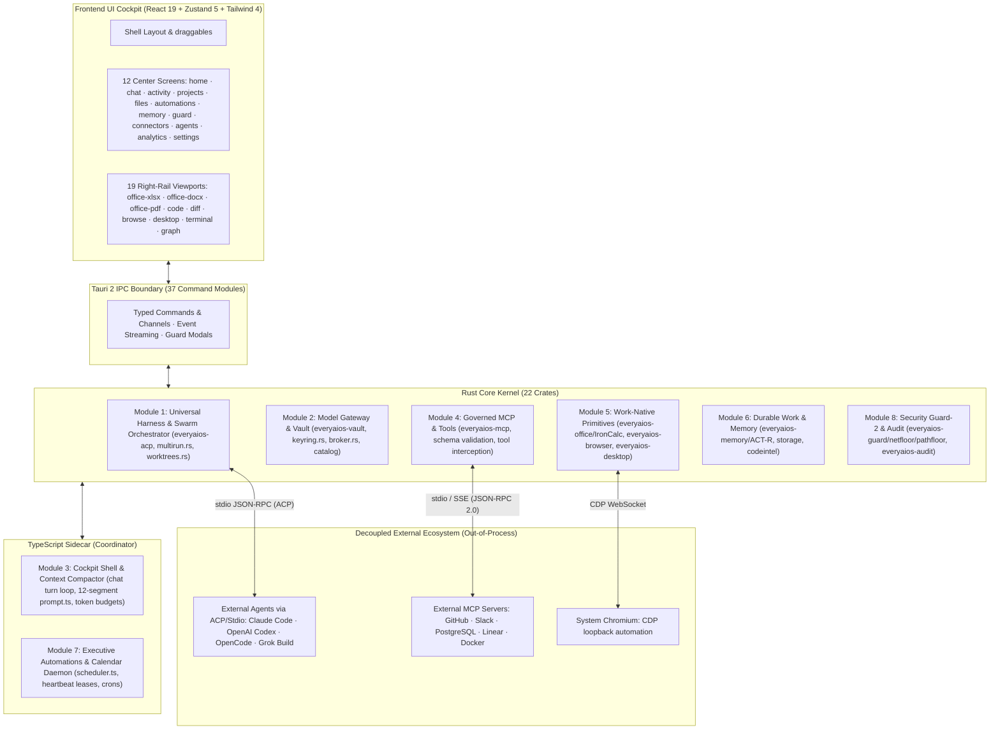

# 01 — System Architecture: The 8 Full-Stack Modules

> **Status:** Architecture Reference.
> **Core Architectural Principle:** EveryAIOS is the **Universal Agentic OS & Desktop Harness ("Switzerland of AI")**. It rejects the proprietary coding agent trap and does not compete with Claude Code, OpenAI Codex, or OpenCode. Instead, EveryAIOS provides the durable desktop operating layer, sandboxed Git worktrees, native Office primitives, tiered browsers, computer use, cognitive memory, and 7-layer Guard-2 security that supercharges any model or agent.

---

## 1.1 Architectural Topology: The 8 Full-Stack Modules

EveryAIOS is structured into 8 cohesive Full-Stack Modules spanning native Rust kernel services, TypeScript sidecar coordination, and React 19 cockpit views:

---

## 1.2 The 4-Question Coupling Test (Coupling vs. Decoupling)

To prevent architectural bloat and maintain strict system integrity, EveryAIOS enforces the **4-Question Coupling Test** for every subsystem:

1. **Does it enforce security boundaries, sandboxing, or audit integrity?**
   - $\to$ **TIGHTLY COUPLED IN RUST KERNEL (`everyaios-guard`, `everyaios-vault`, `everyaios-audit`)**. Never rely on JavaScript or external agent runtimes for authorization, path validation, SSRF filtering, or secret storage.
2. **Does it guarantee durable state recovery, worktree consistency, or crash resilience?**
   - $\to$ **TIGHTLY COUPLED IN CORE (`everyaios-core/worktrees.rs`, `everyaios-storage`)**. Work must survive process restarts, Chief swaps, and machine reboots.
3. **Is it a microsecond in-process calculation primitive?**
   - $\to$ **TIGHTLY COUPLED IN RUST (`everyaios-office` / IronCalc DAG, OOXML surgical XML patcher)**. Local spreadsheet recalculation (300+ Excel functions) and document patching execute in-process with zero network overhead.
4. **Is it an external LLM agent, SaaS integration, or browser instance?**
   - $\to$ **DECOUPLED AS OUT-OF-PROCESS SUBPROCESSES**. External agents (Claude Code, Codex, OpenCode) connect via ACP stdio; MCP servers connect via stdio JSON-RPC; Chrome runs out-of-process via CDP. EveryAIOS never re-implements external coding agent loops or prompts.

---

## 1.3 Deep Breakdown of the 8 Full-Stack Modules

### Module 1: Universal Agent Harness & Swarm Orchestrator
- **Logic**: `crates/everyaios-acp`, `crates/everyaios-core/src/multirun.rs`, `worktrees.rs`, `packages/coordinator/src/chat.ts`, `chief.ts`.
- **Submodules & Functions**:
  - `acp_client_server`: Bidirectional stdio JSON-RPC transport driving external agents.
  - `worktree_swarm_manager`: Isolated Git worktrees (`.everyaios/worktrees/task-<id>`) with serialized queue and disk headroom reservations.
  - `multirun_fanout_engine`: Fans out 1 prompt across up to 5 concurrent models in parallel worktrees with 3-way merge fusion.
  - `subagent_lifecycle_supervisor`: Enforces depth $\le 2$, concurrency $\le 6$, budget fences, and circuit breakers.
- **Frontend UI**: `agents` screen, Chief picker dropdown in `chat`, right-rail `diff` viewport (3-way merge resolver), `activity` tree.

### Module 2: Model Gateway & Encrypted Keyring Vault
- **Logic**: `crates/everyaios-vault`, `crates/everyaios-catalog`, `packages/core-providers`.
- **Submodules & Functions**:
  - `sqlcipher_vault`: AES-256 encrypted SQLite store for credentials, session keys, and secrets.
  - `keyring_pool_manager`: Multi-key pools per provider with priority weights.
  - `rate_limit_failover_rotator`: Honest 429-only key rotation with exponential cooldown (`5s` to `300s`). 5xx server errors do not rotate.
  - `provider_wire_broker`: Native HTTP transports for OpenAI, Anthropic, Bedrock SigV4, Vertex, OpenCode Zen/Go/Free, and local keyless runtimes.
  - `catalog_discovery_engine`: 4-hour scheduled sync with `models.dev/api.json`.
- **Frontend UI**: `settings` $\to$ Providers & Keys, `settings` $\to$ Local Models (hardware fit inspector), isolated `guard.html` unlock modal.

### Module 3: Unified Cockpit Shell & Context Compaction Engine
- **Logic**: `packages/coordinator/src/prompt.ts`, `crates/everyaios-engine`, `src-tauri/src/`.
- **Submodules & Functions**:
  - `prompt_assembler`: 12-segment cache-affine prompt builder with `CACHE_BOUNDARY` markers.
  - `context_compaction_pipeline`: Trims volatile turns, enforces pass-by-ref handles (`refRegistry`), paginates large outputs (50KB cap).
  - `streaming_telemetry_batcher`: 33ms batched token emission with TTFT and token cost tracking.
  - `tauri_ipc_gateway`: 37 native Tauri command modules bridging Rust to React.
- **Frontend UI**: Cockpit layout (`Layout.tsx`), `chat` screen with CoT rollups, 19 right-rail viewports with physical spring motion (CLS = 0).

### Module 4: Governed MCP & Capability Marketplace
- **Logic**: `crates/everyaios-mcp`, `crates/everyaios-blueprint`.
- **Submodules & Functions**:
  - `mcp_client_transport`: JSON-RPC 2.0 client supporting stdio child processes and SSE.
  - `tool_schema_registry`: Discovers, parses, and normalizes tool schemas.
  - `guard2_tool_interceptor`: Computes IEEE-754 argument hashes and validates Guard-2 tickets.
  - `marketplace_catalog`: Curated catalog of MCP servers with one-click install.
- **Frontend UI**: `connectors` screen, per-agent tool scoping drawer, manual tool test bench.

### Module 5: Work-Native Primitives (Office, Browser, CUA)
- **Logic**: `crates/everyaios-office`, `crates/everyaios-browser`, `crates/everyaios-desktop`.
- **Submodules & Functions**:
  - `ironcalc_spreadsheet_engine`: Embedded IronCalc 0.8.3 native Rust spreadsheet engine with full DAG formula evaluation (300+ functions) and live formula repair.
  - `ooxml_surgical_patcher`: Byte-preserving XML part patcher for DOCX, XLSX, and PPTX.
  - `pdf_document_runtime`: Form-filling with `pdf.js` annotation storage, lopdf text extraction, and redaction.
  - `tiered_browser_engine`: Lightpanda headless + Chrome CDP automation + Scrapling + CloakBrowser anti-bot stealth.
  - `desktop_operator_cua`: OS-level Computer Use Agent utilizing Windows Graphics Capture, A11y tree extraction, and Win32 `SendInput`.
- **Frontend UI**: Right-rail `office-xlsx` (interactive spreadsheet grid), `office-docx`, `office-pdf`, `browse`, `desktop`.

### Module 6: Durable Work & Cognitive 5-Tier Memory Subsystem
- **Logic**: `crates/everyaios-memory`, `crates/everyaios-storage`, `crates/everyaios-codeintel`.
- **Submodules & Functions**:
  - `durable_work_persistence`: Crash-resilient session ledger and task checkpoints.
  - `five_tier_memory_model`: Working, Episodic, Semantic (SQLite FTS5 BM25), Procedural (`SKILL.md`), and Entity Knowledge Graph.
  - `actr_activation_engine`: ACT-R cognitive activation ($A_i = B_i + \sum W_j S_{ji}$) with power-law recency decay.
  - `codeintel_repomap`: Tree-sitter AST symbol extractor and PageRank graph for token-compact repo mapping.
- **Frontend UI**: `memory` screen, `projects` & `files` screens, right-rail `graph` (force-directed 2D/3D knowledge graph).

### Module 7: Executive Automations & 24/7 Calendar Daemon
- **Logic**: `packages/coordinator/src/scheduler.ts`, `crates/everyaios-core/src/automation_runtime.rs`.
- **Submodules & Functions**:
  - `heartbeat_cron_daemon`: 24/7 background scheduler evaluating 5-field cron expressions.
  - `lease_execution_supervisor`: Heartbeat lease model preventing OS sleep during active runs.
  - `calendar_sync_gateway`: Bidirectional iCal, Google Calendar, and Outlook sync with meeting prep workflows.
  - `deadletter_retry_handler`: Exponential backoff retries with dead-letter queue.
- **Frontend UI**: `automations` screen, `calendar` screen (Month/Week/Day view with AI time blocks), right-rail `terminal`.

### Module 8: Security Guard-2 & Merkle Audit Membrane
- **Logic**: `crates/everyaios-guard`, `crates/everyaios-audit`.
- **Submodules & Functions**:
  - `prompt_injection_firewall`: J6 `<user_document>` delimiter wrapping and "prompt-is-not-permission" invariant.
  - `ssrf_netfloor`: Zero-I/O network filter blocking RFC1918 private subnets and cloud metadata IP (`169.254.169.254`).
  - `pathfloor_lexical_jail`: Strict directory boundary enforcement preventing path traversal.
  - `guard2_ttl_ticket_authority`: Cryptographically signed, time-limited mutation tickets.
  - `os_sandbox_containment`: Multi-platform isolation (Windows Win32 Job Objects & Restricted Tokens, Linux `bubblewrap`, macOS Seatbelt).
  - `merkle_audit_chain`: Append-only execution log with SHA-256 Merkle tree verification.
- **Frontend UI**: `guard` screen, `activity` audit log viewer, isolated Guard approval diff cards.

---

## 1.4 Data Layer Concurrency (SQLite WAL)

All local databases use **WAL (Write-Ahead Logging)** journal mode:
- Reads NEVER block (multiple readers concurrent with one writer).
- Single-writer at the DB level serialized via Rust mutex.
- Per-agent write queues drain into a FIFO merge queue before hitting the writer.
- `PRAGMA journal_mode=WAL; PRAGMA busy_timeout=5000;` set on every connection.
- Vault (SQLCipher) also uses WAL mode.