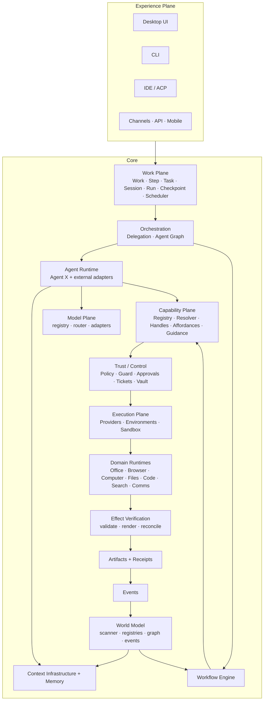

# 03 — High-Level Architecture (HLD)

> **Status:** Draft P0 — architecture root for **HOW** (see `ARCH/00-INDEX.md` §2). Module docs derive from this file; conflicts escalate to a `DEC` entry.
> **Companion docs:** `ARCH/02-THESIS.md` (identity, principles) · `ARCH/06-DATA-MODEL.md` (entities) · `ARCH/07-CONTRACTS.md` (interfaces).

## 1. Shape



*The diagram shows primary flow, not every edge. The authoritative edge list is the module map (§3) plus each module doc's contract section.*

## 2. Planes — ownership boundaries

| Plane | Owns | Never owns |
|---|---|---|
| Experience | Rendering, input, presentation, view state | Domain logic, execution, policy |
| Work | Lifecycle, checkpoints, scheduling, budgets, cancellation | Reasoning, execution |
| Orchestration | Delegation, agent graph, workflow control flow | Raw execution |
| Agent Runtime | Reasoning, context control, planning, model calls | Capability implementation, policy |
| Capability | Semantic operation catalog, resolution, handles, affordances, guidance | Model reasoning |
| Trust / Control | Policy, permissions, approvals, tickets, egress, custody (vault), audit | Domain logic |
| Execution | Running provider calls, environments, sandbox, process lifecycle | Deciding *whether* to run |
| Domain Runtimes | Office / Browser / Computer / Files / Code specialized execution | Agent reasoning, governance |
| Effect Verification | Validate / render / verify / reconcile effects | Deciding what to build |
| Receipts & Events | Durable evidence, replay, audit, projections | Live execution |
| World Model *(cross-cutting)* | Structural state of the machine + change stream | Acting on the world |
| Model Plane | Model catalog, routing, adapter normalization; credential **use** via vault | Holding credentials (vault owns custody) |

## 3. Module map

> `Depends on` lists primary dependencies. Every edge MUST have a named contract in `ARCH/07-CONTRACTS.md` (P1) or the owning module doc.

| Doc | Module | Responsibility | Depends on |
|---|---|---|---|
| 10 | Kernel | ids, errors, config, time, serialization, contracts | — |
| 11 | Work | Work/Step/Task/Session/Run/Checkpoint/Scheduler; lanes (foreground/background/detached) | kernel |
| 12 | Trust | Policy, Guard, approvals, tickets, vault, egress, audit hooks, external-agent projections | kernel, work |
| 13 | Capability | Registry, catalog, resolver, handles (epoch-checked), affordances, guidance | kernel, work, providers, trust |
| 14 | Providers | `ProviderAdapter` contract + native/MCP/ACP/HTTP/CLI/plugin/remote adapters; MCP era policy | kernel, trust, runtime-environments |
| 15 | Agent X | Native agent: loop, planner, delegation, recovery, completion contracts, surfacing (CLI, ACP) | work, context, memory, capability, models, runtime-environments |
| 16 | Context | Context infrastructure (Core: store/query/snapshot/checkpoint) + context control (Agent X) + projections | kernel, files, world-model, memory, artifacts |
| 17 | Memory | Durable memory: layers, write/read paths, minimal algorithm set, lifecycle | kernel, events |
| 18 | Models | Model registry, router, adapters, local discovery (Ollama/LM Studio/vLLM/llama.cpp), reasoning mapping | kernel, trust (vault) |
| 19 | Runtime & Environments | Process manager, environments, sandbox, lifecycle, health | kernel, trust |
| 20 | Workflow | Workflow IR, registry, scheduler, state/version store, approval nodes | work, capability, agent runtime, events, world-model |
| 21 | World Model | Scanner, app/window/process/device/BrowserWorld/FileWorld registries, world graph, event stream, incremental updates | kernel, events, domain collectors |
| 22 | Office | L1/L2/L3 semantics, resident contexts, batch, render/validate, format providers | capability, providers, runtime-environments, trust |
| 23 | Browser | Managed Chromium + adapters, BrowserWorld, capability ladder rungs | capability, providers, world-model |
| 24 | Computer Use | UI automation, accessibility trees, vision fallback, input safety | world-model, capability, models (vision) |
| 25 | Files | File identity, watchers, deltas, leases (write conflicts) | kernel, events |
| 26 | Code | RepoGraph, RepoMap, LSP bridge, worktrees, code execution | files, capability, runtime-environments |
| 27 | Search | Search plane (files, memory, artifacts, world objects) | files, memory, artifacts, world-model |
| 28 | Comms | Connectors: email/calendar/messaging as capability layer | capability, providers, trust |
| 29 | Artifacts | Artifact + Receipt models, versions, provenance, previews, library promotion | kernel, files, events |
| 30 | Events | Event store, bus, replay, subscriptions; usage & cost telemetry | kernel |
| 31 | Skills & Plugins | Skill registry/loader/resolver; plugin surfaces (capabilities, providers, agents, models, channels, UI) | capability, work, trust |
| 32 | Channels | Surfaces & protocols: desktop, CLI, ACP, A2A, API, mobile; agent gateway | everything above (thin) |
| 34 | Effect Verification | Validate/render/verify/reconcile pipeline; receipt policy per risk | domains, artifacts, events |
| 40–42 | Cross | Flows, edge cases, evidence map | all |
| 44 | Absorb Register | Competitor absorb matrix + licensing ledger | archive/REPO-COMPARE evidence |

## 4. Dependency rules

1. **Direction is downward only:** Experience → Work/Orchestration → Agent/Capability → Trust → Execution → Domains; cross-cutting services (events, artifacts, memory, world) are leaves others may depend on, never the reverse.
2. **Kernel stays small.** No domain logic, no orchestration, no policy in the kernel.
3. **One implementation per responsibility.** No second orchestrator, registry, scheduler, provider system, or permission system — including “temporary” ones.
4. **Adapters at the edge.** MCP/ACP/CLI/HTTP/remote live only in Providers/Channels; nothing above Capability knows the transport.
5. **Domains never govern themselves.** Domain runtimes execute; Trust decides; the kernel never special-cases a domain's permission path.
6. **External agents are clients of the public contract** — they MUST NOT be given internal module access to make integration easier.

## 5. The governed execution path

```
USER INTENT
   → WORK (create/resume)                     ◄── control path: bounded, synchronous
   → CAPABILITY (resolve semantic operation)
   → PROVIDER (resolver picks implementation)
   → HANDLE (cached, epoch-checked)                control path target:
   → GUARD (ALLOW | ASK | DENY)                    p50 < 2 ms · p95 < 10 ms · p99 < 25 ms
   → TICKET (scoped, time-boxed authorization)
   → EXECUTE (enqueued)                        ◄── effect path: async, observable
   → EFFECT
   → VERIFY (validate / render / reconcile)
   → RECEIPT (durable evidence)
   → EVENT (published)
```

- **No shortcuts.** Not `agent → raw MCP tool → side effect`; not `UI → special-cased Office backend`; not `browser feature → its own permission system`; not `external agent adapter → its own capability semantics`.
- **Verification depth scales with risk class** (`safe` / `sensitive` / `dangerous`) — defined in `ARCH/34-EFFECT-VERIFICATION.md`.
- **Receipts are mandatory for externally visible effects.**

## 6. Scoping model

**Four states** — applied to MCP servers, skills, plugins, providers, models alike:

| State | Question | Example |
|---|---|---|
| Installed | Does AgentCowork have this at all? | GitHub MCP server installed |
| Available | Can this agent/workspace use it? | Workspace policy allows it |
| Activated | Is it loaded for this task? | Only relevant skills load into context |
| Executing | Is it running right now? | An actual tool call / session / worker |

**Five scopes** (outer → inner): **Global/User → Workspace/Project → Agent → Session → Run/Task.**
Resources are installed/available at Global or Workspace and never duplicated per agent; only activation and execution are scoped narrowly.

## 7. Cross-cutting subsystems

- **Context** (`16`): Core owns infrastructure (store/query/snapshot/checkpoint/projection); Agent X owns control (selection/ranking/budget/prune/compact/rebuild). External agents get a **context projection**, never the substrate.
- **Memory** (`17`): durable knowledge; written via explicit lifecycle (not an LLM dumping everything); read through the Context Controller under budget. Memory ≠ context.
- **World Model** (`21`): the machine explains itself — registries + graph + event stream; consumers query, they do not screenshot by default.
- **Events** (`30`): one event store; UI projections, workflow triggers, world updates, audit, and usage/cost telemetry all derive from it.
- **Artifacts & Receipts** (`29`): outputs of work vs reusable inventory (Library); promotion is explicit.
- **Model Plane** (`18`): one catalog, one router; Agent X and every internal consumer ask the router, never a vendor SDK directly.

## 8. Module interop matrix (first cut — expanded per module in P2/P3, verified in P6)

| Module | Exposes (primary) | Consumed by |
|---|---|---|
| Kernel | types, ids, errors, config | all |
| Work | Work service, lanes, checkpoints | agents, workflows, UI, scheduler consumers |
| Trust | Guard decisions, tickets, approvals, projections | capability, providers, channels, domains |
| Capability | resolve/invoke, handles, descriptors | agents, workflows, UI (deterministic ops) |
| Providers | adapter registry, health, events | capability |
| Agent X | `AgentEngine` implementation, CLI, ACP surface | work, channels, delegation |
| Context | query/snapshot/checkpoint + projection | agents, workflow nodes |
| Memory | memory service (write/read/forget) | agents, context |
| Models | registry, router, adapters | agents, vision, embeddings |
| Runtime & Environments | environment handles, process/sandbox lifecycle | providers, domains |
| Workflow | engine, registry, run state | agent tool surface, schedulers |
| World Model | world query/subscribe | context, workflows, domains, UI |
| Domains | capability descriptors + execution | capability |
| Artifacts | artifact/receipt service | agents, workflows, UI, library |
| Events | store/bus/replay/subscriptions | everyone (read/subscribe) |
| Verification | validated effects + render/verify results | capability (pre-receipt) |

## 9. Implementation order (after docs freeze; not current work)

1. **Six core contracts first:** `AgentEngine`, `AgentSession`, `ContextController` (+ `ContextProvider`), `CapabilityBroker`, `SubagentManager`, `ModelAdapter`.
2. **Minimal native runtime:** model streaming, tool loop, project rules, RepoGraph/RepoMap, filesystem, shell, git, parallel workers, background execution, structured-checkpoint compaction, Core capability access.
3. **Bolt on domains:** browser, Office, computer-use, MCP provider adapter, plugins/skills, ACP server.
4. **Workflow Engine** wired to Capability Plane and World Model events.
5. **World Model** — scanner, registries, graph, incremental updates.
6. **Experience Plane** — shell, Workbench, universal document surface, composer with the namespace protocol.
7. **Multi-surface** — CLI, IDE/ACP, API, mobile, cloud/remote handoff.

## 10. Architecture risks to resolve in module passes

| ID | Risk | Resolved in |
|---|---|---|
| RISK-001 | Control-path latency targets depend on handle caching + ticket reuse; needs a design that keeps Guard cheap without weakening it. | 12, 13 |
| RISK-002 | World Model scope creep (scanning everything) vs value; incremental updates must be provably bounded. | 21 |
| RISK-003 | Workflow durability parity with established runtimes (timers, versioning, cancellation) without adopting one wholesale. | 20 |
| RISK-004 | Office resident contexts — memory/lifecycle bounds and crash safety. | 22 |
| RISK-005 | External-agent projection fidelity: enough context to work, not enough to leak. | 12, 16, 32 |
| RISK-006 | Memory minimalism: retrieval quality with a small algorithm set. | 17 |
| RISK-007 | Provider adapter counting: capability × provider matrix stays declarative, not hand-maintained. | 13, 14 |
