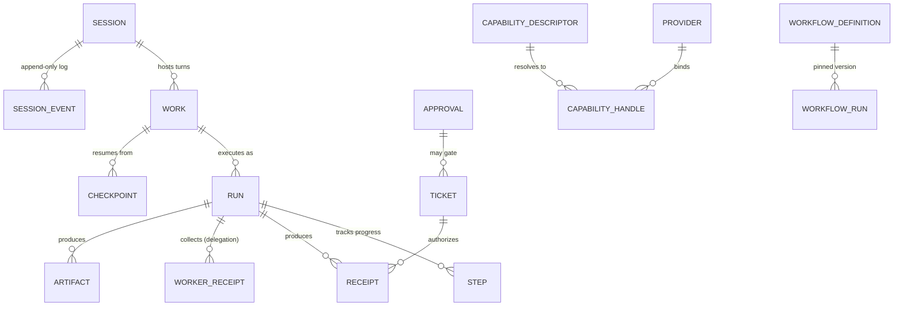

# 06 — Data Model (canonical entity registry)

> **Status:** Draft P1. This is the **entity registry**: one canonical identity per shared entity, with one owner doc each. Module docs carry detailed schemas; this doc owns identity strategy, shared field rules, state-machine naming, and cross-entity constraints. Where this doc and a module doc disagree on naming/identity, **this doc wins**; on field detail, the owner doc wins.
> **Evidence:** product-owner brief schemas · `ARCH/15-AGENT-X.md`, `ARCH/16-CONTEXT.md`, `ARCH/17-MEMORY.md` · `ARCHIVE/v1-research/agent-harness-verification.md` (receipt/limit shapes) · `ARCH/12-TRUST.md`/`13`/`14`/`20` pending (shapes marked *provisional*).

## 0. Conventions

- **IDs:** uuidv7 (time-ordered) for entities; capability ids are dotted semantic names (`office.spreadsheet.edit`); provider ids are stable registry ids. IDs are opaque — never encode state or meaning.
- **Time:** integer epoch milliseconds (UTC) internally; ISO-8601 at boundaries. Local wall-clock time is **never** a durable field.
- **One writer** per entity store (INV-06). Cross-store changes happen via contracts + events, never by shared writes.
- **Immutability classes:**
  - *immutable:* `Event`, `SessionEvent`, `Receipt`, artifact **versions**, `Checkpoint`, workflow **versions**, `WorkerReceipt`.
  - *mutable-with-audit:* `Work`, `Run`, `Step`, `Session`, `WorkflowRun`, `Approval` state transitions.
  - *hard-delete allowed:* `MemoryItem` (explicit forget → suppression record, DEC-018); everything else tombstones + audit.
- **Secrets:** no entity ever stores a credential value — vault references only (INV-02).
- **Sensitivity:** entities that can carry user content have `sensitivity: public | personal | confidential` (default `personal`); this is the **only** sensitivity vocabulary (`normal`/`sensitive` are not sensitivity classes — risk classes are a separate scale); memory carries its own class rules and the assignment/floor rule (`17`, DEC-038).
- **Versioning:** any entity that can be referenced by a running execution (workflow, capability, skill, agent) is content-versioned; runs record the version they started with (INV-16).

## 1. Registry

| DM | Entity | Owner doc | Purpose | Key states |
|---|---|---|---|---|
| DM-001 | `Work` | `11` | Universal execution unit (chat turn, job, workflow run, subagent task, automation) | queued → running → waiting/paused/awaiting_approval → completed/failed/cancelled/expired |
| DM-002 | `Step` | `11` | Unit of progress inside a run | pending → active → done/failed/skipped |
| DM-003 | `Task` | `11` | **Projection** over `Work` + `Step` + assignment metadata — not a standalone durable table (`11` §2) | derived (open → claimed → done/blocked/cancelled) |
| DM-004 | `Session` | `11` | Durable conversation/agent-context container | active → hibernated → archived |
| DM-005 | `Run` | `11` | One concrete execution of an agent (or workflow node) | started → streaming → waiting → terminal |
| DM-006 | `Checkpoint` | `16` (stored `11`) | Durable state-reconstruction point (work · context · workflow) | immutable |
| DM-007 | `SessionEvent` | `11` | Append-only session log entry (the log is truth; UI/prompt/pending are projections) | immutable |
| DM-008 | `Event` | `30` | System-wide published fact (triggers, projections, telemetry, audit feed) | immutable |
| DM-009 | `Ticket` | `12` | Scoped, time-boxed authorization for one effect | issued → used → expired/revoked |
| DM-010 | `Approval` | `12` | Human decision record (agent question · workflow approval node) | requested → granted/denied/edited/expired |
| DM-011 | `CapabilityDescriptor` | `13` | Semantic operation definition | versioned |
| DM-012 | `CapabilityHandle` | `13` | Resolved provider binding (epoch-checked) | valid → stale (epoch bump) → expired |
| DM-013 | `ProviderInfo` | `14` | Provider registration + health | registered → connected → degraded → down |
| DM-014 | `AgentProfile` | `15` | Agent definition (native or external); incl. composer capabilities | installed / available / disabled |
| DM-015 | `DelegationPolicyEntry` | `15` | Worker configuration for delegation | versioned |
| DM-016 | `WorkerReceipt` | `15` | Result summary returned to the parent (never the transcript) | immutable |
| DM-017 | `ContextItem` | `16` | Context fragment record (reference-first) | ephemeral |
| DM-018 | `MemoryItem` | `17` | Durable memory atom | current → superseded; forgotten (suppressed) |
| DM-019 | `Artifact` | `29` | Versioned work product | created → versions (immutable) → archived |
| DM-020 | `Receipt` | `29` | Durable evidence of one externally visible effect | immutable |
| DM-021 | `WorkflowDefinition` | `20` | Deterministic process IR | draft → published (versioned) |
| DM-022 | `WorkflowRun` | `20` | Workflow execution record | queued → running → waiting/paused/awaiting_approval/retrying → completed/failed/cancelled/expired |
| DM-023 | `LibraryItem` | `29` | Reusable inventory entry (explicit promotion only) | active → deprecated |
| DM-024 | `Workspace` | `25` | Scope anchor (folder/repo/multi-root) + project identity | — |
| DM-025 | `ModelDescriptor` | `18` | Model capabilities/pricing/limits registry entry | versioned by provider |
| DM-026 | `WorldObject` (+`WorldEdge`) | `21` | Structural world state + relationships | ephemeral with freshness stamps |
| DM-027 | `Skill` | `31` | Reusable know-how package (instructions + capability requirements) | versioned |

### 1.1 Core relationships (load-bearing references)

*Association lines show load-bearing references, not every field. Epoch checks, projections, and suppression semantics live in the owner docs and §3.*

## 2. Shared field blocks (cross-cutting entities)

> Detailed SQL/TS lives in owner docs; these are the load-bearing shared fields.

**DM-001 `Work`** — `id` · `kind` (`session_turn` | `job` | `workflow_run` | `subagent_task` | `automation`) · `status` · `parent_work_id?` · `session_id?` · `agent_id?` · `workspace_id` · `objective` · `completion_contract_ref?` · `budget {tokens, cost, time}` · `checkpoint_ref?` · `created/started/finished`.
**DM-004 `Session`** — `id` · `workspace_id` · `agent_binding` (Agent X or external) · `status` · `title` · `log_range` (SessionEvent span) · `retention_class` · `last_active`.
**DM-005 `Run`** — `id` · `session_id` · `work_id` · `agent_id` · `model` · `reasoning_level` · `status` · `usage {in,out,cost}` · `receipt_refs[]`.
**DM-006 `Checkpoint`** — `id` · `scope` · `kind` (`work` | `context` | `workflow` | `session`) · `content_ref` · `reconstructable` (produced deterministically vs model-written) · `version`.
**DM-009 `Ticket`** — `id` · `capability_id` · `provider_id` · `environment_id` · `scope` (paths/targets/resource patterns) · `issued_at` · `expires_at` · `uses` · `approval_ref?`.
**DM-011 `CapabilityDescriptor`** — `id` · `version` · `description` · `affordances[]` · `requirements[]` · `providers[]` · `loading_mode` (`eager|catalog|on-demand`) · `risk_class` (`safe|sensitive|dangerous`) · `auth_requirements?`.
**DM-012 `CapabilityHandle`** — `capability_id` · `provider_id` · `provider_epoch` · `environment_id` · `permission_snapshot` · `runtime_handle_ref` · `expires_at`.
**DM-014 `AgentProfile`** — `id` · `name` · `runtime` (`native|acp|mcp-agent|remote`) · `version` · `status` · `supported_models[]` · `capabilities[]` · `protocol` · `supports_subagents/background/steering` · `composer` capabilities.
**DM-015 `DelegationPolicyEntry`** — `worker_agent_id` · `role` · `model?` · `instructions_ref?` · `skills[]` · `mcp_scope[]` · `permissions` · `workspace_scope` (`shared|isolated-worktree|sandbox`) · `can_spawn_children` · `max_parallel` · `max_turns?` · `token_budget?` · `mode` (`automatic|preferred|manual|disabled`) · `routing_rules[]`.
**DM-016 `WorkerReceipt`** — `agent_id` · `run_id` · `status` · `scope[]` · `summary` · `findings?[]` · `changed_files?[]` · `tests?[]` · `artifacts?[]` · `blockers?[]` · `confidence?` · `usage {in,out}` · `will_wake?` (advisory, from the `subagent.finished` event) · `partial?` (set when the child overran its step budget or was interrupted mid-task).
**DM-017 `ContextItem`** — see `16` §2 (id · source · type · content_ref · token_cost · priority · relevance · freshness · scope · pinned · compressible · reconstructable · sensitivity).
**DM-018 `MemoryItem`** — see `17` §3 (full SQL): scope/kind/content/hash/dedup_key/sensitivity/trust_tier/source/confidence/pinned/used/superseded_by/expiry.
**DM-019 `Artifact`** — `id` · `name` · `type` · `mime_type` · `source` · owner refs (`session_id/run_id/workflow_id/agent_id/workspace_id`) · `version` · `location` · `provenance` (chain) · `parent_artifact?` · `permissions`.
**DM-020 `Receipt`** — `id` · `effect_ref` · `ticket_ref` · `capability_id`/`provider_id` · `inputs_digest` · `outputs` · `verification` (what ran) · `status` · `work_id` · `timestamps`.
**DM-021 `WorkflowDefinition`** — `id` · `version` · `trigger` · `inputs/outputs` · `nodes[]`/`edges[]` (typed) · `variables` · `secrets[]` (vault refs) · `retry/timeout/concurrency policies` · `compensation?`.
**DM-022 `WorkflowRun`** — `run_id` · `workflow_id` + `workflow_version` · `status` (enum above) · `current_node` · `variables` · `completed_nodes[]`/`pending_nodes[]` · `waiting_until?` · `checkpoints[]` · `artifacts[]` · `approvals[]` · `errors[]` · `retry_state`.
**DM-023 `LibraryItem`** — `id` · `kind` (`agent|skill|workflow|connector|plugin|template|prompt|saved_artifact`) · `name` · `description` · `saved_from_artifact_id?` · `version` · `usage_count`.
**DM-024 `Workspace`** — `id` · `kind` (`folder|repo|multi-root`) · `roots[]` · `project_identity` (stable repo identity; DEC-040, shared with OQ-FILES-1) · `policy_refs[]` · `trust_level`.
**DM-025 `ModelDescriptor`** — `id` (`provider/model`) · `provider` · `context_window` · `max_output` · `tool_calling` · `reasoning_modes[]` · `vision` · `streaming` · `structured_output` · `cost {in,out}` · `latency_class` · `local|cloud`.
**DM-026 `WorldObject` / `WorldEdge`** — `id` · `kind` (`app|window|file|process|device|browser_tab|…`) · `identity_key` (per-kind stable key) · `attributes` · `freshness` · `provenance`; edges: `kind` · `from` · `to` · `observed_at`.
**DM-027 `Skill`** — `id` · `version` · `metadata` · `instructions_ref` · `capability_requirements[]` · `input/output contracts` · `examples_refs[]`.

## 3. Cross-entity constraints

1. Every `Receipt` references exactly one `Ticket` and one effect; every externally visible effect has a receipt (INV-07).
2. Every effect-bearing `Event` references its `work_id`; every `Work` outcome emits ≥1 event.
3. `Artifact` versions are immutable; provenance chains are append-only; Library promotion is explicit (DEC-014).
4. `CapabilityHandle` validity is `provider_epoch`-checked; handles never survive a provider restart (DEC-002).
5. `SessionEvent.seq` is monotonic per session; the log is append-only and is the source of all session projections (DEC-027).
6. `WorkflowRun` executes against the `WorkflowDefinition` version it started with (INV-16).
7. `Approval` decisions are recorded once and referenced by receipts/tickets; they are never inferred.
8. No entity stores secrets; sensitivity filters apply before any cross-scope read (INV-10).
9. `MemoryItem` is the only entity with hard-delete; deletion writes a suppression record (DEC-018) whose digest is keyed and whose erasure policy is declared (DEC-039).
10. Cross-store references are by id + ref only — never by embedding another entity's mutable state.
11. Memory mutations split by class (DEC-042): **in-store writes** (extract · remember · forget/supersede/pin/edit · wipe) are local persistent mutations — policy-gated per scope + audited, no per-write ticket; **boundary-crossing operations** (export/import to disk, sharing) follow the governed effect path. Permitted scopes and sensitivity ceilings are actor-derived, never caller-supplied (`17` §4/§9).

## 4. Open questions (`OQ-DM-*`)

1. **Resolved (`11` §2, v1):** `Task` is a **projection** over `Work` + `Step` + assignment metadata, not a separate durable entity; the id is kept for traceability. Revisit only with evidence (e.g. cross-work task graphs).
2. `WorldObject.identity_key` per kind (file identity rules live in `25`).
3. `ContextItem` durability: registry assumes ephemeral + references; confirm in `16` final.
4. `SessionEvent` vs `Event` boundary: confirm which event classes are session-local vs published (`11`/`30`).
5. Library template semantics vs versioned item (ties `29`).
6. Session retention classes and hibernation policy (`11`).

## 5. Evidence

Owner brief schemas (Work/Workflow/Artifact/AgentProfile/DelegationPolicy/WorkerReceipt/CapabilityDescriptor/CapabilityHandle/ProviderAdapter) · `ARCH/15-AGENT-X.md` §2/§7 · `ARCH/16-CONTEXT.md` §2/§3 · `ARCH/17-MEMORY.md` §3 · `ARCHIVE/v1-research/agent-harness-verification.md` §A1–A2 (budgets), §A3–B3 (subagent model), §C1–C2 (log/projection), §D1 (handle/registry/inbox).

## 6. Related

- `ARCH/08-REQUIREMENTS.md` — the behaviors these entities serve; `ARCH/09-FEATURE-MATRIX.md` — REQ → entity/owner traceability.
- `ARCH/07-CONTRACTS.md` — the interfaces by which entities are observed and mutated (projections and refs only).
