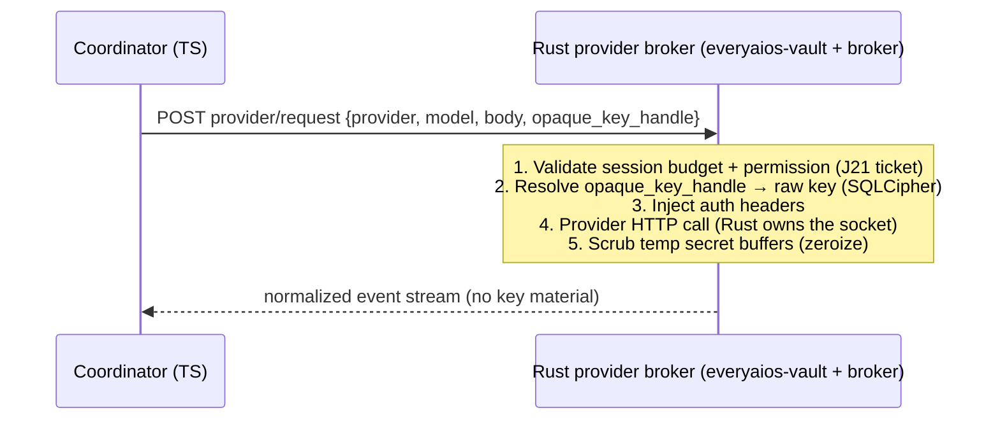

# 06 — Security & Guardrails

> **The user requirement, verbatim:** *"guardrails are very, very important. research on that."* Synthesized from: v2.0 §P8 (Trust Ladder + dual-guard, built in core-tools), doc 03 §8, ZeroClaw security-first (doc 30 §1), BrowserOS ownership + guards/effects pipeline (doc 33 §4.3, §6.3), Hermes prompt-injection scan + FTS5 trust scoring (doc 16), ECC AgentShield + plan-before-build (doc 09), OpenFang WASM metering (doc 09), microsandbox (doc 23), cyber-agent red-team corpus (doc 26 — use their attack patterns as our test suite).

## 6.1 Defense in depth (every path, every layer)

```
LLM output ──► [1] Trust Ladder policy (sidecar, proposes)
            ──► [2] Grammar extractor (sidecar, structure)
            ──► [3] Deterministic regex interceptor (Rust everyaios-guard)
            ──► [4] Path/scope floors (Rust everyaios-guard)
            ──► [5] Human diff-card (Rust — escalated ops only, real click)
            ──► [6] Sandbox execution (subprocess jail / WASM / browser ownership)
            ──► [7] Append-only audit (Rust everyaios-audit)
```

## 6.2 The Trust Ladder (kept from core-tools, 0–100)

- Score grows from successful task completions; decays slowly on repeated failures.
- Tiers: reads (any) · local-write in workspace (≥25) · local-write outside workspace (≥50 + path grant) · external writes / network sends (≥75 + diff-card) · destructive (100 still **requires** diff-card — never auto). The ladder raises *convenience*, never overrides the hard guards.
- Per-agent override (blueprints): role isolation — subagents inherit a capped ladder + `DELEGATE_BLOCKED_TOOLS` (Hermes, doc 16).

## 6.3 Guard 1 — deterministic regex interceptors (Rust)

- A compiled `RegexSet` scanned over **every generated shell string / filesystem path / URL** before execution: `rm -rf /`, `mkfs`, `dd if=/dev/zero`, `drop database`, `format c:`, fork bombs, key/pass exfiltration patterns, `.git` destruction, home-directory wipes, self-modifying shell. Matches → block + audit + UI card ("blocked by Guard 1 — pattern X").
- **Hard floors** (structural, not regex): everyaios-guard owns the workspace boundary map; background loops physically cannot read/write outside granted roots (path canonicalization, symlink resolution — no `..` escapes). The sidecar's own FS access is limited to its data dir (01 §2.3).
- URL floors: `file://` only inside granted roots; scheme guard (browser `navigate_scheme` — BrowserOS guard, doc 33 §4.3).

## 6.4 Guard 2 — human diff-card handshake (Rust)

Escalated actions freeze the loop and render a native card (not LLM-generated): exact file paths (pre/post), script lines, execution target (host vs sandbox vs browser), env vars being set, network destinations. **Approval = an explicit human action** — the card is rendered by the **Tauri shell (Rust side)** from a everyaios-guard payload over IPC (never by the webview's JS), and every approval/denial is audit-logged with a receipt. **Honesty caveat:** the `guard_respond` Tauri command is webview-callable (the webview is the trusted presentation layer, not a security boundary) — a compromised webview *could* self-approve; the hard boundary is the ticket's single-use + args-hash (J21), and a crypto-nonce-bound approve is a P7.5 hardening item, not yet shipped.

## 6.5 Prompt-injection defense (browser + files + web)

- **Context scan** (Hermes pattern, doc 16): every ingested file/webpage/memory block is scanned for injection patterns (instruction-adjacent, `<system`-like tags, "ignore previous instructions") and **wrapped in `<user_document>` delimiters** (PageIndex hardening, doc 25) so the model sees them as data.
- **Browser ownership isolation** (BrowserOS, doc 33): agent tabs vs user tabs (`mine | user | other-agent`); agents read only their own tabs' content; sensitive-site navigation (banking, auth pages) prompts even when in-scope; the agent never reads clipboard unless asked (permission-gated).
- **Tool-result sanitization**: tool outputs are treated as untrusted data — rendered as text/JSON, never as UI markup, never as instructions (they can't call the next tool directly; the loop always re-validates).
- **Escape hatches**: `estop` (global stop, tray-accessible), optional OTP for destructive ops (ZeroClaw, doc 30), per-session "YOLO mode" off by default with a loud warning.

## 6.6 Sandboxes (execution isolation)

| Runner | For | Boundaries |
|---|---|---|
| Subprocess jail | filesystem tools, shells, office sidecars | seccomp/no-new-privs (Linux), app-sandbox (mac), job-object (win); cwd + path floors enforced by everyaios-guard |
| WASM (fuel-metered) | Forge-generated tools | compute budget + epoch interruption (OpenFang dual metering, doc 09); no host syscalls |
| In-cell guard (script-eval) | LLM-generated JS cells (E4/rquickjs) | **AST validation + module deny-list + event-loop guards** (NOOA `code_validator`/`restrictions` pattern, doc 39) — in-process = defense-in-depth only, **never containment** (matches NOOA's own warning: `open()`/`importlib`/reflection escape static checks) |
| Docker (optional) | heavy/data workflows | user-installed Docker only; never required |
| MicroVM (future) | highest isolation | microsandbox msb_krun pattern (doc 23) |
| Browser tab | web content | per-tab process, ownership claims, no extension bridges into the app core |
| Remote-SSH (optional, later) | dev servers / VPS execution | port-forward + SFTP + detached `serve` (Reasonix's 6th backend, doc 05) — always diff-card gated |

## 6.7 Audit (append-only, replayable)

- Every tool dispatch: **`trace_id, span_id`** (OpenTelemetry — matrix J14, doc 43 §2.3: one Rust→sidecar→provider→sandbox flow = one span chain; console/log-file export at v1, OTLP/Jaeger post-v1), plus `session, agent, tool, args(hashed+bounded), result_meta, duration, token_estimate, outcome, approval receipts`.
- Every script primitive via InnerCallHook (BrowserOS, doc 33 §6.3) — `run` can't hide anything.
- Replay of browser sessions (08 §8.5) + screenshot-per-step.
- Retention: replays 7d default, audit configurable; export/wipe controls.
- The cyber red-team corpus (doc 26: PentAGI/PyRIT/NeuroSploit etc.) doubles as our **adversarial test suite** for Guard 1 + injection defense — we test with the same tools the attackers use.

## 6.8 Secrets (see also 03 §3.4)

Vault (SQLCipher) is the only owner of keys/tokens; CES-style executor for high-risk credentialed calls (v2.0 §P8); keys masked everywhere in UI/logs; no key material in crash dumps (crash scrubbing).

---

## 6.9 Credential broker — the request flow (doc 53 §2)

> Formalizes the "keys live only in Rust" promise so it is enforced by construction, not convention.



- `opaque_key_handle` = random 128-bit id minted by `everyaios-vault` at key-ingest; no recoverable relation to the key; scoped to (provider, key_id); revoked on rotation/removal.
- Coordinator provider adapters are **request composers**, not key-holders: build `{provider, model, body}` + handle → consume the normalized stream.
- Budget/permission checks live in the broker (single choke point) — a misbehaving sidecar cannot bypass rate limits by holding its own key.
- Failure: broker down → fail-closed "vault unavailable" (no raw-key fallback); rotation mid-request → re-resolve under broker mutex, stale handle → 401-equivalent retry.

## 6.10 Authorization ticket contract (doc 53 §3)

> Makes "sidecar proposes, Rust disposes" an enforceable invariant, not a slogan.

| Field | Type | Meaning |
|---|---|---|
| `ticket_id` | u64/uuid | unique, single-use |
| `agent_id` | string | blueprint id (delegation scope) |
| `session_id` | string | coordinator session |
| `tool_id` | string | ACP/MCP tool name |
| `operation` | enum | read \| write \| delete \| execute \| network \| navigate \| … |
| `args_hash` | [u8;32] | normalized-args SHA-256 (sort keys, canonical JSON) |
| `authorized_paths/domains` | list | granted roots / egress hosts for this ticket |
| `expiry` | ts | short TTL (e.g. 30s; one-shot ops immediate) |
| `single_use` | bool | burn on first use (default for destructive) |
| `approval_source` | enum | auto_ladder \| guard1_pass \| guard2_human \| policy |
| `risk_class` | enum | routine \| elevated \| high \| destructive |
| `audit_seq` | u64 | links to the everyaios-audit row |

**Lifecycle:** request → policy check (permissions.toml + Trust Ladder) → issue (guard mints) → present → consume (guard validates args_hash + expiry + single_use, executes in Rust, burns) → audit (appended to J5/J19 chain).

**Enforced at every privileged Rust entry point:** FS mutation, shell, network egress, browser control, script-eval, OAuth token use.

## 6.11 Durable event model + idempotency (doc 53 §4)

> "Nothing unreconstructable" needs more than snapshots: an append-only event log is the source of truth; J13 checkpoints are the accelerant.

**Event types (single writer):** `UserMessageAdded · PlanCreated · TaskStarted · ToolProposed · PermissionGranted · ToolStarted · ToolCompleted · ArtifactWritten · ModelTurnCompleted · CheckpointCommitted` — each carries `seq, ts, session, agent, tool, args_hash, result_meta`, feeds J5 NDJSON + J19 Merkle chain + J13 snapshots.

**Idempotency classes** (declared per operation in the tool manifest):

| Class | Meaning | Retry policy |
|---|---|---|
| `safe_retry` | read-only / deterministic | retry freely |
| `unsafe_retry` | mutates (write, send, execute) | never auto-retry |
| `same_key` | retry only with identical idempotency-key | coordinator re-sends same key; broker dedupes |
| `confirm_after_uncertain` | outcome unknown (network drop mid-mutation) | pause → user confirmation before any retry |

**Recovery:** replay events → rebuild state; any `ToolStarted` without `ToolCompleted` → classify by class (safe → re-run; same_key → re-send; else → confirmation card).

## 6.12 Profile-Gated Hooks (ECC Pattern, doc 46)

> Source: affaan-m/ECC (238K⭐, MIT) — hook enforcement profiles.

Instead of all-or-nothing security hooks, enforcement is gated by **profile level**:

| Profile | When to use | What runs |
|---------|-------------|----------|
| **minimal** | Development/testing, speed-priority tasks | Essential lifecycle hooks only (session start/end, crash handler) |
| **standard** (default) | Normal operation | Balanced: pre-tool-use scan, post-edit format check, output sanitization |
| **strict** | Untrusted inputs, production deployments, sensitive operations | All hooks: AgentShield config scan, prompt-injection check, destructive-command gate, output audit |

Controlled via `everyaios.toml`:
```toml
[guard]
hook_profile = "standard"  # minimal | standard | strict
disabled_hooks = []         # override: skip specific hooks by name
```

**5-event hook lifecycle** (maps to Guard-1/Guard-2 timing):
1. `PreToolUse` — before any tool executes (Guard-1 regex + path floor check)
2. `PostToolUse` — after tool execution (format validation, output sanitization)
3. `Stop` — after each agent response (session summarization, cost check)
4. `SessionStart` — context injection, environment prep
5. `SessionEnd` — cleanup, final audit write, memory crystallization

## 6.13 Merkle Hash-Chain Audit Trail (OpenFang Pattern, doc 46)

> Source: RightNow-AI/openfang (18.1K⭐, MIT) — cryptographic tamper-evident logging.

Upgrade the append-only NDJSON audit (everyaios-audit) to a **Merkle hash-chain**:

```
Event N: { seq, ts, kind, payload, prev_hash, hash }
         hash = SHA256(seq || ts || kind || payload || prev_hash)
```

- Each event includes hash of previous event → any tampering breaks the chain
- Verification: replay from genesis event, recompute hashes, compare
- Enables **cryptographic proof** that audit trail hasn't been modified
- Compatible with existing NDJSON format (hash fields are additional)
- Minimal performance overhead (~1μs per SHA256 on modern hardware)

## 6.14 AgentShield: Config-as-Attack-Surface Scanning (ECC Pattern, doc 46)

Treat the agent configuration itself as a security surface:

**Scan targets:**
- `everyaios.toml` — check for injected commands, suspicious URLs, env var overrides
- `agents/*.md` blueprints — check for prompt injection, data exfiltration instructions
- MCP server configs — verify server URLs, check for known-malicious endpoints
- Extension manifests — verify Ed25519 signatures, check permissions requested
- Hook scripts — static analysis for credential access, network calls

**Scan categories (5):**
1. Secrets detection (14+ patterns: API keys, tokens, passwords, private keys)
2. Permission auditing (excessive tool grants, wildcard paths)
3. Hook injection analysis (untrusted code in hook scripts)
4. MCP server risk profiling (unknown servers, excessive tool counts)
5. Agent config review (system prompt override attempts, jailbreak patterns)

**Trigger:** Runs on every config change + periodic background scan + on extension install.

## 6.15 Browser Network Containment (agent-browser + Obscura patterns, doc 55)

> Sources: `vercel-labs/agent-browser` (40K★, Rust CLI — `--allowed-domains` model, source-read doc 55 §1) + `h4ckf0r0day/obscura` (21K★ — SSRF/file-access defaults, source-read doc 55 §2). When the agent browses or scrapes, the **browser child is a network boundary** — contain it, don't just monitor it.

**Enforced in the browser-child launch config + CDP driver (`everyaios-cdp`):**

| Rule | Mechanism | Source |
|---|---|---|
| **Domain allowlist = browser-level containment** | `--allowed-domains` restricts navigations *and* page-initiated traffic (not an OS firewall); when active, **disable `RTCPeerConnection`/WebRTC** so STUN/TURN/DNS cannot bypass the filter | agent-browser |
| **Workers fail closed** | dedicated/shared worker bootstrap wrapper; if page CSP blocks the wrapper, the worker **does not run unguarded** | agent-browser |
| **SSRF defaults** | block loopback / RFC1918 / link-local fetches unless `--allow-private-network` explicitly set (env: `OBSCURA_ALLOW_PRIVATE_NETWORK=1`); same policy for our fetch/read path | Obscura |
| **`file://` blocked** | CDP navigation to `file://` denied by default (opt-in only for local test fixtures on a trusted port) | Obscura |
| **Content boundaries + output caps** | `--content-boundaries`, `--max-output` clamp what the page can feed back into agent context (injection surface) | agent-browser |
| **Trust-boundary docs** | containment is per-browser-context, not a sandbox — document the trust boundary for deployment (J21 permissions.toml `external_network` rules ride the same policy) | agent-browser |

**Where it hooks in:** Guard-1 (path/regex) → network policy check (this section) → ticket `authorized_paths/domains` (6.10) → browser launch with containment flags → audit (6.7).

## 6.16 Subscription-auth / BYO-agent auth boundary (doc 57)

External agent CLIs bring their **own auth** — OAuth tokens from the user's terminal login (e.g. Claude Pro/Max, GitHub Copilot). EveryAIOS never sees or stores them (extends the doc 53 broker model: the harness holds its own credential; we only carry a manifest + an auth-mode label).

⚠️ **The boundary, precisely (doc 57 §3, live-verified 2026-08-10):** Anthropic (Apr 2026) restricts **Claude Pro/Max OAuth tokens to official first-party surfaces** (`claude.ai` + Claude Code). What is **blocked** = *harvesting the subscription token to power a different engine's direct model calls* (OpenClaw/OpenCode wrappers, custom API conduits — third-party model routing on a consumer subscription; server-side header checks + token invalidations, Boris Cherny announcement 2026-04-03/04, HN #46549823). What is **allowed** = *driving Claude Code/Claude Agent via the official ACP wrapper* `@agentclientprotocol/claude-agent-acp` (npx v0.66.0 — **co-authored by Anthropic · Zed · JetBrains**, runs the Claude Agent SDK with the user's own login). **Test: who makes the model call?** Anthropic's own SDK (inside the wrapper/CLI) → allowed; your code with a subscription token → blocked.

**Rules for harness-driving auth (F12/J17):**

1. ✅ **Claude Code / Claude Agent is a first-class F12 harness** — spawn the official `@agentclientprotocol/claude-agent-acp` wrapper (or the user's own `claude` CLI) with the user's own login; badge = **subscription-backed**. Zed/JetBrains/Hermes precedent; Anthropic co-authors the wrapper.
2. ✅ **Open agents** with their own auth (OpenCode, Qwen Code, Goose, Gemini CLI — the blocked OpenCode was the Claude-OAuth-piggybacking mode, not its own-keys operation).
3. ✅ **BYOK API keys** via the broker (§6.9) for **our own engine's** direct provider calls — never subscription tokens.
4. ❌ **Never harvest the subscription OAuth token** (`CLAUDE_CODE_OAUTH_TOKEN`) to power our own (or any non-Claude) engine's direct calls — ToS violation, takedown risk (OpenClaw/OpenCode precedent); the broker never ingests a subscription token.
5. 🏷️ **Auth-mode badge** (F12 UI): every harness labeled **subscription-backed / API-key-backed / local**; Claude Agent shows **subscription-backed (allowed via official wrapper)**.
6. **Enforcement points:** Trust Ladder (§6.2) + ACP `request_permission` → Guard-2 (§6.4) + audit (§6.7); the registry's curated allow-list (doc 57 §2) is the first gate — only reviewed agents ship as defaults.