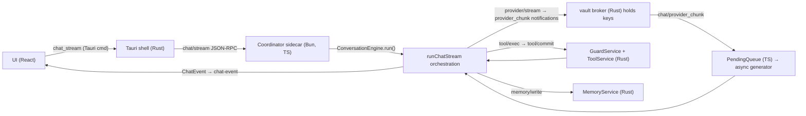
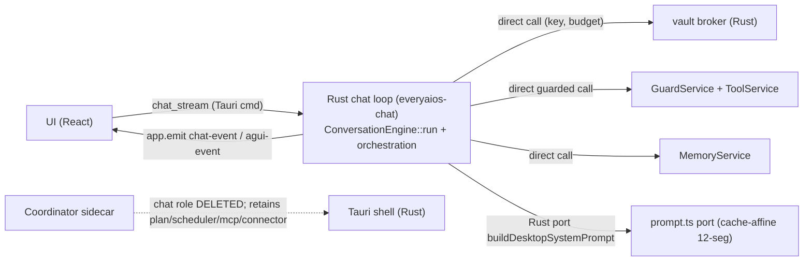

# ARCH/16 — Porting the async chat loop to Rust (ConversationEngine `run()` + `runChatStream`)

> **Status:** SCOPE (code-verified 2026-08-29). Not implemented. This is the honest
> engineering plan for the last large TS slice alive in the sidecar — the streaming
> agent loop every chat turn travels through. It is deliberately *not* the 542 LOC of
> `engine.ts` alone; the verified reality is that the loop is the product of
> `engine.ts` × the coordinator's `runChatStream` orchestration in `chat.ts`, all of
> whose I/O deps already have Rust homes. The plan below is the minimal true port and
> the safest migration path, with the leaky bits called out (prompt assembly, context
> audit invariant, AG-UI).

## 1. Why this is the last meaningful port slice

Every correctness/safety primitive the loop touches already lives in Rust:

| Loop dep (TS) | Rust home today | Port cost |
|---|---|---|
| `streamProvider` (openai stream) | `everyaios-vault` broker + `SessionBudget` (J11) — Rust already streams tokens | **Zero new logic** — removes the TS hop |
| `executeTool` | `everyaios-core` `ToolService` + Guard ticket (`tool/exec`→`tool/commit`) | **Zero new logic** — in-process call |
| `extractMemory` / `persistTurn` | `everyaios-core` `MemoryService` (+ `extractFacts`-style deterministic extract) | **Zero new logic** |
| `gateToolCall` (Alg #17) | `everyaios-engine::gate` (already ported) | done |
| `assessHallucinationRisk` (Alg #8) | `everyaios-engine::risk` | done |
| `plan_retrieval`/`plan_tools`/`family_of` | `everyaios-engine::plan` | done |
| `default_contract` | `everyaios-engine::contract` | done |
| `extractJsonToolCalls` (B5) | `everyaios_vault::extract_json_tool_calls` (mirrored) | done |
| batching/TTFT | `StreamSession` (102 ts) | **port** (~120 rust) |
| routing + observations | `router.ts`/`observations.ts` + the Rust `RouteDecision`/`ProviderObservation` seam (P36) | **partial port** |
| semantic/result cache (A9) | Rust store (cache is Rust-side already) | **zero** |
| tool listing→OpenAI schema | Rust `ToolRegistry` + `listedToolsToOpenAI` (tools.ts, 380 ts) | **port** |
| **prompt assembly (12-seg, cache-affine)** | `buildDesktopSystemPrompt` (prompt.ts, 187 ts) | **the load-bearing new port** |

So the *state machine* is the small part; the coordinated orchestration and the
12-segment cache-affine prompt are the real work.

## 2. Verified call path today (why TS is a relay, not an owner)

Every hop colored real: the provider stream leaves Rust, enters a TS async queue,
feeds the engine, and tool/memory effects are already inter-process calls **back**
into Rust. Porting the loop to Rust removes three round-trips per turn and the
whole `PendingQueue`/`FrameProviderBridge` machinery.

## 3. The cut-path (target architecture after M3)

## 4. Size (honest, code-measured)

| Source (TS) | LOC | Rust port estimate | Notes |
|---|---|---|---|
| `engine.ts` loop structure | 542 | ~700 + tests | 90% pure logic already ported; remainder is the async state machine + event yields |
| `chat.ts` `runChatStream` orchestration | ~800 | ~900 | routing, tool listing, cache, AG-UI, StreamSession, hooks, budget map |
| `prompt.ts` 12-segment cache-affine assembler | 187 | ~600 | **hardest**: CACHE_BOUNDARY, SOUL.md slot, persona overlay, J6 `<user_document>`, below-boundary `memory_warm_set`/`tool_index`, byte-stable prefix invariant, P30.8 `assertAllLogged` audit |
| `tools.ts` `listedToolsToOpenAI`/`resolveActiveTools`/`sortToolsStable` | 380 | ~450 | schema serialization off the Rust ToolRegistry |
| `router.ts` classify/select + `observations.ts` | 445 | ~350 | dues to `everyaios-engine` scoring laws; observations ride the P36 seam |
| `stream-session.ts` | 102 | ~120 | TTFT + 33ms token batch |
| `catalog.ts`/`agui.ts` (hints, AG-UI envelope) | 315 | ~250 | AG-UI line envelope = marshal only |
| **Net-new Rust** | **≈2,770 ts** | **≈3,400 + ~1,200 tests** | |

Slightly larger in Rust than TS *because of the tests* the port must carry to be
diffable against the 302 coordinator tests. **Total effort ≈ 4,500 LOC**, spanning 2
crates, and it touches the live chat path — realistically 3–5 sessions to land safely.

## 5. Blocking prerequisites (checks that gate M1)

These are the two genuinely leaky seams that decide whether the port is clean or a
`.exe` call-back:

1. **The context/audit invariant (P30.8):** `ContextTrace` + `assertAllLogged` proves
   every block injected into the prompt is reconstructable from the trace (system,
   `memory_warm_set`, `tool_index`, `<user>`, J6 docs). A Rust prompt port must carry
   the same provable-presence contract or the honesty invariant is lost. — **must be
   replicated in Rust, not skipped.**
2. **Prompt byte-stability:** the stable prefix above `CACHE_BOUNDARY` must stay
   byte-identical across turns (A9 prompt-cache value). The Rust assembler must own
   the boundary line and the below-boundary injection points exactly as `prompt.ts`
   does today.

If either is deemed "good enough to call back into TS," that's a legitimate
**non-goal** call — but it keeps a Rust↔TS prompt round-trip every turn and halves the
win. The default is: port both.

## 6. Migration phases (each lands green, nothing regresses)

- **M0 — Harness:** add `everyaios-chat` workspace crate; a `RunTurn` facade with the
  loop state machine + the existing native deps (broker/tools/memory/gate/risk/plan)
  wired in-process; emit via a tested `ChatEvent` channel (inject the Tauri emitter).

- **M1 — Loop + tools port:** port `StreamSession` batching, tool schema conversion,
  JSON tool-call extract, tool-loop re-stream + `extraFinalRound` + abort/`gateToolCall`
  wiring. Exit: a Rust unit test replays the engine.test.ts tool-loop scenarios.

- **M2 — Prompt assembler port:** `buildDesktopSystemPrompt` + cache boundary +
  below-boundary injection + context-trace parity. Exit: golden prompt-diff tests
  against `prompt.ts` output for the same opts; byte-identical stable prefix.

- **M3 — Orchestration + cut-over:** routing/scoring, semantic cache, AG-UI envelope,
  observations into the Rust loop; delete the coordinator `chat.ts` stream path and
  `FrameProviderBridge`/`PendingQueue`; issue chat directly from the Tauri `chat_stream`
  command. **Coordinator's chat role removed** (plan/scheduler/mcp/connector remain TS).
  Exit: `cargo test --workspace` + coordinator non-chat suites + UI typecheck + a live
  TTFT sanity check vs current.

- **M4 — Retire:** drop the now-unused vendored `StreamSession`, the chat imports of
  `@personal-ai/core-engine`, and the loop-only helper surface from the coordinator;
  update ARCH/05/13 + §4.2.9 spec mermaid + TODO.

## 7. Risks & explicit non-goals

- **Regression surface:** the 302 coordinator tests lock the loop behavior. The port
  must preserve token ordering, tool-round semantics, `extraFinalRound`, abort-mid-stream
  cleanup, and J11 budget-kill mapping. Keep the TS path alive behind a
  `EVERYAIOS_RUST_CHAT=1` env toggle through M3, then flip default, then delete.
- **Prompt divergences:** cache-affine prefix is a hard performance promise (A9). A
  whitespace/segment reordering that breaks byte-stability silently kills prompt-cache
  hits — hence M2's golden-diff gate before any cut-over.
- **Non-goals (deliberate):** no single ts module is call-back ported (the cross-crate
  round-trip would cancel the win); the *routing* model is reused from
  `everyaios-engine`/P36, not re-derived; AG-UI stays a lightweight envelope (marshal,
  not a port of the UI's generative surface).
- **What this does NOT do:** it does not port the mobile `@personal-ai/core-engine`
  package or the plan-executor / scheduler / MCP / connector loops. Those remain TS by
  design (they are not the chat hot-path and have their own delegation seams).

## 8. Outcome

One turn becomes **one process, zero TS hops, zero IPC round-trips for provider,
tool, and memory** — and the sidecar's largest remaining TS surface is gone. That is
the concrete end condition the earlier "port the last ~1,200 LOC" framing was missing:
it was never 1,200 lines of engine; it is ~2,770 TS lines of engine + orchestration +
prompt, of which all *effects* already run in Rust today.