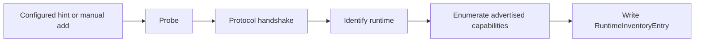
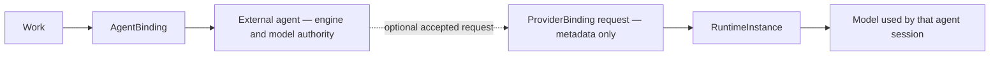

# ARCH/16 — Local runtime interoperability: managed resources, agent-owned inference

> **Status:** Subsystem contract, derived from [`CORE.md`](CORE.md), [`ADR-0005`](ADR/0005-external-agents-are-the-v1-engines.md), and [`ADR-0007`](ADR/0007-windows-first-v1-qualification.md). It records the approved v1 boundary: **EveryAIOS owns the environment; the external agent owns the engine.** Invariants it must not weaken: **I4, I10, I15, I21, I23, I24**.
>
> **2026-09-25 architecture-review disposition:** the existing **I4/I10/I15/I21/I23/I24** already cover this boundary. The review **did not add or change an invariant**, and this contract does not amend [`CORE.md`](CORE.md). It adds no canonical primitive, second registry, second `AgentBinding`, model router, or inference engine.
>
> **v1 platform boundary:** Windows and WSL2 are in scope under [`SUPPORT-MATRIX.md`](../SUPPORT-MATRIX.md); macOS/MLX is deferred.

---

## 1. Scope and non-goals

EveryAIOS may observe a local inference runtime and, when the user has none, install and manage one as a **managed resource**. Management means a known process handle, lifecycle ownership, health observation, configuration identity, and supervised shutdown. It does not transfer inference, reasoning, provider selection, or model selection to EveryAIOS.

This contract governs:

- runtime discovery, inventory, identity, acquisition, and managed lifecycle;
- artifact possession and checksum verification;
- the control an external agent permits EveryAIOS to exercise; and
- an explicit, attributable handoff from a bound agent to a runtime instance and model.

It explicitly does **not** create:

- an EveryAIOS inference engine or reasoning loop;
- a global `ModelCache` or authoritative `ModelRegistry`;
- host model selection or a provider/model router;
- model inheritance from a parent agent to a subagent;
- a second `AgentBinding`, permission system, event log, or resource-lease owner; or
- a readiness rule in which **downloaded ⇒ ready**.

A runtime, artifact, or catalog may make inventory useful without making it execution-compatible with the selected agent.

---

## 2. Vocabulary and canonical owners

These are resource and observation terms, not new canonical execution primitives. The named owner is the only component allowed to author that fact; other surfaces project it.

| Term | Meaning | Canonical owner |
|---|---|---|
| **`RuntimeProvider`** | Runtime classification: `Managed` (EveryAIOS owns the process handle), `External` (observed on this device but not owned), or `Remote` (a runtime reached on another machine; post-v1). It classifies the resource, not the inference engine. | `shared:local-runtime` resource supervisor and its runtime adapter inventory |
| **`RuntimeInventoryEntry`** | One discovered runtime on one `ComputeTarget`, including classification, adapter/protocol, endpoint hint, identity evidence, health observation, and control capability. It is not occupancy or agent compatibility. | `shared:local-runtime` inventory projection |
| **`RuntimeControl`** | The control seam an `AgentAdapter` permits for a bound agent: `NativeOnly`, `LaunchOverride`, `SessionConfig`, or `Unknown`. It is capability metadata, not a host-selected model. | the bound agent's `AgentAdapter`, derived from its verified launch/session contract |
| **`RuntimeHealthState`** | Runtime-process observation: `Unknown`, `Observed`, `Healthy`, `Degraded`, `Down`, or `Unsupported`. `Observed` means a probe/handshake was seen; it does not mean `Healthy`. | the runtime process supervisor and observation recorder for that `RuntimeProvider` |
| **`ModelFamily`** | Logical model lineage, independent of file format or runtime-local name. | non-authoritative `ModelCatalogIndex` |
| **`ModelVariant`** | A family plus a concrete format/quantization/runtime-facing variant. | non-authoritative `ModelCatalogIndex`, with runtime observations kept namespaced |
| **`ModelArtifact`** | The acquireable file identity: format, quantization, `sha256`, size, license, and source. | checksum-verifying artifact store/library owner |
| **`LibraryEntry`** | Proof that an artifact file exists at a known path on a `ComputeTarget`; it says nothing about whether a runtime loaded it. | artifact Library inventory |
| **`RuntimeInstance`** | What one runtime currently has loaded, under that runtime's own identifiers. It is an observation and may outlive or disappear independently of a `LibraryEntry`. | runtime adapter observation for that `RuntimeInventoryEntry` |
| **`ModelCatalogIndex`** | A non-authoritative normalized cache of models.dev, Hugging Face, and runtime catalogs. It may be stale, partial, or deleted; deletion never blocks a turn. | `everyaios-catalog` cache/index owner |
| **`FitResult`** | Advisory capacity estimate: `Fits`, `LikelyFit`, `MayBeSlow`, `WontFit`, or `Unknown`. Every presentation labels it **Estimate** and names the inputs/measurement time. | hardware/capacity estimator for the selected `ComputeTarget` |
| **`ComputeTarget`** | Where a resource is evaluated or observed: `this device` or a `linked/remote machine`. Remote targets are post-v1. | runtime/resource discovery and target descriptor owner |

`ModelFamily → ModelVariant → ModelArtifact` is the catalog-to-file refinement chain; it does not imply agent selection.

Two truth rules follow:

1. **`Observed` is not `Healthy`.** A reachable socket, successful metadata request, or model listing proves only the observation that actually occurred.
2. **A model listing is never proof that an agent can use it.** Use requires the agent's declared control seam, an accepted handoff, and a runtime instance that reports the model.

---

## 3. The control ladder

The ladder is ordered by how directly EveryAIOS may affect the agent's inference configuration. It is not a quality ranking. Level 0 is an observation-only posture and therefore is not a `RuntimeControl` variant.

| Level | Posture | v1 allows | v1 refuses |
|---|---|---|---|
| **0 — inventory only** | Runtime may be discovered and observed; no attach/control action is exposed. | Show runtime, artifact, instance, and health facts with provenance. | Do not imply attachment, model use, or lifecycle control. |
| **1 — `NativeOnly`** | The agent keeps provider/model/auth entirely native. This is the default for subscription sign-in adapters such as Codex, Claude Code, and Antigravity; the examples do not create a hardcoded compatibility matrix. | Inventory and an explanation that the agent manages its own model. | No host credential, endpoint injection, provider selection, or model selection. |
| **2 — `LaunchOverride`** | Allowed only for an adapter with a verified provider-env or fixed-env launch contract. The proposed binding is metadata-only. | Offer a non-secret endpoint/model reference for the next launch and record it as `requested`. | The request remains `requested` until the agent/adapter confirms it; no UI may call it active, and no vault value may be carried in the request. |
| **3 — `SessionConfig`** | Preferred per-session path when the agent exposes it. ACP `ConfigOption` and `session/set_config_option` already exist; this contract adds no protocol. | Present only agent-advertised model/config options and set the selected ACP session option through the existing method. | No synthesized option from a catalog row and no substitution with EveryAIOS's model list. |
| **4 — fully managed inference** | EveryAIOS starts, configures, routes, and chooses the inference model as the agent's engine. | Nothing in v1. | **Refused in v1.** A future proposal requires a new architecture decision and may not weaken I4/I10/I15/I21/I23/I24. |

Explicit refusals:

- A subscription-sign-in agent receives no EveryAIOS-held credential.
- A `ConfigFileOnly` agent receives no config-file edit from this surface.
- An `Unknown` agent is offered no runtime control; discovery remains read-only.
- A catalog row is not an ACP option.
- A reachable endpoint is not proof that the agent used it or can use it.

---

## 4. Discovery and identity

Discovery is evidence-producing and ordered:

1. **Probe** establishes that a candidate can be reached under the network floor. It does not identify a runtime or model as usable.
2. **Handshake** establishes the protocol/adapter contract. A generic **OpenAI-compatible endpoint** is the default adapter. A native adapter exists only where it exposes real capabilities beyond generic compatibility, such as verified lifecycle, acquisition, or runtime-specific control.
3. **Identify** records a stable runtime identity and provenance. A loopback port (`11434`, `8080`, `1234`, and so on) is only a discovery hint; it is never identity or authority.
4. **Enumerate capabilities** records only operations the peer actually advertises or returns. Manual add supplies a user-entered endpoint and protocol, then enters the same probe → handshake → identify → enumerate path; it cannot bypass it.

Model identity is split deliberately:

- **`CanonicalModelRef`** identifies source content, for example `hf://<org>/<repo>@<revision>/<file>`. It is stable across runtime naming changes when a verified mapping exists.
- **`RuntimeModelRef`** identifies a model only inside a runtime namespace, for example `ollama://<runtime-id>/<model-tag>`.

String similarity, display name, or port does not create a mapping. An unmapped `RuntimeModelRef` stays runtime-scoped and is not promoted to a canonical artifact or a host model choice.

---

## 5. Acquisition is not possession

The local-runtime surface keeps five concepts separate:

| Surface | Fact it owns | Fact it does not own |
|---|---|---|
| **Explore** | A catalog/search result and its source metadata. | That a file was acquired or a runtime loaded it. |
| **Library** | An artifact file that exists at a known destination. | That a runtime loaded it or an agent can select it. |
| **Loaded** | A `RuntimeInstance` and the models that runtime currently reports loaded. | That the file remains present after the instance exits. |
| **Runtimes** | Runtime adapters, lifecycle ownership, health, and permitted actions. | A universal model list or a second agent binding. |
| **Remote** | A `ComputeTarget` descriptor for a linked/remote machine. | v1 execution; remote compute targets are post-v1. |

A download button means **“acquire this artifact into this destination through the selected runtime.”** The request must name the artifact, destination, runtime, and compute target. The selected adapter may satisfy it through:

- `runtime.pull` for a runtime-native named-model pull;
- `runtime.download` for the selected runtime's artifact-transfer operation; or
- an optional raw-artifact downloader when the runtime exposes no native acquisition action.

All three remain Guard/path-floor effects and checksum-verify the resulting artifact. The UI must not collapse Explore, Library, Loaded, and Runtimes into one green state.

---

## 6. Managed runtime lifecycle

Only a `Managed` runtime whose process handle EveryAIOS owns may be started, stopped, or restarted by EveryAIOS. An `External` runtime is observed and never stopped by this surface. `Remote` is reserved as a runtime classification but is not a v1 execution surface; remote attach/observe behavior arrives with the post-v1 `ComputeTarget` contract.

- A managed runtime child remains attached to the Rust process/resource supervisor for its whole lifetime. It is never orphaned by dropping a handle; unexpected exit is observed, audited, and reconciled.
- A configuration change produces a deterministic `config_hash` and a `restartRequired` or applied-after-restart result. EveryAIOS does not claim a running process has adopted a new config until restart and observation complete.
- Start, stop, restart, install, configure, acquire, and delete are resource effects, not UI-local toggles. They use the Guard → executor → audit/receipt path.
- Health is a live observation with a timestamp and evidence class. A managed process that is merely reachable is not automatically `Healthy`.
- Windows and WSL2 use their qualified execution paths; macOS/MLX provisioning is deferred and must not be implied by a generic runtime row.

---

## 7. Agent handoff contract

EveryAIOS is a **requester and resource manager** in this chain. The external agent decides whether to accept a provider/runtime binding, which model it uses, and whether to change it.

- The optional `ProviderBinding` request may carry a runtime id, endpoint reference, model reference, compute target, and launch/session seam already permitted by `RuntimeControl`. It is metadata-only, not a durable provider authority, not a second `AgentBinding`, and never carries a secret.
- An ACP `SessionConfig` handoff remains in the agent's provider-private session state after the agent confirms it. An EveryAIOS inventory refresh cannot overwrite that choice.
- A parent agent's model is **never inherited** by a subagent. Each child Work resolves through its own admitted `AgentBinding`; if that agent exposes no compatible model path, the request fails or asks the user rather than silently copying the parent.
- The tool drawer and attribution surface label a runtime action with its `WorkId`, `RunId`, `AgentBindingId`, requester, target, and result (`requested`, agent-confirmed, applied, failed, or unsupported). It must distinguish an EveryAIOS proposal from an agent-owned choice.

The handoff succeeds only when the target agent's adapter accepts the permitted seam and the runtime reports the resulting instance/model state. Reachability and inventory remain observations.

---

## 8. Security and effect boundary

Starting, stopping, restarting, installing, configuring, acquiring, or deleting a runtime is a mutating effect and follows **Guard → executor → audit/receipt**. The runtime's endpoint is checked by `netfloor` like any other outbound destination, including user-added endpoints and loopback hints. Downloaded artifacts are SHA-256 verified against the selected `ModelArtifact` before Library verification is reported. Configuration and process environments are scrubbed; **no provider key ever passes through the vault into an agent**. An external agent's own sign-in and provider credentials remain agent-owned, and no local runtime is granted Office, Browser, or Computer Use authority merely because it is reachable.

---

## 9. Four statuses that never collapse

| Question | Canonical status | Owner |
|---|---|---|
| **Artifact possession** | `downloaded` · `verified` · `missing` | checksum-verifying Library owner |
| **Runtime control** | the §3 ladder (`inventory-only`, `NativeOnly`, `LaunchOverride`, `SessionConfig`, fully managed refused) | bound `AgentAdapter` plus the resource supervisor |
| **Agent readiness** | canonical `AgentReadiness` from [`AGENT.md`](AGENT.md) §3.1 | `everyaios-types::AgentReadiness` |
| **Model control** | `supported` · `negotiated` · `unsupported` · `unknown` | the agent's negotiated capability matrix / ACP `ConfigOption` response |

`RuntimeHealthState` is a timestamped observation attached to the runtime; it is not a substitute for any of these four answers. For example, a `verified` artifact plus a `Healthy` runtime plus a `Ready` agent still cannot be attached when model control is `unsupported`. Conversely, `downloaded` is never rendered as `ready`.

---

## 10. Legacy retirement superseded by this contract

The following seams are **retired as architecture**, whether or not their source removal has already landed:

| Legacy seam | Retirement | Replacement |
|---|---|---|
| `everyaios-vault::local` host-side local inference and `Broker::with_local` | Retired: the vault does not broker a local model into an EveryAIOS or agent-owned engine. | `shared:local-runtime` acquisition/resource management plus explicit agent handoff. **EveryAIOS owns the environment; the external agent owns the engine.** |
| `core::local::endpoint_for/endpoints` as a host execution route | Retired: endpoint discovery is inventory, not a ChatRelay/model route. | Net-floored discovery → `RuntimeInventoryEntry` → control-gated handoff. **EveryAIOS owns the environment; the external agent owns the engine.** |
| `ui/src/lib/model-routing.ts` local-provider selection | Retired: the host picker cannot select a local model for the bound agent. | Agent-advertised `ConfigOption`/native model control, intersected with `RuntimeControl`. **EveryAIOS owns the environment; the external agent owns the engine.** |
| `discovery_cmds` marking listed local models `capabilities_verified: true` or `Healthy` from a listing alone | Retired: a listing is not a handshake, health proof, or agent-use proof. | Probe → handshake → identify → capability enumeration, with listing-only state `Observed`. **EveryAIOS owns the environment; the external agent owns the engine.** |
| `DESKTOP-APP-SPEC.md`'s statement that a local model is a broker provider for the active agent, subagents, and tools | Retired: a local model is not a host provider and is not inherited by subagents/tools. | The product-level resource/handoff promise and the agent-authority contract in this document. **EveryAIOS owns the environment; the external agent owns the engine.** |

This is an architecture retirement record, not a claim that source removal, delivery, or Windows acceptance is complete.

---

## 11. Open boundaries

- **Remote `ComputeTarget`s are post-v1.** LAN, Tailscale, and EveryAIOS-node execution require a later trust, lifecycle, and qualification contract; v1 may reserve the vocabulary but must not imply remote readiness.
- **“Set up a local runtime” is a v1 product path.** A nontechnical user can request a recommended Windows/WSL2 runtime with disk/RAM cost stated, Guard approval, managed provisioning, and an honest started/healthy/degraded/failed result. This contract does not claim that implementation or acceptance already exists.
- **Per-agent runtime compatibility is derived, never hardcoded.** It is computed from the adapter's verified `RuntimeControl`, launch/session contract, protocol capabilities, and current runtime observations. A catalog row, product name, or remembered preference cannot add a compatibility edge.
