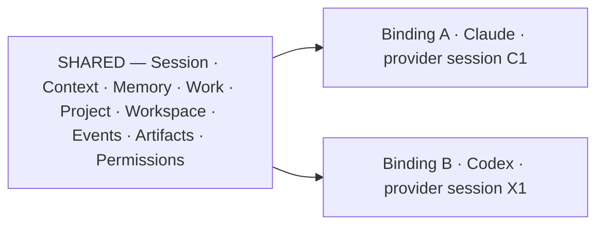

# ARCH/AGENT — the agent model: binding, adapter, bridge

> **Status:** Subsystem contract, derived from [`CORE.md`](CORE.md). Owns the agent-side primitives; the
external protocol surfaces live in [EXTERNAL-AGENTS.md](EXTERNAL-AGENTS.md) and context handoff in
[CONTEXT.md](CONTEXT.md). Invariants it must not weaken: **I23, I24, I25, I27**.
>
> **v1 scope clarification (2026-09-24):** [`ADR/0007`](ADR/0007-windows-first-v1-qualification.md)
> requires the binding contract to qualify on real Windows, live external agents, and Channel B. A source
> seam or a provider handshake is not a qualified binding; voice/STT/TTS/wake-word/audio remain post-v1.
>
> **Projection/lease amendment (2026-09-24):** [`ADR/0008`](ADR/0008-session-workbench-projection-and-resource-leases.md)
> keeps provider-private state binding-owned while resource leases and fences remain Work/Run-owned. A
> binding may exercise a lease in its canonical owner context; it never owns the lease or the physical
> resource.

---

## 1. The rule

> **An agent is a replaceable execution engine attached to a Session — not the owner of it.**

The agent owns the *loop*: reasoning, planning, tool selection, retry strategy, and its own model and
credentials. EveryAIOS owns the *environment*: durable Work, context projection, memory, capability packs,
governance, lifecycle and event history. Neither side owns the other's job.

---

## 2. "Chief" is retired

"Chief" was used for two different roles, which is why architecture text kept contradicting itself:

| Role | What it does | Owner | New name |
|---|---|---|---|
| **Loop owner** | reasons, plans, selects tools | the selected agent (external, or the optional built-in engine) | **AgentBinding** |
| **Turn coordination** | loads state, builds context, projects tools, emits events, drives recovery — **not reasoning** | EveryAIOS | **Turn Coordinator** |

**The built-in engine is deferred to post-v1** — see
[`ADR/0005`](ADR/0005-external-agents-are-the-v1-engines.md). For v1 the only main engines are **external
agents**: nothing may depend on a built-in binding being present — not the picker, not onboarding, not
defaults, not tests. When it returns it is a **governed baseline binding** whose stated value is (a) full
effect governance, because its tools cross the capability plane and an external agent's own tools do not
(**I14**), and (b) zero-install first run. It is not an attempt to out-model frontier agents. On return it
must obey **I23**/**I24** exactly as an external agent does: one binding, switchable, non-owning.

**Legacy identifiers** (rename manifest frozen under `TODO.md` **P69.A30**, documented here so no reader hunts for a concept that no
longer exists): `primary_chief`, `AcpChief`, `ChiefAdapter`, `ChiefError`, `ChiefEvent`, `KNOWN_CHIEFS`,
`chief.ts`, `chief-handoff.ts` / `chief-pin.ts` (and their tests), `userDefaultChief`, the `chief` field of
`RuntimeManifest`, `chief:*` wire strings (stage prefixes, `chief/*` IPC method names), the chief module path,
the composer's "Chief" label, and UI copy naming a "Chief". Until renamed, they are **legacy-only names for a
binding**, and new architecture text must not use the word as a concept.

---

## 3. AgentBinding

```
AgentBinding
├── id · session_id · work_id
├── agent_id · adapter_id
├── protocol                 acp | stdio | in-process
├── provider_session_id      ← deliberately NOT the EveryAIOS Session id
├── model · mode
├── capability_manifest      resolved effective set (see CAPABILITIES.md)
├── governance_mode          governed-mediated | self-contained | not-governed
├── bridge_id
├── state                    active | parked | resuming | dead | unavailable
├── usage · last_event_seq
└── private_state_ref        provider transcript / agent-private state
```

**Why `provider_session_id` must be a separate field:** a Session must never be identified by "whichever
provider transcript was touched last". Binding the shared identity to a provider identity produces an
entire class of bugs — wrong transcript resumed, cross-provider leakage, and a Session that appears to
change identity when the user switches agent.

**Lifecycle events:** `AgentBindingCreated` · `Activated` · `Suspended` · `Resumed` (plus death and
unavailability as state transitions on the same record).

### 3.1 Readiness — one state, not booleans

*Can this agent be used right now?* has exactly one answer,
[`everyaios_types::AgentReadiness`](../crates/everyaios-types/src/lib.rs), declared once and read by every
surface (picker · resolver · trigger plane · delegation gate):

```
Unknown → Discovered → Installed → Launchable → ProtocolCompatible → {AuthRequired → Authenticating} → Ready
                                                                        ↘ Degraded   ↘ Unavailable · Failed
```

The state exists to keep four different facts apart:

| Fact | State | Why it is not `Ready` |
|---|---|---|
| known in the catalog | `Discovered` | nothing runs |
| runtime present | `Installed` | not proven launchable here |
| can start here | `Launchable` | no negotiated protocol |
| negotiated, unauthenticated | `ProtocolCompatible` · `AuthRequired` · `Authenticating` | cannot serve a turn |
| serves a turn | `Ready` (or `Degraded`, with the reduction stated) | — |

**Rules.** `Unknown` is never rendered as available. `installed` on the wire is a projection of this state,
not a parallel field. Only `Ready` is admissible as a **subagent** (`DelegationPolicy::admit` judges it
first) — `Degraded` serves turns but is not delegable. The state is a runtime fact: user policy (disabled)
and install activity (updating) are UI projections layered on top, never readiness values. EveryAIOS may
**facilitate** an agent's authentication but never reads or copies its credential store
([`ROUTING.md`](ROUTING.md) §4, **I10**).

### 3.2 v1 identity, handle, and lifecycle qualification

The v1 binding contract is one chain, not a collection of adapter-local session ids:

```text
canonical Session → Work → Run → AgentBinding → provider_session_id
                                      └─ scoped host handle + cancellation
```

The application Session id, Work id, Run id, binding id, and provider session id are distinct. A
provider session is private adapter state; it is never used to identify the canonical Session, and a
new provider session after restart is not evidence of native resume. A host handle is scoped to its
Session/binding, and cancellation is addressed to that handle without touching another Session's Work.

`ADR-0007` makes the following release obligations for this chain: reconnect must replay the canonical
Work event stream and re-attach the same binding; provider resume is attempted only when the negotiated
ACP capability supports it; otherwise the host continues from a durable checkpoint/ContextPassport and
labels the provider session as restarted; and Channel B calls must retain the same Work-scoped Guard and
receipt path. These are qualification requirements, not a new identity type or a second lifecycle owner.

**Current limitation (corrected 2026-09-24 against source):** the canonical owner preparation is present
in `src-tauri/src/acp_cmds.rs` (`prepare_acp_turn`), and **one half of the earlier limitation has since
closed**: the production ACP client *does* implement provider resume — `AcpSession::session_load`
(`crates/everyaios-acp/src/client.rs:1568`, with the `load_session` alias and
`session_load_with_updates`), gated on the agent having negotiated `agentCapabilities.loadSession`, and
exercised by `crates/everyaios-acp/tests/acceptance_acp_handshake.rs:123`. `session/resume` is absent by
policy — it is the ACP v2 method, and v1 is *narrow unsupported v2*
([`ADR/0007`](ADR/0007-windows-first-v1-qualification.md) §4).

Launch passes the shared-plane server from `channel_b_servers` into `session_new` (`src-tauri/src/acp_cmds.rs`). An empty tool list is no longer the production call. Channel B is still **implemented — unverified** until a live Windows agent completes a guarded tool call on that server. The exact evidence and acceptance condition
live in [`ADR/0007`](ADR/0007-windows-first-v1-qualification.md); the reusable host-side machinery for the
fix already exists and is named in [`EXTERNAL-AGENTS.md`](EXTERNAL-AGENTS.md) §10.

### 3.3 Binding-private state and Work/Run-owned leases

[`ADR/0008`](ADR/0008-session-workbench-projection-and-resource-leases.md) makes the lifetime split explicit:

- **Binding-owned/private:** `provider_session_id`, provider transcript, native prompt/context state,
  provider cache, agent-specific config, and other adapter-private material. These may be parked, resumed,
  or discarded by adapter policy, but never become a canonical Session/Work id or UI projection state.
- **Work/Run-owned:** the `ResourceLease` record, resource generation, access class, fence, renewal/release,
  and reclaim state for a physical resource. The binding is the actor that may exercise a valid lease; it is
  not the lease owner.
- **Session-owned projection:** safe `ResourceRef` and lease attachments shown in the per-Session workbench
  projection. The Session does not own the browser tab, document, Desktop target, provider process, or bearer.

Before a binding acts on a resource, it presents the host-derived `(SessionId, WorkId, RunId, AgentBindingId)`
context and the opaque internal lease handle to the Rust owner. The owner revalidates the resource generation
and fence; a stale actor is refused. A lease is concurrency/fencing, not permission: Guard remains the sole
authorization decider and Vault remains the credential custodian. The full typed contract, same-resource
contention rules, and edge-case matrix are in ADR-0008 §§2, 3, and 6.

---

## 4. Shared vs private

| Shared across the Session (canonical) | Private to one binding |
|---|---|
| Session identity, Space, Project associations | `provider_session_id` |
| Workspace references, current objective, Work | provider transcript |
| Plan, completed steps, findings, artifacts | native prompt state, and the agent's own helpers (for example Claude's task tool). Those helpers are not `delegate.spawn`. `delegate.spawn` is a child Work under EveryAIOS |
| Memory and context snapshot / passport | agent-specific config and internal summaries |
| Approvals, capability grants, budget | provider-side context cache |
| Event history, verification results, receipts, usage | native tool bookkeeping, agent-private memory |
| Work/Run resource-lease records, generations, and fences | an internal, non-exported handle used only while this binding is the active actor |

The rule: **provider-specific state is private and resumable; EveryAIOS session state is canonical and
shared** (I25). None of the right-hand column may become the authoritative owner of the Session.

### 4.1 External precedent for this split

Two independent implementations converge on the same shape, which is evidence the boundary is real rather
than invented here — and worth remembering when someone proposes flattening it:

| Precedent | What it does | Confirms |
|---|---|---|
| **Tide** | one shared spine + thin provider adapters; each UI thread is **deterministically bound to a specific provider session id** instead of "whatever transcript was touched last"; agent-specific quirks live inside the adapter | the left/right split of §4, and specifically the `provider_session_id` rule in §3 |
| **OpenBridge** | separates **product state**, **agent runtime** and **sandbox runtime**; each agent session gets its own execution environment while review/workspace state stays in the host application | the same shared-vs-private boundary, extended to execution environment |

Both are cited as **[D]**-tier precedent, not as dependencies. EveryAIOS's version is *stronger* than either,
because it additionally owns the shared Work/capability/guard plane — which is the point of hosting rather
than embedding.

---

## 5. AgentAdapter

One contract. Adapters declare honestly what they can actually do; they never branch per agent inside the
kernel.

```
AgentAdapter
├── discover() · capabilities() · authenticate()
├── start() · configure()
├── create_session() · resume_session() · close_session()
├── prompt() · cancel()
├── inject_context() · attach_shared_plane() · attach_capabilities()
├── stream_events() · collect_usage()
```

The contract is deliberately **capability-driven**: an adapter that cannot resume a session says so, and the
system degrades honestly instead of pretending. There must not be one adapter with 83 unique methods and
another with 71 — the negotiated matrix (below) carries the differences as data.

### The negotiated capability matrix

Discovered and stored per agent at runtime — never hardcoded:

`acp_version` · `session_resume` · `mcp_support` · `fs_mediation` · `terminal_mediation` ·
`permission_callback` · `subagent_support` · `model_switching` · `mode_switching` · `cancellation` ·
`streaming_events`

**Interception capabilities** — the Layer-2 rows from §7. These are negotiated too, and their absence is a
normal, reportable outcome rather than a defect:

`context_injection` · `tool_interception` · `memory_injection` · `compaction_hook` · `programmatic_control`

Values are `supported` · `negotiated` · `unsupported` · `unknown`. **`unknown` must render as unknown**, not
as supported.

### 5.2 AgentBehaviorProfile — one contract, compiled per adapter

EveryAIOS should be able to state a behavioural policy **once**, agent-agnostically, and have each adapter
compile it into whatever that agent natively exposes. Without this, every policy becomes N per-agent
implementations, which is I26's failure mode applied to behaviour instead of capabilities.

```yaml
behavior:
  context:
    retrieve_memory: true
    inject_relevant_files: true
    preserve_user_constraints: true
  execution:
    inspect_before_edit: true
    verify_after_change: true
    prefer_small_changes: true
  tools:
    require_approval_for: [destructive, external_write]
  completion:
    require_verification: true
  delegation:
    allow_subagents: true
  memory:
    remember_verified_facts: true
```

One clause, one policy — **"verify every implementation"** — compiled into seven different mechanisms:

| Agent | Compiled into |
|---|---|
| Claude Code | `Stop` hook (via plugin) |
| Codex | `Stop` hook + a verification workflow |
| Cline | `afterModel` / `afterTool` hook |
| OpenCode | plugin lifecycle hook (`tool.execute.after`) |
| Pi | `agent_end` / `tool_execution_end` extension |
| Command Code | `Stop` hook |
| Antigravity | hook + a skill/rule |

Three rules make this honest rather than aspirational:

1. **A clause that cannot be compiled is reported as `unenforceable`** for that binding — never silently
   dropped, and never displayed as if applied. This is I15 applied to behaviour.
2. **The profile is data, not code in the kernel.** The same YAML must work for an agent that does not exist
   yet; adding an agent must not require editing the profile schema (I26).
3. **The profile never claims Layer-3 control.** A profile clause is a request to the agent's own mechanisms,
   not a guarantee about its reasoning.

### 5.3 Extension mechanisms by agent — the compile targets

Read from each project's own extension documentation. **Verification status is per-row and must be respected:**

- **Externally verified against the vendor's own docs (2026-09-20):** **Claude Code**
  (`code.claude.com/docs/en/hooks`), **Cline** (`cline/cline` — `cline-sdk` plugin reference),
  **OpenCode** (`@opencode-ai/plugin` — plugin API reference).
- **Still [D]-tier, not independently verified:** **Codex**, **Pi**, **Command Code**, **Antigravity**.
  Treat these as *claims to check*, not facts. Antigravity additionally has **no public embeddable core
  runtime**, so its adapter must be capability-driven and must not assume parity with the SDK-level agents.

Every row — verified or not — must be re-confirmed against the **installed version** at
adapter-implementation time, because hook surfaces move faster than this document. A name in this table is
**data for an adapter**; a hook name appearing as a condition in the kernel is a defect.

| Agent | Mechanism | Native hooks / extension surface |
|---|---|---|
| **Claude Code** | plugin + hooks | **Verified (`code.claude.com/docs/en/hooks`)** — per-session `SessionStart` · `SessionEnd`; per-turn `UserPromptSubmit` · `UserPromptExpansion` · `Stop` · `StopFailure`; per-tool-call `PreToolUse` · `PostToolUse` · `PostToolUseFailure` · `PostToolBatch` · `PermissionRequest` · `PermissionDenied`; plus `SubagentStart` · `SubagentStop` · `TaskCreated` · `TaskCompleted` · `PreCompact` · `PostCompact` · `PreModelSwitch` · `PostModelSwitch` · `Notification` · `ConfigChange` · `InstructionsLoaded` · `CwdChanged` · `FileChanged` · `WorktreeCreate` · `WorktreeRemove`. Hooks may be **command, HTTP, MCP-tool, prompt, or agent** handlers. Plugins bundle skills · agents · commands · MCP servers · hooks |
| **Codex** | App Server + hooks | `thread/start` · `thread/resume`; `preToolUse` · `permissionRequest` · `postToolUse` · `preCompact` · `postCompact` · `sessionStart` · `sessionEnd` · `userPromptSubmit` · `subagentStart` · `subagentStop` · `stop` · `interrupt` |
| **Cline** | agent runtime SDK | **Verified** — `beforeRun` · `beforeModel` · `afterModel` · `beforeTool` · `afterTool` · `onEvent` · `afterRun`, plus `registerTool` · `registerCommand` · `registerRule` · **`registerMessageBuilder`** (rewrites provider messages before they hit the model — the documented route for *custom compaction, redaction and context shaping*). `beforeTool` may return `{ stop: true }` to block a call, and the SDK ships a `gitignore-read-files-guard` example doing exactly that |
| **OpenCode** | plugin API (`@opencode-ai/plugin`) | **Verified** — `chat.message` · `chat.params` · `chat.headers` · `tool.execute.before` · `tool.execute.after` · `tool.definition` · `command.execute.before` · `shell.env` · `event`, plus `permission` · `command` · `auth`. **Experimental (may change):** `experimental.chat.messages.transform`, `experimental.chat.system.transform`, and **`experimental.session.compacting`** |
| **Pi** | extension API | `before_agent_start` · `agent_start` · `agent_end` · `agent_settled` · `turn_start` · `turn_end` · `context` · `tool_call` · `tool_execution_end` · `before_provider_request`; `registerTool()` · `ctx.compact()` · `ctx.abort()` · `ctx.getContextUsage()` |
| **Command Code** | hooks | `PreToolUse` · `PostToolUse` · `Stop` · `SessionStart`, with decision verbs **allow / deny / halt / inject** |
| **Antigravity** | plugin + hooks | plugin bundles skills · agents · rules · MCP; pre/post-execution interception; first-class concurrent subagents |

Two notes that prevent this table from becoming a lie:

- **Antigravity has no public embeddable core runtime.** Its adapter must be capability-driven and must not
  assume parity with the SDK-level agents. That is a limitation to state, not to paper over.
- `beforeModel` (Cline) and `context` / `before_provider_request` (Pi) are the strongest available seams for
  the EveryAIOS **context engine**, but the seam is per-agent and negotiated. Hook names belong in the
  adapter as **data**; a hook name appearing as a condition in the kernel is a defect.

### 5.4 External Subagents & Settings Roster Configuration Plane

Subagents in EveryAIOS are **not** an isolated internal mock loop or a second orchestration engine; **subagents are real external CLI agents** (e.g. Codex CLI, Claude Code, OpenCode, Aider, Grok Build, Cline) managed under the unified Agent Communication Protocol (ACP) and supervised by the kernel.

In **Settings → Agents & Models**, each discovered or configured external agent exposes a dedicated Subagent Configuration card within the roster plane:

```
┌────────────────────────────────────────────────────────────────────────┐
│ 🤖 Claude Code (v1.0.12)                         [ Status: Ready  ● ] │
├────────────────────────────────────────────────────────────────────────┤
│ Roles:           [✓] Allow as Primary      [✓] Enable as Subagent      │
│ Domain Tags:     [✓] Coding   [✓] Architecture  [ ] Scraping  [ ] Office│
│ Max Concurrency: [ 2 ] parallel instances                              │
│ Per-Turn Budget: [ 50 cents max / 50k tokens ]                        │
│ Sandbox Scope:   [ Worktree Isolated (Ephemeral) ▾ ]                   │
└────────────────────────────────────────────────────────────────────────┘
```

1. **Dual Role Eligibility (`allow_as_primary` & `enable_as_subagent`):**
   - **Primary Role:** The agent can be chosen as the active AgentBinding for the Session. "Chief" is not a role.
   - **Subagent Role:** The agent can be dynamically hired by the primary agent (via `delegate.spawn` over ACP / loopback MCP Channel B) as a subordinate specialist to execute discrete, bounded tasks.
   - An external agent can be configured for both roles, primary-only, subagent-only, or disabled completely.

2. **Specialist Domain Routing:**
   - External agents register or are configured with domain strengths: `coding` (deep implementation, refactoring), `architecture` (spec audits, structural design), `research` (web search, docs synthesis), `scraping` (browser automation, data extraction), and `office` (spreadsheet modeling, document drafting).
   - When the primary agent omits a target, EveryAIOS admits the one Ready agent that has that domain and `enable_as_subagent`. If none or more than one match, the call is denied with a reason. EveryAIOS does not silently pick a different agent.

3. **Concurrency & Resource Throttling:**
   - Each agent configuration specifies `max_concurrent_instances` (default: 2, range: 1–8).
   - The delegation policy on the Work gateway enforces this ceiling. The scheduler only starts work. It does not run agents. Excess requests queue on the child Work or return backpressure.

4. **Budget & Token Bounds:**
   - Hard limits on cost (`max_cents_per_turn`) and token volume (`max_tokens_per_turn`) protect against infinite agent retry loops. The stored unit is cents.
   - When a subagent hits a budget threshold, execution is paused and an approval request is surfaced through Guard-2 to the human cockpit.

5. **Sandbox & Worktree Isolation:**
   - Delegated coding subagents execute inside isolated Git worktrees (`everyaios-core` module `worktrees`) created off the current branch. Subagents cannot mutate the primary workspace branch directly without an explicit merge step and user review.

---

## 6. Switching, parking, resuming

Switching behaves like an OS context switch, not like starting a new chatbot.



On switch:

1. finish or safely cancel the current turn;
2. checkpoint the Work; persist the provider session reference and agent-private state;
3. preserve the Work/Run-owned lease and its fence; do not copy a bearer into the binding projection;
4. generate a **ContextPassport** (see [CONTEXT.md](CONTEXT.md));
5. mark the outgoing binding `parked`;
6. activate the incoming binding and attach the AgentBridge in the same canonical owner context;
7. revalidate every attached resource generation/fence before use; stale resources are re-opened or reported;
8. inject the passport; continue.

**Park before kill.** A parked binding keeps its process if resources allow, so switching back is near
instant. If resources are tight, a parked binding becomes `suspended` — its provider session id stays
persisted and resuming recreates the process. Parked bindings are reclaimed by the resource governor, never
by an arbitrary timeout inside the adapter.

`resume_session` is the adapter's job, including ACP version differences (v1 `session/load` vs v2
`session/resume`). The coordinator must not contain protocol-version logic. A provider restart changes the
provider-handle generation and invalidates old provider-bound handles; it does not change Session/Work/Run
identity or silently transfer a lease. ADR-0008 §2.4 and its pending acceptance rows govern this boundary.

---

## 7. Three layers of control — the honest limit

| Layer | What it covers | Confidence |
|---|---|---|
| **1 — EveryAIOS-owned** | MCP tools, memory, browser, office, search, desktop, artifacts, workspace services, connectors — path: agent → bridge → Guard → executor | full |
| **2 — Externally intercepted** | the agent's own hook/extension surfaces where they exist (session start, pre/post tool, compaction, stop, context injection) | per the negotiated matrix |
| **3 — Agent-internal** | internal reasoning, hidden heuristics, internal model routing, tool-selection logic, retry strategy, proprietary prompt behavior | **not controllable** |

Layer 3 is not a defect to fix. **Claiming control over Layer 3 is the defect** — it violates I14/I15 and
produces governance badges that lie.

> **Corollary that corrects an earlier over-claim:** there is no single choke point for *all* effects. An
external agent running its own shell is governed by its own permissions plus the outer OS/workspace
sandbox. The guard controls EveryAIOS capabilities; it does not magically sit between an agent and its own
tools. Any architecture text implying otherwise is wrong.

---

## 8. Invariants this document must not weaken

| Invariant | How |
|---|---|
| I23 — agent is a replaceable engine | §1; nothing in the architecture depends on any specific agent, including the built-in one |
| I24 — switching changes the binding only | §6; Space/Session/Work/Memory/Context/Workspace/Events are untouched |
| I25 — provider state private and resumable | §3 + §4 |
| I12 — one authorization model | Layer 1 goes through Guard; Layers 2–3 are never *claimed* as guarded |
| I15 — no false observability | §7's table is the honesty contract; §5.2's `unenforceable` report is its behavioural form |
| I27 — behaviour compiles per adapter | §5.2; the profile is agent-agnostic data and an uncompilable clause is reported, not dropped |

---

## 9. Migration notes

- `AgentBinding` is new: it must be introduced without breaking the existing `primary_chief` behavior. The
  binding is the durable record; `primary_chief` becomes a legacy pointer into it during migration.
- The binding record is required before `AgentBridge` (`P69.B4`) can be scoped, and before park/resume
  (`P69.B2`) has anywhere to store state.
- The v1 qualification rule in [`ADR/0007`](ADR/0007-windows-first-v1-qualification.md) keeps this
  contract attached to the existing Work/Run/Event/Receipt spine; it does not authorize a second
  binding registry or a provider-owned Session.
- Schema/durable-store changes follow `P70.C5`.
