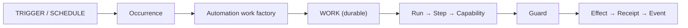

# ARCH/AUTOMATION — triggers, revisions, and the Work factory

> **Status:** Subsystem contract, derived from [`CORE.md`](CORE.md) §4–§5 and [`WORK.md`](WORK.md) §7.
> Owns the **automation definition**, its **revisions**, its **triggers and occurrences**, and the **Work
> factory** that turns a triggered revision into ordinary Work. It owns **no execution**.
> Invariants it must not weaken: **I4, I6, I8, I9, I26**.
> **Added by [`ADR/0005`](ADR/0005-external-agents-are-the-v1-engines.md) and `P71`.** Automation is already
> implemented (`everyaios-core/src/{scheduler_service,automation_runtime}.rs`, the `automations-panel` and
> `automation-editor` surfaces); this document is the contract those implementations must converge on.

---

## 1. The rule

> **A trigger never executes a task. It creates Work.**



This is `WORK.md` §7's reduction rule applied to automation: *if it can be expressed as Work + Step +
Capability + Effect, it does not get a runtime* (**I26**). Automation therefore has a **compiler**, not an
engine.

---

## 2. Automation is a definition

```
Automation
├── id · name · enabled
├── trigger                   schedule | event | condition | manual
├── blueprint_ref             what to do (declarative; never a runtime — WORK.md §9)
├── agent_policy              fixed | inherit-primary | primary-chooses | resolver
├── capability_policy         which packs the run may use
├── execution_policy          max_runtime · deadline
├── concurrency_policy        max_concurrent_runs · overlap_policy
├── budget_policy             token/$ ceiling per run
├── misfire_policy            skip | run_once_on_resume | catch_up
├── input_schema · timezone
└── revision                  monotonic; content-addressed
```

Two properties are load-bearing:

1. **A definition is data**, so export/import is a serialization concern, never a code path.
2. **Secrets are never embedded.** A definition stores `credential_ref`; the value lives in the vault
   (`SECURITY.md` §5). An exported automation must be safe to paste into a repository.

---

## 3. Revisions are immutable per run

A running Work must not mutate because someone edited the automation.

```
Automation ──▶ revision 4 ──▶ Work created ──▶ Work records revision 4
                                     │
       editing the automation ───────┘  affects the NEXT run only
```

Every Work created by an automation records `automation_id` · `automation_revision_id` ·
`trigger_occurrence_id`. Editing affects future runs; it never rewrites a durable Work (**I4**, **I6**).

> **Identity gap (`P71`):** the canonical IDs above do not exist yet in `everyaios-types`.
> `RunSnapshot.task_version` gestures at this and must not be mistaken for it. Until the IDs land, revision
> immutability is a documented obligation without an enforceable key.

## 4. Triggers and occurrences

| Trigger | Fires on | Local-first note |
|---|---|---|
| `manual` | user action ("Run now") | always available |
| `schedule` | cron · interval · time window | needs the app or a background host |
| `event` | file · git · GitHub · calendar · email · app · system · Work · agent | some need reachability |
| `condition` | a predicate evaluated on an observation | evaluated by the Work factory |

Every trigger produces an **Occurrence** record before any Work exists. An occurrence is what makes
deduplication, misfire accounting and "why did this run?" answerable — three questions a bare cron entry
cannot answer.

> **Server-free honesty (I15).** A closed, offline laptop cannot receive an internet webhook. The contract
> therefore supports, in this order: **polling** → **app-running listener** → **user-hosted ingress**
> (`deploy/BYO-HOST.md`). A hosted relay of ours is explicitly *not* part of v1 — and no surface may imply
> otherwise.

---

## 5. The Work factory — compiles, never executes

```
Automation revision ──▶ validate ──▶ compile ──▶ Work + Steps + capability requests
```

The factory's obligations:

1. **Validate** the definition against its own schema before anything runs.
2. **Instantiate** Steps and the capability requests they will need.
3. **Stamp provenance:** `automation_id` · `automation_revision_id` · `trigger_occurrence_id`.
4. **Apply policy:** budget, concurrency admission, agent policy, capability policy.
5. **Refuse** rather than guess when policy or capability makes the run impossible.

It must **not** execute effects, hold execution state, or retry effects. Those belong to the Work kernel
(`WORK.md` §2) and to `RECOVERY.md`.

> **Current-code note (`P71.3c`):** `everyaios-core/src/automation_runtime.rs` currently *is* a runtime
> (`AutomationRuntime::run`/`run_step` executing `run_code`, `online_search`, `email`, `calendar`). It must
> converge on this section: a compiler that produces Work.

---

## 6. Deterministic steps first, agent-backed steps second

Not every automation needs a model:

```
Every day at 09:00 → copy folder → compress → upload        ← deterministic, no agent
Every day at 09:00 → read mail → judge importance → summarise ← agent required
```

An automation may therefore mix **deterministic capability steps** and **agent-backed steps**. Both still
produce Work, and a deterministic-only automation needs no agent binding at all — which matters for cost,
latency and reliability, and is the cheapest reason to keep this distinction explicit rather than implied.

---

## 7. Concurrency and misfire

```
concurrency:  max_concurrent_runs · max_runs_per_hour · deadline
overlap_policy:  parallel | queue | skip | cancel_previous
misfire_policy:  skip | run_once_on_resume | catch_up
```

**`run_once_on_resume` is the default**, not `catch_up`. A laptop that slept through the night must not wake
up and launch seventeen missed copies of a job that uploads files.

These are trigger-and-admission policies **around** Work — not a second runtime, and not part of the
automation's *definition* of purpose.

---

## 8. Wait conditions and checkpoints

Long Work pauses. A pause is a **state**, never a spinning process:

| Wait reason | Resumes when |
|---|---|
| `Approval` | a human decision arrives |
| `UserInput` | the user answers |
| `Timer` | a deadline passes |
| `ExternalEvent` | a subscribed event fires |
| `Resource` | a lease/lock becomes available |
| `Agent` | a bound agent reports back |
| `Retry` | backoff elapses |

`Recoverable` is a first-class outcome, distinct from `Failed`: *effect outcome unknown* is not *effect
failed* (`RECOVERY.md` §3). Long Work checkpoints `current step · progress · agent binding · context
reference · artifacts · unresolved effects` — not every model turn.

> **Code gap (`P71`):** `everyaios-types` `WorkState` has six variants and lacks `Waiting*`, `Verifying` and
> `Recoverable`; there is no `WaitCondition`/`WaitReason` type and no `CheckpointId`. `WORK.md` §4 already
> specifies the full set, so this is code catching up to the contract, not new architecture.

## 9. Ownership — the scheduler's exact boundary

| The scheduler **owns** | The scheduler **must not own** |
|---|---|
| automation definitions · revisions | Work · Run · Step |
| triggers · subscriptions · occurrences | effects or effect retries |
| cron · intervals · windows | execution checkpoints |
| battery/wake policy · misfire policy | execution history (the Event Log owns it — **I3**) |
| concurrency admission · trigger dedupe | agent execution of any kind |

> **Current-code note (`P71.3d`):** `everyaios-core/src/scheduler_service.rs` currently holds a second state
> machine — `RunState` (`:239`), `current_run` (`:373`), retry, a run ledger — plus model assumptions that no
> longer have an owner: `active_model`/`active_effort` (`:645-646`) and `has_api_key` (`:915`). Those must
> become **agent readiness** (`installed · launchable · protocol-compatible · authenticated ·
> capabilities-negotiated · ready`) and an **agent binding policy**, never a global "the model".

---

## 10. The owning Session for headless Work

An automation-created Work is created **without a user present**. `SESSION.md` §2 currently states that
`Chat ↔ Session` is **1:1** and says nothing about automation, delegated or otherwise headless Work — while
`WORK.md` §7 requires every trigger to create Work. Between those two statements there is no named owner for
a headless Work's Session.

This document does **not** resolve it, because Session semantics belong to [`SESSION.md`](SESSION.md) — and a
second source of truth for Session identity is exactly the **I4** failure. What is settled here is the
**requirement**:

1. a trigger-created Work has a durable owning Session;
2. that Session exists without a user-facing Chat;
3. Session **kind** (`interactive` · `automation` · `delegated`) is a property of the Session, not inferred
   from whether a Chat happens to exist;
4. the Work/Event/receipt semantics inside it are identical to an interactive Session's.

> **Resolved (`ADR-0006`, 2026-09-21):** `SESSION.md` now defines Session **kinds** — `interactive` (behind a
> Chat, 1:1) · `automation` (no Chat, normal) · `delegated` (no Chat, explicit). The requirement below is
> therefore **settled as a rule**, not an open question; what remains is implementation (`P71.8`).

---

## 11. UI contract

`UI.md`'s projection rule governs everything here. The automation surface shows:

- the automation list — name · schedule or trigger · bound agent · enabled
- per-automation actions — **Run now** · Edit · Enable/Disable · Duplicate · Export
- recent runs with an honest status — running · completed · failed · **waiting for approval**
- export/import as `*.automation.json`, **never** carrying a secret (only `credential_ref`)

Runs/Steps/effects stay behind the details affordance. A user who never opens it should still be able to
tell at a glance whether their morning job ran.

---

## 12. Invariants this document must not weaken

| Invariant | How |
|---|---|
| I4 — one owner per state | §9's boundary; §10 refuses to become a second Session authority |
| I6 — Work is the durable unit | §3's revision stamping on the Work itself |
| I8 — subagents are child Work | an agent-backed step delegates via child Work, never a sub-runtime |
| I9 — MultiRun is a strategy | a retried automation produces Runs of one Work, not new Works |
| I26 — no new runtime | §5's factory compiles; §7's policies surround Work |
| I15 — no false claims | §4's server-free honesty; §11's waiting-for-approval status |

---

## 13. Migration notes

- `automation_runtime.rs` → **Work factory** (`P71.3c`): keep validation and instantiation, remove execution.
- `scheduler_service.rs` → **trigger plane** (`P71.3d`): remove the execution state machine and the model
  assumptions; keep cron/interval/event/webhook/window, battery policy, misfire policy, admissions.
- `RunSnapshot.task_version` → superseded by `automation_revision_id` once the canonical IDs land (`P71.4`).
- The `automations-panel` / `automation-editor` / `schedules-section` surfaces keep their UX; what changes is
  what they are allowed to be an authority over — nothing (`UI.md` §1).


