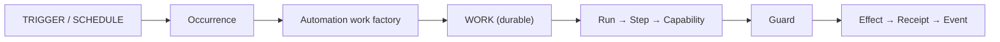

# ARCH/AUTOMATION — triggers, revisions, and the Work factory

> **Status:** Subsystem contract, derived from [`CORE.md`](CORE.md) §4–§5 and [`WORK.md`](WORK.md) §7.
> Owns the **automation definition**, its **revisions**, its **triggers and occurrences**, and the **Work
> factory** that turns a triggered revision into ordinary Work. It owns **no execution**.
> Invariants it must not weaken: **I4, I6, I8, I9, I26**.
>
> **v1 scope clarification (2026-09-24):** [`ADR/0007`](ADR/0007-windows-first-v1-qualification.md)
> makes durable revision/occurrence identity, `compile_work` on the production firing path, event/webhook
> admission, and pending/uncertain/cancelled handling v1 qualification obligations. It adds no scheduler
> state machine or canonical primitive. Voice/STT/TTS/wake-word/audio remain post-v1.
>
> **Projection/lease amendment (2026-09-24):** [`ADR/0008`](ADR/0008-session-workbench-projection-and-resource-leases.md)
> applies the same `Session → Work → Run → AgentBinding` identity, non-authoritative projection, and
> Work/Run-owned resource leases to headless automation Sessions. It does not create hidden Chats or move
> durable admission/occurrence ownership into the scheduler.
> **Added by [`ADR/0005`](ADR/0005-external-agents-are-the-v1-engines.md) and `P71`.** Automation is already
> implemented (`everyaios-core/src/{scheduler_service,automation_runtime}.rs`, the `automations-panel` and
> `automation-editor` surfaces); this document is the contract those implementations must converge on.

---

## 1. The rule

> **A trigger never executes a task. It creates Work.**



This is `WORK.md` §7's reduction rule applied to automation: *if it can be expressed as Work + Step +
Capability + Effect, it does not get a runtime* (**I26**). Automation therefore has a **compiler**, not an
engine.

---

## 2. Automation is a definition

```
Automation
├── id · name · enabled
├── trigger                   schedule | event | condition | manual
├── blueprint_ref             what to do (declarative; never a runtime — WORK.md §9)
├── agent_policy              fixed | inherit-primary | primary-chooses | resolver
├── capability_policy         which packs the run may use
├── execution_policy          max_runtime · deadline
├── concurrency_policy        max_concurrent_runs · overlap_policy
├── budget_policy             token/$ ceiling per run
├── misfire_policy            skip | run_once_on_resume | catch_up
├── input_schema · timezone
└── revision                  monotonic; content-addressed
```

Two properties are load-bearing:

1. **A definition is data**, so export/import is a serialization concern, never a code path.
2. **Secrets are never embedded.** A definition stores `credential_ref`; the value lives in the vault
   (`SECURITY.md` §5). An exported automation must be safe to paste into a repository.

---

## 3. Revisions are immutable per run

A running Work must not mutate because someone edited the automation.

```
Automation ──▶ revision 4 ──▶ Work created ──▶ Work records revision 4
                                     │
       editing the automation ───────┘  affects the NEXT run only
```

Every Work created by an automation records `automation_id` · `automation_revision_id` ·
`trigger_occurrence_id`. Editing affects future runs; it never rewrites a durable Work (**I4**, **I6**).

> **v1 identity requirement ([`ADR/0007`](ADR/0007-windows-first-v1-qualification.md)).** The IDs above
> are v1 release obligations, even though the canonical schema and production firing wiring are not yet
> complete. `revision_id` must be content-addressed and immutable for the life of a Work; `occurrence_id`
> must identify one trigger admission durably; both must be stamped on the Work created by that occurrence.
> They are fields/provenance on existing records, not new canonical primitives.
>
> **Status (corrected 2026-09-24 against source).** The earlier note that
> `src-tauri/src/scheduler_fire.rs:177`–`210` "creates the automation Work/Run directly and does not call
> that factory" **no longer describes the code.** The live firing path now imports and calls the factory:
> `use everyaios_core::automation_runtime::{WorkSpec, compile_work};` (`scheduler_fire.rs:13`), the call at
> `:125`, an explicit post-condition at `:132`–`134` refusing a spec whose `provenance.revision_id` /
> `trigger_occurrence_id` disagree with the admitted occurrence, occurrence-derived ids
> (`automation_work_id` / `automation_run_id`, `:225`–`226`), and Work creation through
> `gateway.create_work_in_session` (`:265`). The file's own doc comment at `:122` exists to stop the bypass
> recurring. `automation_runtime.rs` remains the compiler seam with the required provenance fields.
>
> What is **not** yet closed is the qualification, not the wiring: `scheduler_service.rs` records
> `mark_fired` as a job timestamp rather than the durable occurrence identity required above, and no live
> acceptance run has demonstrated occurrence→Work provenance on a real install. Both the compiler and the
> production firing path are therefore **implemented — unverified**, and this row cannot be qualified until
> the occurrence record and its admission states are exercised live.
>
> **Do not "fix" this path to satisfy `check-arch-invariants.mjs`.** That gate's `E4-WORK-CREATION` rule is a
> text-level regex on the `WorkCreated` variant name, so it also fires on lines that merely *match* on
> replayed events. The three hits it reports in this area — `scheduler_fire.rs:257`, `execution.rs:393` and
> `execution.rs:528` — are read-only pattern matches over `gateway.events(...)` / replayed envelopes
> (an objective comparison, a `created.len() != 1` validation, and a legacy `run_id` reconstruction), not
> appends. An append is a violation; a match is not. Any correction here must be made to the gate's
> calibration, never by rewriting a correct read into a different shape to silence a regex.

## 4. Triggers and occurrences

| Trigger | Fires on | Local-first note |
|---|---|---|
| `manual` | user action ("Run now") | always available |
| `schedule` | cron · interval · time window | needs the app or a background host |
| `event` | file · git · GitHub · calendar · email · app · system · Work · agent | some need reachability |
| `condition` | a predicate evaluated on an observation | evaluated by the Work factory |

Every trigger produces an **Occurrence** record before any Work exists. An occurrence is what makes
deduplication, misfire accounting and "why did this run?" answerable — three questions a bare cron entry
cannot answer.

**Occurrence admission is part of v1 qualification.** The admission path validates event/webhook
authenticity, schema, scope, frequency, and misfire policy, then durably records the automation id, the
immutable revision id, and the occurrence id before Work creation. The occurrence-to-Work mapping is
one-to-one for a first firing and remains stable across retries and reconnects. A later trigger firing
gets a later occurrence; it never reuses an old occurrence to hide a duplicate.

The existing Work/Event/Receipt vocabulary carries the admission states without a scheduler-owned
state machine:

- `pending`: the occurrence is durably admitted but Work admission is not complete;
- `uncertain`: admission or effect completion cannot be proven and must be reconciled before retry;
- `cancelled`: cancellation won the monotonic race and no later attempt re-opens that occurrence.

`pending` is occurrence admission state, `uncertain` is the existing uncertain-effect/Recoverable
projection, and `cancelled` is the existing Work cancellation state. None is a new primitive.

> **Server-free honesty (I15).** A closed, offline laptop cannot receive an internet webhook. The contract
> therefore supports, in this order: **polling** → **app-running listener** → **user-hosted ingress**
> (`deploy/BYO-HOST.md`). A hosted relay of ours is explicitly *not* part of v1 — and no surface may imply
> otherwise.

---

## 5. The Work factory — compiles, never executes

```
Automation revision ──▶ validate ──▶ compile ──▶ Work + Steps + capability requests
```

The factory's obligations:

1. **Validate** the definition against its own schema before anything runs.
2. **Instantiate** Steps and the capability requests they will need.
3. **Stamp provenance:** `automation_id` · `automation_revision_id` · `trigger_occurrence_id`.
4. **Apply policy:** budget, concurrency admission, agent policy, capability policy.
5. **Refuse** rather than guess when policy or capability makes the run impossible.

It must **not** execute effects, hold execution state, or retry effects. Those belong to the Work kernel
(`WORK.md` §2) and to `RECOVERY.md`.

> **Current-code note (`P71.3c` + ADR-0007, corrected 2026-09-24):** `everyaios-core/src/
> automation_runtime.rs` is the compiler seam and exposes `compile_work` with the required provenance
> fields, **and the production firing path calls it** — `src-tauri/src/scheduler_fire.rs` imports
> `compile_work` (`:13`), invokes it (`:125`), refuses a provenance mismatch (`:132`–`134`), and creates
> the Work through `gateway.create_work_in_session` with occurrence-derived ids (`:225`–`226`, `:265`).
> The factory's obligations 1–3 and 5 in this section are therefore satisfied on the live path. What still
> blocks qualification is obligation 4 plus durable occurrence identity: admission states
> (`pending`/`uncertain`/`cancelled`) and the occurrence record itself are not yet exercised live, so the
> automation row stays **implemented — unverified**.

---

## 6. Deterministic steps first, agent-backed steps second

Not every automation needs a model:

```
Every day at 09:00 → copy folder → compress → upload        ← deterministic, no agent
Every day at 09:00 → read mail → judge importance → summarise ← agent required
```

An automation may therefore mix **deterministic capability steps** and **agent-backed steps**. Both still
produce Work, and a deterministic-only automation needs no agent binding at all — which matters for cost,
latency and reliability, and is the cheapest reason to keep this distinction explicit rather than implied.

---

## 7. Concurrency and misfire

```
concurrency:  max_concurrent_runs · max_runs_per_hour · deadline
overlap_policy:  parallel | queue | skip | cancel_previous
misfire_policy:  skip | run_once_on_resume | catch_up
```

**`run_once_on_resume` is the default**, not `catch_up`. A laptop that slept through the night must not wake
up and launch seventeen missed copies of a job that uploads files.

These are trigger-and-admission policies **around** Work — not a second runtime, and not part of the
automation's *definition* of purpose.

---

## 8. Wait conditions and checkpoints

Long Work pauses. A pause is a **state**, never a spinning process:

| Wait reason | Resumes when |
|---|---|
| `Approval` | a human decision arrives |
| `UserInput` | the user answers |
| `Timer` | a deadline passes |
| `ExternalEvent` | a subscribed event fires |
| `Resource` | a lease/lock becomes available |
| `Agent` | a bound agent reports back |
| `Retry` | backoff elapses |

`Recoverable` is a first-class outcome, distinct from `Failed`: *effect outcome unknown* is not *effect
failed* (`RECOVERY.md` §3). Long Work checkpoints `current step · progress · agent binding · context
reference · artifacts · unresolved effects` — not every model turn.

> **Code gap (`P71`) — closed (`P71.3g`, implemented 2026-09-21 — not yet verified):** `everyaios-types`
> now carries the full §4 lifecycle (`Created · Planning · Ready · Running · WaitingTool ·
> WaitingApproval · WaitingUser · Checkpointed · Verifying · Completed · Failed · Cancelled · Paused ·
> Recoverable`), with `Recoverable` a first-class outcome; `WaitReason`/`WaitCondition` (approval ·
> user input · timer · external event · resource · agent · retry, each mapping to the state it parks
> the Work in) and `CheckpointId` (`ckpt:<work>/<step>`, deterministic) exist. The Work Gateway's
> transition door is typed (`record_execution_transition(WorkState)`, `record_wait(condition)`), the
> terminal outcome door refuses non-terminal states, and the `execution/transition` RPC parses with
> `try_parse` and refuses unknown spellings instead of coercing them.

## 9. Ownership — the scheduler's exact boundary

| The scheduler **owns** | The scheduler **must not own** |
|---|---|
| automation definitions · revisions | Work · Run · Step |
| triggers · subscriptions · occurrences | effects or effect retries |
| cron · intervals · windows | execution checkpoints |
| battery/wake policy · misfire policy | execution history (the Event Log owns it — **I3**) |
| concurrency admission · trigger dedupe | agent execution of any kind |

> **Repair note (`P71.3d`, implemented 2026-09-21 — not yet verified):** `everyaios-core/src/
> scheduler_service.rs` no longer holds a second state machine. `RunState` (leases, fences, checkpoints,
> retry, `Failed`), `current_run`/`RunSnapshot`, the runs ledger and the model assumptions
> (`active_model`/`active_effort`, drift pins, `has_api_key`/`dispatch_preflight`) are **deleted**.
> What remains is the trigger plane this section specifies: definitions + triggers (cron · interval ·
> event · webhook · window), next-due computation, occurrence records (`mark_fired` — trigger dedupe +
> misfire accounting), battery/misfire/frequency admission, monitor observation accounting, nudge
> sentinels, the incident ack-store and the read-only doctor. Pause is a trigger-plane flag
> (`Job.paused`), never an execution wait — those are `WaitCondition` (§8). Run history is the Event
> Log's (**I3**); a run-level failure record is **agent readiness** + binding policy, never a global
> "the model".
>
> **`P71.3f` (implemented 2026-09-21 — not yet verified):** that readiness half now exists — one state
> ([`everyaios_types::AgentReadiness`](../crates/everyaios-types/src/lib.rs), [`AGENT.md`](AGENT.md)
> §3.1) replacing the scattered booleans. The scheduler's connection to it is the trigger-plane doctor,
> which reads it as an ordinary check (`agents`: ready · launchable · auth-required · discovered), and
> the firing turn's gate: a turn that names an agent fails with the readiness state as the reason
> (`agent_not_ready`) rather than a generic engine error. Which agent a *session's* firing resolves to
> is the session binding's question (P71.5b retires the Chief vocabulary) — the firing turn passes no
> agent id today, so the gate is exact where an agent is named and silent where it is not.

---

## 10. The owning Session for headless Work

An automation-created Work is created **without a user present**. `SESSION.md` §2 currently states that
`Chat ↔ Session` is **1:1** and says nothing about automation, delegated or otherwise headless Work — while
`WORK.md` §7 requires every trigger to create Work. Between those two statements there is no named owner for
a headless Work's Session.

This document does **not** resolve it, because Session semantics belong to [`SESSION.md`](SESSION.md) — and a
second source of truth for Session identity is exactly the **I4** failure. What is settled here is the
**requirement**:

1. a trigger-created Work has a durable owning Session;
2. that Session exists without a user-facing Chat;
3. Session **kind** (`interactive` · `automation` · `delegated`) is a property of the Session, not inferred
   from whether a Chat happens to exist;
4. the Work/Event/receipt semantics inside it are identical to an interactive Session's.

> **Resolved (`ADR-0006`, 2026-09-21):** `SESSION.md` now defines Session **kinds** — `interactive` (behind a
> Chat, 1:1) · `automation` (no Chat, normal) · `delegated` (no Chat, explicit). The requirement below is
> therefore **settled as a rule**, not an open question; what remains is implementation (`P71.8`).

### 10.1 Headless identity, projection, and resource scope

An automation firing uses the same canonical owner chain as an interactive turn:

```text
automation SessionId → WorkId → RunId → AgentBindingId → ResourceRef/lease attachment
```

The automation Session has **no hidden Chat**. The Work factory, Work/Run/Event/Receipt/Audit spine, and
resource engines retain their existing owners; the scheduler retains only definitions, triggers, admission,
and durable occurrence identity. A `SessionWorkbenchProjection` for an automation Session is a read model that
can be rendered by the Automation screen or attached later to a continuation Chat, but it is not a scheduler
run ledger, execution state machine, or second event log.

A headless Run uses the same Work/Run-owned `ResourceLease` generation/fence rules as an interactive Run.
Browser profiles/tabs, Office documents, Desktop targets, and provider-private handles remain typed resource
references; the automation Session does not own the physical resource. Missing/stale resources, lease
contention, crash/reclaim, logout, and config-scope changes follow ADR-0008 and `RECOVERY.md`/`SECURITY.md` with
the same honest `uncertain` outcome. The acceptance matrix, including no-Chat automation and no bearer/token
in UI/IPC/logs, is normative in [`ADR/0008`](ADR/0008-session-workbench-projection-and-resource-leases.md) and
remains pending implementation/qualification.

---

## 11. UI contract

`UI.md`'s projection rule governs everything here. The automation surface shows:

- the automation list — name · schedule or trigger · bound agent · enabled
- per-automation actions — **Run now** · Edit · Enable/Disable · Duplicate · Export
- recent runs with an honest status — pending · running · completed · failed · **uncertain** · **cancelled** ·
  **waiting for approval**; a `pending` or `uncertain` occurrence is never rendered as success
- export/import as `*.automation.json`, **never** carrying a secret (only `credential_ref`)

The v1 evidence rule is that the list and history are projections of the canonical Work/Event/Receipt
spine. They do not establish occurrence provenance or execution completion; those require the factory
and recovery paths named in [`ADR/0007`](ADR/0007-windows-first-v1-qualification.md).

Runs/Steps/effects stay behind the details affordance. A user who never opens it should still be able to
tell at a glance whether their morning job ran.

---

## 12. Invariants this document must not weaken

| Invariant | How |
|---|---|
| I4 — one owner per state | §9's boundary; §10 refuses to become a second Session authority |
| I6 — Work is the durable unit | §3's revision stamping on the Work itself |
| I8 — subagents are child Work | an agent-backed step delegates via child Work, never a sub-runtime |
| I9 — MultiRun is a strategy | a retried automation produces Runs of one Work, not new Works |
| I26 — no new runtime | §5's factory compiles; §7's policies surround Work |
| I15 — no false claims | §4's server-free honesty; §11's waiting-for-approval status |

---

## 13. Migration notes

- `automation_runtime.rs` → **Work factory** (`P71.3c`): keep validation and instantiation, remove execution.
- `scheduler_service.rs` → **trigger plane** (`P71.3d`): remove the execution state machine and the model
  assumptions; keep cron/interval/event/webhook/window, battery policy, misfire policy, admissions.
- `RunSnapshot.task_version` → superseded by `automation_revision_id` once the canonical IDs land (`P71.4`).
- [`ADR/0007`](ADR/0007-windows-first-v1-qualification.md) makes the remaining production call from
  `scheduler_fire.rs` into `compile_work`, durable occurrence admission, and the existing Work recovery
  semantics a v1 release gate; it does not add a scheduler-owned executor.
- The `automations-panel` / `automation-editor` / `schedules-section` surfaces keep their UX; what changes is
  what they are allowed to be an authority over — nothing (`UI.md` §1).

---

## Repo-comparison additions (briefs 01–19)

> Delta-analysis items re-homed into this contract (each entry: brief item ID · disposition tag ·
> SOURCE repo + evidence path under `REPO-COMPARE/clone2|clone3/` · one-sentence LOGIC · target §).
> Arrows to files not owned here are annotations only.

- **RTE-9** · [ADD] · SOURCE: `clone2/litellm` (provider/deployment/tag budget model) — LOGIC: budget gates (provider/deployment/tag budgets, one batched spend read, fail-closed when no budget remains, remaining-budget gauges) scope to Work/session budgets on a single-operator desktop — no tenancy — target: §2 (`budget_policy`) → `CORE.md` §8.4 CostLedger + Guard (annotations).
- **CON-3** · [ADD] · SOURCE: `clone2/nango` (signed-webhook pipeline; ELv2 pattern-mining only, never linked) — LOGIC: a signed inbound webhook pipeline (HMAC-SHA256, bounded retries with backoff, timeout, circuit breaker, trusted-setter-only URL override, throttled inbound dispatch queue) moves event triggers honestly up the §4 ladder — polling → app-running listener → user-hosted ingress (`deploy/BYO-HOST.md`), no hosted relay — target: §4 (Guard egress annotation).
- **WRK-11** · [IMPROVE] · SOURCE: `clone2/openclaw` (event-conditioned standing intents) — LOGIC: standing intents get fire budgets, cooldown and authenticated-owner-only creation so budgets bound autonomous firing and owner-only creation prevents an agent from arming itself, all still counted as occurrences — target: §4.
- **12-5** · [IMPROVE] · SOURCE: `clone2/openwork` (`docs/features/automations-desktop-runner/README.md` — desktop-runner claim protocol) — LOGIC: the scheduler/runner split claims each occurrence atomically under lock with heartbeats and terminates every missed/unavailable occurrence as an explicit receipt instead of a silent skip — target: §§4–7.
- **WRK-3** · [IMPROVE] · SOURCE: `clone2/openclaw` (`heartbeat-monitor.ts`; restart-catchup / recovery-identity / overdue test templates verified by brief 17) — LOGIC: cron operational rules — reschedule-overdue-never-replay at startup, reconcile by exact run identity (never coincident start times), grace windows, hard-kill escalation, supervisor auto-disable with visible enabled/disabled state — make the `P71.3d` trigger-plane repair verifiable, trigger-plane only — target: §7/§9.
- **11-6** · **Not adopted (recorded)** · SOURCE: `clone2/AIOS` (`aios/scheduler/fifo_scheduler.py`, `rr_scheduler.py`, `aios/syscall/syscall.py`) — LOGIC: a thread FIFO/RR scheduler-as-kernel carries no authorization, no durability and no effect ledger, so the Work factory + scheduler boundary (§5, §9) and the WORK.md §7 reduction rule stay authoritative — this pattern stays rejected — target: §5/§9 (+ [WORK.md](WORK.md) §7).


