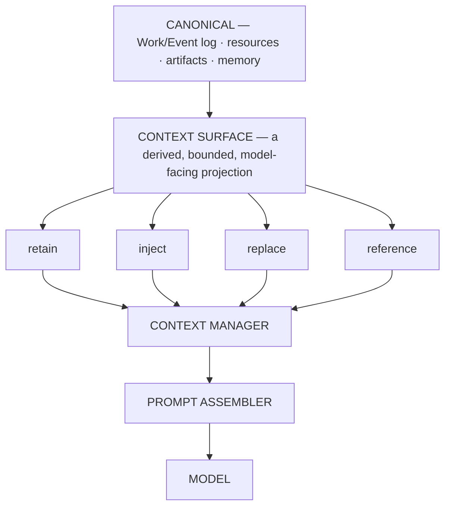

# ARCH/CONTEXT — context engineering: history, surface, prompt

> **Status:** Subsystem contract, derived from [`CORE.md`](CORE.md) §8. Owns the boundary between durable
> truth and what a model actually sees. Invariants it must not weaken: **I2, I16, I17, I18, I19, I20, I21,
> I22**.

---

## 1. History is not Context

> **Canonical truth is never optimized for a provider. Optimization happens in a derived projection.**

The separation is the whole design:



> **The model can forget without EveryAIOS forgetting.**

Nothing important is ever destructively deleted merely because the model does not need it right now.

---

## 2. ContextSurface

The surface is an explicit object, not an emergent property of a message array:

```
ContextSurface
├── source_events        which canonical events feed this surface
├── visible_nodes        what the model currently sees
├── injected_nodes       added without a canonical event
├── replacements         spans replaced by a summary node
├── references           pointers the model may open instead of inline content
├── token_estimate
└── cache_boundary       where the stable prefix ends
```

`ContextSurface` belongs **inside** context engineering, backed by projections. It is not a new subsystem,
not a new database, and not a new runtime — the temptation to grow it into one is the main risk of this
document.

---

## 3. The optimization order — normative

Steps 1–5 are cheap and deterministic. Only step 6 costs a model call.

1. **reuse the cached stable prefix**
2. **do not inject unnecessary context**
3. **replace resources with references**
4. **prune oversized tool results** (bounded head + marker + tail)
5. **remove low-value historical surface**
6. **semantic compaction** — bounded, and it must fit its own summarizer
7. **retry against the exact route's capacity**

Doing these out of order is a defect (I19). Sending a second model call to summarize a 100k-token page
fetch when retaining the first and last few thousand tokens would have sufficed is the canonical violation.

```
pressure → cheap reducers → RE-MEASURE → still too large? → no: done
                                                     ↓ yes
                                              semantic compaction → RE-MEASURE
```

Every reducer must **re-measure**. A reduction that does not verify its own effect cannot be trusted.

---

## 4. Cache stability

```
STABLE PREFIX (append-stable)          DYNAMIC TAIL
├── system identity                    ├── relevant memory
├── project instructions               ├── Work state
├── stable capability schemas          ├── retrieved resources
├── stable skill index                 ├── tool results
└── stable tool definitions            └── current user message
```

Consequences that are easy to get wrong:

- A **mounted tool schema** change is a prefix mutation, treated as a cache-boundary event. Tool sets must not
  churn per turn; changing schemas can destroy prefix reuse.
- A capability backend may **start asynchronously behind a stable façade** — fast startup *and* prefix
  stability are compatible, and there is no reason to choose (see [CAPABILITIES.md](CAPABILITIES.md) §7).
- A **summary request** should resemble an ordinary provider request (same system prefix, ordinary tool
  schemas, one compaction instruction) so the existing cacheable prefix is reused rather than rebuilt.
- Reordering system sections, rewriting history, or injecting metadata into the prefix are all
  cache-boundary events. They are permitted — but they must be **intentional and observable** (I16).

---

## 5. The exposed contracts

These six are architecture. Everything else is a replaceable strategy.

| Contract | Responsibility |
|---|---|
| `ContextBudget` | how much of this turn may be spent, per category |
| `ContextSelector` | what deserves to enter this turn |
| `Compactor` | `selectRange()` · `buildSummaryRequest()` · `summarize()` · `installProjection()` · `verify()` |
| `ReferenceStore` | resolve a reference to content on demand |
| `CacheBoundary` | where stability ends and churn begins |
| `CostLedger` | what was actually spent, per route and per turn |

**CacheBoundary enforcement (2026-09-23, TODO P69.E9):** the shell-owned stable prefix is fingerprinted
every ACP turn (`everyaios-acp::prefix_guard`); each turn's `PrefixEvent` (stable / declared /
undeclared mutation) lands in the per-session tool log and an undeclared mutation prints loudly.
The warm-memory set is dynamic-tail content and is deliberately **not** fingerprinted — the memory
system legitimately learns between turns. Tool-schema churn on the ACP path is not yet observable
here because external agents own their tool surface; `EXTERNAL-AGENTS.md` §3 covers it contractually.

**Strategies** (plug in behind the above, never become architecture): BM25 · RRF · reranking · snippets ·
AST/structural pruning · output shrinking · compaction · prefix cache · pass-by-reference · progressive
disclosure · tool-output persistence · cache affinity.

---

## 6. Compaction must never depend on an over-limit summary request

This is a real, observed failure mode elsewhere: the summarization request itself exceeds the summarizer's
context and the system deadlocks. The contract:

```
pressure → cheap prune → re-measure → select summary input THAT FITS the summarizer
        → summarize → install projection → verify
        → still over budget? → second bounded reduction
        → still impossible?  → deterministic degraded rescue (stated, never silent)
```

A degraded rescue must be **visible** — the user and the receipt must be able to tell that the context was
reduced without a summary. Silent truncation that presents itself as normal context is a lie.

---

## 7. Raw output is not context

> **Raw tool/resource output is not automatically model context (I17); full content stays retrievable
> through references (I18).**

```
Effect
├── RawResult        full content / artifact          → stored, addressable
└── ProviderResult   bounded, model-visible content   → the only thing the model sees
```

`Resource` formalizes this so the two are never conflated:

```
Resource
├── id · type · size · digest · storage_ref
├── provider_view        bounded representation
└── retrieval_policy     what on-demand access is allowed
```

The model receives the small bounded view and can explicitly request more (`resource.open`,
`resource.read_range`, `artifact.extract`). This is the single largest token saving available and it fits
the existing pass-by-reference principle.

---

## 8. Handoff objects

| Object | Carries | Never carries |
|---|---|---|
| **ContextCapsule** | execution provenance: workspace ref, capability scope, parent Work ref, source artifact refs, snapshot hash, model, instructions | the parent's context |
| **ContextPassport** | semantic continuation: objective, plan, completed steps, open questions, findings, verified facts, relevant files, artifacts, workspace, memory refs, known failures, constraints | the transcript; private chain-of-thought |

A passport is ~0.5–1.5k tokens of state. A child agent or a newly activated binding receives the passport
plus references and fetches depth through EveryAIOS tools. **Copying the parent's whole context into a
child is the anti-pattern** — it makes delegation expensive and cache-hostile.

Never transfer raw model "thinking": shared state carries findings, facts, decisions, tool results,
artifacts, verification and plan state — not private reasoning.

---

## 9. Capacity comes from the route

```
EveryAIOS resolves: which agent receives this Work → the agent's own route → ContextManager asks:
                     "how much context can THIS route accept?"
```

There is **no global context-window registry** (I21). A global registry is exactly the second source of
truth I4 forbids, and it drifts from reality the moment a provider changes limits or a user configures a
custom endpoint. The adapter for the resolved route is authoritative.

---

## 10. Invariants this document must not weaken

| Invariant | How |
|---|---|
| I2 — canonical state is never provider-optimized | §1; optimization lives in the surface |
| I16 — prefixes are append-stable | §4 |
| I17/I18 — bounded view, full content retrievable | §7 |
| I19 — cheap reduction precedes summarization | §3 |
| I20 — compaction cannot overflow | §6 |
| I21 — route-derived capacity | §9 |
| I22 — assembly serializes, it does not own policy | §5; `ContextSelector` vs `Prompt Assembler` are separate objects |

---

## 11. Migration notes

The existing `ARCH/05-TOKEN-ECONOMY.md` already carries the prefix-cache lesson, tool-result size control
and pass-by-reference. **It is not being replaced from scratch** — it is being narrowed to a strategy
document under this contract (`P69.A16`), and `ARCH/13-PROMPT-ANATOMY.md` is absorbed here (`P69.A24`)
because the assembler is the serializer of Context, not the owner of Context policy.

---

## Repo-comparison additions (briefs 01–19)

Items from the 2026-09-22 repo-comparison pass (`REPO-COMPARE/DELTA-ANALYSIS.md` §3) whose primary
landing zone is this document. **Re-home rule (that analysis §5):** owners are the **Rust context
projector**, the **context passport** in `src-tauri/src/acp_cmds.rs`, and **`everyaios-memory`
compaction** — never the archived sidecar assembler (the sidecar turn loop was deleted in `P71.2c`).
Evidence paths are relative to `/home/sarvesh/business_Dev/REPO-COMPARE/`.

- **MEM-11** [add] — *prune-then-summarize compaction protocol + constants* — SOURCE: opencode
  (+ codex template half) · EVIDENCE: `clone2/opencode/packages/opencode/src/session/compaction.ts`
  and `clone2/opencode/packages/opencode/src/session/overflow.ts` (PRUNE_PROTECT 40K,
  PRUNE_MINIMUM 20K, tool-output serialize cap 2K, preserve-recent 2–15K, protected tool classes,
  tail-turn splitting; the codex update-in-place template half — Objective / Work State / Next Move /
  Relevant Files — was not re-verified in brief 17, follow-up) — LOGIC: battle-tested numbers make
  the normative §3 order (cheap prune before summarize) directly implementable and satisfy I19/I20.
  OWNER: Rust context projector + `everyaios-memory` compaction (+ passport build in
  `src-tauri/src/acp_cmds.rs`) — never the archived assembler. TARGET: §3 / §5 (`Compactor`).

- **MEM-12** [add] — *overflow recovery bundle* — SOURCE: opencode + codex (shared) · EVIDENCE:
  `clone2/opencode/packages/opencode/src/session/overflow.ts` (`COMPACTION_BUFFER = 20_000`
  overflow detection) — LOGIC: one bounded recovery — compaction-prompt-fits hard test (I20),
  remove-first-item retry on `ContextWindowExceeded`, 20K verbatim user-message cap,
  triggering-message replay — turns a fatal overflow 400 into a single verified retry instead of a
  deadlock. OWNER: `everyaios-memory` compaction + Rust context projector (re-homed; no
  coordinator/assembler owner). TARGET: §6.

- **COO-4** [add] — *managed tool-output spool* — SOURCE: opencode · EVIDENCE:
  `clone2/opencode/packages/opencode/src/tool/truncate.ts` (full output saved to a typed path +
  "delegate to save context" hint in the bounded preview), `clone2/opencode/packages/opencode/src/tool/truncation-dir.ts`
  (spool directory; the 7-day retention class is the brief's spec) — LOGIC: the concrete
  implementation of §7's `provider_view` / `storage_ref` pair (I17/I18) — the model sees only the
  bounded preview while full content stays retrievable, and the preview hint routes bulk reads to
  delegation. OWNER: tool settlement in `everyaios-core` + `core-tools` at the façade (re-homed from
  "coordinator"). TARGET: §7.

- **10-4** [add] — *Prompt Defense Baseline block in the context passport* — SOURCE: ECC · EVIDENCE:
  `clone2/ECC/agents/code-reviewer.md` (`## Prompt Defense Baseline`), `clone2/ECC/AGENTS.md`,
  `clone2/ECC/docs/ECC-2.0-REFERENCE-ARCHITECTURE.md` — LOGIC: the projection into external agents
  should carry a compact standing anti-hijack preamble (no persona/role override, untrusted-data
  marking, unicode/homoglyph vigilance) so injected content cannot rewrite identity at the top of
  context. TARGET: §1; → src-tauri/src/acp_cmds.rs `build_acp_prompt_with_passport` (impl) +
  → ARCH/13-PROMPT-ANATOMY.md principles.

- **COO-15** [add] — *Context Epoch semantics* — SOURCE: opencode · EVIDENCE:
  `clone2/opencode/packages/core/src/session/context-epoch.ts` (`SessionContextEpoch`
  initialize/prepare/reset; also `session/history.ts`, `session/sql.ts`) — note: brief 17 reported
  "no ContextEpoch symbol in fresh tree"; **that claim is wrong** — the module exists under
  `packages/core` as `SessionContextEpoch` — LOGIC: baseline-vs-mutable epoch semantics
  (reconcile/replace/advance; compaction ⇒ fresh baseline) make §4's append-stable prefix
  observable under revert/compaction/model-switch instead of assumed (I16). TARGET: §2
  (`ContextSurface`) / §5 (`CacheBoundary`).

- **COO-16** [add] — *typed context fragments (`ContextualUserFragment`-style)* — SOURCE: codex ·
  EVIDENCE: `clone2/codex/AGENTS.md` ("All injected fragments must be defined as structs in
  `core/context` and implement `ContextualUserFragment` trait"), `clone2/codex/.codex/skills/code-review-context/SKILL.md`
  — LOGIC: gives §2's `ContextSurface` a typed load/baseline/update fragment shape (structured,
  diffable, replaceable) — the concrete strategy implementation behind the contract, not a new
  subsystem. TARGET: §2 / §5.

- **MEM-10** [add] — *dual-watermark incremental summarization (wall-clock AND event-time)* —
  SOURCE: graphiti · EVIDENCE: `clone2/graphiti/graphiti_core/graphiti.py` (two watermarks on the
  saga node: `last_summarized_at` — wall-clock filter; `last_summarized_episode_valid_at` —
  episode/event-time, advanced only after a completed incremental summarize run), also
  `clone2/graphiti/graphiti_core/nodes.py` — LOGIC: summarization gated on both clocks never runs on
  a stale watermark or drops late-arriving events, so the `Compactor`'s input is current when §6's
  "summary input THAT FITS" rule operates. OWNER: `everyaios-memory` compaction. TARGET: §5
  (`Compactor` strategy) / §6.

- **13-2** [improve] — *skill/tool reranking before injection as a named stage* — SOURCE:
  anything-llm (MIT) · EVIDENCE: `clone2/anything-llm/server/utils/agents/aibitat/utils/toolReranker.js`
  (embeds tool name/description/params/examples, reranks to top-15 before injection) — LOGIC: names
  §3 step 2 ("do not inject unnecessary context") as a dedicated tool-surface stage so tool loadouts
  stay bounded as MCP/skill mounts grow — protecting I16 prefix stability. TARGET: §3 (optimization
  order); → ARCH/CAPABILITIES.md §6.

- **14-5** [improve] — *tool-result budget with persisted content-replacement records that survive
  resume* — SOURCE: cc-haha (brief 14 lane) · EVIDENCE: `clone2/cc-haha/src/query.ts`
  (`applyToolResultBudget`), `clone2/cc-haha/src/Tool.ts` (`Tool.maxResultSizeChars`) — LOGIC: typed
  content-replacement records (never prose parsing) keep §7's bounded provider view re-installable
  after resume for durable query sources, so a restart never silently reverts to raw output.
  TARGET: §7 (brief anchor `CONTEXT.md:142`) + paired strategy 05 §5.4.

- **14-6** [improve] — *cache-stable tool-pool ordering (built-ins as contiguous prefix)* — SOURCE:
  cc-haha · EVIDENCE: `clone2/cc-haha/src/tools.ts` (`assembleToolPool`, built-ins contiguous) —
  LOGIC: tool-pool construction order is a prefix mutation (§4 consequence 1); fixed ordering with
  a documented breakpoint rationale keeps mounted-tool churn the exception and preserves prefix
  reuse (I16). TARGET: §4; → ARCH/EXTERNAL-AGENTS.md §3 (stable façades).

- **14-8** [improve] — *per-model compaction thresholds + post-compact re-injection budgets* —
  SOURCE: cc-haha + grok-build · EVIDENCE: `clone2/cc-haha/src/services/compact/autoCompact.ts` and
  `clone2/cc-haha/src/services/compact/compact.ts` (`POST_COMPACT_TOKEN_BUDGET`, warning/error
  buffers; the brief's grok citation `session/compaction.rs` does not exist — actual files are
  `clone2/grok-build/crates/codegen/xai-grok-shell/src/session/compaction_{config,segments,context}.rs`)
  — LOGIC: thresholds keyed to the resolved model plus bounded re-injection caps (files/skills
  token budgets) make §6's post-summarize re-measure concrete — the projection is verified to fit
  after install, not assumed. OWNER: Rust context projector + `everyaios-memory` compaction.
  TARGET: §6 (+ 05 §5.2 planner budgets).

- **06b/19 fail-closed** [improve] — *fail-closed compression safety + fail-loud* — SOURCE: headroom
  (Apache-2.0, license corrected per brief 17) · EVIDENCE:
  `clone2/headroom/headroom/transforms/smart_crusher.py` (fail-closed, fail-loud, no-silent-fallback
  crushing), `clone2/headroom/headroom/transforms/content_router.py` (`_is_already_compressed`
  double-compress guard), `clone2/headroom/headroom/transforms/cache_aligner.py` (detector-only
  aligner that never rewrites the system prompt), `clone2/headroom/headroom/ccr/tool_injection.py` +
  `clone2/headroom/headroom/ccr/response_handler.py` (hash-ownership verification on retrieval,
  bounded ≤3 rehydration rounds with RESOLVED/ERROR status), `clone2/headroom/headroom/cache/compression_store.py`
  — LOGIC: compression failure must stay §6-visible (degraded rescue stated, never silent), must
  never double-compress, and must never install content whose ownership hash does not verify.
  OWNER: `everyaios-memory` compaction (re-homed; never an archived owner). TARGET: §6;
  → crates/everyaios-memory/src/compaction.rs (impl).

- **09-DeerFlow-6** [improve] — *prefix-cache hygiene: static system prompt,
  reminder-in-first-user-message* — SOURCE: DeerFlow (ByteDance) · EVIDENCE:
  `clone2/deerflow/backend/packages/harness/deerflow/agents/lead_agent/agent.py` (date/memory
  injected as `<system-reminder>` into the first user message), 
  `clone2/deerflow/backend/packages/harness/deerflow/agents/lead_agent/prompt.py` (static system
  prompt) — LOGIC: volatile per-turn facts ride in the first user message instead of the system
  prompt, so §4's append-stable prefix survives them without a cache-boundary event (I16).
  TARGET: §4.

- **14-13** [upgrade] — *rtk-class output compressor on the native shell/tool-result path* —
  SOURCE: rtk (Apache-2.0; re-implement as a strategy, no vendoring) · EVIDENCE:
  `clone2/rtk/docs/contributing/ARCHITECTURE.md`, `clone2/rtk/src/core/filter.rs`,
  `clone2/rtk/src/hooks/trust.rs` (project-filter trust gate) — LOGIC: wire the pattern
  `05-TOKEN-ECONOMY.md` §5.10 already documents with fail-safe passthrough and exit-code
  preservation so raw command output shrinks before it becomes model context (I17) while full
  output stays retrievable through §7's reference path; a partial implementation is already live at
  `crates/everyaios-memory/src/rtk.rs` (ls/ps/git/du parsers) — the upgrade is wiring + trust gate
  at the shell façade. TARGET: §7 + ARCH/05-TOKEN-ECONOMY.md §5.10 (paired entry there).

- **09-Hermes-10-rejection** [remove] — **Not adopted (recorded):** no micro-compaction by default —
  ship occupancy telemetry first. SOURCE: hermes · EVIDENCE: `clone2/hermes/agent/micro_compaction.py`
  (feature-gated `_micro_compact_enabled`, `_emit_micro_compaction_telemetry`, user prompts never
  compacted, documented cache-break trade-off as opt-in) — LOGIC: folding exchanges per turn breaks
  §4 prefix stability and §5.3 byte-stability for savings not yet measured on our workloads;
  occupancy telemetry is the precondition, and micro-compaction stays a future opt-in option only
  (recorded per `REPO-COMPARE/DELTA-ANALYSIS.md` §6 #4; full entry in
  [`05-TOKEN-ECONOMY.md`](05-TOKEN-ECONOMY.md)). TARGET: this record (§4 / §6).
