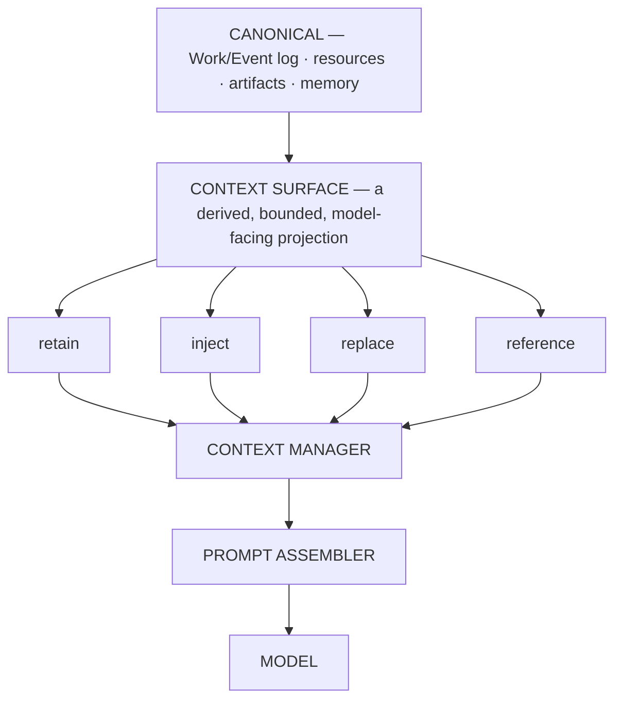

# ARCH/CONTEXT — context engineering: history, surface, prompt

> **Status:** Subsystem contract, derived from [`CORE.md`](CORE.md) §8. Owns the boundary between durable
> truth and what a model actually sees. Invariants it must not weaken: **I2, I16, I17, I18, I19, I20, I21,
> I22**.

---

## 1. History is not Context

> **Canonical truth is never optimized for a provider. Optimization happens in a derived projection.**

The separation is the whole design:



> **The model can forget without EveryAIOS forgetting.**

Nothing important is ever destructively deleted merely because the model does not need it right now.

---

## 2. ContextSurface

The surface is an explicit object, not an emergent property of a message array:

```
ContextSurface
├── source_events        which canonical events feed this surface
├── visible_nodes        what the model currently sees
├── injected_nodes       added without a canonical event
├── replacements         spans replaced by a summary node
├── references           pointers the model may open instead of inline content
├── token_estimate
└── cache_boundary       where the stable prefix ends
```

`ContextSurface` belongs **inside** context engineering, backed by projections. It is not a new subsystem,
not a new database, and not a new runtime — the temptation to grow it into one is the main risk of this
document.

---

## 3. The optimization order — normative

Steps 1–5 are cheap and deterministic. Only step 6 costs a model call.

1. **reuse the cached stable prefix**
2. **do not inject unnecessary context**
3. **replace resources with references**
4. **prune oversized tool results** (bounded head + marker + tail)
5. **remove low-value historical surface**
6. **semantic compaction** — bounded, and it must fit its own summarizer
7. **retry against the exact route's capacity**

Doing these out of order is a defect (I19). Sending a second model call to summarize a 100k-token page
fetch when retaining the first and last few thousand tokens would have sufficed is the canonical violation.

```
pressure → cheap reducers → RE-MEASURE → still too large? → no: done
                                                     ↓ yes
                                              semantic compaction → RE-MEASURE
```

Every reducer must **re-measure**. A reduction that does not verify its own effect cannot be trusted.

---

## 4. Cache stability

```
STABLE PREFIX (append-stable)          DYNAMIC TAIL
├── system identity                    ├── relevant memory
├── project instructions               ├── Work state
├── stable capability schemas          ├── retrieved resources
├── stable skill index                 ├── tool results
└── stable tool definitions            └── current user message
```

Consequences that are easy to get wrong:

- A **mounted tool schema** change is a prefix mutation, treated as a cache-boundary event. Tool sets must not
  churn per turn; changing schemas can destroy prefix reuse.
- A capability backend may **start asynchronously behind a stable façade** — fast startup *and* prefix
  stability are compatible, and there is no reason to choose (see [CAPABILITIES.md](CAPABILITIES.md) §7).
- A **summary request** should resemble an ordinary provider request (same system prefix, ordinary tool
  schemas, one compaction instruction) so the existing cacheable prefix is reused rather than rebuilt.
- Reordering system sections, rewriting history, or injecting metadata into the prefix are all
  cache-boundary events. They are permitted — but they must be **intentional and observable** (I16).

---

## 5. The exposed contracts

These six are architecture. Everything else is a replaceable strategy.

| Contract | Responsibility |
|---|---|
| `ContextBudget` | how much of this turn may be spent, per category |
| `ContextSelector` | what deserves to enter this turn |
| `Compactor` | `selectRange()` · `buildSummaryRequest()` · `summarize()` · `installProjection()` · `verify()` |
| `ReferenceStore` | resolve a reference to content on demand |
| `CacheBoundary` | where stability ends and churn begins |
| `CostLedger` | what was actually spent, per route and per turn |

**Strategies** (plug in behind the above, never become architecture): BM25 · RRF · reranking · snippets ·
AST/structural pruning · output shrinking · compaction · prefix cache · pass-by-reference · progressive
disclosure · tool-output persistence · cache affinity.

---

## 6. Compaction must never depend on an over-limit summary request

This is a real, observed failure mode elsewhere: the summarization request itself exceeds the summarizer's
context and the system deadlocks. The contract:

```
pressure → cheap prune → re-measure → select summary input THAT FITS the summarizer
        → summarize → install projection → verify
        → still over budget? → second bounded reduction
        → still impossible?  → deterministic degraded rescue (stated, never silent)
```

A degraded rescue must be **visible** — the user and the receipt must be able to tell that the context was
reduced without a summary. Silent truncation that presents itself as normal context is a lie.

---

## 7. Raw output is not context

> **Raw tool/resource output is not automatically model context (I17); full content stays retrievable
> through references (I18).**

```
Effect
├── RawResult        full content / artifact          → stored, addressable
└── ProviderResult   bounded, model-visible content   → the only thing the model sees
```

`Resource` formalizes this so the two are never conflated:

```
Resource
├── id · type · size · digest · storage_ref
├── provider_view        bounded representation
└── retrieval_policy     what on-demand access is allowed
```

The model receives the small bounded view and can explicitly request more (`resource.open`,
`resource.read_range`, `artifact.extract`). This is the single largest token saving available and it fits
the existing pass-by-reference principle.

---

## 8. Handoff objects

| Object | Carries | Never carries |
|---|---|---|
| **ContextCapsule** | execution provenance: workspace ref, capability scope, parent Work ref, source artifact refs, snapshot hash, model, instructions | the parent's context |
| **ContextPassport** | semantic continuation: objective, plan, completed steps, open questions, findings, verified facts, relevant files, artifacts, workspace, memory refs, known failures, constraints | the transcript; private chain-of-thought |

A passport is ~0.5–1.5k tokens of state. A child agent or a newly activated binding receives the passport
plus references and fetches depth through EveryAIOS tools. **Copying the parent's whole context into a
child is the anti-pattern** — it makes delegation expensive and cache-hostile.

Never transfer raw model "thinking": shared state carries findings, facts, decisions, tool results,
artifacts, verification and plan state — not private reasoning.

---

## 9. Capacity comes from the route

```
ModelCatalog → ModelRouter → resolved route → ContextManager asks:
                     "how much context can THIS route accept?"
```

There is **no global context-window registry** (I21). A global registry is exactly the second source of
truth I4 forbids, and it drifts from reality the moment a provider changes limits or a user configures a
custom endpoint. The adapter for the resolved route is authoritative.

---

## 10. Invariants this document must not weaken

| Invariant | How |
|---|---|
| I2 — canonical state is never provider-optimized | §1; optimization lives in the surface |
| I16 — prefixes are append-stable | §4 |
| I17/I18 — bounded view, full content retrievable | §7 |
| I19 — cheap reduction precedes summarization | §3 |
| I20 — compaction cannot overflow | §6 |
| I21 — route-derived capacity | §9 |
| I22 — assembly serializes, it does not own policy | §5; `ContextSelector` vs `Prompt Assembler` are separate objects |

---

## 11. Migration notes

The existing `ARCH/05-TOKEN-ECONOMY.md` already carries the prefix-cache lesson, tool-result size control
and pass-by-reference. **It is not being replaced from scratch** — it is being narrowed to a strategy
document under this contract (`P69.A16`), and `ARCH/13-PROMPT-ANATOMY.md` is absorbed here (`P69.A24`)
because the assembler is the serializer of Context, not the owner of Context policy.
