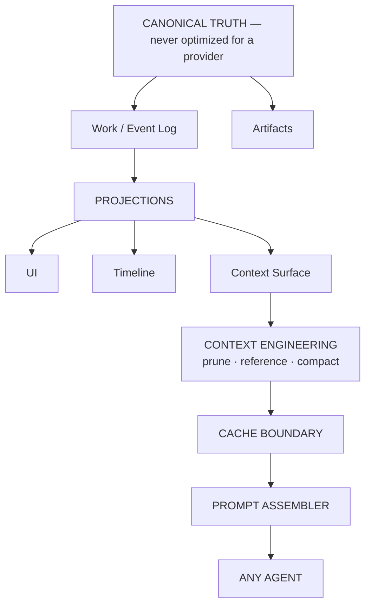
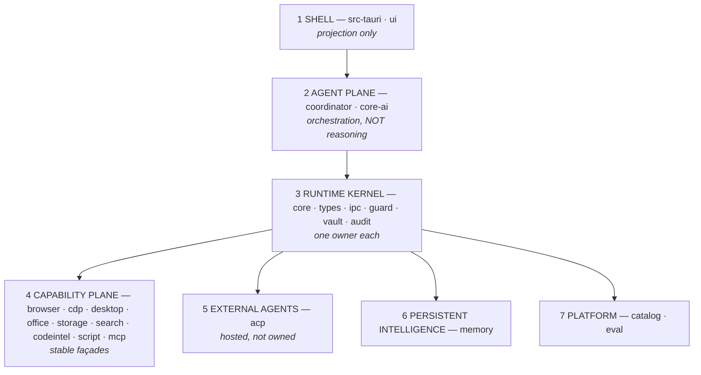
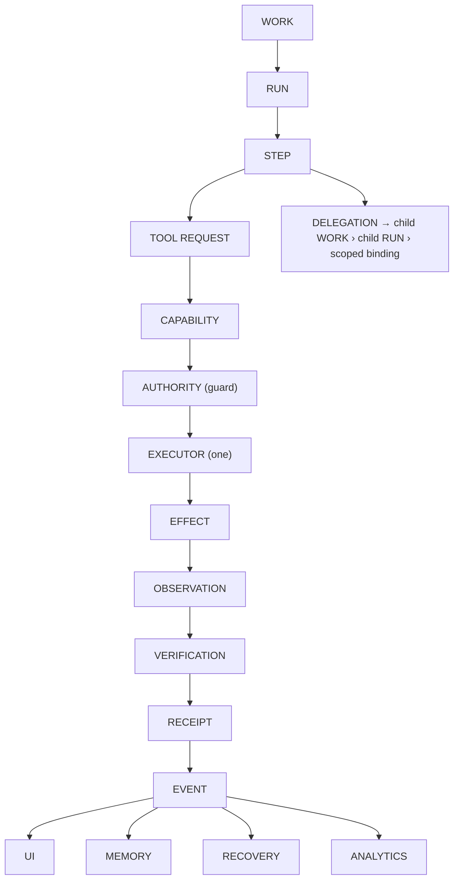

# ARCH/CORE — The EveryAIOS Core Architecture (single architectural authority)

> **Status:** Architecture authority. This file is the **root** of the `ARCH/` set: every other
> architecture document derives from it and none may weaken it. Product behavior is still owned by
> `../DESKTOP-APP-SPEC.md`; delivery status and open work are still owned by `../TODO.md`; capability
> *identity* is still owned by `../capabilities.yaml` + `09-FEATURE-MATRIX.md` + spec §0. This file owns
> **architecture**: the primitives, their owners, and the invariants that bind them.
> **Predecessor contract:** the 4 non-negotiables this file inherits and expands — one effect-authorization
> model · one append-only event log · one Progress timeline · Work is the durable unit (`00-INDEX.md`).
> **Evidence tiers:** **[S]** read from source · **[G]** graph fact from the codegraph index · **[D]**
> doc-derived · **[NOT BUILT]** not yet implemented. Claims without a tier are normative contract.

---

## 0. How to read this document

The architecture has exactly one job: **maintain a rich, durable, multi-agent environment while showing
each model only the minimum context it needs, in a representation that stays cheap, stable, recoverable,
and fast.**

Everything below is what it costs to be able to say that sentence.



The last node is deliberately **any agent**. EveryAIOS is not an agent; it is the environment agents run
inside. See [AGENT.md](AGENT.md).

---

## 1. The one-sentence architecture

> EveryAIOS is a **durable agent operating plane** underneath, with a **cache-aware provider projection**
> above it, hosting **replaceable external agents** that it does not out-try to out-think.

Two consequences everything else follows from:

1. **Canonical state is never optimized for a provider.** Optimization happens in a *derived* projection.
2. **The agent is replaceable; the Work is not.**

---

## 2. The seven planes



The plane split is a **dependency rule**, not a folder preference: plane *n* may depend on plane *n+1*,
never the reverse, and **no plane may skip the kernel to reach an effect**.

---

## 3. The canonical primitives

These are the objects the architecture is *made of*. Introducing a new canonical primitive requires an ADR.

> **The execution spine.** Six of the list below — **Work · Run · Step · Effect · Receipt · Event** — are the
> spine that everything else reduces to. They are the minimum a feature must be expressible in; the
> remaining primitives are *context* for the spine (where it runs, who it belongs to, what authorized it),
> not alternative execution paths. If a feature cannot be expressed in the spine, that is a design signal,
> not a reason to add a runtime (§3.2).

| Primitive | Owner | Meaning | Persist? |
|---|---|---|---|
| **Space** | kernel | The user's AI environment: shared memory, preferences, projects, connectors, permissions | yes |
| **Project** | kernel | A logical domain inside a Space. **Optional** — never a prerequisite for conversation | yes |
| **Workspace** | kernel | The physical resource environment (paths, worktrees) a Work may touch | yes |
| **Chat** | kernel | The **user-facing** object = one Session. Created by the user | yes |
| **Session** | kernel | The technical unit behind a Chat: canonical context, events, artifacts, bindings | yes |
| **Work** | kernel | The **durable objective**. Survives crashes, pauses, agent switches, UI disconnects | yes |
| **Run** | kernel | One execution attempt inside a Work | yes |
| **Step** | kernel | One logical unit of work — **not necessarily one tool call** | yes |
| **Capability** | kernel | What the system *can* do (`filesystem.write`) | registry |
| **Tool** | kernel | How a model *requests* it (`file_ops.write`) — an invocation surface | derived |
| **AuthorizationTicket** | guard | Single-use, argument-bound authorization for exactly one effect | transient |
| **Effect** | kernel | A request to change the world. **The model never executes; it requests** | yes |
| **Observation** | kernel | What actually happened | yes |
| **Verification** | kernel | Whether it achieved the goal | yes |
| **Receipt** | audit | Evidence, tamper-evident | yes |
| **Event** | kernel | Append-only historical truth | yes |

Supporting contracts — defined in their own documents, deliberately **not** new primitives:
`AgentBinding`, `AgentAdapter`, `AgentBridge`, `ContextSurface`, `ContextPassport`, `CapabilityPack`,
`ResourceRef`, `ViewerProvider`, `ModelRoute`.

### 3.1 The three-way distinction that must never collapse

| | Question it answers | Wrong to merge because |
|---|---|---|
| **Capability** | What can the system do? | An ability exists even with no model and no tool mounted |
| **Tool** | How does the model ask for it? | Several tools may façade one capability; mounting is a context decision |
| **Executor** | Who actually performs it? | The model requests; the executor performs — collapsing these is what makes a system unauditable |

> **Tool** is to **Capability** what a façade is to an implementation: one capability may have several
> tool façades; one tool façade may never bypass the capability's executor. [D]

### 3.2 The reduction rule

> **If a new feature can be expressed as `Work + Step + Capability + Effect`, it does not get a new
> runtime.**

This is the single rule that prevents architecture rot, and it is machine-checkable (§12, I26).

---

## 4. The ownership matrix

Every "where does this go?" question is one of these. Each has exactly **one** owner; a second owner is a
defect, not a preference.

| Question | Sole owner | Anyone else |
|---|---|---|
| Who owns **state**? | `everyaios-core` (Work/Run/Step) + `everyaios-types` (schemas) | may hold projections and caches only |
| Who owns **effects**? | `everyaios-core` executor, gated by `everyaios-guard` | capability crates *request* |
| Who owns **schemas**? | `everyaios-types` | TS types are derived, never hand-duplicated |
| Who owns **events**? | `everyaios-core` writer → `everyaios-audit` | UI/memory/analytics are projections |
| Who owns **permissions**? | `everyaios-guard` | nothing else decides allow / deny / ask |
| Who owns **credentials**? | `everyaios-vault` | nothing else holds key material |
| Who owns **tools**? | `everyaios-core` `ToolRegistry` | TS / MCP / UI schemas derive from it |
| Who owns **agents**? | `everyaios-agents` `AgentRegistry` | TS is a read-only façade |
| Who owns **memory**? | `everyaios-memory` (storage) + `core-memory` (reasoning only) | algorithms are strategies |

The same matrix, as a dependency rule for CI (§12):

```
ONE STATE OWNER · ONE EFFECT OWNER · ONE TOOL REGISTRY · ONE EVENT LOG · ONE WORK MODEL ·
ONE AUTHORIZATION MODEL · ONE VAULT · ONE AGENT REGISTRY · ONE CONTEXT MANAGER
```

---

## 5. The canonical flow

Everything in the product is this flow. There is no second path.



Read from the right-hand side: **memory, UI, recovery and analytics are all projections of the Event
log.** None of them is an independent truth. [D]

### 5.1 The two execution paths — and why "everything is ticketed" was always wrong

The stale one-liner "every mutation is ticketed" is **false** and must not be written back into docs. What
the code actually enforces is **authorization provenance**:

| Path | Provenance | Who stamps it |
|---|---|---|
| Agent / automation mutation | `AuthorizationTicket` — single-use, args-bound | `everyaios-guard` (mint), executor (consume) |
| Human UI mutation | trusted user-gesture provenance (`AuthKind::human_gesture`) | Rust call sites only, from a native UI-event origin |

Every mutation audit row records `authorization: agent_ticket | automation_ticket | human_gesture`, set by
Rust call sites from a typed argument — **never read from a serde value built from UI/agent input**, so a
machine cannot manufacture human authorization. That is the real security principle; "ticket" is the
implementation detail. [S: spec §4.3 / P48.2 anti-impersonation]

### 5.2 Durable ordering

**DURABLE INTENT → DURABLE ATTEMPT → EFFECT → OBSERVE → VERIFY → RECEIPT.**

The authoritative intent/attempt is written **before** an irreversible external effect. A crash after
ticket approval but before attempt resolves to **`uncertain`** — never `failed`, never `succeeded`. [S]

---

## 6. The invariants

Twenty-seven rules (I1–I27). These are the contract; a change that violates one is an architecture change and needs
an ADR. I1–I9 are inherited (the repo's four non-negotiables, expanded, plus the honesty rules already
enforced by tests). I10–I27 are established by this document (I27 added via ADR-0004).

### Ownership and truth

| # | Invariant | Tier |
|---|---|---|
| **I1** | **Work proposes, the kernel disposes.** The sidecar has no effect-execution surface. | structural + doc |
| **I2** | **Canonical state is never optimized for a provider.** Provider optimization happens in a derived projection. | doc (new) |
| **I3** | **One append-only Event Log is the historical truth.** UI, memory, analytics and recovery are projections of it, never parallel truths. | tested + doc |
| **I4** | **No subsystem may create a second source of truth for state another subsystem owns.** | doc (CI-enforced) |
| **I5** | **Audit is append-only** — append and sequence-resume are the only operations. | tested |
| **I6** | **Work is the durable unit.** It outlives sessions, runs, agents, nodes and clients. | tested + doc |
| **I7** | **Every side effect becomes an Effect**, with authorization provenance (§5.1) and a Receipt. | structural |
| **I8** | **Subagents are child Work/Runs**, not a separate runtime; they inherit references and scope, never a copied prompt. | doc (new) |
| **I9** | **MultiRun is a strategy over Runs**, not an execution kernel. | doc (new) |

### Security

| # | Invariant | Tier |
|---|---|---|
| **I10** | **Provider API keys live only in `everyaios-vault`.** No TS package, agent, or projection holds or seals credential material. | doc — **violated today, see §11 V4** |
| **I11** | **All outbound network crosses `netfloor`; all writes cross `pathfloor`.** Policy is central, never per-caller. | doc + structural |
| **I12** | **There is one authorization model and one security gate.** No module — connector, MCP, ACP, UI, or agent adapter — may bypass Guard. | doc (CI-enforced) |
| **I13** | **Sandbox is an execution mechanism, not the security architecture.** Guard decides policy; sandbox enforces isolation; the executor performs. | doc (new) |
| **I14** | **Authority does not leak across the seam.** An external agent's native tools are governed by *its* permissions plus the outer OS/workspace sandbox — never claimed as Guard-mediated. | doc |
| **I15** | **Never claim observability over an effect you do not control.** Governance badges state the real boundary. | doc |

### Context and providers

| # | Invariant | Tier |
|---|---|---|
| **I16** | **Provider-visible prefixes are append-stable.** Any prefix-changing operation (tool/schema change, system reorder, history rewrite) is intentional, observable, and treated as a cache-boundary event. | doc (new) |
| **I17** | **Raw tool/resource output is not automatically model context.** The provider receives a bounded representation. | doc (new) |
| **I18** | **Full content stays retrievable** through Resource/Artifact references. | doc (new) |
| **I19** | **Cheap deterministic reduction precedes model-backed summarization** (prune → re-measure → compact). | doc (new) |
| **I20** | **Compaction must never depend on an over-limit summary request.** Every reduction is bounded and verifies its own input fits. | doc (new) |
| **I21** | **Context capacity comes from the resolved route**, not from a global registry. | doc (new) |
| **I22** | **Prompt assembly serializes Context; it does not own Context policy.** Context Manager, Prompt Assembler and model client are three objects. | doc (new) |

### Agents

| # | Invariant | Tier |
|---|---|---|
| **I23** | **An agent is a replaceable execution engine attached to a Session — not the owner of it.** | doc (new) |
| **I24** | **Agent switching changes the AgentBinding only.** Space, Session, Work, Memory, Context, Workspace and Event history do not change. | doc (new) |
| **I25** | **Provider-specific session state is private and resumable; EveryAIOS session state is canonical and shared.** | doc (new) |
| **I26** | **Adding a capability must never require modifying an agent integration**, and a new feature expressible as Work+Step+Capability+Effect must not introduce a runtime. | doc (CI-enforced) |
| **I27** | **Behavioural policy is declared once, agent-agnostically, and compiled into each adapter's native mechanism.** A clause an agent cannot enforce is reported `unenforceable` for that binding — never silently dropped and never shown as applied. | doc (new) |

---

## 7. The agent model

### 7.1 The word "Chief" is retired

"Chief" conflated two roles, which is why the docs kept contradicting themselves:

| Role | What it does | Who owns it |
|---|---|---|
| **Loop owner** — reasons, plans, selects tools | *The selected agent*, whatever it is | the agent (external or the optional built-in engine) |
| **Turn coordination** — load state, build context, project tools, emit events, drive recovery | EveryAIOS, and it is **not reasoning** | `coordinator` |

> **Retirement rule:** `Chief` and `ChiefAdapter` are retired as architecture terms. The loop-owner role is
> `AgentBinding`; the coordination role is the **Turn Coordinator**. `primary_chief` survives only as a
> legacy identifier until it is migrated (see `../TODO.md`), never as a concept in new text.

EveryAIOS may still ship a **built-in** binding for zero-install first run, but it is **one option among
equals**: it is not privileged, nothing in the architecture may depend on it, and every feature must work
with it absent.

### 7.2 AgentBinding

The missing abstraction. A Session owns bindings; exactly one is active.

```
AgentBinding
├── id
├── session_id · work_id
├── agent_id · adapter_id
├── protocol                  (acp | stdio | in-process)
├── provider_session_id       ← NOT the EveryAIOS Session id
├── model · mode
├── capability_manifest
├── governance_mode           (governed-mediated | self-contained | not-governed)
├── bridge_id
├── state                     (active | parked | resuming | dead | unavailable)
├── usage · last_event_seq
└── private_state_ref
```

`provider_session_id` being a *different* value from the EveryAIOS Session id is what prevents an entire
class of bugs — the Session must never be identified by "whichever provider transcript was touched last".

### 7.3 AgentAdapter — capability-driven, not per-agent branches

One canonical contract, and each adapter **declares honestly what it can actually control**:

```
AgentAdapter
├── discover() · capabilities() · authenticate()
├── start() · configure()
├── create_session() · resume_session() · close_session()
├── prompt() · cancel()
├── inject_context() · attach_shared_plane() · attach_capabilities()
├── stream_events() · collect_usage()
```

The discovered/declared capability matrix (ACP version, session resume, MCP, fs mediation, terminal
mediation, permission callback, subagents, model switching, cancellation, streaming) is **runtime
negotiated and stored**, never a hardcoded per-agent branch.

### 7.4 AgentBridge — how an agent receives the shared plane

Two protocols with two distinct jobs:

| Protocol | Job |
|---|---|
| **ACP** | agent lifecycle: process, session, prompt, cancel, permission callback, fs/terminal mediation |
| **MCP** | the capability surface: tools, resources, prompts the agent may use |
| **Work Gateway** | execution and state: the only path to an effect |

```
AgentBinding
   ├── ACP channel          (lifecycle)
   ├── MCP bridge           (capabilities, Work+Binding scoped, short-lived credential)
   ├── Context projector    (ContextPassport)
   ├── Permission bridge    (→ Guard)
   ├── Event bridge         (agent events → canonical events)
   └── Work identity        (implicit in the connection, not an argument)
```

**The bridge is not a second kernel.** It forwards; it never performs effects. Tool calls carry their
`space_id`/`session_id`/`work_id`/`binding_id` **implicitly from the authenticated connection**, so an
agent cannot assert an identity it does not have. External agents see **task-shaped façades**
(`everyaios.work.status`, `everyaios.context.recall`, `everyaios.memory.recall`,
`everyaios.browser.research`, `everyaios.office.edit`, …), never the internal tool catalogue.

### 7.5 Governance modes, stated honestly

| Mode | Filesystem / terminal authority | Audit coverage |
|---|---|---|
| **Channel B** (MCP tool catalogue) | EveryAIOS, through its own capabilities | the **only** fully-ticketed external path |
| **Governed-mediated** (ACP `fs/*`, `terminal/*`) | EveryAIOS, servicing the agent's own file/shell calls | mediated effects are audited |
| **Self-contained** | the agent's own tools | EveryAIOS audits only what crosses the bridge |
| **Not-governed** | the agent's own, no bridge | no EveryAIOS claim at all |

The UI must show which mode is actually in force. Claiming identical observability across modes would
violate I15. **Status 2026-09-21: repaired in code, not yet verified.** Mediated is now the default when a
mediation seam is attached (`GovernancePreference::Mediated`, `P69.C3`) and the `fs/*` / `terminal/*`
handlers exist behind the `ClientMediation` seam with an explicit fail-closed refusal when no mediator is
attached (`P69.C2`) — see §11.1. The v1-only caveat below still bounds the claim.

**Version caveat that governs the ordering above.** The mediated mode is a **v1 surface being deleted**:
ACP v2 removes the client filesystem and terminal APIs and directs implementers to expose Client-side tools
through **MCP servers** instead (`agentclientprotocol.com/protocol/v2/migration`). So implementing `fs/*` /
`terminal/*` is a **v1 compatibility win**, not the durable governed path; **Channel B is the durable path**,
which is why it heads the table. [D] — see [EXTERNAL-AGENTS.md](EXTERNAL-AGENTS.md) §5.1.

---

## 8. Context engineering

### 8.1 History is not Context

The core separation. Canonical history stays rich and complete; the model-facing surface is a *derived,
bounded projection* that can retain, inject, replace and reference.

> **The model can forget without EveryAIOS forgetting.**

```
CANONICAL (Work/Event log · resources · artifacts · memory)
        │
        ▼
CONTEXT SURFACE   ← source events · visible nodes · injected nodes · replacements · references ·
                    token estimates · cache boundary
        │
   ┌────┼────────────┐
 retain  inject   replace
   └────┼────────────┘
        ▼
CONTEXT MANAGER → PROMPT ASSEMBLER → MODEL
```

`ContextSurface` belongs *inside* context engineering, backed by projections. It is not a new subsystem,
database, or runtime.

### 8.2 The optimization order (normative)

1. reuse the cached stable prefix
2. do not inject unnecessary context
3. replace resources with references
4. prune oversized tool results
5. remove low-value historical surface
6. semantic compaction
7. retry against the exact route's capacity

Steps 1–5 are cheap and deterministic; only step 6 costs a model call. Doing them out of order is a
defect (I19).

### 8.3 Cache stability

```
STABLE PREFIX                     DYNAMIC TAIL
├── system identity               ├── relevant memory
├── project instructions          ├── work state
├── stable capability schemas     ├── retrieved resources
├── stable skill index            ├── tool results
└── stable tool definitions       └── current user message
```

Anything that mutates the stable prefix is a **cache-boundary event** (I16). This is why mounted tool
schemas must not churn per turn, and why a capability backend may start asynchronously **behind a stable
façade** without changing the provider-visible contract.

### 8.4 The exposed contracts

Only these are architecture; everything else is a replaceable strategy.

`ContextBudget` · `ContextSelector` · `Compactor` (select → build request → summarize → install →
verify) · `ReferenceStore` · `CacheBoundary` · `CostLedger`

Strategies (BM25, RRF, rerank, AST pruning, output shrinking, prefix cache, pass-by-reference, progressive
disclosure, FSRS, ACT-R, spreading activation) plug in behind them.

### 8.5 Handoff objects

| Object | Purpose |
|---|---|
| **ContextCapsule** | execution metadata/provenance for a child or resumed binding: workspace ref, capability scope, parent Work ref, source artifact refs, context snapshot hash, model, instructions |
| **ContextPassport** | semantic continuation state: objective, plan, completed steps, open questions, findings, verified facts, relevant files, artifacts, workspace, memory refs, known failures, constraints |

A passport is **not** a transcript. It is ~0.5–1.5k tokens of continuation state; the agent fetches depth
through EveryAIOS tools. A child agent inherits **references and scope, never a copied prompt**.

---

## 9. The capability platform

### 9.1 Packs

The shared plane is a **modular capability platform**, not a fixed set of tools:

```
capability-pack/
├── manifest.yaml      (id, version, provides, requires, optional, permissions, enabled_by_default)
├── capabilities/      (what the system can do)
├── skills/            (procedural knowledge)
├── resources/         (large data)
├── viewers/           (how humans inspect resources)
└── scripts/ · assets/
```

`effective = Core ∪ EnabledPacks ∩ AgentSupported ∩ SessionAllowed ∩ WorkScope ∩ GuardPolicy`

Because the model is intersection-based, an agent that supports less simply gets less — no adapter change.
Because packs declare `requires` / `optional`, a pack can **degrade gracefully** (a research skill with
browser disabled runs search-only) instead of breaking.

### 9.2 Four capability states, three scopes

State: `Unavailable` (dependency missing) · `Disabled` · `Enabled` (activatable) · `Active` (mounted).
Scope: **Global · Space · Session.** Disabled means *actually disabled*: no tools, no skills, no server,
no processes, no context, no tokens.

### 9.3 Skills are not tools

| Thing | Meaning | Loaded |
|---|---|---|
| **Capability** | what the system can do | pack activation |
| **Tool** | how the model invokes it | when relevant |
| **Action** | a deterministic higher-level operation (`browser.extract_table`) that collapses many round trips | when invoked |
| **Skill** | procedural knowledge: *how* to do a class of tasks | **progressively** |

Skills use the portable open **`SKILL.md` + `references/` + `scripts/` + `assets/`** format — no
EveryAIOS-proprietary skill concept. Skills declare required capabilities and outputs, so dependency
resolution happens before loading.

---

## 10. Memory

### 10.1 Four classes

| Class | Meaning |
|---|---|
| **Context** | this turn only. Not persistent memory |
| **Episodic** | what happened — **derived from Work/Run/Event history**, not a parallel timeline |
| **Knowledge** | durable facts, entities, relationships, preferences, project facts |
| **Procedural** | skills, workflows, learned procedures |

Scope is hierarchical: **User → Space → Project → Session → Work**, with agent-private state *beside* the
hierarchy, never promoted automatically.

### 10.2 Progressive disclosure

Memory is **durable data, not prompt stuffing**. A relevance decision routes each candidate to either a
tiny injection (targeted, bounded) or an on-demand tool (`memory.recall` / `remember` / `forget`, plus
`context.recall` for task continuity).

The budget is a **maximum, not a spend**: no relevant memory means zero injected tokens.

Writes happen **after** work from event-derived candidates, through dedupe/conflict/provenance — so the
memory system never becomes a second timeline. Full architecture: [MEMORY.md](MEMORY.md).

---

## 11. Current-state deltas (verified)

### 11.1 Defects confirmed in source (at the 2026-09-20 thaw)

> **All nine repaired in code 2026-09-20/21 — implemented, not verified.** `TODO.md` P69.C1–C4 and C7–C12
> carry `IMPLEMENTED — unverified`; C5/C6 are documentation sweeps and remain open. The evidence column is
> the dated thaw record — cited line numbers are as-of that date and are intentionally not rewritten. Each
> row now names its repair row.

| # | Defect | Evidence | Invariant broken | Repair (TODO) |
|---|---|---|---|---|
| **V1** | The ACP permission path grants approval without consulting Guard | `crates/everyaios-acp/src/chief.rs:417` — `let approval = Approval::allow(); // host decides; driver maps to the option` | I12 | **C1** — implemented (unverified) |
| **V2** | ACP `fs/*` and `terminal/*` are unhandled → mediated mode has no filesystem/terminal path | `crates/everyaios-acp/src/client.rs:521` handles only `session/request_permission`; everything else returns `-32601 method not found` (`client.rs:538`) | I14, §7.5 | **C2** — implemented (unverified) |
| **V3** | Mediated mode is not the default | `crates/everyaios-acp/src/chief.rs:373` — `advertise_fs_terminal: false, // default: withhold (self-contained path)` | §7.5 | **C3** — implemented (unverified) |
| **V4** | A TypeScript package stores provider credentials, against the vault rule | `packages/core-providers/src/vault.ts` — `ProviderVault` seals/unseals API keys via `@everyaios/core-security` (`:88`, `:147`) | **I10** (the most serious) | **C4** — implemented (unverified) |
| **V5** | **Auth mode is inferred from the software license** — a category error that also abuses the term `local`. `auth_from_license` maps open-license → `Local`, else → `Subscription`, and can **never** yield `ApiKey`. But `Local` means **local inference on this machine** (`03-BYOK-KEYRINGS.md` §3.0, with its own `local-models-panel` UI) — not "open source", which is a *license* property orthogonal to authentication. ~20 seed agents are mislabelled, incl. `amp` (commercial frontier), `glm-agent` (needs a Coding Plan), `qwen-code` / `kimi` / `goose` / `fast-agent` (need API keys) | `crates/everyaios-acp/src/registry_index.rs:403` (doc comment admits "license → auth-mode heuristic"); `registry.rs:206–234` (`AuthMode::Local` on 24 seed entries). The registry carries **no** auth field — it is a curated list of auth-supporting agents whose `authMethods` are CI-verified **in the ACP handshake** | I23, `EXTERNAL-AGENTS.md` §4(4), BYOK §3.0 | **C7** — implemented (unverified) |
| **V6** | **Registry `env` is discarded in the merge.** `env: vec![]` is hardcoded while `launch_plan` *does* merge `manifest.env` into the spawn environment, so the value is parsed, then stringified into a description note instead of wired | `registry_index.rs:363` (`env: vec![]`) vs `registry.rs:276` (`let mut env = m.env.clone();`); `with_env_note` puts env in prose | `EXTERNAL-AGENTS.md` §4(6) | **C8** — implemented (unverified) |
| **V7** | **A binary agent with a missing platform block launches bare.** Falls back to `args: vec![]` — but ACP binary args are load-bearing (`poolside` `["acp"]`, `antigravity-acp` `["--uid="]` on linux only). The agent then starts its normal CLI, not its ACP server, and looks broken with no useful error | `registry_index.rs:349` (`t.map(…).unwrap_or_default()`), `:348` (cmd fallback) | `EXTERNAL-AGENTS.md` §4(5) | **C9** — implemented (unverified) |
| **V8** | Minor schema-coverage gap: `license_url` is present in `registry.json` but **not parsed**; and `is_open_license` is substring matching, so a license string merely *containing* `mit`/`bsd` passes as open | `registry_index.rs` `struct RegistryAgent` (no `license_url` field); `is_open_license` at `:263` | `EXTERNAL-AGENTS.md` §4 | **C10** — implemented (unverified) |
| **V9** | **The auth-mode wire contract disagrees across layers.** Two Rust serializers emit different strings for the same variant, and the two TypeScript types do not match either — so an auth mode can be silently unrepresentable at a boundary | `registry.rs:44` → `"local"` vs `src-tauri/src/settings_cmds.rs:628` → `"local_cli"`; `ui/src/lib/acp.ts:11` → `"subscription" \| "api_key" \| "local"` vs `ui/src/lib/settings.ts:95` → `'subscription' \| 'api_key' \| 'local_cli' \| 'keyless' \| 'unknown'` | I4 (one schema owner), BYOK §3.0 | **C11** — implemented (unverified) |

### 11.2 Consolidation targets

Duplicate authorities to collapse into the matrix in §4: multiple agent registries and
`AgentDefinition`s · a second TypeScript permission/trust-ladder engine · duplicate provider vault ·
duplicate Work/session state in the UI store · duplicate tool schema universes · duplicate prompt/context
managers · duplicate search/RAG implementations · duplicate event stores. Each is enumerated with an
owner and an action in `../TODO.md`.

**Status 2026-09-21 (implemented, not verified).** The P69.D wave collapsed the ones with a landed row:
agent registries and `AgentDefinition`s (**D1/D15/D23**) · the TS permission/trust-ladder engine
(**D3/D5/D6** — policy is advisory in `core-engine`; Guard is the only decider) · the duplicate provider
vault (**C4**) · tool schema universes (**D2/D17/D18**) · prompt/context managers (**D7**) · search/RAG
(**D9/D10**) · event stores and the Work model (**D11**). UI Work/session state is **classified, not
deleted** (**D24** — verified classification). Still partial per their rows: D1/D2/D9/D24/D25 (named
remainders), D15 (naming half), D19/D20 (`SCOPED` shrink plans).

### 11.3 Honest gaps

Windows ConPTY (P68.7) and WGC/WinUia (P57.6/P66.7) are unimplemented and untested — no Windows host has
run them. Non-Linux MCP confinement reports `Ambient`. Per-edge confidence is **not** persisted in the
codegraph index (`edges.confidence` is NULL for all 2,203 edges), so graph confidence is whole-index, never
per-edge.

---

### 11.4 What the spec already carries — the delta is smaller than it looks

**Do not treat this thaw as a rewrite of the product contract.** `DESKTOP-APP-SPEC.md` §4.3 is already
titled *"Final architecture — the agent control plane"* and already states, in verified form:

| Already in spec §4.3 / §4.4 / §9 | Consequence for this thaw |
|---|---|
| The three-protocol stance — ACP = local harness-drive, MCP = tool surface (Channel B is the only fully ticketed external path), A2A = remote discovery, post-v1 | **No change.** Keep as written |
| Model ownership: only the built-in runtime owns the EveryAIOS model surface; every external agent owns its own auth/model/routing, and Native credentials are never passed to it | **No change.** Already matches I10's intent |
| `primary_chief` = inbuilt **|** any installed ACP agent, "Chief is the executive, not the workhorse", "Orchestrator is code" | **Already the interchangeable-agent model.** The *concept* is correct; only the **word** retires (§7.1) |
| The 8-plane map (Frontend · Work Gateway/Session Runtime · Control Plane · AI Plane · Data Plane · Extension · Trust Plane · Deployment) | **Richer than CORE §2's 7 planes.** CORE §2 is the dependency rule; the spec's map is the deployment/ownership view. Reconcile by reference, not by replacement |
| The capability contract — `identity/describe/risk/prepare/validate/execute/observe/verify/rollback/explain` + `IdempotencyClass` (incl. `UncertainRequiresReconciliation`) | **Already exists.** It is the concrete form of the Capability/Executor distinction and of §5.2 |
| The two mutation paths + "authorization provenance on the audit" (`agent_ticket` / `automation_ticket` / `human_gesture`, stamped by Rust call sites only) | **Already correct** and already defeats impersonation. CORE §5.1 restates it as the canonical rule |
| The per-surface effect-authorization matrix (11 surfaces × agent/human/ticket/audit/verify/receipt/recovery) | **Keep as the auditability evidence surface.** Do not duplicate it into ARCH |
| Work terminology + the 14-phase state machine; `Execution` retained only as a back-compat alias | **Already aligns** with the primitive set. P69.D21 removes the alias when safe |
| §9's ten product principles, incl. *"Cache-first money discipline"* and *"Expandable by design (not by rebuild) — a versioned extension bundle or an ACP-wired harness, never a rebuild"* | **§9 principle 5 already anticipates I16 and §9 principle 10 already anticipates I26** |
| §9.2's edge cases: exactly-once is not guaranteed, TOCTOU binding, lease fencing, `uncertain` reconciliation | **Already the source for RECOVERY.md.** CORE adds no new rule here |

**Therefore the honest delta is narrow and specific.** What the spec genuinely lacks is: the **Chat vs
Session** user-facing split; `AgentBinding` as a named primitive with a private `provider_session_id` and a
park/resume lifecycle; the **AgentBridge** (work-scoped credential); **ContextSurface / projection** as a
named layer with retain/inject/replace; formal **ContextPassport / ContextCapsule**; **Capability Packs**
with `provides`/`requires`/optional + viewers; the **4 memory classes** replacing 5-tier; the **File
Workbench / viewer registry**; and the **model-free reduction before compaction** ordering with
route-derived capacity.

Everything else in P69 is **ARCH-side elaboration and code-side consolidation** — not a product-contract
rewrite. Any edit that claims the spec must be rebuilt from scratch is wrong.

---

## 12. The do-not-build list

Explicitly **not** kernel architecture. Each may become a strategy, plugin or experiment later, but
none may define the kernel. A proposal requiring one of these as a core dependency is an architecture
change and needs an ADR.

mandatory ACT-R memory · mandatory FSRS memory · a mandatory temporal knowledge graph · a mandatory
ontology engine · multiple graph databases · multiple vector databases · a giant multi-dimensional
router · multiple workflow runtimes · multiple event logs · multiple tool registries · multiple
permission systems · multiple prompt builders · multiple context managers · multiple execution
kernels · multiple browser runtimes exposed to agents · microVM isolation everywhere · a distributed
cluster runtime · remote-node orchestration · the full remote-agent protocol stack as a kernel
dependency · a plugin marketplace · a giant autonomous swarm framework

> **Why this list exists:** every item is defensible alone and fatal in aggregate. Each is a *second*
> way to do something the architecture already does once — exactly what I4 forbids. This is the
> pre-written answer to "can we also add …?".

---

## 13. The target module map

Plane → module. This is the **target**; the disposition of what exists today belongs to the rewrite of
`02-MODULE-LAYOUT.md` (`P69.A15`).

| Plane | Modules |
|---|---|
| **1 Shell** | `src-tauri` · `ui` |
| **2 Agent plane** | `coordinator` (turn coordination) · `core-ai` (context · prompt · generation) · `core-agents` · `core-memory` (reasoning only) · `core-providers` · `core-search` · `core-tools` · `everyaios-engine` (pure policy) · `everyaios-blueprint` (declarative plans) |
| **3 Runtime kernel** | `everyaios-core` (Work · Run · Step · Effect · Event · Receipt · ToolRegistry · Workspace · Work Gateway) · `everyaios-types` · `everyaios-ipc` · `everyaios-guard` · `everyaios-vault` · `everyaios-audit` |
| **4 Capability plane** | `everyaios-browser` · `everyaios-cdp` · `everyaios-desktop` · `everyaios-office` · `everyaios-storage` · `everyaios-search` · `everyaios-codeintel` · `everyaios-script` · connectors · `everyaios-mcp` |
| **5 External agents** | `everyaios-acp` (adapter + bridge) |
| **6 Persistent intelligence** | `everyaios-memory` |
| **7 Platform** | `everyaios-catalog` · `everyaios-eval` |

Dependency direction follows the plane numbers: lower may not import higher, and **nothing reaches an
effect except through the kernel**.

---

## 14. Service-layer rules

One rule per service — each of these was a real ambiguity.

| Service | Rule |
|---|---|
| `everyaios-types` | **The canonical schema layer.** Shared wire/domain schemas, canonical ids (`SpaceId` … `ReceiptId`), `EffectRequest`, `CapabilityRequest`, `AuthorizationTicket`, `AgentDefinition`, `AgentBinding`, `ContextSnapshot`, `ContextPassport`, event envelopes + versioning, receipt schemas. TS types are **derived**, never hand-maintained duplicates |
| `everyaios-ipc` | **Transport only.** Serialization, framing, streaming event transport, sidecar lifecycle transport. No business logic, no authorization decisions, no model routing, no Work mutation outside the Work Gateway |
| `everyaios-guard` | **The only authorization authority** — [SECURITY.md](SECURITY.md) |
| `everyaios-vault` | **The only credential authority**. No TS package seals or holds key material (I10) |
| `everyaios-audit` | **The only evidence authority.** Append and sequence-resume are the only operations |
| `everyaios-codeintel` | Produces **evidence and context**. Never writes files, never executes commands, never becomes an executor; the coordinator and verification *consume* its evidence |
| `everyaios-storage` | Owns file discovery, disk analysis, dedup, treemap, large-file detection, the storage index and cleanup proposals. It **must not own Workspace** |
| the terminal plane | **One terminal plane.** Status and history are observation; a command request is a capability request; shell execution is the canonical executor and owns the PTY. No hidden shell runner, no coordinator shell executor, and no agent-private shell while operating in mediated mode |
| `everyaios-script` | **A deterministic embedded scripting/automation runtime — not a shell.** `script.run` is the shell/terminal capability; embedded JS is the script capability. Separate execution classes |
| `everyaios-catalog` | Provider and model metadata — capabilities, context limits, pricing, modality, static/live refresh. Not credentials, not transport, not an autonomous route brain |
| `everyaios-eval` | **Outside the runtime.** Evaluation harness, golden sets, regression cases, benchmarks, quality metrics, security tests. No production runtime dependency on evaluation abstractions |

---

## 15. CI architecture checks

The invariants that are machine-checkable should be machines' work, not reviewers':

- exactly one AgentRegistry · one ToolRegistry · one authorization engine · one Work model · one event
  writer · one vault
- no TS module executes a privileged effect directly
- every effect passes Guard (including connector, MCP, ACP and UI paths)
- no subsystem creates a second event log
- no scheduler-, workflow- or subagent-owned execution loop
- no UI write to kernel state except through the Work Gateway
- newly added capability rows keep `capabilities.yaml` == `09-FEATURE-MATRIX.md` == spec §0

---

## 16. Document map

| Document | Owns |
|---|---|
| **CORE.md** (this file) | primitives · ownership matrix · invariants · plane rules |
| [SESSION.md](SESSION.md) | Space / Project / Workspace / Chat→Session / Work hierarchy |
| [WORK.md](WORK.md) | Work · Run · Step · Effect · Observation · Verification · Receipt · Event — the canonical event vocabulary and the projection rule |
| [AGENT.md](AGENT.md) | AgentBinding · AgentAdapter · AgentBehaviorProfile · per-agent extension mechanisms · switching, park, resume |
| [EXTERNAL-AGENTS.md](EXTERNAL-AGENTS.md) | ACP/MCP surfaces · capability matrix · governance modes |
| [CONTEXT.md](CONTEXT.md) | ContextSurface · projections · compaction · cache boundary · budget |
| [CAPABILITIES.md](CAPABILITIES.md) | packs · tools/actions/skills · viewers · settings states |
| [MEMORY.md](MEMORY.md) | four classes · scopes · progressive disclosure |
| [SECURITY.md](SECURITY.md) | sole Guard ownership · ticket lifecycle · sandbox |
| [RECOVERY.md](RECOVERY.md) | Work + checkpoint + idempotency + uncertain-effect classification |
| [UI.md](UI.md) | the cockpit as a **projection** · mutation only through the Work Gateway · the File Workbench and its viewer registry |
| [DESKTOP.md](DESKTOP.md) | **computer use** — windows · capture · accessibility tree · OCR/vision · verification. Deliberately separate from the browser |
| [ROUTING.md](ROUTING.md) | catalog → router → vault → transport → cost ledger |
| `../DESKTOP-APP-SPEC.md` | product behavior. **Not** architecture |
| `../TODO.md` | delivery status, sequencing, and every unit of work |
| `../RESEARCH/` | explicitly non-normative research |
| `ADR/` | why a specific implementation was chosen |
