# EveryAIOS — Architecture & Flow Diagrams (Mermaid)

> **Generated:** 2026-08-09 · **Spec version:** v3.16 · **Diagrams:** 24
> **Purpose:** Every major system flow visualized. Render with any Mermaid-compatible viewer.
> **Surgical hierarchy (doc 52 §1):** the harness-driving diagrams compose external agent CLIs as **brain → core → surgeon** workers via ACP (J17/F12) — Aider-class precision editors included in the harness list. Storage-intelligence flows (D9–D12) and the tiered search cascade (G8) are described in docs 49/52.

---

## 1. System Architecture Overview

```mermaid
graph TB
    subgraph UI["UI LAYER — Tauri 2 Window (React SPA, ARCH/12)"]
        Sidebar[Sidebar<br/>Nav + Sessions + Status]
        Chat[Chat + Artifacts + Progress Steps]
        Cockpit[Cockpit / Flight Deck]
        Workspace[Workspace Panel<br/>Shell/Code/Browser/Excel/Word/PPT/PDF]
        Office[Office Editors<br/>docx/xlsx/pptx/pdf]
        Perms[Permission Cards + Guard UI]
        Analytics[Token/Cost Analytics]
        AutoBuilder[Automation Builder]
        KnowledgeUI[Knowledge Browser]
        Tray[Tray Daemon]
    end

    subgraph RustCore["RUST CORE — everyaios-core binary"]
        EosCDP[everyaios-cdp<br/>CDP Client]
        EosBrowser[everyaios-browser<br/>Snapshot/Diff/Refs]
        EosScript[everyaios-script<br/>rquickjs Sandbox]
        EosGuard[everyaios-guard<br/>Guard-1 + Guard-2]
        EosAudit[everyaios-audit<br/>NDJSON + Replay]
        EosMCP[everyaios-mcp<br/>MCP Server]
        EosVault[everyaios-vault<br/>SQLCipher Keys]
        EosIPC[everyaios-ipc<br/>JSON-RPC Framing]
        Supervisor[ProcessSupervisor]
    end

    subgraph Sidecar["TS SIDECAR — coordinator (Bun compiled)"]
        Engine[core-engine<br/>3-stage loop]
        Memory[core-memory<br/>7 algorithms]
        Files[core-files<br/>RAG + embeddings]
        Connectors[core-connectors<br/>Hub routing]
        Search[core-search<br/>Cascade + research]
        Auto[core-automations<br/>Crystallization]
        Providers[core-providers<br/>BYOK clients]
        Tools[core-tools<br/>Trust Ladder]
    end

    subgraph Browser["BROWSER CHILDREN (tiered)"]
        Chrome[System Chrome/Edge]
        Lightpanda[Lightpanda ~16× less mem (vendor benchmark)]
        Obscura[Obscura ~30MB (opt-in)]
        Stealth[Fortress/Camoufox]
    end

    subgraph Storage["LOCAL STORAGE"]
        SQLite[(SQLite<br/>app.db + memory.db)]
        LadybugDB[(Rust-native graph store<br/>(LadybugDB optional))]
        SqliteVec[(sqlite-vec<br/>Vectors)]
        Vault[(SQLCipher<br/>vault.db)]
    end

    UI -->|Tauri Commands + Events| RustCore
    RustCore -->|stdio JSON-RPC<br/>length-prefixed| Sidecar
    RustCore -->|CDP WebSocket<br/>loopback| Browser
    Sidecar --> Storage
    RustCore --> Storage
    EosVault --> Vault
    Supervisor -->|spawn/kill/restart| Sidecar
    Supervisor -->|spawn/kill| Browser
```


---

## 2. Agent Turn Lifecycle

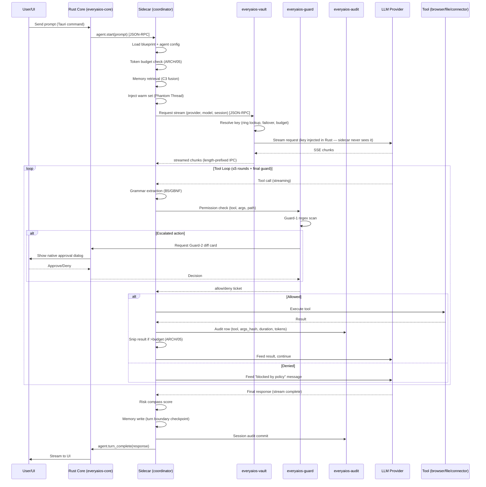


---

## 3. BYOK Key-Ring Resolution & Failover

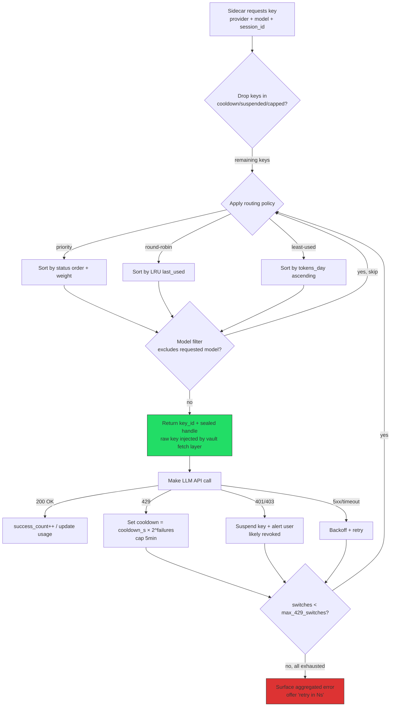


---

## 4. Memory Retrieval Pipeline (Multi-Signal Fusion C3)

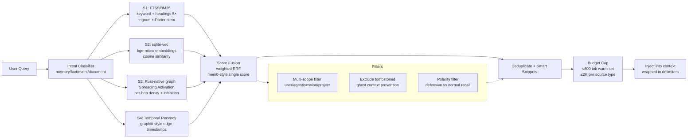


---

## 5. Browser Tier Escalation

```mermaid
flowchart TD
    Task[Browser Task Arrives] --> T0{Tier 0: Static OK?<br/>No JS needed?}
    T0 -->|yes| Static[reqwest + markitdown<br/>0 browser overhead]
    T0 -->|no, needs JS| T1{Tier 1: Lightweight?<br/>No login/WebGL needed?}
    T1 -->|yes (default)| LP[Lightpanda ~16× less mem (vendor benchmark)<br/>Zig, AGPL spawn-only]
    T1 -->|opt-in| Obscura[Obscura ~30MB RSS<br/>V8 + CDP + stealth-lite]
    T1 -->|no, needs auth/WebGL| T2[Tier 2: System Chrome/Edge<br/>full browser via CDP]
    T2 --> Check{Challenge/block<br/>detected?}
    Check -->|no| Done[Execute task]
    Check -->|yes| T3{Tier 3: Stealth needed?}
    T3 -->|Firefox stealth| Camoufox[Camoufox<br/>Playwright/Juggler]
    T3 -->|Chromium stealth, open| Fortress[Fortress<br/>CDP native, open-source]
    T3 -->|Chromium stealth, closed| Cloak[CloakBrowser<br/>⚠️ proprietary binary]
    
    Static --> Result[Return to sidecar]
    Obscura --> Result
    LP --> Result
    Done --> Result
    Camoufox --> Result
    Fortress --> Result
    Cloak --> Result

    style Cloak fill:#f99,stroke:#900
    style Fortress fill:#9f9,stroke:#090
```


---

## 6. Security Gate Pipeline

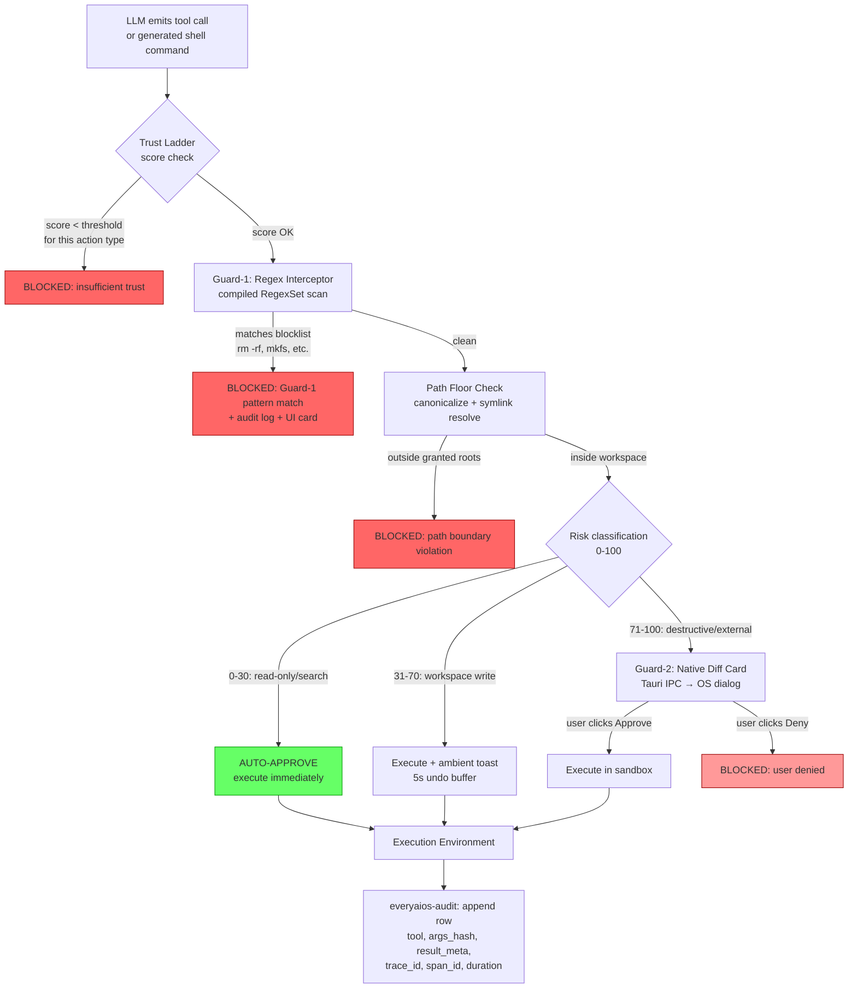


---

## 7. Circuit Breaker + MCQ Interrupt + DAG Resume

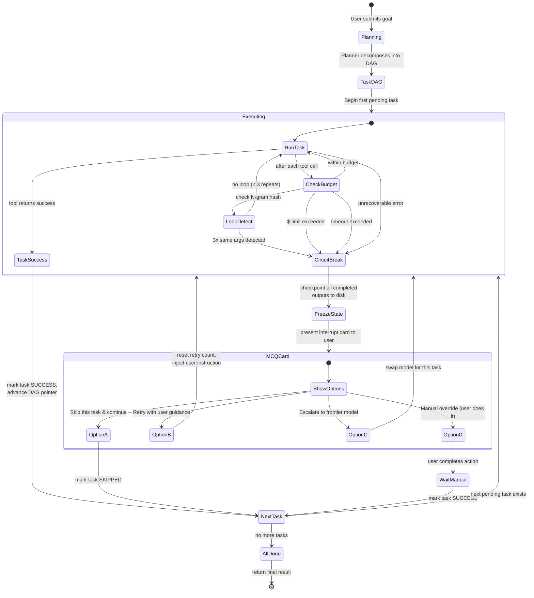


---

## 8. Office Edit Pipeline

```mermaid
flowchart TD
    Open[User opens .docx/.xlsx/.pptx/.pdf] --> Detect{Detect format}
    Detect -->|.docx| DocxPath
    Detect -->|.xlsx| XlsxPath
    Detect -->|.pptx| PptxPath
    Detect -->|.pdf| PdfPath
    Detect -->|.doc/.xls/.ppt| Legacy[Convert to modern format<br/>soffice --convert-to<br/>then open as read-only]

    subgraph DocxPath[Word Pipeline]
        D1[Open ZIP] --> D2[Parse structure<br/>parts index, content types, rels]
        D2 --> D3[Read target part → BLOCK TREE<br/>anchored with docxIndex]
        D3 --> D4[LLM edits PLAIN TEXT<br/>against block tree]
        D4 --> D5[Deterministic patch renderer<br/>minimal XML diff, w:t prefix/suffix]
        D5 --> D6[ZIP rewrite:<br/>modified parts only,<br/>everything else byte-copied]
    end

    subgraph XlsxPath[Excel Pipeline]
        X1[calamine: fast read] --> X2[Deterministic Planner<br/>regex NLP → workbook DSL]
        X2 -->|common ops| X3[Zero-LLM execution<br/>sort/fill/shift/sum/pivot]
        X2 -->|complex ops| X4[LLM generates formula/value]
        X3 --> X5[IronCalc recalc<br/>300+ functions, NEVER LLM-computed]
        X4 --> X5
        X5 --> X6[Surgical part-patch<br/>xl/worksheets/sheetN.xml]
    end

    subgraph PptxPath[PowerPoint Pipeline]
        P1[Parse slide parts] --> P2[Patch ppt/slides/slideN.xml<br/>text runs, bullets, shapes]
        P2 --> P3[Add/remove slides:<br/>clone part + rels + Content_Types]
    end

    subgraph PdfPath[PDF Pipeline]
        F1{Operation type?}
        F1 -->|form fill/annotate| F2[pdf-lib (AcroForms)]
        F1 -->|text replace| F3[lopdf replace_text<br/>exact-match only]
        F1 -->|structural edit| F4[Re-author from extracted content]
        F1 -->|redact| F5[Fill glyph boxes +<br/>remove text streams]
    end

    D6 --> Verify
    X6 --> Verify
    P3 --> Verify
    F2 --> Verify
    F3 --> Verify
    F4 --> Verify
    F5 --> Verify

    Verify[Verify: reopen + assertions] --> Snapshot[snapshotBefore kept<br/>for 1-click rollback]
    Snapshot --> Save[Atomic write:<br/>temp ZIP → fsync → rename]

    style Legacy fill:#ff9,stroke:#990
```


---

## 9. Token Economy / Compaction Pipeline

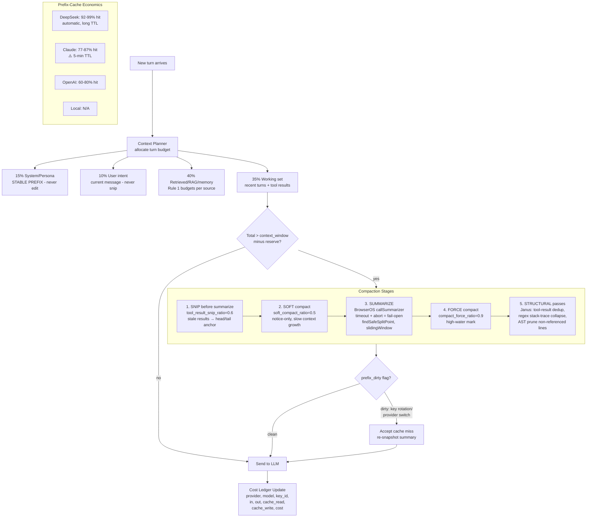


---

## 10. Extension ABI Lifecycle

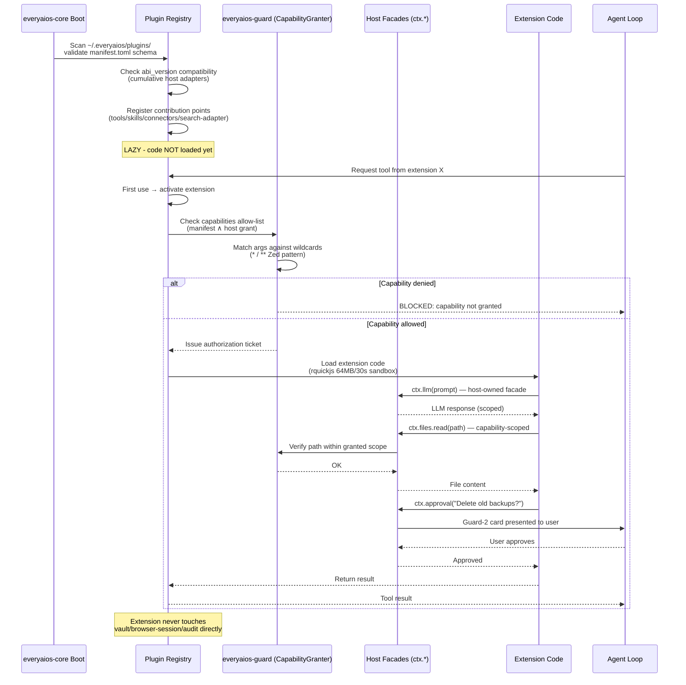


---

## 11. Connector Hub Routing

```mermaid
flowchart TD
    Request[Agent needs external action<br/>e.g. 'send Gmail', 'create Jira ticket'] --> Registry[Unified Tool Registry<br/>lookup ToolDefinition]
    Registry --> Route{Hub Router:<br/>which engine handles this?}

    Route -->|official MCP server exists| MCPServer[MCP Server<br/>user-supplied stdio/npx or HTTP<br/>Gmail/Slack/GitHub/Linear…]
    Route -->|direct API available| Native[Native Adapter<br/>BYO OAuth/API-key in vault<br/>direct HTTP/SDK call]
    Route -->|simple OAuth, no 3rd party| AuthBridge[Local Auth Bridge<br/>PKCE client, no secret<br/>local token manager]
    Route -->|logged-in web session exists| BrowserConn[Browser-Session Connector<br/>drive via CDP + Session Vault]

    MCPServer --> Exec[Execute + audit]
    Native --> Exec
    AuthBridge --> Exec
    BrowserConn --> Exec

    note right of Route: Connector-platform decision 2026-08-16 — MCP is the platform; Composio/Zapier/Nango aggregator tabs removed

    Exec --> Dedup{Already connected<br/>via another engine?}
    Dedup -->|yes| Skip[Skip: no double-connect]
    Dedup -->|no| Done[Return result to agent]

    style Skip fill:#ff9,stroke:#990
```


---

## 12. ACP Harness-Driving Flow

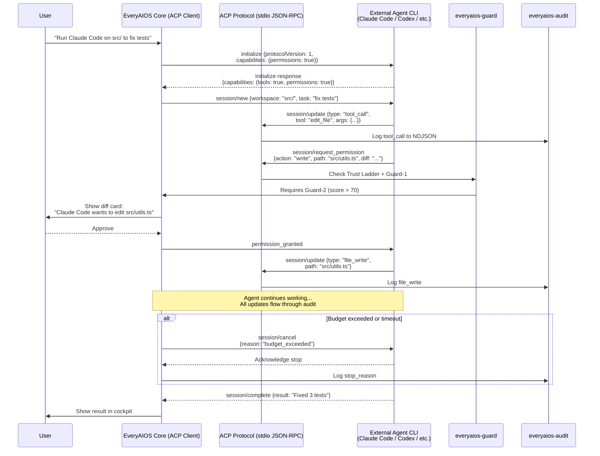


---

## 13. Process Lifecycle & Orphan Prevention

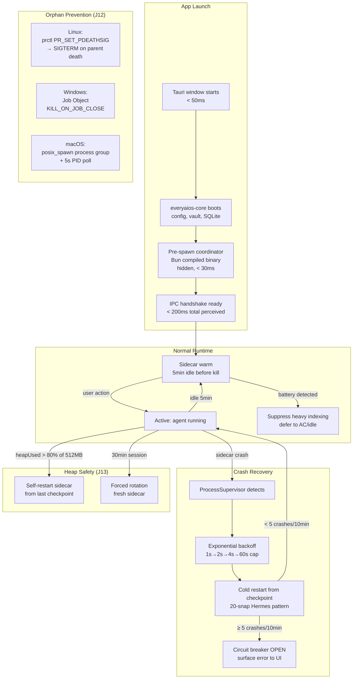


---

## 14. Crystallization Engine (B8 — Zero-Token Automation)

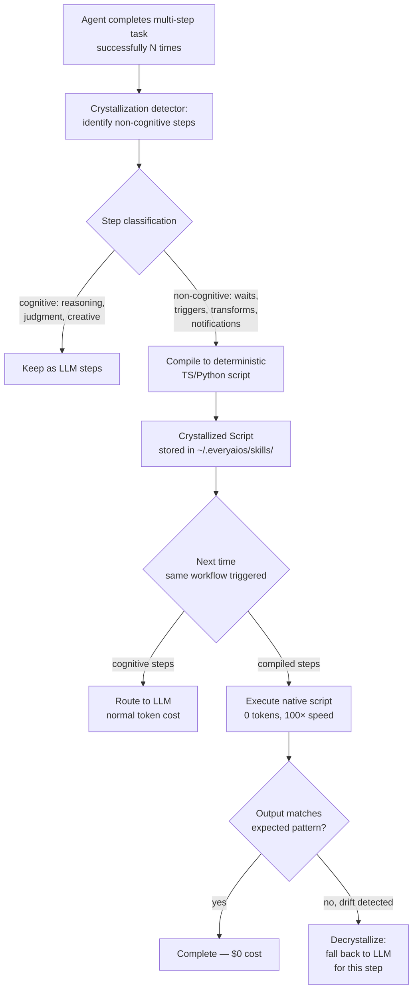

---

## 15. Session Vault & Login Flow

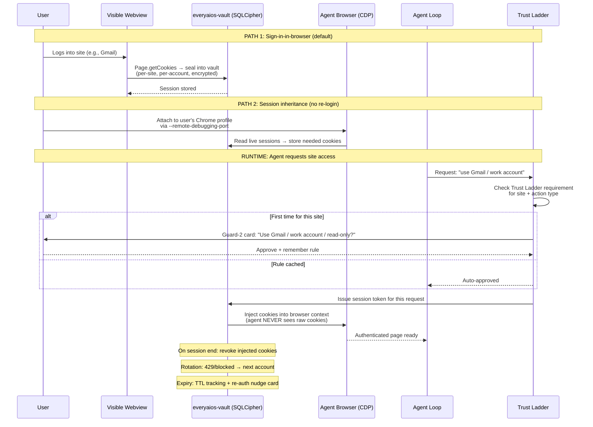


---

## 16. Ghost Context Prevention (Tombstone Eviction)

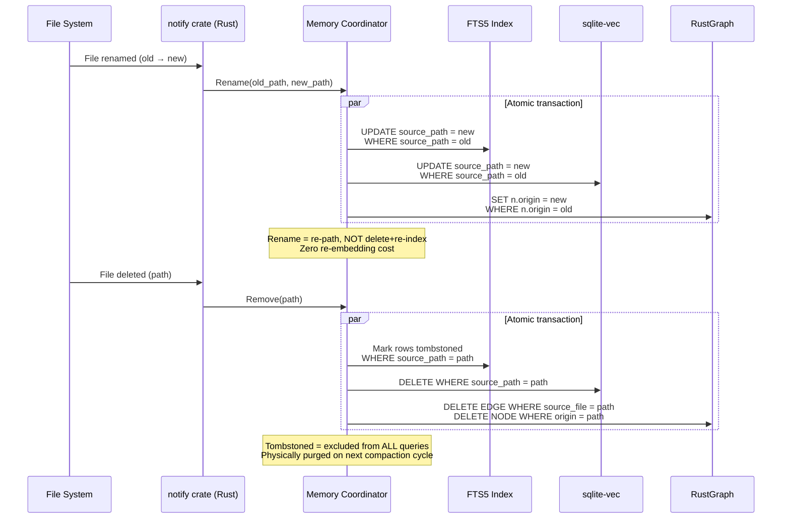

---

## 17. Scheduled Tasks & Nudge Sentinels

```mermaid
flowchart TD
    subgraph Triggers["Task Triggers (B7)"]
        Cron[Cron: "every Monday 9AM"]
        Interval[Interval: "every 4 hours"]
        Event[Event: "on git push to main"]
        Webhook[Webhook: "POST /hooks/deploy"]
        Nudge[Nudge Sentinel:<br/>agent detects repeating pattern<br/>→ suggests schedule]
    end

    Triggers --> Scheduler[everyaios-core Scheduler<br/>cron-next evaluation]
    Scheduler --> Check{Battery-aware?}
    Check -->|on battery + heavy task| Defer[Defer until AC/idle]
    Check -->|on AC or light task| Spawn[Spawn agent session]
    Spawn --> Crystallized{Task crystallized?}
    Crystallized -->|yes| Script[Run deterministic script<br/>0 tokens]
    Crystallized -->|no| Agent[Run agent loop<br/>normal token cost]
    Script --> Audit[Audit + notify user]
    Agent --> Audit
```


---

## 18. MCP Server (Stateless 2026-07-28) — Tool Serving

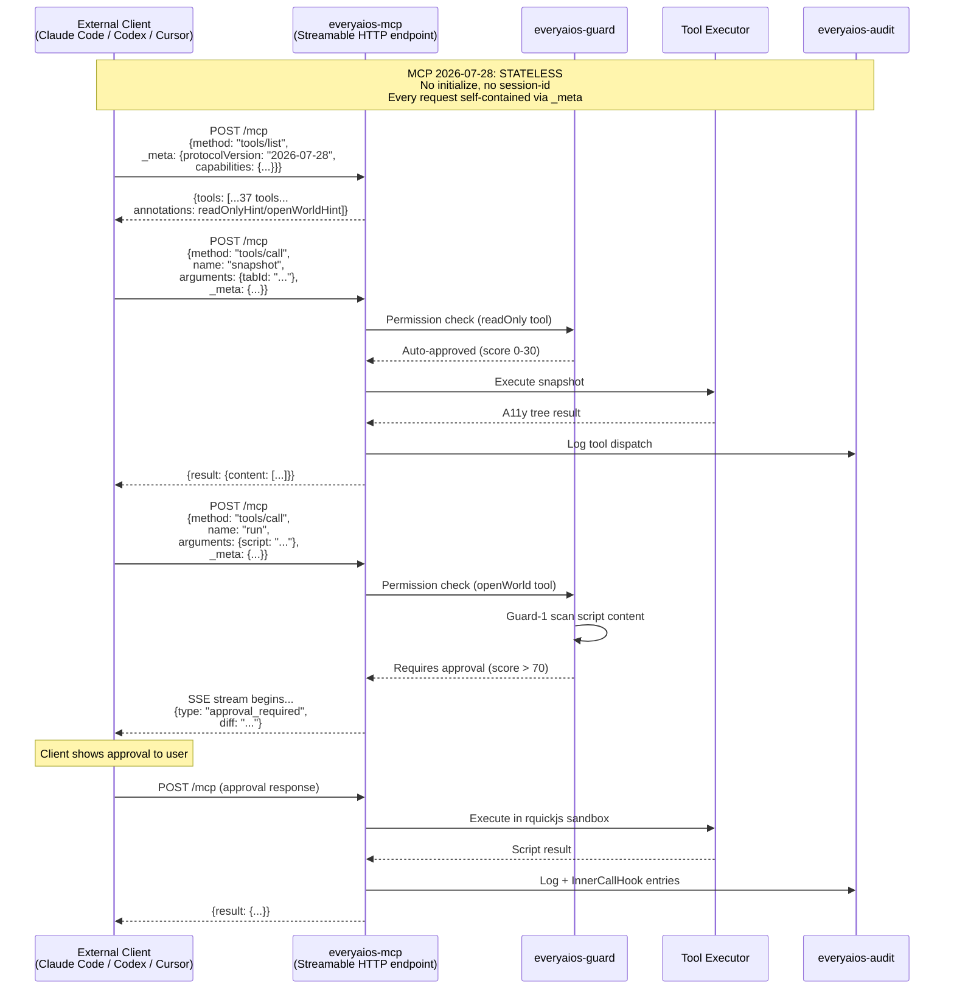

---

## 19. Sub-Agent Orchestration

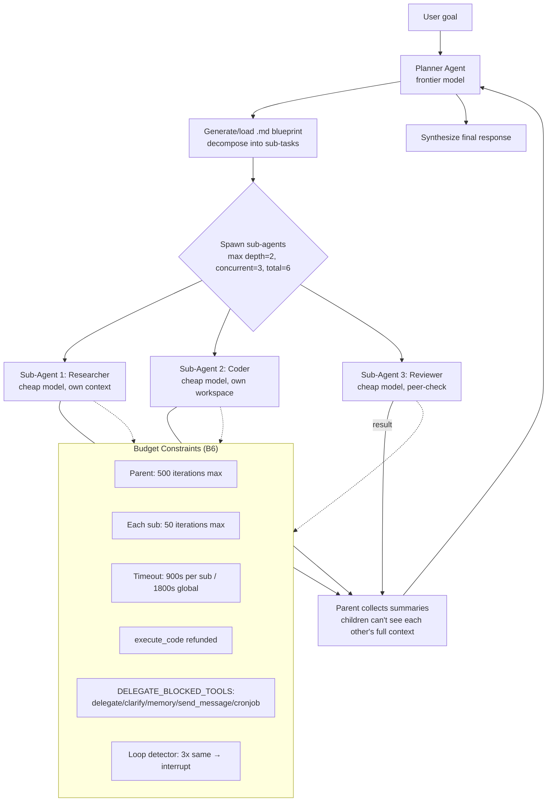


---

## 20. Full System Interaction (All Components Working Together)

```mermaid
flowchart TB
    subgraph UserLayer["USER"]
        Human((Human))
    end

    subgraph UILayer["UI (Tauri Webview)"]
        ChatUI[Chat]
        FlightDeck[Ambient Flight Deck]
        OfficeUI[Office Editors]
        ReplayUI[Audit/Replay]
    end

    subgraph RustLayer["RUST CORE (everyaios-core binary)"]
        direction TB
        IPC[everyaios-ipc<br/>JSON-RPC + length-prefix]
        Guard[everyaios-guard<br/>Guard-1 + Guard-2 + Trust Ladder]
        Vault[everyaios-vault<br/>SQLCipher keys + sessions]
        Audit[everyaios-audit<br/>NDJSON append-only]
        MCP[everyaios-mcp<br/>stateless HTTP server]
        CDP[everyaios-cdp<br/>browser driver]
        Script[everyaios-script<br/>rquickjs sandbox]
        Super[ProcessSupervisor<br/>spawn/kill/restart]
    end

    subgraph SidecarLayer["SIDECAR (Bun binary)"]
        direction TB
        AgentLoop[Agent Loop<br/>3-stage + tool loop]
        MemEngine[Memory Engine<br/>7 algos + fusion]
        Compaction[Compaction Pipeline<br/>snip→soft→summarize→force]
        ConnHub[Connector Hub<br/>routing engine]
        SearchEngine[Search Cascade<br/>+ deep research]
        BlueprintEngine[Blueprint Engine<br/>DAG planner]
        SkillRegistry[Skill Registry<br/>~/.everyaios/skills/]
    end

    subgraph BrowserLayer["BROWSERS (tiered)"]
        Obscura[Obscura 30MB]
        Chrome[System Chrome]
        Stealth[Fortress/Camoufox]
    end

    subgraph StorageLayer["STORAGE (all local)"]
        AppDB[(app.db)]
        MemDB[(memory.db)]
        VaultDB[(vault.db<br/>SQLCipher)]
        LDB[(Rust-native graph<br/>(LadybugDB optional))]
        VecDB[(sqlite-vec)]
    end

    subgraph External["EXTERNAL (user's keys)"]
        LLMs[LLM Providers<br/>Anthropic/OpenAI/DeepSeek/...]
        Connectors[SaaS APIs<br/>Gmail/Slack/Notion/...]
        Harnesses[Agent CLIs<br/>Claude Code/Codex/...]
    end

    Human --> ChatUI
    Human --> FlightDeck
    ChatUI --> IPC
    FlightDeck --> IPC
    OfficeUI --> IPC
    IPC <--> AgentLoop
    AgentLoop --> MemEngine
    AgentLoop --> Compaction
    AgentLoop --> ConnHub
    AgentLoop --> SearchEngine
    AgentLoop --> BlueprintEngine
    AgentLoop --> SkillRegistry
    AgentLoop -->|permission check| Guard
    Guard -->|diff card| ChatUI
    AgentLoop -->|resolve key| Vault
    Vault --> LLMs
    AgentLoop -->|tool exec| Script
    AgentLoop -->|browser tool| CDP
    CDP --> Obscura
    CDP --> Chrome
    CDP --> Stealth
    ConnHub --> Connectors
    MCP --> Harnesses
    AgentLoop -->|audit row| Audit
    MemEngine --> MemDB
    MemEngine --> LDB
    MemEngine --> VecDB
    Audit --> AppDB
    Super -->|lifecycle| SidecarLayer
    Super -->|lifecycle| BrowserLayer

    style RustLayer fill:#1a1a2e,color:#fff
    style SidecarLayer fill:#16213e,color:#fff
    style StorageLayer fill:#0f3460,color:#fff
```


---

## 21. UI Layout & Workspace Panel (ARCH/12)

```mermaid
graph LR
    subgraph App["EveryAIOS Desktop (Tauri 2)"]
        subgraph Sidebar["Sidebar (240px)"]
            Nav[New Session<br/>Automations<br/>Guard<br/>Connectors<br/>Memory<br/>Analytics]
            Sessions[Recent Sessions<br/>• Running ⏳<br/>• Action Required ●<br/>• Completed ✓<br/>└─ Child sessions]
        end

        subgraph Center["Chat Panel (40%)"]
            Messages[Messages Stream]
            Artifacts[Artifact Cards<br/>📄 Rendered Previews]
            Progress[Progress Steps<br/>✓ Done • Running ○ Pending]
            MCQ[MCQ Interrupt<br/>Approve / Edit / Reject]
            Input[Input Bar<br/>+ attach | mode | 🎙 | ▶]
        end

        subgraph Right["Workspace Panel (60%, tabbed)"]
            TabBar["[Progress][Shell][Code][Browser][Excel][Word][PPT][PDF][+]"]
            Shell[Terminal<br/>Read-only ↔ Writable]
            Code[Editor<br/>Live diffs, 100+ langs]
            BrowserView[Live Browser<br/>● Live indicator]
            ExcelView[Spreadsheet<br/>Real-time cells + charts]
            WordView[Document<br/>Live cursor + typing]
            PPTView[Slides<br/>Element editing]
            PDFView[PDF<br/>Forms + annotations]
        end
    end

    Nav --> Center
    Sessions --> Center
    Center --> Right
    Progress -.->|click step| Right
```

---

## 22. Takeover / Resume Flow

```mermaid
stateDiagram-v2
    [*] --> AgentRunning: Session starts

    AgentRunning: Agent Working
    AgentRunning: All panels read-only
    AgentRunning: ● Live indicator ON

    UserPauses: User Clicks ⏸ Pause
    UserControl: User Has Control
    UserControl: Panels editable
    UserControl: ⏸ Paused indicator

    ResumePrompt: Resume Dialog
    ResumePrompt: "Describe what you changed"
    ResumePrompt: [text field required]

    AgentContinues: Agent Resumes
    AgentContinues: Context includes user changes
    AgentContinues: ● Live indicator restored

    AgentRunning --> UserPauses: User clicks Pause
    AgentRunning --> MCQInterrupt: Agent needs input
    UserPauses --> UserControl: Panels unlock
    MCQInterrupt --> UserControl: User responds
    UserControl --> ResumePrompt: User clicks ▶ Resume
    ResumePrompt --> AgentContinues: Description submitted
    AgentContinues --> AgentRunning: Loop continues
    AgentContinues --> [*]: Task complete

    state MCQInterrupt {
        [*] --> ShowOptions
        ShowOptions: ● Action Required
        ShowOptions: [Approve] [Edit] [Reject] [Options]
    }
```

---

## 23. RepoMap Context Selection (Aider Pattern, doc 46)

```mermaid
flowchart TD
    Start[User sends coding prompt] --> Extract[Extract identifiers<br/>from message text]
    Extract --> Walk[Walk project files<br/>respect .gitignore]
    Walk --> Tags[tree-sitter tag extraction<br/>definitions + references<br/>130+ languages]
    Tags --> Cache{SQLite cache<br/>valid?}
    Cache -->|hit| Graph
    Cache -->|miss| Reparse[Parse file → new tags]
    Reparse --> Store[Store in diskcache<br/>keyed by mtime]
    Store --> Graph

    Graph[Build NetworkX MultiDiGraph<br/>file nodes + symbol edges]
    Graph --> Personalize[Personalize PageRank:<br/>• boost files in context<br/>• boost mentioned identifiers]
    Personalize --> Rank[Rank files by score]
    Rank --> BinarySearch[Binary search:<br/>render top-N as tree<br/>until fits token_budget]
    BinarySearch --> Output[Output: hierarchical symbol tree<br/>injected into LLM context]

    style Start fill:#e8f5e9
    style Output fill:#e8f5e9
    style Graph fill:#fff3e0
    style BinarySearch fill:#fff3e0
```

---

## 24. Computer-Use Agent Loop (OmniParser + UI-TARS, doc 48)

```mermaid
sequenceDiagram
    participant U as User
    participant Agent as EveryAIOS Agent
    participant Screen as Screen Capture
    participant Parser as OmniParser<br/>(YOLO + Florence)
    participant VLM as Vision LLM<br/>(UI-TARS / Claude / GPT-4o)
    participant Exec as Action Executor<br/>(pyautogui / CDP)

    U->>Agent: "Fill out the expense form"
    
    loop Screenshot-Action Loop
        Agent->>Screen: Capture screenshot
        Screen-->>Agent: Raw image (1024×768)
        
        alt Structured app (has DOM/a11y)
            Agent->>Agent: Use CDP 37-tool catalog
        else Native desktop / unknown app
            Agent->>Parser: Parse screenshot
            Parser->>Parser: YOLO9 detect interactive regions
            Parser->>Parser: Florence caption each element
            Parser-->>Agent: Structured JSON<br/>[{box, label, actionable}...]
        end
        
        Agent->>VLM: Screenshot + parsed elements + task
        VLM-->>Agent: Thought: "I see the Amount field..."<br/>Action: click(x=450, y=320)
        
        Agent->>Exec: Execute action
        Exec-->>Agent: Action complete
        
        Agent->>Agent: Check: task done?
    end
    
    Agent->>U: ✓ Task complete<br/>(with screenshots as proof)
```

---

## Notes on Diagram Consistency

After iterating through all flows, the following cross-cutting invariants hold across every diagram:

1. **"Sidecar proposes, Rust disposes"** — visible in diagrams 2, 6, 10, 12, 18: every mutating action from the sidecar passes through everyaios-guard before execution.

2. **Audit is universal** — every diagram that involves execution (2, 5, 6, 8, 10, 11, 12, 15, 18, 19) terminates with an audit write. No action escapes logging.

3. **Pass-by-reference** — diagrams 4, 9 show that large payloads (snapshots, office files, scraped pages) never serialize into IPC; only refs + bounded previews cross the boundary.

4. **Battery-awareness** — diagrams 13, 17 show that heavy background work (indexing, embedding, scheduled tasks) is suppressed on battery.

5. **Tombstone eviction** — diagram 16 ensures ghost context from deleted/renamed files never pollutes retrieval in diagram 4.

6. **MCQ interrupt** — diagram 7 (original) + diagram 22 (expanded UI flow) show how circuit breaks in any execution diagram gracefully hand control back to the user with Approve/Edit/Reject options.

7. **Crystallization** — diagram 14 shows how successful multi-step workflows from diagram 2 eventually compile to zero-token scripts used by diagram 17 (scheduled tasks).

8. **Key affinity** — diagram 3 shows key-ring resolution respects cache economics from diagram 9 (same provider+model+session = same key to preserve prefix cache).

9. **UI as live viewport** — diagram 21 shows the workspace panel as a real-time view into agent execution; diagram 22 shows the takeover/resume state machine that enables human-in-the-loop collaboration.

10. **Intelligent context selection** — diagram 23 (RepoMap) shows how the agent selects relevant codebase context without loading everything, feeding only the most relevant symbols into the LLM within a token budget.

11. **Vision fallback for computer-use** — diagram 24 shows the dual-path: CDP 37-tool catalog for structured apps (DOM available) vs OmniParser+VLM screenshot loop for native desktop apps (no DOM).
