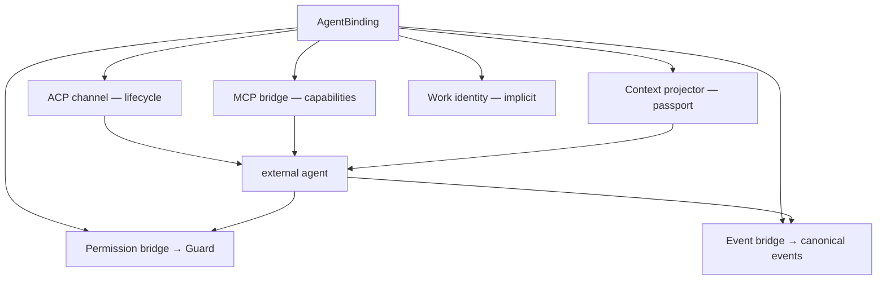

# ARCH/EXTERNAL-AGENTS — protocol surfaces and the shared plane

> **Status:** Subsystem contract, derived from [`CORE.md`](CORE.md). Owns how an external agent reaches
> EveryAIOS. The binding/adapter model is in [AGENT.md](AGENT.md); capability packs in
> [CAPABILITIES.md](CAPABILITIES.md). Invariants it must not weaken: **I12, I14, I15, I26, I27**.
>
> **v1 scope clarification (2026-09-24):** [`ADR/0007`](ADR/0007-windows-first-v1-qualification.md)
> makes ACP identity, per-Session handles/cancellation, reconnect/resume, and a real Channel B binding
> v1 qualification obligations. It does not turn an absent protocol method or an empty MCP-server list
> into a capability. ACP v2 is narrowly unsupported in this release until explicitly implemented and
> qualified; voice/STT/TTS/wake-word/audio remain post-v1.
>
> **Projection/lease amendment (2026-09-24):** [`ADR/0008`](ADR/0008-session-workbench-projection-and-resource-leases.md)
> requires the authenticated ACP/MCP connection to derive the canonical `Session → Work → Run → AgentBinding`
> owner context. Caller arguments, transport headers, and JSON-RPC ids are not owner selectors; lease bearer
> custody remains Rust-private and never crosses renderer/IPC.

---

## 1. Two protocols, three jobs

Using one protocol for everything is the mistake this document exists to prevent.

| Job | Protocol | Why |
|---|---|---|
| **Agent lifecycle** — process, session, prompt, cancel, permission callback, fs/terminal mediation | **ACP** | it is a client↔agent control protocol; it has no capability catalogue |
| **Capability surface** — tools, resources, prompts the agent may use | **MCP** | it is an agent↔tool protocol, and its discovery model is what makes capability packs possible |
| **Execution and state** — the only path to an effect | **Work Gateway** | no protocol may bypass Guard and the executor |

> **The one-line rule:** ACP = *who is running*; MCP = *what it may use*; the Work Gateway = *what may
> actually change*. An adapter that conflates them becomes a second kernel.

---

## 2. AgentBridge

The bridge is the missing piece. It is **not** an execution engine.



### 2.1 Scoped credential, implicit identity

```
AgentBinding → short-lived BridgeCredential → MCP bridge → Work Gateway → capability scope
```

Every tool call implicitly carries `space_id`, `session_id`, `work_id`, `binding_id` and the capability
manifest — **derived from the authenticated connection, never from caller-supplied arguments**. An agent
must not be able to name a Work it is not bound to, and must not be able to widen its own scope by asking
politely.

Explicitly rejected: a long-lived local endpoint exposing "everything" with no identity. That is a second
security gate, which I12 forbids.

### 2.1.1 Authenticated owner context and private lease custody

The host, not the caller, derives the canonical owner tuple for every ACP/MCP connection and request:

```text
authenticated connection → (SessionId, WorkId, RunId, AgentBindingId)
                                      ↓
                         Work/Run ResourceLease + generation/fence
```

A transport header may authenticate the connection, but it cannot select a Work, Session, or Binding. Tool
arguments, metadata, browser/MCP headers, and JSON-RPC request/notification ids are correlation or payload
data only; a mismatch with the host-derived tuple is refused. A provider/session id received from an agent is
adapter-private state, never a replacement canonical owner. Reconnect re-derives the tuple from the trusted
Rust owner and replays the Work event cursor; it does not trust a renderer-provided owner or create a new Work.

A Channel B lease is supervised and private to the Rust host. The renderer and Tauri IPC receive only safe
lease id, generation, fence/status, and typed resource-reference fields. Bearer/token material never crosses
that boundary, is never placed in a projection, event, error, or log, and cannot be reconstructed from a
caller argument. The complete identity, lease, contention, and crash matrix is normative in ADR-0008 §§1–3
and §6; implementation and qualification remain pending.

### 2.2 The bridge performs no effects

It forwards. `tool call → authenticated IPC → Work Gateway → capability resolver → Guard → executor →
effect → receipt → event`. If the bridge ever executes something itself, it has become a kernel.

---

## 3. Task-shaped façades, never the internal catalogue

External agents see a **small, stable, task-shaped surface** — not the internal tool list.

| Family | Façades (as shipped in `everyaios-mcp::SHARED_FACADES`) |
|---|---|
| Work | `work.create` · `work.status` |
| **Delegation** | `delegate.spawn` · `delegate.status` · `delegate.cancel` |
| Workspace / artifacts | `workspace.map` · `artifact.store` · `artifact.retrieve` |
| Browser | `browser.research` · `browser.operate` · `browser.extract` |
| Office | `office.open` · `office.inspect` · `office.edit` · `office.calculate` · `office.render` · `office.verify` |
| Desktop / computer use | `computer_use.see` · `computer_use.act` |
| Memory / context / search / connectors | named, not yet callable: they join this table when their façades land — a name in this table means the façade is live |

**One naming rule (`P71.1b`).** A façade id is a **flat dot-hierarchy** — `office.edit`, `delegate.spawn` —
with **no namespace prefix**. The `everyaios.` prefix belongs to capability-pack ids (e.g. `everyaios.office`
in a pack manifest), never to façade ids; code, the MCP `tools/list` and these docs all use the flat form.

Three rules: the façade set is **stable** (it is part of the cache-stable prefix — I16); an agent never
sees an internal implementation as a tool; and **delegation is a platform feature, not a built-in engine's
private ability** — the primary agent chooses, EveryAIOS validates, and a delegated task becomes a child
Work in the one Work graph (`P71.1`). Memory deliberately exposes no algorithms — no ACT-R, no FSRS, no
BM25, no graph traversal. Those are strategies behind `recall`/`remember`/`forget`.

---

## 4. Onboarding **any** registry agent — the unified contract

**Goal:** any agent in the [ACP registry](https://agentclientprotocol.com/registry) works, and adding agent
#44 is a **registry entry — never a code change.** That is testable, and today the design nearly achieves it:

```
registry.json (cdn.agentclientprotocol.com/registry/v1/latest/registry.json)
   → RegistryIndex::parse        (id · name · version · license · license_url · distribution)
   → platform resolution         (npx | uvx | binary[<platform>: archive + sha256 + cmd + args])
   → RegistryPolicy::evaluate    →  denylist → Block · allowlist|open-license → Allow · else → Ask
   → merge_into(LaunchRegistry)  →  canonical id (`-acp` stripped, aliases fixed)
   → AgentAdapter + negotiated capability matrix   (no per-agent branches anywhere)
```

The load-bearing properties — each of which must stay true:

1. **One interface, zero per-agent code.** `AgentAdapter` (`AGENT.md` §5) plus the negotiated matrix carries
   every difference as **data**. A branch on agent identity in the kernel is a defect.
2. **Fail to consent, not to rejection.** An agent not on the allowlist and not open-licensed is `Ask`, not
   `Block`. **Ask is the common path, not the exception** — the registry is majority-proprietary. An
   unreachable consent surface silently breaks most of the registry, so `Ask` must be wired end-to-end.
3. **The registry is the authority for launch, not a seed.** `registry.json` is a **live feed updated
   hourly** by a cron that watches npm/PyPI/GitHub releases. Registry entries therefore **override** curated
   seed entries (`upsert`), and any cached version pin ages within the hour. Cache refresh and the pinned-
   schema rule (`P69.B14`) must be designed for a feed, not a snapshot.
4. **Authentication comes from the protocol, never from the license.** The registry carries **no auth
   field**; it is a curated list of agents that support authentication, and **CI verifies every agent
   returns valid `authMethods` in the ACP handshake**. So the `initialize`/`authenticate` exchange is the
   only authoritative source. Inferring auth from `license` is a category error (`CORE.md` §11.1, **V5**).
5. **Distribution args are per-platform and meaningful.** `args` live *inside* the platform target and
   genuinely differ (`poolside` ships `["acp"]`; `antigravity-acp` ships `["--uid="]` on linux only; npx
   agents use `["--acp"]`). Launching an ACP binary **without** its args starts its normal CLI, not its ACP
   server — the agent then looks broken with no useful error (**V7**).
6. **`env` from the registry is functional, not decoration.** `manifest.env` *is* merged into the spawn
   environment, so dropping it in the merge breaks agents that need it (**V6**).

**Failure honesty:** an agent that installs but cannot complete an ACP handshake must report *that*, not
appear as an empty chat. "It launched" is not "it works".

---

## 5. Governance modes — stated honestly

| Mode | Filesystem / terminal authority | What EveryAIOS may claim |
|---|---|---|
| **Channel B** (MCP tool catalogue) | EveryAIOS, through its own capabilities | the **only** fully-ticketed external path — Guard → executor → receipt on every call |
| **Governed-mediated** (ACP `fs/*`, `terminal/*`) | EveryAIOS, servicing the agent's *own* file/shell tool calls | mediated effects are audited end to end |
| **Self-contained** | the agent's own tools | EveryAIOS audits **only** what crosses the bridge |
| **Not-governed** | the agent's own, no bridge attached | no EveryAIOS governance claim at all |

The active mode is shown in the UI. Presenting self-contained as if it were mediated violates I15. This
document deliberately does **not** claim identical observability across modes.

### 5.1 Mediated is a **v1** surface and is being deleted — the durable path is Channel B

This ordering is deliberate and corrects an earlier framing that treated mediated as the governance ideal.
**ACP v2 removes the client filesystem and terminal surface entirely.** The v2 migration guide is explicit:

> "The Client file system, terminal execution, and session modes APIs are gone." … "Remove `fs/*` and
> `terminal/*` implementations for v2 connections. **Expose Client-side tools through MCP servers passed in
> `mcpServers`**; do not treat display terminals as Client resources." — `agentclientprotocol.com/protocol/v2/migration`

Consequences that must be stated plainly:

1. **Mediated mode is a v1-supported, declining surface.** Implementing `fs/*`/`terminal/*` handlers buys
   governance for v1-only agents, which will "remain common for some time" — that is a real and worthwhile
   compatibility win, but it is **not** the durable architecture. Anyone building it expecting it to be the
   long-term governed path is building on a deprecated surface.
2. **Channel B is the durable path** — the same conclusion `CORE.md` §11.4 reaches ("the only fully-ticketed
   external path"). That is why the table above is ordered with it first.
3. **Omission of fs/terminal does *not* force Channel B.** Withholding the capability makes the agent fall
   back to its **own in-process backends**, where its own sandbox and permission rules apply and nothing
   crosses the ACP wire. The honest claim there is "self-contained under the agent's own sandbox", never
   "EveryAIOS-governed". *(Corrected mechanism, verified against codeg `host_tools_policy.rs` and the ACP v2
   RFD `client-filesystem-terminal-capabilities`; recorded in `../SPEC-CHANGELOG.md`.)*
4. **Adapters must stay capability-driven across both versions.** v1 and v2 peers will coexist for a long
   time, so `fs_mediation` / `terminal_mediation` are negotiated per connection (§7) and a v2 connection that
   reports them absent must degrade to Channel B or self-contained — never throw and never claim coverage it
   does not have.
5. **v1 release policy: narrow unsupported v2.** ACP v1 is the only baseline this release qualifies. A v2
   negotiation is refused explicitly until an adapter and conformance evidence support it; the host never
   silently downgrades a v2 connection, translates unknown v2 methods, or claims the removed v2 client
   filesystem/terminal surface. A future v2 implementation must be an explicit capability decision, not an
   inference from the v1 adapter.

---

## 6. Confirmed defects (at the 2026-09-20 thaw)

**Status 2026-09-21 — all three repaired in code (implemented, not verified):** V1 → `P69.C1`
(`PermissionGate`, fail-closed `DenyAllGate` default) · V2 → `P69.C2` (`ClientMediation` seam with an
explicit refusal when no mediator is attached) · V3 → `P69.C3` (`GovernancePreference::Mediated` default
when a mediation seam exists). The evidence below is the dated thaw record — line numbers are as-of that
date and are intentionally not rewritten.

| # | Defect | Evidence | Repair (TODO) |
|---|---|---|---|
| **V1** | The ACP permission path grants approval without consulting Guard — `Approval::allow()` on the host side | `crates/everyaios-acp/src/chief.rs:417` | **C1** — implemented (unverified) |
| **V2** | ACP `fs/*` and `terminal/*` are unhandled, so mediated mode has no filesystem or terminal path; every other agent→client request returns `-32601 method not found` | `crates/everyaios-acp/src/client.rs:521` (only `session/request_permission` is implemented); `client.rs:538` (fallback error) | **C2** — implemented (unverified) |
| **V3** | Mediated mode is not the default — the client withholds the fs/terminal capability set | `crates/everyaios-acp/src/chief.rs:373` | **C3** — implemented (unverified) |

> V1 is the most serious: an architecture that advertises a single authorization gate while this path
grants approval unilaterally is mis-described, not merely incomplete. **V1 and V2 must both close before
any claim of "all mediated effects are governed" is written into a document.** *(Both are repaired in
code as of 2026-09-21 — C1/C2, implemented but not verified; the claim may be written once verification
runs.)*

*(A `Approval::allow()` also appears at `chief.rs:663`; that one is a test-driver fixture, not a
production path, and must not be reported as a second vulnerability.)*

---

## 7. ACP session lifecycle

The adapter owns protocol translation; the coordinator does not.

```
new_session() · load_session()  (ACP v1) · resume_session()  (ACP v2) · close_session() · prompt() · cancel()
```

- Resume must **not** require replaying the whole conversation (that is what `ContextPassport` is for).
- MCP bridge data is re-attached on resume with the same Space/Session/Work/capability scope.
- Resource leases are revalidated by Work/Run owner context and generation/fence before a reattached call; a
  provider restart creates a new private provider-handle generation but does not change Session/Work/Run.
- The host keeps any lease bearer private; ACP/MCP payloads and renderer-facing status contain no bearer/token.
- Version differences (`load` vs `resume`) live inside the adapter.
- A capability the agent negotiates as absent must degrade, never throw.

> **GAP (D2, recorded 2026-09-22; rechecked for ADR-0007 on 2026-09-24).** The lifecycle above is
> contract-not-code on the wire: the production ACP client (`crates/everyaios-acp/src/client.rs`) implements
> `initialize` · `authenticate` · `session/new` · `session/prompt` · `session/cancel` ·
> `session/request_permission` · `session/set_config_option` · `update` — but has **no `session/load` and no
> `session/resume`**. The only `session/load` in the tree is the test fixture
> `crates/everyaios-acp/src/bin/mock-agent.rs`. Resume promises in this section are therefore currently
> unexecutable; implementation is queued in TODO as the **H4 vehicle (session-resume wire)**.
>
> **v1 qualification consequences ([`ADR/0007`](ADR/0007-windows-first-v1-qualification.md)).** The
> production path must also bind a real MCP server in `session/new`, scope its host handle and cancellation
> to the owning Session/binding, and prove reconnect by replaying Work events and re-attaching the same
> binding. A fresh provider session is an explicitly labelled degraded continuation, not native resume.
> The current shell calls `session.session_new(&cwd, vec![])` at
> `src-tauri/src/acp_cmds.rs:1548` (and the authentication retry at `:1643`), so Channel B is **not yet
> qualified**; the MCP server and the governance tests do not erase that live-path gap.

---

## 8. What EveryAIOS must never do

- Never re-implement an external agent's reasoning loop, prompt, or tool-selection logic.
- Never hold an external agent's credentials, or copy a subscription credential to power another engine.
- Never expose the internal tool catalogue as the external capability surface.
- Never let MCP or ACP establish a second permission universe or bypass the executor.
- Never claim audit coverage over an effect the agent performed with its own tools. *(Hard denies: respect
the user's own permission decisions inside the agent.)*
- Never hardcode a per-agent branch in the kernel; differences live in the negotiated matrix.

---

## 9. Invariants this document must not weaken

| Invariant | How |
|---|---|
| I12 — one authorization model | §2.1; the bridge cannot mint authority, only carry it |
| I14 — authority does not leak across the seam | §8's final bullet; §5's honest modes |
| I15 — no false observability | §5's "what EveryAIOS may claim" column |
| I26 — a new capability never needs an agent change | §3's stable façades; a new pack needs no adapter edit |
| I16 — prefix stability | §3's stable façade set |

---

---

## 10. Shared Plane Wire Lifecycle & MCP Server Binding (HLD & LLD)

The interaction between an external ACP agent and the EveryAIOS Shared Plane operates over a two-protocol bridge:

```
External Agent (Subprocess)
  │  1. Spawn with stdio transport + Context Passport
  ▼
ACP Host Seam (`src-tauri/src/acp_cmds.rs`)
  │  2. Start Local In-Process MCP Loopback Server (`everyaios-mcp`)
  │  3. `session/new` carrying the Work-scoped `mcpServers: [{ name: "everyaios", url: "http://127.0.0.1:<port>" }]`
  ▼
Agent discovers `SHARED_FACADES` via MCP `tools/list`
  │  4. Agent calls tool `office.calculate` or `browser.operate` via MCP `tools/call`
  ▼
`ToolService::dispatch_facade` (`crates/everyaios-core/src/tools.rs`)
  │  5. Guard-1 (AST & rate limit check) + Guard-2 (Diff Card & Ticket approval)
  ▼
In-Process Rust Engine (IronCalc, OOXML Patcher, Lightpanda, Windows CUA Ladder)
  │  6. Execute mutation / read in-process (Zero UI clicks for Office)
  │  7. Spool large payload (>2k tokens) to `~/.everyaios/spool/{sha256}.blob` (MEM-15)
  ▼
Observation returned to Agent + Append receipt to Merkle Audit Log (`everyaios-audit`)
```

### 10.1 Wire Message Schemas (ACP + MCP JSON-RPC)

1. **`session/new` Wire Payload:**
```json
{
  "jsonrpc": "2.0",
  "id": 1,
  "method": "session/new",
  "params": {
    "cwd": "C:\\Users\\User\\Project",
    "mcpServers": [
      {
        "name": "everyaios",
        "url": "http://127.0.0.1:49152/mcp",
        "headers": {
          "Authorization": "Bearer <ephemeral-session-token>"
        }
      }
    ]
  }
}
```

2. **`tools/list` Wire Response (19 `SHARED_FACADES` Advertised):**
```json
{
  "jsonrpc": "2.0",
  "id": 2,
  "result": {
    "tools": [
      {
        "name": "office.calculate",
        "description": "Recalculate a spreadsheet (.xlsx) through the embedded IronCalc formula engine.",
        "inputSchema": {
          "type": "object",
          "properties": {
            "path": { "type": "string", "description": "Workspace-relative or absolute path to .xlsx workbook" }
          },
          "required": ["path"]
        }
      },
      {
        "name": "office.edit",
        "description": "Surgically patch a document (.docx/.xlsx/.pptx) block preserving styles and macros.",
        "inputSchema": {
          "type": "object",
          "properties": {
            "path": { "type": "string" },
            "address": { "type": "string", "description": "Cell address (e.g. B2) or paragraph id" },
            "text": { "type": "string" }
          },
          "required": ["path", "text"]
        }
      }
    ]
  }
}
```

3. **Large Payload Spooling Schema (`CCR` / `MEM-15`):**
If tool execution output exceeds 2,000 tokens:
```json
{
  "jsonrpc": "2.0",
  "id": 3,
  "result": {
    "content": [
      {
        "type": "text",
        "text": "{\n  \"summary\": \"Extracted 2,450 rows from Sheet 'Ledger'. First 5 rows: [...]\",\n  \"truncated\": true,\n  \"spool_token\": \"sha256-e3b0c44298fc1c149afbf4c8996fb92427ae41e4649b934ca495991b7852b855\",\n  \"total_tokens\": 24800\n}"
      }
    ]
  }
}
```

---

## 11. Tool Affinity & Model Steering Injection

External coding agents (Claude Code, OpenAI Codex, OpenCode, Aider) are trained with strong prior weights favoring native coding tools (`bash`, `python`, `file_edit`). Without explicit host steering, agents default to writing Python scripts or invoking shell utilities (e.g. `libreoffice`, `curl`, `openpyxl`) rather than calling EveryAIOS shared facades.

To guarantee that external models naturally use the shared plane:

### 11.1 Context Passport Cowork Steering Block
Every prompt dispatched via `build_acp_prompt_with_passport` (`src-tauri/src/acp_cmds.rs`) injects the following high-priority steering block:

```markdown
## Shared Cowork Capabilities
You have direct access to EveryAIOS native cowork tools via the connected MCP server:
- **Spreadsheets (.xlsx) & Documents (.docx/.pptx):** ALWAYS use `office.*` tools (`office.open`, `office.inspect`, `office.edit`, `office.calculate`). Do NOT write custom Python scripts or execute CLI tools in bash to modify office files.
- **Web Browsing & Research:** ALWAYS use `browser.*` tools (`browser.research`, `browser.operate`, `browser.extract`) rather than executing raw curl or headless scripts in bash.
- **Desktop UI Automation:** Use `computer_use.*` tools (`computer_use.see`, `computer_use.act`).
- **Subagent Delegation:** Use `delegate.spawn` to delegate subtasks to isolated child worktrees.
```

### 11.2 Guard-1 Deflection & Recovery Nudge
If an external agent attempts a shell command to manipulate office files (e.g. `python -c "import openpyxl..."` or `soffice --headless`) or perform unisolated web crawling, Guard-1 detects the pattern via Tree-Sitter AST inspection (`SEC-4`) and blocks the shell command with an actionable deflection nudge:

```json
{
  "ok": false,
  "error": "Direct shell manipulation of office documents is blocked for integrity and audit safety. Use the 'office.edit' or 'office.calculate' facade instead."
}
```
This forces the model's reasoning loop to gracefully pivot and invoke the shared plane tool.

---

## 12. Migration notes

- V1 must be fixed before the permission path can be described as guarded; V2/V3 before mediated mode can be
described as the primary path. **Status 2026-09-21:** V1–V3 are repaired in code (C1–C3 — implemented,
not verified); the descriptions still may not claim guarded/primary mediation until verification runs.
- The bridge requires the binding record first ([AGENT.md](AGENT.md) §3) — order is binding → bridge → scope.
- The v1 qualification rule in [`ADR/0007`](ADR/0007-windows-first-v1-qualification.md) keeps ACP, MCP,
  and the Work Gateway as three protocol/ownership jobs; a second protocol server, binding registry, or
  execution loop is not an acceptable way to fill a missing lifecycle method.
- Multi-platform confinement honesty is unchanged: a confined launch fails closed, and a non-Linux posture
  reports what it actually achieved rather than claiming confinement.

---

## Repo-comparison additions (briefs 01–19)

Verified delta items from `REPO-COMPARE/DELTA-ANALYSIS.md` §3 whose target is this document. Each entry:
brief tag · disposition · SOURCE repo + evidence path (under `REPO-COMPARE/clone2|clone3/`) ·
one-sentence logic → target §. Halves owned by other lanes are named as cross-domain deferred.

- **COO-3** · `[improve]` · SOURCE `clone2/codex/codex-rs/app-server` (+ `app-server-protocol`) — The
  Codex engine contract is the app-server **v2 thread/turn/item** JSON-RPC surface (not v1 events),
  already carrying approval/sandbox knobs per thread that the adapter translates into Guard tickets
  (native plane stays engine-governed; capability plane mints — I14 / One Invariant). → §7.
- **19-7** · `[add]` · SOURCE `clone3/agent-control/ccmanager` (include-file semantics; brief 19 rec 7 +
  cross-repo synthesis #4) — `.worktreeinclude` interop (same filename + gitignore semantics as Claude
  Code/Conductor/Codex, git-actually-ignored check only) is honored when minting worktree workspaces so
  `workspace.map` reports the include-aware tree. → §3 (`workspace.map`); *cross-domain deferred:* WORK
  workspace-creation half → WORK lane.
- **11-3** · `[add · annotation]` · SOURCE `clone2/eliza/packages/core/README.md` (room entitlement
  evaluated inside the storage adapter before rows/counts/ranking return; CAS role changes;
  fail-closed for unresolved identities) — Entitlement is checked fail-closed in the read path before
  any data returns, so the bridge/adapter never returns store rows without the entitlement verdict — the
  bridge still forwards, never authorizes (§2.2). → annotation here; *cross-domain deferred:*
  15-CONNECT-STORE + SECURITY §2 → store/security lanes.
- **11-10** · `[add · annotation]` · SOURCE `clone2/openfang/docs/architecture.md` ("Agent Lifecycle" —
  spawn validates capability inheritance before grants) — A child's capability set may never exceed its
  parent's at spawn, enforced before any grant, so delegation through the bridge cannot widen scope.
  → annotation here; *cross-domain deferred:* WORK §8 + SECURITY §2 → work/security lanes.
- **11-13** · `[add]` · SOURCE `clone2/deepseek-harness/docs/capability_seams.md` — The three-role seam
  rule (definition + provider + consumer all required; a provider swap must move every dependent
  together) is the extension test for capability packs bound through this bridge. → §7; *cross-domain
  deferred:* brief 11-13's checkpoint-wrapping half → RECOVERY §7 (recovery lane).
- **19-17** · `[upgrade]` · SOURCE `clone3/agent-control/agent-client-protocol`
  (`docs/rfds/session-fork.mdx`, `docs/rfds/session-resume.mdx`) — Adopt the ACP `session/fork` +
  `session/resume|list|delete` RFDs into the binding lifecycle (fork-at-message, capability-gated)
  instead of adapter-invented equivalents. → §7 + AGENT.md §6.
- **13-8** · `[add]` · SOURCE `clone2/claude-mem/docs/architecture-overview.md` ("Graceful Degradation")
  — In the host-facing hook contract, transport/worker failures queue and exit clean and **never block
  the host session**, while client-contract bugs may block. → §7 + `everyaios-acp`.
- **MCPM-1** · `[add · annotation]` · SOURCE `clone3/mcp-plugins-skills-connectors/mcpm.sh/src/mcpm/clients/base.py`
  (abstract `ClientManager`) — A harness-adapter emitter turns one internal MCP-server descriptor into
  per-client config stanzas (native-first: emit config, never wrap native tools) while preserving §4's
  rule that adding an agent is a registry entry, never a code change. → §4 annotation; *cross-domain
  deferred:* primary 15-CONNECT §4 → store lane.
- **MCPM-3** · `[improve · annotation]` · SOURCE `clone3/mcp-plugins-skills-connectors/mcpm.sh/src/mcpm/core/schema.py:42-60`
  — `${VAR}` env indirection in emitted configs resolves **only from vault references at emit time**
  (plaintext-resolution fallback forbidden), reinforcing §4's "`manifest.env` is functional" rule with
  I10 custody. → §4 annotation + `→ 03-BYOK` (BYOK lane owns the custody file).
- **19-18** · `[improve]` · SOURCE `clone3/agent-control/agentapi` (`conversation.go`; negative evidence
  `acpio.go`) — The two-transport AgentIO seam (structured preferred, PTY fallback behind one
  Conversation interface) must handle methods capability-honestly: unimplemented ACP methods negotiate
  absent, never stubbed or auto-allowed. → §§5/7 (+ AGENT.md §5 matrix cross-ref).
- **14-14** · `[add]` · SOURCE `clone2/harnessrouter/protocol/schema/`, `clone2/harnessrouter/protocol/conformance/`
  — UHP conformance-suite *discipline* — a versioned machine-readable schema plus runnable conformance
  tests per harness/adapter façade, shaped on the ACP/MCP/Work-Gateway trichotomy of §1 — **UHP is not
  adopted as a fourth protocol**. → §§1–2 (+ ADR-0005 reference; ADR not edited here).
- **03/05 §3 #14** · **Not adopted (recorded)** · SOURCE `clone2/opencode` (`permission/index.ts`
  wildcard grammar; V1 loop) + `clone2/codex` (V1-deprecated patterns) — No V1-deprecated surface
  mirroring: a deprecated v1 surface (fs/terminal mediation, wildcard permission grammar) may be
  supported only as declining compatibility per §5.1, never mirrored as a durable API, grammar, or
  design once v2 parity exists. → §5.1 (and §8).
