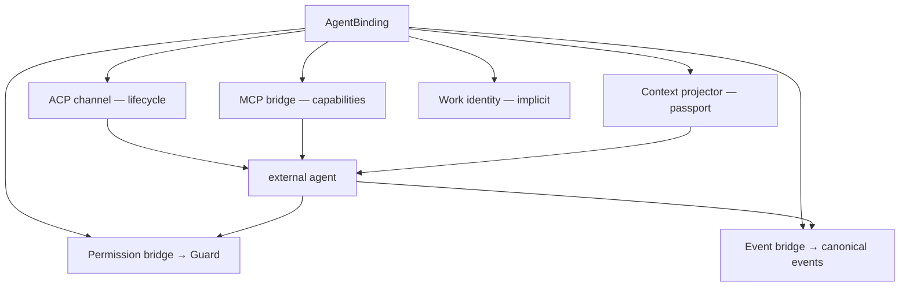

# ARCH/EXTERNAL-AGENTS — protocol surfaces and the shared plane

> **Status:** Subsystem contract, derived from [`CORE.md`](CORE.md). Owns how an external agent reaches
> EveryAIOS. The binding/adapter model is in [AGENT.md](AGENT.md); capability packs in
> [CAPABILITIES.md](CAPABILITIES.md). Invariants it must not weaken: **I12, I14, I15, I26, I27**.

---

## 1. Two protocols, three jobs

Using one protocol for everything is the mistake this document exists to prevent.

| Job | Protocol | Why |
|---|---|---|
| **Agent lifecycle** — process, session, prompt, cancel, permission callback, fs/terminal mediation | **ACP** | it is a client↔agent control protocol; it has no capability catalogue |
| **Capability surface** — tools, resources, prompts the agent may use | **MCP** | it is an agent↔tool protocol, and its discovery model is what makes capability packs possible |
| **Execution and state** — the only path to an effect | **Work Gateway** | no protocol may bypass Guard and the executor |

> **The one-line rule:** ACP = *who is running*; MCP = *what it may use*; the Work Gateway = *what may
> actually change*. An adapter that conflates them becomes a second kernel.

---

## 2. AgentBridge

The bridge is the missing piece. It is **not** an execution engine.



### 2.1 Scoped credential, implicit identity

```
AgentBinding → short-lived BridgeCredential → MCP bridge → Work Gateway → capability scope
```

Every tool call implicitly carries `space_id`, `session_id`, `work_id`, `binding_id` and the capability
manifest — **derived from the authenticated connection, never from caller-supplied arguments**. An agent
must not be able to name a Work it is not bound to, and must not be able to widen its own scope by asking
politely.

Explicitly rejected: a long-lived local endpoint exposing "everything" with no identity. That is a second
security gate, which I12 forbids.

### 2.2 The bridge performs no effects

It forwards. `tool call → authenticated IPC → Work Gateway → capability resolver → Guard → executor →
effect → receipt → event`. If the bridge ever executes something itself, it has become a kernel.

---

## 3. Task-shaped façades, never the internal catalogue

External agents see a **small, stable, task-shaped surface** — not the internal tool list.

| Family | Façades (as shipped in `everyaios-mcp::SHARED_FACADES`) |
|---|---|
| Work | `work.create` · `work.status` |
| **Delegation** | `delegate.spawn` · `delegate.status` · `delegate.cancel` |
| Workspace / artifacts | `workspace.map` · `artifact.store` · `artifact.retrieve` |
| Browser | `browser.research` · `browser.operate` · `browser.extract` |
| Office | `office.open` · `office.inspect` · `office.edit` · `office.calculate` · `office.render` · `office.verify` |
| Desktop / computer use | `computer_use.see` · `computer_use.act` |
| Memory / context / search / connectors | named, not yet callable: they join this table when their façades land — a name in this table means the façade is live |

**One naming rule (`P71.1b`).** A façade id is a **flat dot-hierarchy** — `office.edit`, `delegate.spawn` —
with **no namespace prefix**. The `everyaios.` prefix belongs to capability-pack ids (e.g. `everyaios.office`
in a pack manifest), never to façade ids; code, the MCP `tools/list` and these docs all use the flat form.

Three rules: the façade set is **stable** (it is part of the cache-stable prefix — I16); an agent never
sees an internal implementation as a tool; and **delegation is a platform feature, not a built-in engine's
private ability** — the primary agent chooses, EveryAIOS validates, and a delegated task becomes a child
Work in the one Work graph (`P71.1`). Memory deliberately exposes no algorithms — no ACT-R, no FSRS, no
BM25, no graph traversal. Those are strategies behind `recall`/`remember`/`forget`.

---

## 4. Onboarding **any** registry agent — the unified contract

**Goal:** any agent in the [ACP registry](https://agentclientprotocol.com/registry) works, and adding agent
#44 is a **registry entry — never a code change.** That is testable, and today the design nearly achieves it:

```
registry.json (cdn.agentclientprotocol.com/registry/v1/latest/registry.json)
   → RegistryIndex::parse        (id · name · version · license · license_url · distribution)
   → platform resolution         (npx | uvx | binary[<platform>: archive + sha256 + cmd + args])
   → RegistryPolicy::evaluate    →  denylist → Block · allowlist|open-license → Allow · else → Ask
   → merge_into(LaunchRegistry)  →  canonical id (`-acp` stripped, aliases fixed)
   → AgentAdapter + negotiated capability matrix   (no per-agent branches anywhere)
```

The load-bearing properties — each of which must stay true:

1. **One interface, zero per-agent code.** `AgentAdapter` (`AGENT.md` §5) plus the negotiated matrix carries
   every difference as **data**. A branch on agent identity in the kernel is a defect.
2. **Fail to consent, not to rejection.** An agent not on the allowlist and not open-licensed is `Ask`, not
   `Block`. **Ask is the common path, not the exception** — the registry is majority-proprietary. An
   unreachable consent surface silently breaks most of the registry, so `Ask` must be wired end-to-end.
3. **The registry is the authority for launch, not a seed.** `registry.json` is a **live feed updated
   hourly** by a cron that watches npm/PyPI/GitHub releases. Registry entries therefore **override** curated
   seed entries (`upsert`), and any cached version pin ages within the hour. Cache refresh and the pinned-
   schema rule (`P69.B14`) must be designed for a feed, not a snapshot.
4. **Authentication comes from the protocol, never from the license.** The registry carries **no auth
   field**; it is a curated list of agents that support authentication, and **CI verifies every agent
   returns valid `authMethods` in the ACP handshake**. So the `initialize`/`authenticate` exchange is the
   only authoritative source. Inferring auth from `license` is a category error (`CORE.md` §11.1, **V5**).
5. **Distribution args are per-platform and meaningful.** `args` live *inside* the platform target and
   genuinely differ (`poolside` ships `["acp"]`; `antigravity-acp` ships `["--uid="]` on linux only; npx
   agents use `["--acp"]`). Launching an ACP binary **without** its args starts its normal CLI, not its ACP
   server — the agent then looks broken with no useful error (**V7**).
6. **`env` from the registry is functional, not decoration.** `manifest.env` *is* merged into the spawn
   environment, so dropping it in the merge breaks agents that need it (**V6**).

**Failure honesty:** an agent that installs but cannot complete an ACP handshake must report *that*, not
appear as an empty chat. "It launched" is not "it works".

---

## 5. Governance modes — stated honestly

| Mode | Filesystem / terminal authority | What EveryAIOS may claim |
|---|---|---|
| **Channel B** (MCP tool catalogue) | EveryAIOS, through its own capabilities | the **only** fully-ticketed external path — Guard → executor → receipt on every call |
| **Governed-mediated** (ACP `fs/*`, `terminal/*`) | EveryAIOS, servicing the agent's *own* file/shell tool calls | mediated effects are audited end to end |
| **Self-contained** | the agent's own tools | EveryAIOS audits **only** what crosses the bridge |
| **Not-governed** | the agent's own, no bridge attached | no EveryAIOS governance claim at all |

The active mode is shown in the UI. Presenting self-contained as if it were mediated violates I15. This
document deliberately does **not** claim identical observability across modes.

### 5.1 Mediated is a **v1** surface and is being deleted — the durable path is Channel B

This ordering is deliberate and corrects an earlier framing that treated mediated as the governance ideal.
**ACP v2 removes the client filesystem and terminal surface entirely.** The v2 migration guide is explicit:

> "The Client file system, terminal execution, and session modes APIs are gone." … "Remove `fs/*` and
> `terminal/*` implementations for v2 connections. **Expose Client-side tools through MCP servers passed in
> `mcpServers`**; do not treat display terminals as Client resources." — `agentclientprotocol.com/protocol/v2/migration`

Consequences that must be stated plainly:

1. **Mediated mode is a v1-supported, declining surface.** Implementing `fs/*`/`terminal/*` handlers buys
   governance for v1-only agents, which will "remain common for some time" — that is a real and worthwhile
   compatibility win, but it is **not** the durable architecture. Anyone building it expecting it to be the
   long-term governed path is building on a deprecated surface.
2. **Channel B is the durable path** — the same conclusion `CORE.md` §11.4 reaches ("the only fully-ticketed
   external path"). That is why the table above is ordered with it first.
3. **Omission of fs/terminal does *not* force Channel B.** Withholding the capability makes the agent fall
   back to its **own in-process backends**, where its own sandbox and permission rules apply and nothing
   crosses the ACP wire. The honest claim there is "self-contained under the agent's own sandbox", never
   "EveryAIOS-governed". *(Corrected mechanism, verified against codeg `host_tools_policy.rs` and the ACP v2
   RFD `client-filesystem-terminal-capabilities`; recorded in `../SPEC-CHANGELOG.md`.)*
4. **Adapters must stay capability-driven across both versions.** v1 and v2 peers will coexist for a long
   time, so `fs_mediation` / `terminal_mediation` are negotiated per connection (§7) and a v2 connection that
   reports them absent must degrade to Channel B or self-contained — never throw and never claim coverage it
   does not have.

---

## 6. Confirmed defects (at the 2026-09-20 thaw)

**Status 2026-09-21 — all three repaired in code (implemented, not verified):** V1 → `P69.C1`
(`PermissionGate`, fail-closed `DenyAllGate` default) · V2 → `P69.C2` (`ClientMediation` seam with an
explicit refusal when no mediator is attached) · V3 → `P69.C3` (`GovernancePreference::Mediated` default
when a mediation seam exists). The evidence below is the dated thaw record — line numbers are as-of that
date and are intentionally not rewritten.

| # | Defect | Evidence | Repair (TODO) |
|---|---|---|---|
| **V1** | The ACP permission path grants approval without consulting Guard — `Approval::allow()` on the host side | `crates/everyaios-acp/src/chief.rs:417` | **C1** — implemented (unverified) |
| **V2** | ACP `fs/*` and `terminal/*` are unhandled, so mediated mode has no filesystem or terminal path; every other agent→client request returns `-32601 method not found` | `crates/everyaios-acp/src/client.rs:521` (only `session/request_permission` is implemented); `client.rs:538` (fallback error) | **C2** — implemented (unverified) |
| **V3** | Mediated mode is not the default — the client withholds the fs/terminal capability set | `crates/everyaios-acp/src/chief.rs:373` | **C3** — implemented (unverified) |

> V1 is the most serious: an architecture that advertises a single authorization gate while this path
grants approval unilaterally is mis-described, not merely incomplete. **V1 and V2 must both close before
any claim of "all mediated effects are governed" is written into a document.** *(Both are repaired in
code as of 2026-09-21 — C1/C2, implemented but not verified; the claim may be written once verification
runs.)*

*(A `Approval::allow()` also appears at `chief.rs:663`; that one is a test-driver fixture, not a
production path, and must not be reported as a second vulnerability.)*

---

## 7. ACP session lifecycle

The adapter owns protocol translation; the coordinator does not.

```
new_session() · load_session()  (ACP v1) · resume_session()  (ACP v2) · close_session() · prompt() · cancel()
```

- Resume must **not** require replaying the whole conversation (that is what `ContextPassport` is for).
- MCP bridge data is re-attached on resume with the same Space/Session/Work/capability scope.
- Version differences (`load` vs `resume`) live inside the adapter.
- A capability the agent negotiates as absent must degrade, never throw.

---

## 8. What EveryAIOS must never do

- Never re-implement an external agent's reasoning loop, prompt, or tool-selection logic.
- Never hold an external agent's credentials, or copy a subscription credential to power another engine.
- Never expose the internal tool catalogue as the external capability surface.
- Never let MCP or ACP establish a second permission universe or bypass the executor.
- Never claim audit coverage over an effect the agent performed with its own tools. *(Hard denies: respect
the user's own permission decisions inside the agent.)*
- Never hardcode a per-agent branch in the kernel; differences live in the negotiated matrix.

---

## 9. Invariants this document must not weaken

| Invariant | How |
|---|---|
| I12 — one authorization model | §2.1; the bridge cannot mint authority, only carry it |
| I14 — authority does not leak across the seam | §8's final bullet; §5's honest modes |
| I15 — no false observability | §5's "what EveryAIOS may claim" column |
| I26 — a new capability never needs an agent change | §3's stable façades; a new pack needs no adapter edit |
| I16 — prefix stability | §3's stable façade set |

---

## 10. Migration notes

- V1 must be fixed before the permission path can be described as guarded; V2/V3 before mediated mode can be
described as the primary path. **Status 2026-09-21:** V1–V3 are repaired in code (C1–C3 — implemented,
not verified); the descriptions still may not claim guarded/primary mediation until verification runs.
- The bridge requires the binding record first ([AGENT.md](AGENT.md) §3) — order is binding → bridge → scope.
- Multi-platform confinement honesty is unchanged: a confined launch fails closed, and a non-Linux posture
  reports what it actually achieved rather than claiming confinement.
