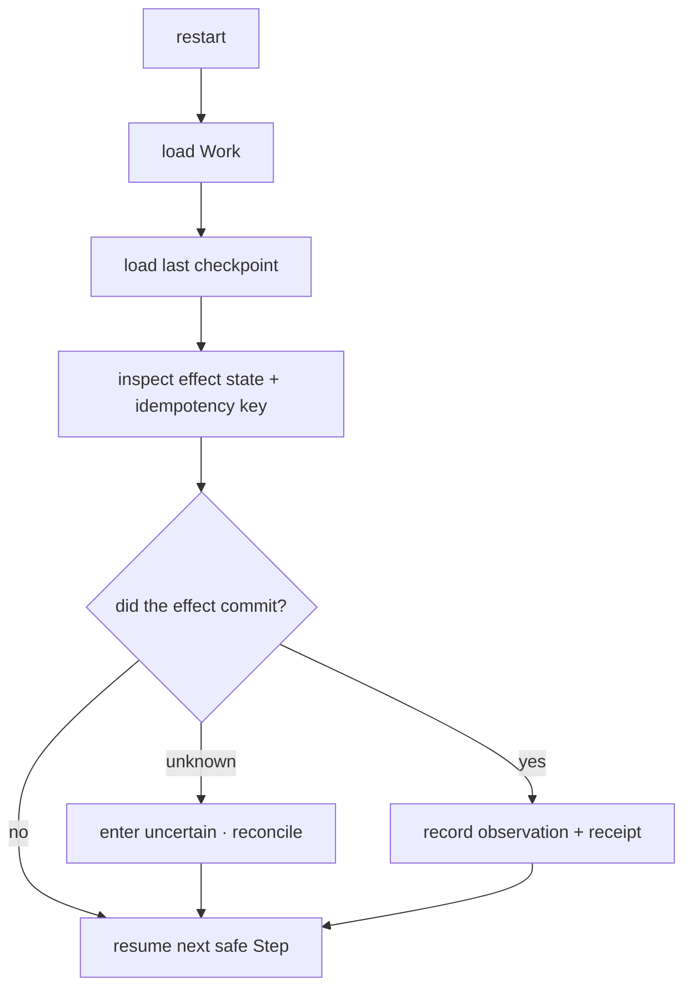

# ARCH/RECOVERY — durable Work, uncertain effects, safe resume

> **Status:** Subsystem contract, derived from [`CORE.md`](CORE.md) §5.2 and §6. Owns what happens after a
> crash, a kill, a disconnect or a lease loss. Invariants it must not weaken: **I6, I7, I15**.
>
> **v1 scope clarification (2026-09-24):** [`ADR/0007`](ADR/0007-windows-first-v1-qualification.md)
> makes production `ExecutionKernel` recovery, full Work replay, durable audit/receipt handling, and
> live crash/reconnect evidence v1 qualification obligations. Recovery still composes the one Work/Event/
> Receipt spine; it is not a second runtime or authority. Voice/STT/TTS/wake-word/audio remain post-v1.
>
> **Projection/lease amendment (2026-09-24):** [`ADR/0008`](ADR/0008-session-workbench-projection-and-resource-leases.md)
> adds resource generation/fence, held-lease reclaim, and event-cursor projection rebuild rules. These extend
> recovery of the existing spine; they do not create a second recovery authority or event log.

---

## 1. Five inputs, and no others

| Input | Role |
|---|---|
| **Work** | the durable objective — the thing being recovered |
| **Checkpoint** | the last known-good resumable position |
| **Idempotency class** | whether an interrupted effect may be retried at all |
| **Event log** | what definitely happened |
| **Receipt** | what was proven to have happened |

> Fancy memory is not what makes a system recoverable. **Work + checkpoint + idempotency + event log +
> receipt** is. A system with brilliant recall and no durable Work loses the user's task.

---

## 2. Durable ordering

```
DURABLE INTENT → DURABLE ATTEMPT → EFFECT → OBSERVE → VERIFY → RECEIPT
```

The authoritative intent and attempt are written **before** an irreversible external effect. This ordering is
contractual, not an implementation preference — it is the only thing that makes post-crash classification
possible.

---

## 3. The uncertain state

```
ticket approved, attempt lost → uncertain
                            → never failed
                            → never succeeded
```

This is the single most important rule in this document. A crash between approval and execution leaves the
world in an unknown state, and the system must say so.

**Never fabricate completion.** A receipt that reports success for an effect whose outcome was never observed
is the worst possible defect: it is simultaneously a data-integrity bug and a lie to the user.

---

## 4. Recovery flow



Rules: **never blindly replay** a non-idempotent effect; inspect before continuing; classify unknown state as
unknown; resume the next safe Step; require reconciliation before any retry of something that may have
already happened.

---

## 5. Idempotency classes

The capability contract already declares an idempotency class per capability (see spec §4.3). Recovery
branches on it:

| Class | Recovery behaviour |
|---|---|
| `SafeRetry` | retry freely |
| `Idempotent` | retry freely |
| `SameKeyOnly` | retry only with the same key |
| `Unsafe` | never blindly retry |
| `UncertainRequiresReconciliation` | inspect/reconcile first; may require the user |

Exactly-once is **not guaranteed** for external effects (email, calendar, payment, HTTP). Where a provider
offers an idempotency key, use it; otherwise enter `uncertain` and reconcile. Claiming exactly-once would be
an honesty violation.

---

## 6. TOCTOU and lease fencing

- A file can change between check and use; a symlink or reparse point can swap mid-flight. Bind every ticket
  to the canonical path **plus file identity** (hash/inode) plus workspace/session/run, and re-check the
  precondition immediately before the write.
- A stale worker must not commit after its lease expired or was reassigned. Checkpoint and lease-finish
  operations reject a non-current fencing token.

Both are recovery concerns, not only concurrency concerns: they are what stop a resumed Work from writing
over someone else's newer state.

### 6.1 Resource lease, generation, and projection recovery

`ResourceLease` recovery follows the same Work/Run owner chain as execution; it is not scheduler state and not
a UI lock. On restart, replay the lease lifecycle facts from the existing durable Work/event/audit records,
then for each live lease:

1. verify the Work/Run owner tuple and the resource's current identity/generation;
2. compare the recorded fence with the current fence and reject any stale checkpoint, renewal, or commit;
3. if the holder is alive, renew only within the same generation and owner tuple;
4. if the holder is gone, mark the lease `uncertain`/`reclaim_pending` until process/resource identity and any
   in-flight effect are reconciled;
5. fence the old generation before granting a replacement lease; never transfer a bearer or physical handle;
6. record release, expiry, revocation, reclaim, and uncertainty as durable evidence, then rebuild the
   `SessionWorkbenchProjection` from the last acknowledged event cursor.

A crash while a lease is held therefore does **not** make the resource immediately free. A crash after an
effect but before its receipt remains `uncertain` under §3, even if the lease can later be reclaimed; the
receipt/effect outcome is reconciled independently. A missing resource produces `unavailable`, and a changed
file/browser/Desktop generation produces `stale`; neither may be converted to success or silently retargeted.

Logout or a configuration-scope change invalidates private authentication/lease access without changing the
canonical Session/Work identity. Re-authentication or scope re-resolution creates a new resource/lease generation
and fence only after the old generation is fenced; it does not create a new canonical Session, Work, or provider-
session identity. The edge-case matrix in [`ADR/0008`](ADR/0008-session-workbench-projection-and-resource-leases.md)
is normative and remains pending qualification.

---

## 7. Checkpoints

A checkpoint records enough to resume without re-deriving: phase, completed steps, pending approvals,
artifacts and references, the in-flight effect (if any) with its idempotency key. Checkpoints are written at
phase transitions and before any irreversible effect — not on a timer, and never only at the end.

A Work that is `Recoverable` is presented to the user as resumable **with what is known and what is
unknown**, not with a confident summary that hides the ambiguous effect.

### 7.1 v1 production recovery and full replay qualification

A checkpoint primitive is not production recovery. For the v1 gate, restart must reconstruct the
canonical Work chain from durable records: Work and Session ownership, `SessionKind`, Run identity,
automation revision/occurrence provenance when present, AgentBinding state and private provider-session
reference, checkpoints, pending approvals, and the last acknowledged event sequence. Replay must be
idempotent and must refuse a malformed or incomplete record rather than manufacture a clean state.

The durable ordering remains:

```text
intent → attempt → effect → observation → verification → receipt/event
```

If the process dies after an attempt but before its receipt, recovery reports `uncertain`, reconciles
before retry, and never converts the missing observation into `failed` or `succeeded`. Audit append and
receipt persistence must be on the production path, not only in isolated kernel tests. Client reconnect
replays from the last acknowledged Work event sequence and re-attaches the existing binding; it does not
create a replacement Work.

**Current limitation (corrected 2026-09-24 against source):** `crates/everyaios-core/src/work_gateway.rs`
opens and replays a durable Work journal and rebuilds binding projections. The earlier note that
`chat.rs:1127`–`1154` "constructs a fresh `ExecutionKernel::new()`" **no longer describes the code**: the
live relay instead recovers through
`ExecutionKernel::recover_from_work_gateway_with_checkpoint(&work_gateway, Some(&checkpoint_path))`
(`crates/everyaios-core/src/chat.rs:1165`; see also [`ADR/0007`](ADR/0007-windows-first-v1-qualification.md)),
under the in-file rule that *"the journal is authoritative. An
ExecutionKernel snapshot is only a cache and is accepted solely after its identities/states validate
against the replayed Work events."* There is no `ExecutionKernel::new()` call in `chat.rs`.

What remains **implemented — unverified / open** is the qualification itself, not the wiring: full
cross-surface replay, production recovery on a real install, and durable per-effect receipt attachment
have not been demonstrated end to end, and §6.1's lease/generation recovery matrix is still pending. The
exact qualification rule is in [`ADR/0007`](ADR/0007-windows-first-v1-qualification.md).

---

## 8. Invariants this document must not weaken

| Invariant | How |
|---|---|
| I6 — Work is the durable unit | §1; recovery is defined on Work, not on a UI session or a provider session |
| I7 — effects carry provenance and a receipt | §2's ordering; §3's refusal to fabricate |
| I15 — no false claims | §3, §5's exactly-once concession, §7's honest resume presentation |
| I5 — append-only evidence | recovery reads the log; it never rewrites it |

---

## 9. Migration notes

The durable kernel persistence, per-effect receipts and per-surface verification already exist and are the
foundation here. What this document adds is the **contract**: the ordering, the uncertain classification,
and the rule that recovery branches on the declared idempotency class rather than on optimism. Regression
coverage (crash at each phase, kill mid-effect, lease loss, append-only resume) is `P69.F9`. Under
[`ADR/0007`](ADR/0007-windows-first-v1-qualification.md), that coverage must be connected to the live
ExecutionKernel/WorkGateway path and demonstrated on the qualified Windows release candidate.

---

## Repo-comparison additions (briefs 01–19)

> Delta-analysis items re-homed into this contract (each entry: brief item ID · disposition tag ·
> SOURCE repo + evidence path under `REPO-COMPARE/clone2|clone3/` · one-sentence LOGIC · target §).
> Arrows to files not owned here are annotations only.

- **WRK-7** · [ADD] · SOURCE: `clone2/codex` (`failInterruptedTools`; name not found by brief 17's re-grep, which softened the claim to interrupted-guidance behavior) + `clone2/opencode` — LOGIC: an interrupted tool must settle deterministically on Work resume (recorded failure, never a silent retry), because silent retry would violate the idempotency classes this document branches on — target: §5 (+ checkpoint restore in §7).
- **WRK-13 + 14-11** · [ADD] / [IMPROVE] · SOURCE: `clone2/openclaw` (terminal/output planes) + `clone2/harnessrouter` (`gateway/control_store.py` — lease fencing + one-way latch) — LOGIC: one terminal plane with a surrogate-safe rolling replay ring, high-water marks and session-scoped attach, fenced by lease tokens with a one-way cancellation latch so stale writers skip and cancellation stays monotonic — target: §6 → `12-UI-SPEC.md` §4.4 (Shell view, annotation).
- **14-12** · [IMPROVE] · SOURCE: `clone2/cline` (`sdk/ARCHITECTURE.md` — proceed-while-running, detached-log reconciliation) — LOGIC: detached long-running command ownership carries a PID + process-generation start token and bounded detach logs, and reconciliation never guesses exit from host death — target: §3/§6 (+ [WORK.md](WORK.md) §2 chain half).
- **14-1** · [ADD] · SOURCE: `clone2/grok-build` (`xai-grok-workspace/src/session/checkpoint.rs` — `RewindCheckpoint` at turn boundaries: fs point + hunk delta + git HEAD/index) — LOGIC: per-prompt rewind checkpoints extend this document's phase-boundary durability to turn boundaries as an explicit protocol, not an in-process accident — target: §7.
- **14-2** · [ADD] · SOURCE: `clone2/cline` (`core/src/session/checkpoint-restore.ts`) — LOGIC: transactional restore wraps any `git clean`-style restore in a private stash ref with commit/rollback, so a half-applied restore is impossible and §3's "never fabricate completion" holds — target: §7.
- **19-9** · [ADD] · SOURCE: `clone3/agent-control/acpx` (`lock-owner.ts`) + `clone3/agent-control/ccmanager` (`sessionRestorer.ts`, `sessionManager.ts`) — LOGIC: process liveness = pid **+ birth identity** (pid-reuse safe) with a single bounded respawn/fallback and a rule to never replay one-off prompts on restore — target: §6 → `AGENT.md` §6 (annotation).
- **19-11** · [ADD] · SOURCE: `clone3/agent-control/vibe-kanban` (`worktree-manager.rs:303-391`, `env.rs:30-74` — retry-after-metadata-cleanup, batch cleanup, uncommitted-change guard) — LOGIC: worktree lifecycle must clean metadata before retry, sweep stale worktrees at boot, and refuse dispatch over uncommitted changes so workspace recovery cannot destroy user work — target: §7 (+ [WORK.md](WORK.md) §7).
- **10-5** · [ADD] · SOURCE: `clone2/ECC` (`docs/architecture/observability-readiness.md`) — LOGIC: a local, file-backed observability-readiness gate (status payload · session snapshot · risk ledger · handoff JSON must all exist) must pass before autonomy/automation levels may rise — honest observability precedes granted autonomy — target: this document + [WORK.md](WORK.md) (observability-readiness gate) → `scripts/` (CI gate, annotation).

---

## 10. Turn-Atomic Multi-File Snapshots with Pre-Commit Rollback (NextCoWork Pattern)

> **Specified — not implemented. Corrected 2026-09-25 against source.** There is no `file_change_sets`
> symbol, no `~/.everyaios/snapshots/` writer, and no `outcome: RolledBackDueToFailure` audit verdict
> anywhere in the tree. The rollback that *is* implemented is **per-file and in-memory**:
> `crates/everyaios-office/src/rollback.rs` — `Snapshot::capture(original)` before an edit,
> `record_save(saved)` after a successful write, and `undo()` restoring the pre-edit bytes (the "one-click
> undo + crash recovery" guarantee named in that file's own header, kept until the edit is confirmed). It
> covers **one document's bytes**, not a multi-file turn transaction, and it is the only real mechanism
> behind the name "rollback" in this repository. Owning TODO row: `P69.G2`. The specification below is
> kept as the target contract.

When an agent executes multi-file modifications across a workspace in a single turn:
1. **Pre-Mutation Snapshot:** The engine computes SHA-256 hashes and captures full backup copies of all target files into `~/.everyaios/snapshots/{work_id}/{step_id}/`.
2. **Atomic Change Sets (`file_change_sets`):** Modifications are staged. If any single file write fails, gets rejected by Guard-1 pathfloors, or experiences a syntax error during verification, the entire multi-file change set is transactionally rolled back to its pre-mutation state.
3. **Rollback Receipts:** Rollback events are appended to `everyaios-audit` with `outcome: RolledBackDueToFailure`, ensuring the filesystem is never left in a half-mutated, broken state.

## 11. Windows Named Pipe Lifecycle Mutex & PID Identity Verification (Open-Design / ACPX Pattern)

> **Specified — not implemented. Corrected 2026-09-25 against source.** Zero hits: there is no
> `\\.\pipe\everyaios-core-supervisor-lock` (or any named-pipe mutex), no `GetProcessTimes` call, and no
> `/proc/sys/kernel/random/boot_id` or `/proc/[pid]/stat` `starttime` read. The only birth-identity
> *wording* in the tree is a doc comment on a resource-ref type
> (`crates/everyaios-types/src/workbench.rs:248` — "process birth identity"), not a check. The real
> supervisor lifecycle is worktree/process provisioning in `everyaios-core::execution`, which has no
> cross-process singleton lock and no pid-reuse guard. Owning TODO row: `P69.G2`.

To prevent process corruption, multiple sidecar instances, or signaling recycled PIDs:
- **Windows Named Pipe Mutex:** The Rust core acquires an exclusive cross-process named pipe lock (`\\.\pipe\everyaios-core-supervisor-lock`). If another instance holds the pipe, startup halts with a clear collision error.
- **PID Birth-Identity Verification:** Before terminating or signaling any child process (MCP server, ACP agent, terminal PTY), the supervisor verifies process creation identity:
  - Windows: `GetProcessTimes` creation timestamp matching the recorded birth time.
  - Linux: `/proc/sys/kernel/random/boot_id` and `/proc/[pid]/stat` `starttime` ticks.
- If the PID has been recycled by the OS for a different application, the signal is dropped, preventing accidental termination of unrelated host applications.

## 12. Subagent Queue Deadlock Prevention (NextCoWork Pattern)

> **Specified — not implemented. Corrected 2026-09-25 against source.** `CyclicDelegationRefused`,
> `SUBAGENT_HEARTBEAT_TIMEOUT`, and `InterruptedByTimeout` have zero hits in the tree. What delegation
> *does* enforce is depth and breadth, not cycle- or heartbeat-based liveness:
> `P64_MAX_SUBAGENT_DEPTH = 2` (`crates/everyaios-core/src/execution.rs:2142`) and
> `everyaios_blueprint::SubAgentLimits` (`chat.rs`, the `delegate.*` façade seam). That is a different
> guarantee — a depth cap cannot detect an `A → B → A` cycle and a limit list carries no heartbeat
> timeout — so this section must not be read as describing delivered deadlock prevention. Owning TODO
> row: `P69.G2`.

When parent agents spawn child subagents:
- **Parent-Child Cycle Detection:** The work scheduler constructs an in-memory directed acyclic graph (DAG) of active delegation leases. Any circular delegation request (A -> B -> A) is rejected immediately with `CyclicDelegationRefused`.
- **Orphaned Lease Timeout:** If a child run fails to report heartbeat within `SUBAGENT_HEARTBEAT_TIMEOUT = 120s`, the lease is reclaimed, the child marked `InterruptedByTimeout`, and the parent receives a structured timeout receipt.

## 13. Guard-1 Tool Deflection & Recovery Nudge Loop (Shell-Bias Recovery)

> **Corrected 2026-09-25 against source — the real mechanism is a substring scan, and it is unwired.**
> `everyaios-guard::deflection::deflect_shell_bias` (`crates/everyaios-guard/src/deflection.rs:50`)
> lowercases the command and tests it against **hardcoded substring needles** — `OFFICE`
> (`openpyxl`, `python-docx`, `python_docx`, `pptx`, `xlsxwriter`, `libreoffice --headless`), `BROWSER`
> (`puppeteer`, `playwright`, `selenium`, `chromedriver`), `DESKTOP` (`pyautogui`, `xdotool`, `sendinput`,
> `cliclick`) — with no parsing of any kind. **`everyaios-guard` has no `tree-sitter` dependency**, so
> step 1 below is **specified — not implemented** as written. The return type is
> `DeflectionNudge { target, matched, message }` — there is no `suggested_tool` and no `suggested_args`
> field anywhere in the tree; the nudge is a single `deflection_nudge: …` message naming the façade
> family (`office` / `browser` / `computer_use`). The loop is also **not wired**: the only non-test
> reference to `deflect_shell_bias` in the whole crate is the uncalled re-export
> `shell_bias_nudge` (`crates/everyaios-guard/src/toctou.rs:234`), so no denial, card, or redirect is
> produced today. Owning TODO row: `P69.G2`. The steps below are kept as the target contract.

When an external coding agent falls back to native shell bias and attempts direct script execution on office documents or unisolated web scraping:
1. **Tree-Sitter AST Interception (`SEC-4`):** Guard-1 inspects the proposed command line (e.g. `python -c "import openpyxl..."`, `libreoffice --headless`, `curl https://...`). **Specified — not implemented** — today this is `deflect_shell_bias`'s substring match (see the note above).
2. **Actionable Deflection Error:** Instead of a generic permission denial, Guard-1 returns a structured nudge — **target shape, not the implemented one** (the real `DeflectionNudge` is `{ target, matched, message }`; see the note above):
   ```json
   {
     "ok": false,
     "error": "Direct shell execution on office documents is blocked for integrity. Use the 'office.calculate' or 'office.edit' facade.",
     "suggested_tool": "office.calculate",
     "suggested_args": { "path": "filename.xlsx" }
   }
   ```
3. **Loop Recovery:** The external agent's reasoning loop catches the structured suggestion and redirects its next step into the shared plane, achieving self-healing without human intervention.

