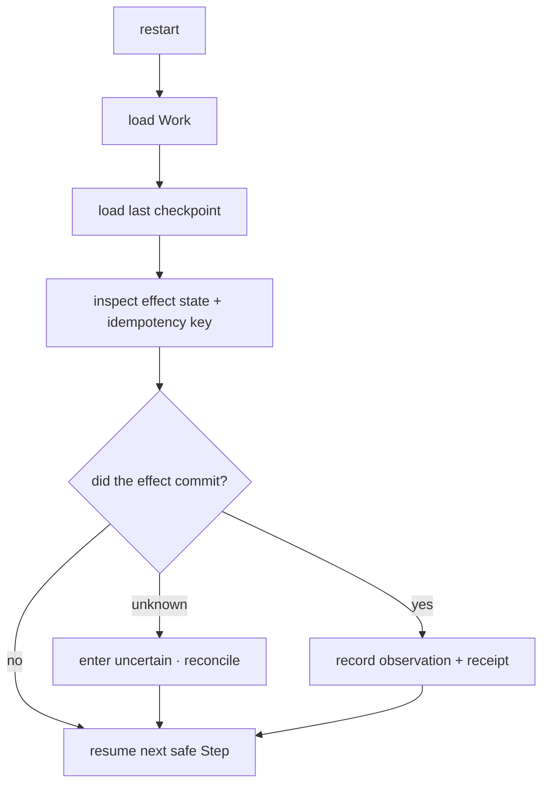

# ARCH/RECOVERY — durable Work, uncertain effects, safe resume

> **Status:** Subsystem contract, derived from [`CORE.md`](CORE.md) §5.2 and §6. Owns what happens after a
> crash, a kill, a disconnect or a lease loss. Invariants it must not weaken: **I6, I7, I15**.

---

## 1. Five inputs, and no others

| Input | Role |
|---|---|
| **Work** | the durable objective — the thing being recovered |
| **Checkpoint** | the last known-good resumable position |
| **Idempotency class** | whether an interrupted effect may be retried at all |
| **Event log** | what definitely happened |
| **Receipt** | what was proven to have happened |

> Fancy memory is not what makes a system recoverable. **Work + checkpoint + idempotency + event log +
> receipt** is. A system with brilliant recall and no durable Work loses the user's task.

---

## 2. Durable ordering

```
DURABLE INTENT → DURABLE ATTEMPT → EFFECT → OBSERVE → VERIFY → RECEIPT
```

The authoritative intent and attempt are written **before** an irreversible external effect. This ordering is
contractual, not an implementation preference — it is the only thing that makes post-crash classification
possible.

---

## 3. The uncertain state

```
ticket approved, attempt lost → uncertain
                            → never failed
                            → never succeeded
```

This is the single most important rule in this document. A crash between approval and execution leaves the
world in an unknown state, and the system must say so.

**Never fabricate completion.** A receipt that reports success for an effect whose outcome was never observed
is the worst possible defect: it is simultaneously a data-integrity bug and a lie to the user.

---

## 4. Recovery flow



Rules: **never blindly replay** a non-idempotent effect; inspect before continuing; classify unknown state as
unknown; resume the next safe Step; require reconciliation before any retry of something that may have
already happened.

---

## 5. Idempotency classes

The capability contract already declares an idempotency class per capability (see spec §4.3). Recovery
branches on it:

| Class | Recovery behaviour |
|---|---|
| `SafeRetry` | retry freely |
| `Idempotent` | retry freely |
| `SameKeyOnly` | retry only with the same key |
| `Unsafe` | never blindly retry |
| `UncertainRequiresReconciliation` | inspect/reconcile first; may require the user |

Exactly-once is **not guaranteed** for external effects (email, calendar, payment, HTTP). Where a provider
offers an idempotency key, use it; otherwise enter `uncertain` and reconcile. Claiming exactly-once would be
an honesty violation.

---

## 6. TOCTOU and lease fencing

- A file can change between check and use; a symlink or reparse point can swap mid-flight. Bind every ticket
  to the canonical path **plus file identity** (hash/inode) plus workspace/session/run, and re-check the
  precondition immediately before the write.
- A stale worker must not commit after its lease expired or was reassigned. Checkpoint and lease-finish
  operations reject a non-current fencing token.

Both are recovery concerns, not only concurrency concerns: they are what stop a resumed Work from writing
over someone else's newer state.

---

## 7. Checkpoints

A checkpoint records enough to resume without re-deriving: phase, completed steps, pending approvals,
artifacts and references, the in-flight effect (if any) with its idempotency key. Checkpoints are written at
phase transitions and before any irreversible effect — not on a timer, and never only at the end.

A Work that is `Recoverable` is presented to the user as resumable **with what is known and what is
unknown**, not with a confident summary that hides the ambiguous effect.

---

## 8. Invariants this document must not weaken

| Invariant | How |
|---|---|
| I6 — Work is the durable unit | §1; recovery is defined on Work, not on a UI session or a provider session |
| I7 — effects carry provenance and a receipt | §2's ordering; §3's refusal to fabricate |
| I15 — no false claims | §3, §5's exactly-once concession, §7's honest resume presentation |
| I5 — append-only evidence | recovery reads the log; it never rewrites it |

---

## 9. Migration notes

The durable kernel persistence, per-effect receipts and per-surface verification already exist and are the
foundation here. What this document adds is the **contract**: the ordering, the uncertain classification,
and the rule that recovery branches on the declared idempotency class rather than on optimism. Regression
coverage (crash at each phase, kill mid-effect, lease loss, append-only resume) is `P69.F9`.
