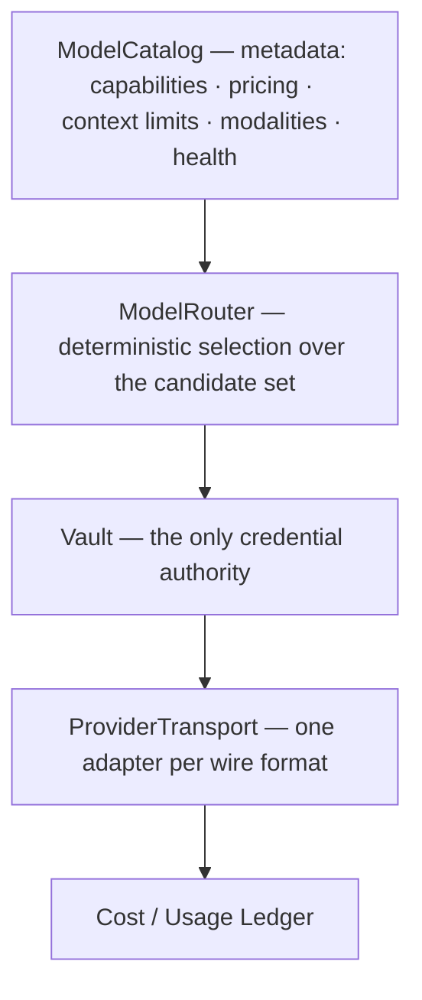

# ARCH/ROUTING — catalog, router, credentials, transport, ledger

> **Status:** Subsystem contract, derived from [`CORE.md`](CORE.md) §4 and §8. Owns model selection and
> provider access. Invariants it must not weaken: **I10, I21**.

---

## 1. The chain



Each link has exactly one responsibility. The router does **not** hold credentials; the transport does **not**
choose a model; the ledger does **not** route.

---

## 2. Capacity comes from the resolved route

```
provider + model → adapter.resolveModel() → authoritative context capacity
```

There is **no global context-window registry** (I21). A global table is a second source of truth that drifts
the moment a provider changes limits or a user configures a custom endpoint. See
[CONTEXT.md](CONTEXT.md) §9.

---

## 3. The v1 policy is deliberately boring

```
candidate filter:  capability (tools · vision · modality · context fit)
                 × health (recent observations, not assumptions)
                 × cost
                 × latency
                 → selection
```

> The router does **not** need to become a research project. A deterministic policy over four signals is
> sufficient for v1, and advanced routing can arrive later behind the same interface without an
> architecture change — which is the point of keeping the interface thin.

A provider-qualified selection is preserved end-to-end: the picker's provider **and** model id both reach the
broker. Unsupported transports **fail closed** rather than being guessed.

---

## 4. Credentials

[SECURITY.md](SECURITY.md) §5 owns the rule; the routing consequence is: the broker resolves a credential
**inside the vault boundary** and the sidecar receives frames, never key material (I10). Key-rings support
multiple keys per provider with an explicit failover taxonomy (§5 below). A keyless local runtime is a
first-class provider, not a special case.

---

## 5. Failover taxonomy — honest about what does and does not rotate

| Response | Meaning | Action |
|---|---|---|
| **429** | rate limited | mark failure, set cooldown (honour `Retry-After`, else backoff with a cap), retry with the next key; the priority key becomes eligible again after cooldown; bounded switches per call |
| **401 / 403** | credential rejected | suspend that key, tell the user, try the next key if one exists |
| **5xx** | provider trouble | **do not rotate keys** — this is not a key problem, and rotating hides an outage while burning other keys |

The 5xx distinction matters: a naive "rotate on any failure" policy converts a provider incident into the
exhaustion of every key the user owns.

---

## 6. Catalog and health

- The catalog is a **synced snapshot with a live refresh**: a vendored/bootstrap list plus periodic refresh;
  curated seed rows are labeled as fallback and **never presented as live capability**.
- Health is an **observation**, not an inference: a probe writes a durable observation, and every surface that
  makes a claim replays what a probe actually observed. A failed probe never verifies; a metadata-only probe
  confirms nothing hard; a report that confirmed nothing must not read as "fully verified".
- Probing a keyed provider resolves the credential from the vault, uses the provider's own model endpoint, and
  is **not a turn** — it must not move key health or budget.

---

## 7. Local models

A local runtime (Ollama, llama.cpp server, LM Studio attach, MLX, or a served GGUF) participates as a
**keyless provider** on the same list, with the same catalog/health semantics. Hardware fit is a routing
input computed from live host metrics — never a static stub — and a fit estimate is a recommendation, not a
promise.

---

## 8. Invariants this document must not weaken

| Invariant | How |
|---|---|
| I10 — credentials only in the vault | §4; the router never touches key material |
| I21 — route-derived capacity | §2 |
| I4 — one owner per state | §1's single responsibility per link; no routing logic in the UI, TS and Rust simultaneously |
| I15 — no false claims | §6's observation semantics; §5's refusal to rotate on 5xx |

---

## 9. Migration notes

Routing logic currently exists in more than one layer (provider metadata in TS, selection in Rust, picker UX
in the UI). Consolidating to this chain is `P69.D6` and `P69.A12`; the picker keeps its UX and loses any
pretence of being an authority.
