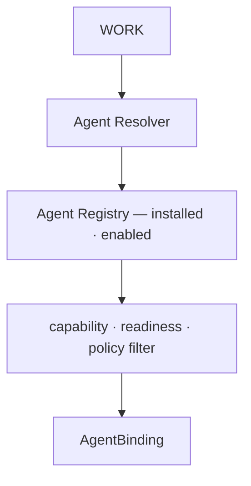

# ARCH/ROUTING — agent routing, credentials, and usage observability

> **Status:** Subsystem contract, derived from [`CORE.md`](CORE.md) §4 and §8. Owns **which external agent
> receives a Work**, plus credential and usage/cost **observability**. It no longer owns model selection or
> provider transport — see [`ADR/0005`](ADR/0005-external-agents-are-the-v1-engines.md).
> Invariants it must not weaken: **I4, I10, I15, I21, I23, I24**.

---

## 1. What "routing" means now

The question this document answers:

> **Which external agent should receive this Work?**

Not: *which LLM should EveryAIOS call?* The agent owns its provider, model, authentication, model switching
and provider fallback ([`AGENT.md`](AGENT.md) §1). EveryAIOS knows about them only as negotiated or reported
metadata.



---

## 2. Resolution inputs

| Input | Meaning |
|---|---|
| **capability match** | what the Work's Steps require vs the agent's negotiated manifest |
| **readiness** | installed · launchable · protocol-compatible · authenticated · negotiated · ready |
| **user policy** | fixed agent · inherit primary · primary chooses · resolver chooses |
| **delegation policy** | whether this agent is allowed as a worker — depth · concurrency · budget |
| **scope** | the Work's Session/Project scope and remaining budget |

The **primary agent chooses; EveryAIOS validates.** A delegation request that fails any check is **denied with
a reason** — never silently downgraded to a different agent, which would make the outcome unpredictable and
the audit trail wrong.

---

## 3. The v1 policy is deliberately boring

```
capability filter × readiness × user policy → selection
```

Deterministic, explainable, and thin enough that a better agent-selection strategy can arrive later behind the
same interface without an architecture change. Unready agents are not selected, and the UI states why.

---

## 4. Credentials — whose they are

| Credential | Owner | Store |
|---|---|---|
| EveryAIOS connector credentials (Gmail · GitHub · Calendar · Slack · Drive) | EveryAIOS | vault (**I10**) |
| EveryAIOS-managed API credentials | EveryAIOS | vault (**I10**) |
| Browser session vault | EveryAIOS | vault |
| Scoped capability secrets | EveryAIOS | vault, opaque handle |
| **External-agent credentials** (subscriptions · provider keys · OAuth) | **the agent** | the agent's own store |

EveryAIOS may **initiate or facilitate** an agent's authentication. It must **never** copy credentials out of
an agent's native store. The vault remains the single authority for what EveryAIOS owns; the rule is narrowed
from *"all provider keys"* to *"all keys EveryAIOS holds"* — which is what makes it true rather than
aspirational. See [`SECURITY.md`](SECURITY.md) §5 and ADR-0005 §6.

---

## 5. Usage and cost observability

Tokens and cost are **observations**, sourced from agent reports, ACP events, provider reports where those are
exposed, and EveryAIOS capability calls. Never invent precision an agent did not report (**I15**): where an
agent reports nothing, the surface says so rather than showing a plausible-looking number.

Cache-aware accounting survives unchanged in spirit: prompt-cache reads and writes are tracked per turn where
they are reported, and the ledger distinguishes what was observed from what was estimated.

---

## 6. Catalog and health — of agents, not models

- **Agent health is an observation, not an inference.** A probe writes a durable observation and every surface
  replays what a probe actually observed. A metadata-only probe confirms nothing hard.
- **Registry metadata is discovery input, never runtime truth.** The handshake wins
  ([`EXTERNAL-AGENTS.md`](EXTERNAL-AGENTS.md) §4).
- **Model metadata is reference data.** Catalogue, pricing, context limits and modalities are retained for
  display and for capacity estimation where a route reports it. It is not an execution authority, and the
  loss of a catalogue must never prevent a turn.

---

## 7. Capacity

Context capacity comes from the **resolved route** where the agent reports it (**I21**). Where an agent reports
nothing, EveryAIOS must not fabricate a window — it uses a conservative configured default and labels the
value as an assumption rather than a measurement.

---

## 8. Local models are not this document's business

A local runtime (Ollama · llama.cpp server · LM Studio attach · MLX · a served GGUF) is an **agent's provider
decision**, not an EveryAIOS routing concern. Discovery remains useful as **inventory**, so the user can point
an agent at what is installed — and it is reported as inventory, never as an EveryAIOS inference path.

---

## 9. Invariants this document must not weaken

| Invariant | How |
|---|---|
| I4 — one owner per state | §1–§3: agent selection has exactly one owner |
| I10 — credentials only in the vault | §4: narrowed to EveryAIOS-owned material, which is what makes it enforceable |
| I15 — no false claims | §5–§6: observations, never claims; §7's labelled assumption |
| I21 — route-derived capacity | §7 |
| I23 / I24 — agent is replaceable | §1: switching changes the AgentBinding only |

---

## 10. Migration notes

- **Reversed:** the previous chain (`ModelCatalog → ModelRouter → Vault → ProviderTransport → model execution`)
  is retired. It was correct while EveryAIOS had its own model path; that path is deferred to post-v1
  ([`ADR/0005`](ADR/0005-external-agents-are-the-v1-engines.md)).
- [`03-BYOK-KEYRINGS.md`](03-BYOK-KEYRINGS.md) is re-scoped to EveryAIOS-owned credentials and connector
  key-rings, not agent inference (`P71.6`).
- [`05-TOKEN-ECONOMY.md`](05-TOKEN-ECONOMY.md) keeps context engineering + usage ledger + cost observability
  and loses the "model gateway" framing (`P71.4`).
- Routing logic currently exists in more than one layer (provider metadata in TS, selection in Rust, picker UX
  in the UI). Consolidating to this chain is `P69.D6` / `P69.A12`; the picker keeps its UX and loses any
  pretence of being an authority.
