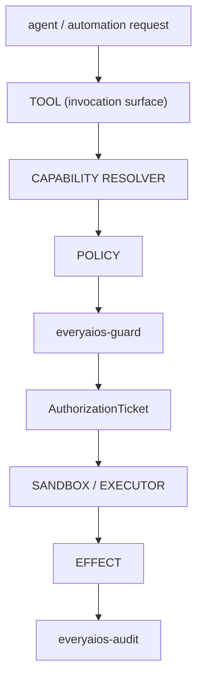

# ARCH/SECURITY — one gate, one authorization model

> **Status:** Subsystem contract, derived from [`CORE.md`](CORE.md) §6 and §7.5. Owns authorization,
> credentials and evidence. Invariants it must not weaken: **I7, I10, I11, I12, I13, I14, I15**.

---

## 1. There is one security gate



No module — connector, MCP adapter, ACP adapter, UI command, or agent adapter — may bypass this path. A
component that decides its own permissions has become a second security gate, which I12 forbids.

---

## 2. The authorization model is provenance, not a slogan

The obsolete phrasing "every mutation is ticketed" was never accurate. What the system enforces:

| Path | Provenance | Stamped by |
|---|---|---|
| Agent / automation mutation | `AuthorizationTicket` — single-use, argument-bound | Guard mints; the executor consumes |
| Human UI mutation | trusted user-gesture provenance (`human_gesture`) | Rust call sites only, from a native UI-event origin |

Every mutation audit row records `authorization: agent_ticket | automation_ticket | human_gesture`, set by
Rust call sites from a **typed** argument — never read from a serialized value built from UI or agent input.
Therefore **a machine cannot manufacture human authorization**, and every effect is attributable.

> The real principle is *authorization provenance on the effect*, not the existence of a ticket object.
> "ticket" is the implementation detail for the agent half.

---

## 3. Ticket lifecycle

```
mint (from risk + operation + read-only)
  → validate (unexpired, unused, correct chain)
  → bind   (matches the args-hash of exactly this effect)
  → consume (exactly once)
```

- **Single-use is structural, not advisory.** A consumed ticket cannot authorize a second effect.
- **Argument-bound:** a ticket authorizes exactly the effect it was minted for; changing arguments invalidates it.
- **Human cards are non-replayable:** extending a pending card re-mints its nonce so the previously displayed
  card dies immediately — stale-window and replay surfaces stay closed.
- **Approval scope is exact.** A batch approval covers an immutable change set, never a standing category — a
  user may not approve "reorganize my files" and have new mutations minted later under it.
- **Control-plane separation:** operations that only make sense before a decision (e.g. extending a pending
  card's TTL) are explicitly denied to the agent side and reachable only from the control plane.

---

## 4. `everyaios-guard` owns

policy · risk classification · capability authorization · path floors · network/SSRF floors · egress rules ·
injection protection · sandbox profile selection · approval policy · authorization tickets and their
consumption · policy snapshots · emergency stop.

**Removed competing authority** (each is a consolidation row in `P69.D`): the TypeScript permission gate,
the TypeScript trust ladder as an authority, the TypeScript engine's permission gate, UI-side approval
decisions, coordinator-side security decisions, connector-specific permission models, and ACP-specific
permission logic.

The **trust ladder remains** as a *policy input* — it raises convenience and never overrides a hard guard.
A policy input is not an authority.

---

## 5. Credentials: `everyaios-vault` and nothing else

> **Provider API keys live only in the vault (I10).**

- The vault owns custody, key-rings, 429-driven failover state, and credential selection.
- Streams are **brokered**: the sidecar receives frames, never key material.
- A TypeScript package that seals or unseals credentials **violates I10**. The confirmed defect
  (`packages/core-providers/src/vault.ts`, `P69.C4` — the most serious item in the thaw register) is
  **repaired in code (2026-09-21, implemented, not verified):** `ProviderVault` is a handle-only façade,
  custody is Rust-side (`vault_key_add` / `provider_probe`), and the CRED-1/2/3 checks in
  `scripts/check-arch-invariants.mjs` fail the build if a TS seal/unseal path reappears.
- Credential-shaped values must be refused in child-process environments; a confined child obtains
  credentials through the vault broker, never by inheritance.

---

## 6. `everyaios-audit` owns evidence

Receipts · the append-only event/evidence log · tamper-evident chaining · audit verification · retention and
roll-up. Append and sequence-resume are the only operations (I5). Retention may roll up old payloads to
digests while keeping the envelope, sequence and verifiability intact.

---

## 7. Sandbox is a mechanism, not the architecture

```
Guard decides policy → Sandbox enforces isolation → Executor performs the action
```

Sandboxing is not a substitute for authorization, and not every effect needs a heavyweight sandbox (I13).
Confusing "isolated" with "authorized" produces systems that are neither.

A confinement request **fails closed**: if the requested posture cannot be achieved, that is an error, never
a silent downgrade to ambient. Where a platform cannot confine, the posture reports what it actually
achieved — never a claim.

---

## 8. Floors

- **`pathfloor`** — path traversal, workspace boundaries, canonical-path and file-identity binding; the
  precondition is re-checked immediately before the write (TOCTOU).
- **`netfloor`** — SSRF and egress policy; loopback/link-local and `file://` are refused, and refusal does not
  escalate to a heavier engine in the hope it will succeed.
- Both are enforced **centrally**, never per-caller (I11).

---

## 9. What Guard does not control — stated, because pretending is the real failure

| Layer | Governed by |
|---|---|
| EveryAIOS capabilities | Guard, fully |
| External agent's hooks, where they exist | EveryAIOS policy delivered through the agent's own extension surface |
| **External agent's own tools and shell** | **the agent's own permissions + the outer OS/workspace sandbox** |
| Agent-internal reasoning | nobody — it is not ours |

The outer sandbox is the boundary for Layer 3. There is **no single choke point for every effect**, and any
document implying there is violates I14/I15. See [EXTERNAL-AGENTS.md](EXTERNAL-AGENTS.md) §5 for the
per-mode claims that are permitted.

---

## 10. Invariants this document must not weaken

| Invariant | How |
|---|---|
| I7 — every side effect is an Effect with provenance + receipt | §1, §2 |
| I10 — keys only in the vault | §5 |
| I11 — central floors | §8 |
| I12 — one authorization model | §1, §4 |
| I13 — sandbox is mechanism | §7 |
| I14 — authority does not leak across the seam | §9 |
| I15 — no false observability | §9's table is the honesty contract |

---

## 11. Migration notes

`P69.C1`–`P69.C4` are **repaired in code as of 2026-09-21 (implemented, not verified)**. This document
must still not be summarized anywhere as "every mediated effect is governed" until the repairs are
**verified**; the accurate statement at this moment is: *EveryAIOS capability effects are governed; the ACP
permission path and the mediated fs/terminal path are repaired in code but unverified (`P69.C1`/`C2`).*
