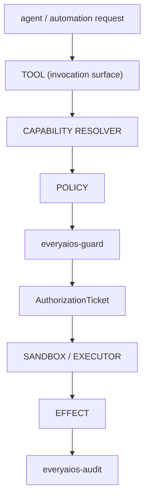

# ARCH/SECURITY — one gate, one authorization model

> **Status:** Subsystem contract, derived from [`CORE.md`](CORE.md) §6 and §7.5. Owns authorization,
> credentials and evidence. Invariants it must not weaken: **I7, I10, I11, I12, I13, I14, I15**.

---

## 1. There is one security gate



No module — connector, MCP adapter, ACP adapter, UI command, or agent adapter — may bypass this path. A
component that decides its own permissions has become a second security gate, which I12 forbids.

---

## 2. The authorization model is provenance, not a slogan

The obsolete phrasing "every mutation is ticketed" was never accurate. What the system enforces:

| Path | Provenance | Stamped by |
|---|---|---|
| Agent / automation mutation | `AuthorizationTicket` — single-use, argument-bound | Guard mints; the executor consumes |
| Human UI mutation | trusted user-gesture provenance (`human_gesture`) | Rust call sites only, from a native UI-event origin |

Every mutation audit row records `authorization: agent_ticket | automation_ticket | human_gesture`, set by
Rust call sites from a **typed** argument — never read from a serialized value built from UI or agent input.
Therefore **a machine cannot manufacture human authorization**, and every effect is attributable.

> The real principle is *authorization provenance on the effect*, not the existence of a ticket object.
> "ticket" is the implementation detail for the agent half.

---

## 3. Ticket lifecycle

```
mint (from risk + operation + read-only)
  → validate (unexpired, unused, correct chain)
  → bind   (matches the args-hash of exactly this effect)
  → consume (exactly once)
```

- **Single-use is structural, not advisory.** A consumed ticket cannot authorize a second effect.
- **Argument-bound:** a ticket authorizes exactly the effect it was minted for; changing arguments invalidates it.
- **Human cards are non-replayable:** extending a pending card re-mints its nonce so the previously displayed
  card dies immediately — stale-window and replay surfaces stay closed.
- **Approval scope is exact.** A batch approval covers an immutable change set, never a standing category — a
  user may not approve "reorganize my files" and have new mutations minted later under it.
- **Control-plane separation:** operations that only make sense before a decision (e.g. extending a pending
  card's TTL) are explicitly denied to the agent side and reachable only from the control plane.

---

## 4. `everyaios-guard` owns

policy · risk classification · capability authorization · path floors · network/SSRF floors · egress rules ·
injection protection · sandbox profile selection · approval policy · authorization tickets and their
consumption · policy snapshots · emergency stop.

**Removed competing authority** (each is a consolidation row in `P69.D`): the TypeScript permission gate,
the TypeScript trust ladder as an authority, the TypeScript engine's permission gate, UI-side approval
decisions, coordinator-side security decisions, connector-specific permission models, and ACP-specific
permission logic.

The **trust ladder remains** as a *policy input* — it raises convenience and never overrides a hard guard.
A policy input is not an authority.

---

## 5. Credentials: `everyaios-vault` and nothing else

> **Provider API keys live only in the vault (I10).**

- The vault owns custody, key-rings, 429-driven failover state, and credential selection.
- Streams are **brokered**: the sidecar receives frames, never key material.
- A TypeScript package that seals or unseals credentials **violates I10**. The confirmed defect
  (`packages/core-providers/src/vault.ts`, `P69.C4` — the most serious item in the thaw register) is
  **repaired in code (2026-09-21, implemented, not verified):** `ProviderVault` is a handle-only façade,
  custody is Rust-side (`vault_key_add` / `provider_probe`), and the CRED-1/2/3 checks in
  `scripts/check-arch-invariants.mjs` fail the build if a TS seal/unseal path reappears.
- Credential-shaped values must be refused in child-process environments; a confined child obtains
  credentials through the vault broker, never by inheritance.
- **GAP / D1 (P0, verified 2026-09-22) — known defect: a connector OAuth token is readable from the
  TS sidecar.** `fetchWorkerOAuthToken` is exported at
  `packages/core-connectors/src/connection-manager.ts:900`, re-exported from
  `packages/core-connectors/src/index.ts:24`, and compiled into `dist/` — a live **I10 custody
  violation** (connector OAuth token custody outside `everyaios-vault`). This document records the
  defect; it does not fix it. Implementation is queued in `../TODO.md` per
  `REPO-COMPARE/DISPOSITION.md` SEC-1 (P0 — retire the export, move custody fully into the vault,
  sequenced with the C4 wave). Until that row lands, §5's "and nothing else" claim carries this
  named exception — no other document may soften it to "keys only in the vault, mostly".

---

## 6. `everyaios-audit` owns evidence

Receipts · the append-only event/evidence log · tamper-evident chaining · audit verification · retention and
roll-up. Append and sequence-resume are the only operations (I5). Retention may roll up old payloads to
digests while keeping the envelope, sequence and verifiability intact.

---

## 7. Sandbox is a mechanism, not the architecture

```
Guard decides policy → Sandbox enforces isolation → Executor performs the action
```

Sandboxing is not a substitute for authorization, and not every effect needs a heavyweight sandbox (I13).
Confusing "isolated" with "authorized" produces systems that are neither.

A confinement request **fails closed**: if the requested posture cannot be achieved, that is an error, never
a silent downgrade to ambient. Where a platform cannot confine, the posture reports what it actually
achieved — never a claim.

---

## 8. Floors

- **`pathfloor`** — path traversal, workspace boundaries, canonical-path and file-identity binding; the
  precondition is re-checked immediately before the write (TOCTOU).
- **`netfloor`** — SSRF and egress policy; loopback/link-local and `file://` are refused, and refusal does not
  escalate to a heavier engine in the hope it will succeed.
- Both are enforced **centrally**, never per-caller (I11).

---

## 9. What Guard does not control — stated, because pretending is the real failure

| Layer | Governed by |
|---|---|
| EveryAIOS capabilities | Guard, fully |
| External agent's hooks, where they exist | EveryAIOS policy delivered through the agent's own extension surface |
| **External agent's own tools and shell** | **the agent's own permissions + the outer OS/workspace sandbox** |
| Agent-internal reasoning | nobody — it is not ours |

The outer sandbox is the boundary for Layer 3. There is **no single choke point for every effect**, and any
document implying there is violates I14/I15. See [EXTERNAL-AGENTS.md](EXTERNAL-AGENTS.md) §5 for the
per-mode claims that are permitted.

---

## 10. Invariants this document must not weaken

| Invariant | How |
|---|---|
| I7 — every side effect is an Effect with provenance + receipt | §1, §2 |
| I10 — keys only in the vault | §5 |
| I11 — central floors | §8 |
| I12 — one authorization model | §1, §4 |
| I13 — sandbox is mechanism | §7 |
| I14 — authority does not leak across the seam | §9 |
| I15 — no false observability | §9's table is the honesty contract |

---

## 11. Migration notes

`P69.C1`–`P69.C4` are **repaired in code as of 2026-09-21 (implemented, not verified)**. This document
must still not be summarized anywhere as "every mediated effect is governed" until the repairs are
**verified**; the accurate statement at this moment is: *EveryAIOS capability effects are governed; the ACP
permission path and the mediated fs/terminal path are repaired in code but unverified (`P69.C1`/`C2`).*

---

## 12. Repo-comparison additions (briefs 01–19)

Delta-analysis items whose primary home in this cluster is this document (the sibling items whose
target is `06-SECURITY-GUARDRAILS.md` live in that file's matching section; `SEC-27` landed in
[`CORE.md`](CORE.md) §4 per the root-authority rule). Each entry carries: ID · disposition ·
SOURCE · one-sentence LOGIC · target §. **SOURCE paths are under
`/home/sarvesh/business_Dev/REPO-COMPARE/` unless noted**; evidence is pattern-read (per each
repo's license), never vendored. Line-level cites are given only where re-measured in this pass.

- **SEC-15** [add] — short-lived, allowlist-scoped **connect-session tickets** (TTL + permitted
  connectors + tags) replacing ambient long-lived device credentials in every auth flow / agent tool
  call; tickets stay the sole effect authority inside I12. **SOURCE:** nango, ELv2 pattern-read —
  `clone2/nango` (brief 02 restoration note: distilled content, repo-level cite; line-level
  provenance pending re-clone). **LOGIC:** an expiring, scope-bound ticket converts a standing
  connector credential into single-mint auditable authority. **Target:** §3 (→ 15-CONNECT-STORE.md).
- **SEC-16** [add] — capability grants as `can × where` with an **issuable vs private-scope split**
  (wildcards never expand private scopes) + exhaustiveness tests. **SOURCE:** nango, ELv2
  pattern-read — `clone2/nango` (brief 02 restoration note, repo-level cite). **LOGIC:** selecting
  the scope explicitly *before* minting keeps tickets exact while making "where" testable instead of
  implied. **Target:** §4 (scope selection, additive to and preceding §3 minting).
- **CON-5** [add] — deploy-time **AST security scan** of user/agent-supplied connector/script bundles
  (Function-constructor gadgets, aliased bindings) as admission *before* script/sandbox execution.
  **SOURCE:** nango, ELv2 pattern-read — `clone2/nango` (brief 02 restoration note, repo-level
  cite). **LOGIC:** a static gate complements the sandbox (I13) — a bundle that should never run is
  rejected before isolation is asked to contain it. **Target:** §7 (+ everyaios-script admission).
- **CON-6** [add] — connection lifecycle hooks + per-provider **credential-verification probes**
  wired to Guard audit + an honest `invalid_credentials` reconnect state in the UI.
  **SOURCE:** nango, ELv2 pattern-read — `clone2/nango` (brief 02); credential/refresh flow at
  `clone2/nango/packages/shared/lib/services/connections/credentials/refresh.ts` (re-verified in
  brief 17). **LOGIC:** probing validity and surfacing `invalid_credentials` keeps reconnect state
  truthful (I15 class) instead of silently retrying dead credentials. **Target:** §6 (+ →
  15-CONNECT-STORE.md, → 12-UI-SPEC.md indicators).
- **SEC-35** [add] — approval rows with **expiry**, bounded-audience session keys, first-answer-wins
  resolution, corrupt-row denial. **SOURCE:** openclaw, MIT —
  `clone2/openclaw/src/gateway/operator-approval-store.kernel.ts` (`expiresAtMs` validation,
  re-measured) + `clone2/openclaw/packages/gateway-protocol/src/approvals-validators.test.ts`
  (brief 17 recheck). **LOGIC:** an approval that can neither expire nor race-answer is a standing
  authority — TTL + first-answer-wins close both windows. **Target:** §3 (batch approvals still
  cover immutable change sets only; exact scope + TTL are the guardrails).
- **SEC-36** [add] — background-process hygiene: output retention caps, completion wake, and a
  **per-command egress credential proxy revoked on exit**. **SOURCE:** openclaw, MIT —
  `clone2/openclaw/src/gateway/` (brief 04 rec 7; restoration note: line-level provenance pending).
  **LOGIC:** scoped credentials that die with the process bind egress authority to process lifetime.
  **Target:** §5/§8 (+ everyaios-core executor, Guard egress).
- **19-3** [add] — approval precedence chain `autoDeny → autoApprove → escalate → defaultAction →
  mode`, **fail-closed when non-interactive**, escalation payload resumable by the orchestrator.
  **SOURCE:** acpx, MIT — `clone3/agent-control/acpx/docs/permissions.md` (re-measured).
  **LOGIC:** a fixed chain with a fail-closed default removes ad-hoc allow paths from the adapter —
  the chain orders proposals, Guard answers. **Target:** §3 (pending card) (+ →
  06-SECURITY-GUARDRAILS.md).
- **19-15** [add] — permission-broker budgets: pending-count/byte caps, request + delivery +
  cancel-delivery timeouts, capability advertised `unsupported` when non-interactive.
  **SOURCE:** mosoo-agent-driver, Apache-2.0 —
  `clone3/agent-control/mosoo-agent-driver/src/core/driver-permission-broker.ts` (re-measured).
  **LOGIC:** bounded queues and delivery timeouts stop the permission bridge from becoming an
  unbounded stall/DoS surface, and report `unsupported` honestly when nobody can answer.
  **Target:** §3 (→ EXTERNAL-AGENTS.md §7).
- **SEC-19** [add] — column-class **egress policy** (`allow / redact / statistics-only / deny`,
  columns default closed) applied before artifacts reach connectors. **SOURCE:** genoffice,
  Apache-2.0 — `clone2/genoffice/apps/sheets/src/ai/privacy-policy.ts` (re-measured; brief 17).
  **LOGIC:** closed-by-default column classes bound artifact egress to declared fields, so bulk data
  cannot ride an export. **Target:** §5 (→ 15-CONNECT-STORE.md).
- **12-10** [add] — per-session **mount table + realpath symlink-escape validation** as the
  pathfloor contract shape, implemented in Rust. **SOURCE:** open-cowork, MIT —
  `clone2/open-cowork/src/main/sandbox/path-resolver.ts` + `clone2/open-cowork/src/main/sandbox/path-guard.ts`
  (re-measured). **LOGIC:** virtual→real mapping validated with realpath per session makes symlink
  escapes structurally impossible at the floor instead of regex-guarded. **Target:** §8 (floors).
- **05/SEC-6** [improve] — **policy-amending ticket decisions**: approve ⇒ persistent allow rule
  with exact scope + TTL (exec-policy amendment); batch approvals still cover immutable change sets
  only. **SOURCE:** codex, Apache-2.0 — `clone2/codex/codex-rs/core/src/mcp_tool_call.rs`
  (`ReviewDecision::ApprovedExecpolicyAmendment` family, re-measured file) +
  `clone2/codex/codex-rs/execpolicy/` (brief 17 recheck). **LOGIC:** only an explicit, scoped,
  expiring amendment may grow standing scope — an approval never silently widens its original
  batch. **Target:** §3.
- **19-4** [improve] — risk classification = deterministic pattern blocklist **first**, optional LLM
  assist second, helper failure/timeout ⇒ **require human** — policy *input* only, never a decider.
  **SOURCE:** ccmanager, MIT — `clone3/agent-control/ccmanager/src/services/autoApprovalVerifier.ts`
  (re-measured) + mosoo matched-ask-rule override (brief 19). **LOGIC:** deterministic-first
  classification fails to a human instead of to a model guess, preserving Guard as the only decider.
  **Target:** §4 (+ → 06-SECURITY-GUARDRAILS.md §6.2 policy-input family).
- **12-8** [improve] — renderer/UI-originated policy is **untrusted at the native boundary**:
  validate/coerce and fail closed to `ask` (never auto-allow). **SOURCE:** open-cowork, MIT —
  `clone2/open-cowork/src/main/config/permission-rules-store.ts` (re-measured; the header-comment
  rule itself). **LOGIC:** a compromised renderer must not be able to mint allow-rules — coercion to
  `ask` fails closed at the trust boundary. **Target:** §2/§4 (provenance + Guard policy).
- **19-12** [improve] — control-plane children get **explicit env maps**: strip host control
  payloads, inherit at most proxy keys, never ambient `os.Environ()`. **SOURCE:**
  mosoo-agent-driver, Apache-2.0 —
  `clone3/agent-control/mosoo-agent-driver/src/runtimes/child-process-env.ts` +
  `clone3/agent-control/mosoo-agent-driver/src/runtimes/acp/acp-configuration.ts` (re-measured);
  anti-pattern: agentapi `clone3/agent-control/agentapi/lib/termexec/termexec.go` (re-measured
  path). **LOGIC:** explicit env maps stop ambient credential/payload inheritance — the §5
  child-environment rule made concrete. **Target:** §5.
- **11-12** [improve] — authorization-class guards run at a **fixed protected position** (after
  pre-execute, before execute) with fail-closed one-shot approval ahead of them; advisory policy
  waterfalls may transform a call but never skip that position. **SOURCE:** deepseek-harness, MIT —
  `clone2/deepseek-harness/docs/tool-execution-pipeline.md` + `clone2/deepseek-harness/docs/subsystems/approval.md`
  (re-measured; absent/unanswerable ⇒ deny). **LOGIC:** a fixed position makes the one decider
  structurally unskippable while advisory hooks remain reorderable inputs. **Target:** §§1–4 (+ →
  06-SECURITY-GUARDRAILS.md §6.10).
- **SEC-12** [improve] — **per-hop redirect revalidation** on every guard-mediated fetch path
  (`context: 'redirect'` re-assert); a public URL that 302s to `169.254.169.254` must not bypass
  one-shot validation. **SOURCE:** nango (ELv2 pattern-read) + obscura (shared, brief 08) —
  `clone2/nango/packages/shared/lib/services/proxy/utils.ts` (re-measured file; brief 17 confirmed
  the redirect-hop block) + `clone2/obscura`. **LOGIC:** re-validating every hop closes the
  redirect-SSRF class one-shot URL validation cannot see. **Target:** §8.
- **10-7** [add] — hooks-metadata **fingerprint discipline** for generated configs: pair the payload
  (project instructions, MCP configs) with a sidecar fingerprint + CI drift check so a silent
  reorder/edit cannot swap identities. **SOURCE:** ECC, MIT — `clone2/ECC`
  `hooks/hooks.metadata.json` + `hooks/README.md` (ECC worktree de-indexed; content read via
  `git -C clone2/ECC show HEAD:<path>`, re-verified). **LOGIC:** fingerprinted sidecars turn config
  tamper/reorder into CI-visible drift instead of an invisible identity swap. **Target:** §4
  (protected surfaces) (+ scripts/ci).
- **14-10** [add] — **unknown-tool-defaults-unsafe** safety classification + trusted allowlist for
  the read-only fast path at the capability resolver. **SOURCE:** eigent —
  `clone2/eigent/backend/app/run_runtime/tool_checkpoint.py` (re-measured path). **LOGIC:** default
  -unsafe for unknown tools makes the fast path an allowlist, so a newly surfaced tool cannot ride
  trusted defaults. **Target:** §4 (→ CAPABILITIES.md §8 four-way state).

---

## 13. Not adopted (recorded)

Consolidated rejection register from the repo-comparison pass (delta analysis §6, item 4 and kin).
These stay rejected; the register exists so a future lane cannot re-derive them as "new ideas".

| Brief ID | Disposition | Not adopted | Evidence (pattern-read, under `REPO-COMPARE/`) | Why it stays rejected |
|---|---|---|---|---|
| **13-13** | [remove] | AccessGrant-style per-resource ACL — a **second permission universe** beside Guard | open-webui `clone2/open-webui/backend/open_webui/models/access_grants.py` (+ `models/functions.py`, re-measured) | one decider (I12); connectors/knowledge may not own permission models — group/public *sharing UI ideas* only, every grant routes through Guard-2 (15-CONNECT-STORE `P69.D17`) |
| **13-13** | [remove] | **In-process extension execution** — a non-ticketed effect path | open-webui `clone2/open-webui/backend/open_webui/models/functions.py` (re-measured) | sidecar proposes / Rust disposes; in-process extensions would skip mint → consume → audit |
| **16-20** | [remove] | Dual **plaintext key stores** (SQLite/IndexedDB), **unauthenticated localhost** HTTP API, **CORS `origin: '*'`** | workany (community license, pattern-read) `clone2/workany/src/shared/db/settings.ts` + `clone2/workany/src-api/src/app/middleware/cors.ts` + `clone2/workany/src-api/src/app/api/*` (re-measured) | I10 vault-only custody; guarded IPC, deny-by-default local control plane — single vault + guarded IPC only |
| **12-15** | [remove] | **Silent no-isolation fallbacks** ("native / no security isolation" default) and rootless file/exec routes | workany (pattern-read) `clone2/workany/src-api/src/extensions/sandbox/native.ts` (header: "No security isolation is provided", re-measured line 7) | evidence-gated readiness: an unachievable posture is an error, never a silent downgrade (§7 fail-closed) |
| **09-DeerFlow-10** | [remove] | **Fail-open authz defaults** (upstream now defaults `fail_closed=True` at config level — match or beat) | deerflow, MIT `clone2/deerflow/backend/app/gateway/authz.py` (`config.fail_closed` gates at `:247`, `:291`, re-measured) | authorization defaults fail closed; a helper failure must resolve to deny/human, never to allow |
| **19-1** | [remove] | **Unconditional-allow / Noop / blind-Enter approval paths** — never answer an agent permission request with them | agentapi `clone3/agent-control/agentapi/x/acpio/acpio.go` + `clone3/agent-control/agentapi/lib/termexec/termexec.go`; vibe-kanban `clone3/agent-control/vibe-kanban/crates/executors/src/approvals.rs` (+ `crates/executors/src/executors/claude/client.rs`); claude-squad `clone3/agent-control/claude-squad/session/tmux/tmux.go` (paths re-measured) | every agent permission answer routes through Guard (§1–§4); V1's `Approval::allow()` lesson is that this exact shape recurs |

**Orchestrator grep triage — `Approval::allow()` in `crates/` (verified by read, 2026-09-22):**
grepping the Rust workspace for `Approval::allow(` returns exactly **two** matches, both in
`crates/everyaios-acp/src/chief.rs`, and **both inside `#[cfg(test)] mod tests`** (attribute at
`chief.rs:686`, module opens `chief.rs:687` — re-measured by reading the file):

- **`chief.rs:789`** — `Box::new(|_req| Ok(Approval::allow()))`: a fixture closure passed to
  `DelegateChief::new` inside the test `delegate_chief_satisfies_the_trait_contract`. **Test code.**
- **`chief.rs:866`** — `Approval::allow()` in `struct AllowGate`: a test stand-in
  `impl PermissionGate` whose own doc comment says it exists for the request→decision→resume round
  trip, with the fail-closed default covered by the `DenyAllGate` tests. **Test code.**

Finding: **neither occurrence is production**, and no production `Approval::allow()` call site
remains in `crates/` under this pattern — the formerly production V1 site (`chief.rs:417`, recorded
as CORE §11.1 **V1**, repaired under `P69.C1`) no longer matches. This is consistent with
`scripts/check-arch-invariants.mjs` **DECIDE-2**, which scans only the production part of the ACP
source (everything before the in-file `#[cfg(test)]`) and is green. Honest bounds on this triage:
it covers the literal `Approval::allow(` shape in `crates/` only — other unconditional-allow
constructions (renamed constructors, `allow: true` literals, TS-side answer paths) are **not**
excluded by it. The defect row, if any is opened, remains `../TODO.md`'s to carry; this register
records the verified fact only.
