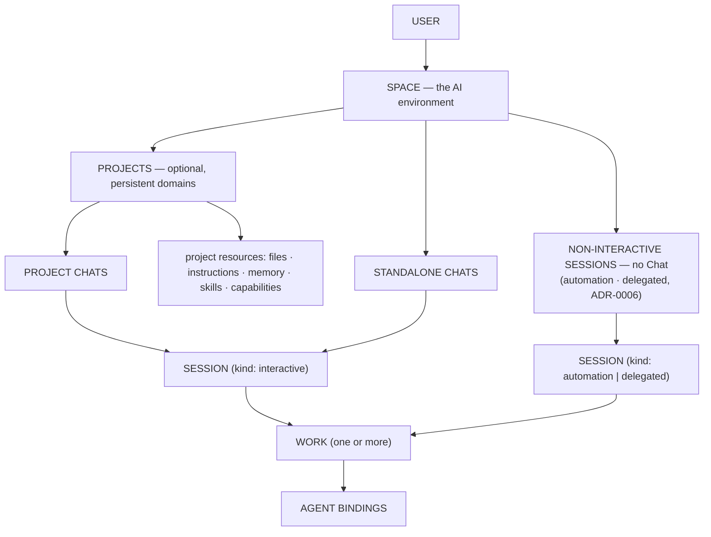

# ARCH/SESSION — Space, Project, Workspace, Chat, Work

> **Status:** Subsystem contract, derived from [`CORE.md`](CORE.md). It specializes CORE §3's primitives; it
does not restate them. Read CORE first — the invariants it must not weaken (I4, I6, I23, I24, I25) are
defined there.

---

## 1. The problem this document solves

The repo previously used **Session** as both a technical unit and a user-visible word, and left
"does a chat need a project?" unanswered. That produced three failure modes: users were asked to create a
container before they could talk; "session" meant different things in the UI and the API; and an
agent-facing session id could be confused with a provider's session id.

This document fixes all three with one rule:

> **The user creates Chats. EveryAIOS creates Sessions and Works. Projects are optional.**

---

## 2. Vocabulary

| Layer | Words | Used by |
|---|---|---|
| User-facing | **Space · Project · Chat** | UI, docs, support |
| Internal / API | **Session** (behind a Chat) · **Work** · **Run** · **Step** | kernel, IPC, storage |
| Agent-facing | `provider_session_id` — never an EveryAIOS id | AgentBinding only |

`Chat ↔ Session` is **1:1** *for interactive Sessions*. The user says "open my chat"; the runtime says "resume
session". Same object, two vocabularies. **Nothing user-visible may say "Session".**

**Sessions have a `kind`** — `interactive` · `automation` · `delegated` (`ADR/0006`). The kind is a property of
the Session, never inferred from whether a Chat exists:

| Kind | Has a Chat? | Created by | Surfaced through |
|---|---|---|---|
| `interactive` | **yes** (1:1) | the user (`+ New Chat`) | the Chat list |
| `automation` | **no** — and that is normal | a trigger firing (`WORK.md` §7) | the Automation screen's run list (`AUTOMATION.md` §11) |
| `delegated` | **no** | an explicit out-of-session delegation the user starts | the work/Activity timeline |

A Chat may be created **from** a non-interactive Session later (open a run, continue it). That is a
projection-side affordance, not a second Session: the Session gains a Chat and the 1:1 rule then applies
again. Ordinary child Work does **not** get its own Session — it lives in its parent's (I8).

---

## 3. Hierarchy



| Primitive | Meaning | Required? |
|---|---|---|
| **Space** | The user's environment: shared memory, preferences, skills, agent configuration, connectors, permissions, projects, chats. Answers "which AI environment am I in?" | exactly one active |
| **Project** | A persistent domain inside a Space (a repo, a thesis, a tax filing). Holds project instructions, files, memory, skills, knowledge, workspaces and its chats | **optional** |
| **Workspace** | The physical resources a Work may touch — paths and worktrees. Answers "where are the files?" | per Work |
| **Chat** | One conversation — the user's object | yes for `interactive` Sessions; **none** for `automation`/`delegated` (ADR-0006) |
| **Session** | Canonical context, events, artifacts, bindings. Behind a Chat when `interactive`; standalone when `automation`/`delegated` | **yes — every Work has one** |
| **Work** | The durable objective inside a Session (see CORE §5) | per objective |

> **Why Space exists at all:** "workspace" is already overloaded by every agent CLI (working directory).
> Giving the top-level container a distinct name keeps `Workspace` meaning exactly one thing — physical
> resources. A Session belongs to a Space; a Work *references* the Workspace(s) it may touch. Those are not
> the same kind of containment and must not be drawn as a single tree.

---

## 4. The optional-Project rule

```
Chat
├── project_id = null   → standalone chat
└── project_id = "…"    → project chat
```

- A standalone Chat is a first-class, permanent citizen — not a degraded state.
- `+ New Chat` must work with no Project, no Space setup and no configuration.
- A Chat created inside a Project inherits the Project's applicable context (instructions, memory, files,
  skills, capabilities) **without** losing its own conversational state.
- `Move to Project` and `Remove from Project` are supported and must not alter conversation history.
- Moving a project chat to a different Project requires an explicit user action, because project memory and
  scope would silently change meaning.

**Why it is stated as a rule:** the previous ambiguity invited an implementation where a nullable project was
an error path, producing a "project-scoped" code path and a "loose" code path — a second source of truth
for the same object, which I4 forbids.

---

## 5. Scope resolution

Memory and capability scopes resolve **outward**, most-specific first:

```
Work → Session → Project → Space → User
```

1. A narrower scope **filters** the broader one; it never silently widens it.
2. A fact written at Project scope does not become visible at Space scope except by explicit promotion.
3. Agent-private state is **beside** the hierarchy, never inside it, and is never promoted automatically.
4. A standalone Chat resolves at `Session → Space → User`. This is a normal resolution path, not a special
   case.
5. A **non-interactive** Session resolves the same way — `Work → Session → Space → User`, or through
   `Project` when the automation is project-scoped. **Same shape, no new rule** (`ADR-0006` §8).

---

## 6. Lifecycle

| Event | Effect |
|---|---|
| New Chat | create an `interactive` Session; create the first Work lazily on the first objective; bind the selected agent |
| Trigger fires (scheduler · event) | create an `automation` Session **with no Chat** and compile its Work (`WORK.md` §7, `AUTOMATION.md` §5) — never a hidden Chat |
| Open a run | attach a Chat to that existing non-interactive Session; the 1:1 rule then applies to it |
| Explicit out-of-session delegation | create a `delegated` Session (ordinary child Work does **not** — it stays in its parent's Session, I8) |
| Resume Chat | rehydrate Session **from the event log**, never from model memory; re-attach bindings |
| Switch agent | **must not** create a Session — see [AGENT.md](AGENT.md) and invariant I24 |
| Move to / from Project | update the association only; history, events and artifacts unchanged |
| Delete Chat | delete the Session and its projections; **retain** audit and receipts under the audit retention policy |

---

## 7. Work inside a Session

A Session may hold several Works (investigate → fix → deploy). Agent switching happens **inside** a Work; it
does not start a new one.

```
Session S123
├── Work W1  investigate
├── Work W2  implement      ← switching happens here
└── Work W3  deploy
```

Work is the durable unit (I6): it survives crashes, pauses, agent switches and UI disconnects. A Session is
the container that makes a Work reachable; it is **not** a second durability mechanism.

---

## 8. Invariants this document must not weaken

| Invariant | How this document respects it |
|---|---|
| I4 — one owner per state | Session owns canonical conversation context; the UI owns presentation state only |
| I6 — Work is durable | Session is context, Work is durability; neither duplicates the other |
| I23 — agents are replaceable | the agent is a binding on the Session, never its owner |
| I24 — switching changes the binding only | §6, "Switch agent" row |
| I25 — provider state is private and resumable | §2 vocabulary; provider ids never appear as Session ids |
| I8 — subagents are child Work | §2's kind table; child Work stays in its **parent's** Session, never a new one |
| I15 — no false claims | a non-interactive Session is surfaced through its owner (automation run list · Activity timeline), never as a fabricated Chat |

---

## 9. Migration notes

- Existing user-visible "Session" strings become "Chat" (tracked as `P69.A29`).
- **`SessionKind`** (`interactive` | `automation` | `delegated`) is a new durable field per `ADR-0006`; existing
  Sessions migrate to `interactive`, which preserves today's behaviour exactly. Canonical type + scope rule:
  `P71.8`.
- Existing records need a Space: the migration creates a default Space and adopts existing projects and
  chats into it; a chat with no project stays standalone (`project_id = null`).
- Nothing here authorizes a schema change by itself — the durable-store schema version bump and its
  migration are `P70.C5`.
