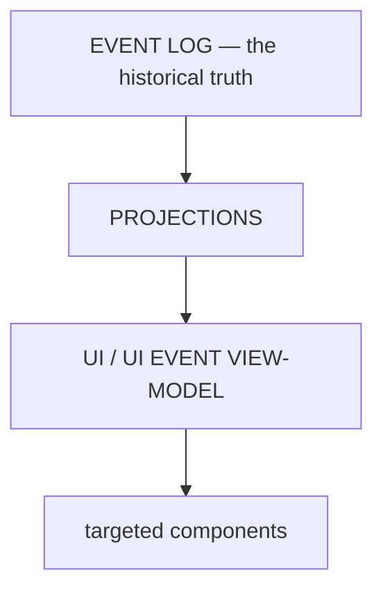

# ARCH/UI — the cockpit as a projection, and the File Workbench

> **Status:** Subsystem contract, derived from [`CORE.md`](CORE.md) §3 and §5. Owns what the shell may read,
> what it may never own, and how a human inspects a resource. Invariants it must not weaken:
> **I3, I4, I12, I15**. Interaction detail remains in `12-UI-SPEC.md`; this document is the boundary.
>
> **Projection/lease amendment (2026-09-24):** [`ADR/0008`](ADR/0008-session-workbench-projection-and-resource-leases.md)
> defines `SessionWorkbenchProjection` and `LensState` as non-authoritative per-Session UI projections. The
> shell may show typed resource references and safe lease status, but it never owns a physical resource,
> permission, bearer, or canonical execution state.

---

## 1. The UI is a projection



The UI does **not** subscribe directly to raw kernel, session, executor, provider or MCP internals. A small
**presentation-oriented event contract** sits between them, so a change in an internal event shape does not
ripple into components.

### 1.1 Chat Presentation Projection & Collapsible Sub-boxes Contract

The primary chat interface renders agent turns as a strictly ordered, clean chronological narrative. Raw CLI streams, ANSI sequences, tool execution chatter, and intermediate chain-of-thought blocks must never spill into unmanaged, sprawling chat transcripts.

```
┌─────────────────────────────────────────────────────────────┐
│ 1. [ 🧠 Reasoning Sub-box (Closed by default once settled) ▾]│
├─────────────────────────────────────────────────────────────┤
│ 2. [ 🔧 Grouped Tool Sub-box (Closed by default settled)  ▾]│
│    ┌──────────────────────────────────────────────────────┐ │
│    │ (Nested drawer: args, status, logs, spooled refs)    │ │
│    └──────────────────────────────────────────────────────┘ │
├─────────────────────────────────────────────────────────────┤
│ 3. 💬 Assistant Markdown & LaTeX Response Body               │
├─────────────────────────────────────────────────────────────┤
│ 4. 📄 Artifact Cards & Guard-2 Approval Cards               │
└─────────────────────────────────────────────────────────────┘
```

1. **Chronological Hierarchy & Auto-Collapse Lifecycle:**
   - **Reasoning (`<ReasoningSubbox />`):** Shows a live ticking stopwatch during streaming (`Thinking... 1.8s`). Upon turn completion/settlement, it immediately and unconditionally auto-collapses to a compact pill: `[ 🧠 Thought for 4.2s ▾ ]`. Clicking smoothly expands the sequenced thought steps without layout displacement.
   - **Tool Execution (`<ToolExecutionBox />`):** Single-tool actions render as `[ ✓ Read file.rs (120ms) ▾ ]`. Multi-tool sequences (2+ operations) group into a unified compact drawer: `[ 🔧 Executed N actions (Read, Terminal, Patch) · 1.8s ▾ ]`. Auto-collapses on completion to keep user focus on the final response. Expanding reveals itemized tool cards (risk level, execution latency, formatted parameters, stdout/diff results, inline retry affordances).
   - **Response Body:** Clean Markdown, KaTeX math blocks, and highlighted syntax code blocks.
   - **Artifact & Approval Cards:** Visual previews of generated/modified files (dockable into right-rail Drafting Table viewports) and Guard-2 interactive approval/diff prompts.

2. **CLI Terminal Stream Normalization:**
   - External CLI agents communicate over stdio emitting ANSI escapes, terminal clearing sequences, spinners, and raw stderr dumps.
   - The ACP adapter layer (`everyaios-acp`) normalizes raw stdout/stderr into typed `UIEventEnvelope` structures. Raw terminal output is strictly quarantined inside the collapsible tool execution drawer; the chat surface remains clean, semantic markdown.

3. **Large Payload Spooling & Zero CLS Bounding:**
   - Tool outputs exceeding 2,000 tokens are spooled to content-addressed disk storage (`retrieve_original(hash)`). A compact **Spooled Blob Card** renders in the drawer with summary statistics and an `[Inspect in Right Rail ↗]` action to open Monaco diff or data viewers.
   - Pre-allocated min-height bounding boxes and skeleton loaders prevent layout shift during high-frequency token streaming (maintaining CLS = 0).

4. **Context Passport & Specialist Attribution:**
   - An optional `<memory_passport>` inspector pill in the turn header allows auditing injected memory items, skills, and governance policies.
   - Delegated operations display explicit attribution badges (`@Codex CLI`, `@Claude Code`, `@Aider`, etc.) identifying the executing specialist agent.


---

## 2. What the UI may own — and may not

| Class | Owns | Examples |
|---|---|---|
| **Canonical** | **nothing** | — the UI owns no durable truth (I3, I4) |
| Projection | a rendered view of canonical state | work status, timeline, artifact list, agent activity |
| Cache | a local copy with a defined invalidation rule | fetched rows, viewer metadata |
| Ephemeral UI state | interaction state with no durability claim | selected pane, expanded rows, transient composer text before a draft is persisted, focus |
| Session input record | a durable pre-submit draft reference owned by the Session projection; it is not Work execution state | persisted composer draft and attachment metadata; submission creates a Work/Run queue item |

**Optimistic presentation** is permitted only where it is explicitly safe and visibly reconciled; it must
never assert a completed effect before the receipt exists.

Consolidation targets (`P69.D24`): duplicated Work truth, duplicated session truth, a second agent registry,
duplicated authorization/permission state, duplicated runtime lifecycle, and duplicated event history. Each is
a second source of truth and must be deleted, not synchronized.

---

## 3. Mutations only through the Work Gateway

Every durable change the user makes goes `UI → IPC → Work Gateway`, and an effect additionally passes Guard.
The shell is **not**: an alternate kernel, an alternate Work database, an alternate security engine, or an
alternate event log.

### 3.1 SessionWorkbenchProjection and LensState

The UI reads one **non-authoritative** `SessionWorkbenchProjection` per canonical `SessionId`, derived from the
`Session → Work → Run → AgentBinding` chain. It may hold per-session active/open lens order, typed
`ResourceRef` values, resource generations, safe lease attachments, drafts, queue/wait/review/receipt
references, and freshness (`fresh | rebuilding | stale | unavailable`). It must not hold physical handles,
bearer/token material, provider-private state, or a second copy of Work/Run/Guard state.

- **Session switch:** restore only the selected Session's own lenses, drafts, queues, and resource references.
  Never transfer the previous Session's active tab, lease, or physical resource implicitly.
- **Resource state:** a missing, stale, conflicting, or revoked resource is rendered as such; mutating controls
  are disabled until re-observation/reattachment. The UI never falls back to another Session's resource.
- **Interaction records:** drafts are pre-submit Session input; submitted prompts are Work/Run queue items;
  steering is an active-Run control; questions/reviews are Work/Run waits; approvals are Guard-owned; receipts
  are audit-owned. The projection displays and routes these; it does not decide or complete them.
- **Mutations:** opening a lens is a projection action; acquiring/releasing a resource lease and every effect
  go through the Work Gateway/ToolService/Guard path. Lease status is never treated as permission.
- **Privacy:** safe ids, generations, conflict classes, and availability may cross IPC; credentials, cookies,
  provider tokens, and lease bearers may not. See ADR-0008 §§1–4 and §6 for the full model and pending matrix.

---

## 4. The File Workbench

Inspect data should be a first-class subsystem, not another panel. The right side expands into a resizable
workbench:

```
Explorer  →  File tab  →  Viewer / Editor
```

The workbench is deliberately built on **one abstraction** rather than a type per format:

```
FileResource
├── uri · path · name · mime · extension
├── size · modified · content_type · encoding · permissions
```

There is no `MarkdownFile`, `PDFFile`, `RustFile` at the system level. There is a resource, and a registry of
viewers that can render it. Opening it adds a typed `ResourceRef` and a per-Session `LensState`; it does not
transfer physical ownership or acquire a lease merely because a tab was opened.

### 4.1 Viewer selection cascade

1. explicit user override
2. MIME type
3. extension
4. filename pattern (`README`, `Dockerfile`, `Makefile`, `.env`, `LICENSE`, `Cargo.toml`, `package.json`)
5. magic bytes
6. content sniffing
7. generic fallback

This is why all of the following must open correctly: an extensionless file, a known filename with no
extension, a mislabeled extension, and a file whose extension is simply unknown. A file with no extension
whose bytes are valid UTF-8 opens **as text** — that is the expected behaviour, not a special case.

### 4.2 Viewer families

| Family | Behaviour |
|---|---|
| **Text / code** | syntax highlighting, line numbers, folding, search, replace, diagnostics, diff, dirty state, undo/redo, save, large-file mode |
| **Markdown** | **Source \| Preview** as two tabs — the preview is not a separate file |
| **PDF** | page navigation, zoom, search, thumbnails, text selection, links |
| **Images** | zoom, fit, pan, background toggle, dimensions |
| **Office** | DOCX document preview · XLSX grid · PPTX slides · PDF — served by the existing office engines, **not** a UI-specific parser |
| **Data** | JSON/JSONL/CSV/TSV/XML/YAML/TOML/SQL/logs with Raw · Tree · Table · Preview switching |
| **Archive** | read-only browsing without extraction; opening a member uses the same workbench |
| **Media** | play/pause/seek/volume/fullscreen, with transcript/metadata when available |
| **Unknown binary** | never "cannot open": type, size, **preview as hex**, **preview as text**, open with system, save |
| **Large files** | range reads over virtualized chunks — never read a multi-GB file into a string |

> **Two rules worth stating explicitly.** (1) Office rendering reuses the real engine — one implementation,
> several UI renderers (the existing \"two façades, one implementation\" rule). (2) The viewer set is
> **contributed by capability packs** ([CAPABILITIES.md](CAPABILITIES.md) §9), so adding a format is adding a
> pack, not editing the workbench.

### 4.3 Large files and honesty

Range reads, streaming and virtualized views keep the workbench usable on files larger than memory. When
content is truncated or sampled, the viewer says so — a silently partial table is a false claim (I15).

---

## 5. Vocabulary the cockpit must use

The user-facing container word is **Chat**, not Session ([SESSION.md](SESSION.md)). The cockpit may show a
Work timeline and a plan; it must not expose `Run`, `Step`, `Effect`, `AgentBinding` or `Event` as concepts to
a casual user. Power surfaces may, but only labelled as such.

---

## 6. Why the UI feels fast — the mechanism, not the polish

```
durable event → incremental projection → small snapshot update → targeted component
```

**Not:** `React asks the backend for the entire current state, repeatedly, and rebuilds everything.`

The chat surface is a set of **keyed nodes** (message · tool-call · tool-result · artifact · approval ·
work-status). A tool result updates one node; it does not re-render a 5,000-message conversation or re-parse
every markdown block. Bounded history windows, lazy mounting of heavy viewers and a small view-model are the
mechanism behind the perceived speed — they are architectural, not cosmetic.

---

## 7. Invariants this document must not weaken

| Invariant | How |
|---|---|
| I3 — one historical truth | §1; the UI renders projections, never its own history |
| I4 — one owner per state | §2's table; §2's consolidation targets; §3.1's projection is derived and per-Session |
| I12 — one authorization model | §3; the UI never decides allow/deny |
| I15 — no false claims | §2's optimistic rule; §4.3's truncation disclosure; no "completed" before a receipt |
| I16 — prefix stability | §6's keyed incremental rendering keeps the *view* stable without touching provider context |

---

## 8. Migration notes

The workbench is new (`P69.B8`); the existing rail/view infrastructure is the starting point, and the
browser/office/file viewers already exist in some form. The rule that changes behaviour is §4.1's cascade —
which is what makes "all file types open" true rather than aspirational. Consolidating the UI store into the
four classes in §2 is `P69.D24` and is a prerequisite for the timeline rebuild in `P69.F7`.

---

## Repo-comparison additions (briefs 01–19)

> Delta group: *"ARCH/12-UI-SPEC.md + ARCH/UI.md + ARCH/SESSION.md"* (`REPO-COMPARE/DELTA-ANALYSIS.md` §3).
> Evidence paths are repo-relative under `/home/sarvesh/business_Dev/REPO-COMPARE/clone2/`. Dispositions are
> the briefs' tags; arrows into files not owned here carry `→ <file> §…` and are cross-domain deferred.

- **12-1** · `add` — SOURCE: openwork (MIT) · evidence: `openwork/docs/features/headless-session-control.md` (`session.send {sessionId, text, workspaceId?, reveal?}` with ownership check equal to `session.read`; navigation only via explicit `reveal: true` or a separate `session.open`; honest `effects.ui` metadata) — LOGIC: control actions are addressed by id and headless-by-default — surfacing the UI is an explicit `reveal` opt-in and every registered control action carries truthful `effects` metadata declared by the kernel, never asserted by the renderer — which keeps this document's projection and gateway rules enforceable per action rather than by convention (the single-registry half is already proven by `ipc-parity.mjs`). → target §2 (what the UI may own: by-id control handles + declared effects are projection, not authority) + §3 (mutations only through the Work Gateway: `reveal` and `effects` are kernel-authored; the shell never decides what a control will do).
- **A5** · documented **ANTI-pattern — never adopt** · SOURCE: ChatGPT (lencx) — **no license file** (all-rights-reserved; pattern-read as what-not-to-build only) · evidence: `ChatGPT/src-tauri/scripts/ask.js` (DOM-scraping injection into the remote chatgpt.com webview: native-setter textarea writes, synthetic `InputEvent`s, form-button `submit()`), `ChatGPT/src-tauri/src/core/cmd.rs` (`format!("ChatAsk.sync({})", message)` string-built eval), `ChatGPT/src-tauri/src/core/setup.rs` + `tauri.conf.json` (`csp: null` multi-webview shell) — LOGIC: recorded strictly as anti-patterns — the chat/agent plane stays natively owned and external-site interaction goes through the Browse/browser capability, never DOM-scraping eval-injection; `format!`-built eval strings are rejected in favor of structured JSON IPC (`nativeCall`), the shape §2–§3 already require. → target §2–§3 (anti-pattern register: chat-plane custody + IPC shape); AGENT.md §1 cross-ref (primary owned by the agent lane — cross-domain deferred).

---

## 9. Drafting Table In-Pane Search Grammar & Viewport Controls

The right-rail Drafting Table provides unified, keyboard-first in-pane discovery across all 19 viewports:
- **Search Prefix Grammar:**
  - `/file:<pattern>`: Filters workspace explorer and file tabs by glob.
  - `/symbol:<name>` or `@<name>`: Jumps to AST definitions in code/diff viewports via `everyaios-codeintel`.
  - `/line:<num>` or `:<num>`: Direct jump to line offset.
  - `#<heading>`: Document outline navigation in DOCX, Markdown, and PDF viewports.
  - `$<range>` (e.g. `$A1:D50`): Cell range selection and formula inspection in XLSX viewports.
- **Escape Hatch & Keyboard Priority:** `Escape` clears active search highlights before unfocusing; `Cmd/Ctrl+F` attaches search context directly to the active viewport rather than the global application frame.

## 10. Physical Spring Motion & Semantic Cool-Blue Theming Tokens

To achieve top-tier visual craft (Linear / Apple standard):
- **Physical Spring Damping:** All sidebar collapsing, modal reveals, and viewport expansions use Framer Motion damped springs (`{ type: "spring", mass: 1.0, stiffness: 280, damping: 28 }`), ensuring zero cumulative layout shift (`CLS = 0`).
- **Semantic Color Tokens:** Accent colors are fully tokenized semantic variables:
  - `accent-primary`: Default Cool Blue (`#2563eb` light / `#3b82f6` dark)
  - `accent-muted`: `#93c5fd` / `#1e3a8a`
  - User-selectable themes (Cool Blue, Slate, Emerald, Violet, Indigo) dynamically bind semantic tokens without hardcoded hex values.
- **Tabular Numerical Telemetry:** JetBrains Mono tabular figures (`font-variant-numeric: tabular-nums`) format all token counts, latency metrics, line numbers, and financial spend readouts to prevent horizontal jitter during real-time streaming.
- **WCAG 2.2 Accessibility:** Focus outlines (`ring-2 ring-accent-primary`), ARIA labels, and keyboard tab sequences are strictly validated across all 12 center screens and 19 right-rail viewports.
