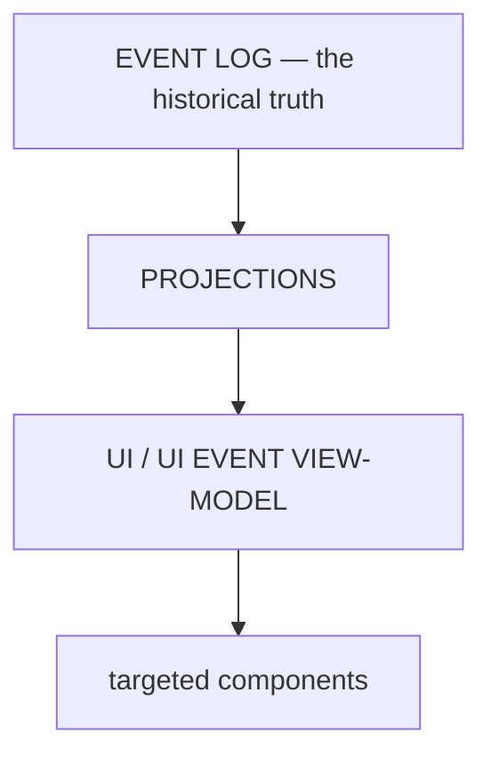

# ARCH/UI — the cockpit as a projection, and the File Workbench

> **Status:** Subsystem contract, derived from [`CORE.md`](CORE.md) §3 and §5. Owns what the shell may read,
> what it may never own, and how a human inspects a resource. Invariants it must not weaken:
> **I3, I4, I12, I15**. Interaction detail remains in `12-UI-SPEC.md`; this document is the boundary.

---

## 1. The UI is a projection



The UI does **not** subscribe directly to raw kernel, session, executor, provider or MCP internals. A small
**presentation-oriented event contract** sits between them, so a change in an internal event shape does not
ripple into components.

---

## 2. What the UI may own — and may not

| Class | Owns | Examples |
|---|---|---|
| **Canonical** | **nothing** | — the UI owns no durable truth (I3, I4) |
| Projection | a rendered view of canonical state | work status, timeline, artifact list, agent activity |
| Cache | a local copy with a defined invalidation rule | fetched rows, viewer metadata |
| Ephemeral UI state | interaction state with no durability claim | selected pane, open tabs, expanded rows, composer text, focus |

**Optimistic presentation** is permitted only where it is explicitly safe and visibly reconciled; it must
never assert a completed effect before the receipt exists.

Consolidation targets (`P69.D24`): duplicated Work truth, duplicated session truth, a second agent registry,
duplicated authorization/permission state, duplicated runtime lifecycle, and duplicated event history. Each is
a second source of truth and must be deleted, not synchronized.

---

## 3. Mutations only through the Work Gateway

Every durable change the user makes goes `UI → IPC → Work Gateway`, and an effect additionally passes Guard.
The shell is **not**: an alternate kernel, an alternate Work database, an alternate security engine, or an
alternate event log.

---

## 4. The File Workbench

Inspect data should be a first-class subsystem, not another panel. The right side expands into a resizable
workbench:

```
Explorer  →  File tab  →  Viewer / Editor
```

The workbench is deliberately built on **one abstraction** rather than a type per format:

```
FileResource
├── uri · path · name · mime · extension
├── size · modified · content_type · encoding · permissions
```

There is no `MarkdownFile`, `PDFFile`, `RustFile` at the system level. There is a resource, and a registry of
viewers that can render it.

### 4.1 Viewer selection cascade

1. explicit user override
2. MIME type
3. extension
4. filename pattern (`README`, `Dockerfile`, `Makefile`, `.env`, `LICENSE`, `Cargo.toml`, `package.json`)
5. magic bytes
6. content sniffing
7. generic fallback

This is why all of the following must open correctly: an extensionless file, a known filename with no
extension, a mislabeled extension, and a file whose extension is simply unknown. A file with no extension
whose bytes are valid UTF-8 opens **as text** — that is the expected behaviour, not a special case.

### 4.2 Viewer families

| Family | Behaviour |
|---|---|
| **Text / code** | syntax highlighting, line numbers, folding, search, replace, diagnostics, diff, dirty state, undo/redo, save, large-file mode |
| **Markdown** | **Source \| Preview** as two tabs — the preview is not a separate file |
| **PDF** | page navigation, zoom, search, thumbnails, text selection, links |
| **Images** | zoom, fit, pan, background toggle, dimensions |
| **Office** | DOCX document preview · XLSX grid · PPTX slides · PDF — served by the existing office engines, **not** a UI-specific parser |
| **Data** | JSON/JSONL/CSV/TSV/XML/YAML/TOML/SQL/logs with Raw · Tree · Table · Preview switching |
| **Archive** | read-only browsing without extraction; opening a member uses the same workbench |
| **Media** | play/pause/seek/volume/fullscreen, with transcript/metadata when available |
| **Unknown binary** | never "cannot open": type, size, **preview as hex**, **preview as text**, open with system, save |
| **Large files** | range reads over virtualized chunks — never read a multi-GB file into a string |

> **Two rules worth stating explicitly.** (1) Office rendering reuses the real engine — one implementation,
> several UI renderers (the existing \"two façades, one implementation\" rule). (2) The viewer set is
> **contributed by capability packs** ([CAPABILITIES.md](CAPABILITIES.md) §9), so adding a format is adding a
> pack, not editing the workbench.

### 4.3 Large files and honesty

Range reads, streaming and virtualized views keep the workbench usable on files larger than memory. When
content is truncated or sampled, the viewer says so — a silently partial table is a false claim (I15).

---

## 5. Vocabulary the cockpit must use

The user-facing container word is **Chat**, not Session ([SESSION.md](SESSION.md)). The cockpit may show a
Work timeline and a plan; it must not expose `Run`, `Step`, `Effect`, `AgentBinding` or `Event` as concepts to
a casual user. Power surfaces may, but only labelled as such.

---

## 6. Why the UI feels fast — the mechanism, not the polish

```
durable event → incremental projection → small snapshot update → targeted component
```

**Not:** `React asks the backend for the entire current state, repeatedly, and rebuilds everything.`

The chat surface is a set of **keyed nodes** (message · tool-call · tool-result · artifact · approval ·
work-status). A tool result updates one node; it does not re-render a 5,000-message conversation or re-parse
every markdown block. Bounded history windows, lazy mounting of heavy viewers and a small view-model are the
mechanism behind the perceived speed — they are architectural, not cosmetic.

---

## 7. Invariants this document must not weaken

| Invariant | How |
|---|---|
| I3 — one historical truth | §1; the UI renders projections, never its own history |
| I4 — one owner per state | §2's table; §2's consolidation targets |
| I12 — one authorization model | §3; the UI never decides allow/deny |
| I15 — no false claims | §2's optimistic rule; §4.3's truncation disclosure; no "completed" before a receipt |
| I16 — prefix stability | §6's keyed incremental rendering keeps the *view* stable without touching provider context |

---

## 8. Migration notes

The workbench is new (`P69.B8`); the existing rail/view infrastructure is the starting point, and the
browser/office/file viewers already exist in some form. The rule that changes behaviour is §4.1's cascade —
which is what makes "all file types open" true rather than aspirational. Consolidating the UI store into the
four classes in §2 is `P69.D24` and is a prerequisite for the timeline rebuild in `P69.F7`.
