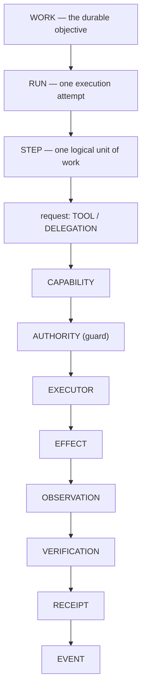

# ARCH/WORK — Work, Run, Step, Effect, Event and the projection rule

> **Status:** Subsystem contract, derived from [`CORE.md`](CORE.md) §3 and §5. Owns the execution primitives,
the canonical event vocabulary, and the rule that every read surface is a projection. Invariants it must not
weaken: **I3, I4, I6, I7, I9**.
>
> **Projection/lease amendment (2026-09-24):** [`ADR/0008`](ADR/0008-session-workbench-projection-and-resource-leases.md)
> makes Work/Run/Event/Receipt the sole truth spine and derives the non-authoritative
> `SessionWorkbenchProjection` from it. Work/Run own resource lease attachments and fencing; Workbench
> references never become execution, permission, or recovery authorities.

---

## 1. The law

> **Work is the durable unit of execution.** It survives crashes, pauses, agent switches, node changes and UI
disconnects. It is not the AI's working memory — it *is* the work.

That single sentence is why the system can say "the AI forgot, but the work did not". Everything else in
this document exists to keep it true.

---

## 2. The chain



| Primitive | Meaning | Notes |
|---|---|---|
| **Work** | durable objective | the only thing that must survive a restart |
| **Run** | one attempt | a Work may have many; a failed Run is not a failed Work |
| **Step** | one logical unit | **not** necessarily one tool call |
| **Effect** | a requested change to the world | the model requests; the executor performs |
| **Observation** | what actually happened | never assumed |
| **Verification** | whether it achieved the goal | may honestly be *unverifiable* |
| **Receipt** | evidence | the artifact that makes a claim checkable |
| **Event** | historical truth | append-only |

> **A Step is not a tool call.** Conflating them makes planning impossible to express and forces the UI to
> render implementation detail. One Step may be "make the tests pass" and involve forty tool calls.

---

## 3. Contract objects

| Object | What it is |
|---|---|
| `EffectRequest` | a proposed effect: operation, target/resource identity, args hash, risk, idempotency class. Produced by a capability, a connector action, or a tool request |
| `CapabilityRequest` | a request to *use* a capability before it becomes an effect request — carries the capability id, resolved scope and required authority |
| `AuthorizationTicket` | single-use, argument-bound authorization for exactly one `EffectRequest` (see [SECURITY.md](SECURITY.md) §3) |
| `WorkReceipt` / per-effect receipt | the evidence chain: requested vs authorized, resource, before/after refs, diff, rollback ref, gap/uncertainty |

Canonical ids (owned by the shared types crate): `SpaceId` · `ProjectId` · `WorkspaceId` · `SessionId` ·
`WorkId` · `RunId` · `StepId` · `EffectId` · `EventId` · `AgentBindingId` · `ReceiptId`.

---

## 4. State

`Work` state is **event-derived**, not a mutable blob the system trusts:

```
Created → Planning → Ready → Running { WaitingTool · WaitingApproval · WaitingUser · Checkpointed }
        → Verifying → Completed | Failed | Cancelled | Paused | Recoverable
```

`Recoverable` is a first-class outcome, not a failure: the system knows it was interrupted and knows whether
the in-flight effect committed, was lost, or is unknown (see [RECOVERY.md](RECOVERY.md) §3).

---

## 5. The canonical event vocabulary

The event log is the historical truth, so the vocabulary is a contract — not an open string field. At
minimum:

| Group | Events |
|---|---|
| Work | `WorkCreated` · `WorkStarted` · `WorkPaused` · `WorkResumed` · `WorkCompleted` · `WorkFailed` · `WorkCancelled` |
| Run | `RunStarted` · `RunCompleted` · `RunFailed` · `RunPaused` · `RunResumed` |
| Step | `StepStarted` · `StepCompleted` · `StepFailed` |
| Request / authority | `ToolRequested` · `ApprovalRequested` · `ApprovalDecided` · `TicketMinted` · `TicketConsumed` |
| Effect | `EffectAttempted` · `EffectObserved` · `EffectVerified` · `EffectFailed` · `EffectUncertain` |
| Output | `ArtifactCreated` · `ReceiptCreated` |
| Binding | `AgentBindingCreated` · `AgentBindingActivated` · `AgentBindingSuspended` · `AgentBindingResumed` |

Rules:

- Events are **append-only**; nothing rewrites them (I3, I5).
- Every event carries `sequence` (total persistence order) and `causal_parent` (the happens-before edge).
  Unrelated concurrent events may interleave in any order — `causal_parent` is what defines ordering, not timestamps.
- Events are **versioned**; an envelope carries its schema version so a replay of old events stays valid.
- Not every event is semantic: presence and telemetry replay as UI state and must **never** create false
  semantic edges in memory or graph reconstruction (I4).

---

## 6. Everything else is a projection

> **UI, memory, analytics, audit view and recovery state are all projections of the event log.** None of them
> is an independent truth, and none may be written to directly.

| Projection | Derived from |
|---|---|
| UI timeline · Work status · session state | events |
| memory extraction (candidates) | events, after the turn |
| analytics · token/cost dashboard | events + the cost ledger |
| artifact list · agent activity | events |
| audit view | events + receipts (evidence) |
| recovery state | events + checkpoints |

Two consequences that are easy to violate:

1. A "session state" store that the UI *writes* is a second source of truth (I4). The UI projects; the
   kernel owns.
2. A read model that cannot be rebuilt from events is either derived state with a documented cache rule, or
   a bug. There is no third option.

### 6.1 Workbench references and interaction semantics

[`ADR/0008`](ADR/0008-session-workbench-projection-and-resource-leases.md) derives the cockpit's
`SessionWorkbenchProjection` from the existing `Session → Work → Run → AgentBinding` chain. It changes none
of the truth owners in §2, §4, or §5:

- Work owns its durable objective and the queue of accepted user prompts.
- Run owns one execution attempt, its waits, in-flight effect, and active resource-lease/fence state.
- Event/Receipt/Audit own historical truth and evidence. A Workbench reference is only a typed pointer to
  those records, never a replacement event log, receipt, or retry state machine.
- Session/UI may retain a logical projection, lens state, and pre-submit draft reference. A draft is not a
  prompt until submitted; submission creates a durable Work/Run queue item before dispatch.

The input vocabulary is intentionally distinct:

| Surface record | Owner | Semantics |
|---|---|---|
| **Prompt queue** | Work/Run | Ordered durable user intents accepted for that Work/Run; cancellable and replayable. It is not an in-memory UI list. |
| **Steering** | Active Run coordination | A bounded control such as pause, redirect, narrow scope, or interrupt. It is not a queued prompt and never silently becomes a new Work. A stale target reports `not_applied` or raises a question. |
| **Review** | Work/Run | A request to inspect a plan, diff, or pending effect. It grants no authority and is separate from approval. |
| **Question / user input** | Work/Run wait | A question is bound to the exact Work/Run and resource generation; its answer is an event on that chain. |
| **Approval** | Guard, linked to the effect | The native human/automation decision for one exact authorization ticket. UI rendering never decides it. |
| **Receipt** | Audit/Work receipt chain | Evidence of observation/verification. The projection can display a reference and uncertainty, never manufacture success. |

A Session's lens may point at any of these records, but switching lenses or Sessions cannot change their
owner. Deleting a Session detaches the projection and its draft/lens state; surviving Work/Run queues, events,
receipts, and leases remain addressable and recoverable. The complete contention, generation, crash, and
secret-custody matrix is normative in ADR-0008 §6 and remains pending implementation/qualification.

---

## 7. One path — every trigger produces Work

| Trigger | What it actually does |
|---|---|
| Chat | creates Work |
| Scheduler | creates Work (it owns **no** execution engine, memory, tools, state machine or event log) |
| Workflow / automation | a Blueprint plus deterministic execution → creates Work |
| Subagent | creates a **child Work** |
| External agent (ACP) | acts inside the Work it is bound to |
| MultiRun | a **strategy** that launches several Runs of the same Work and fuses the results |

This table is the enforcement of the reduction rule: *if it can be expressed as Work + Step + Capability +
Effect, it does not get a runtime.*

---

## 8. Subagents are child Work

```
Parent Work
├── Child Work A
├── Child Work B
└── Child Work C
```

Each child gets its own Work and Run, a scoped agent definition, scoped tools, a **permission intersection**
(never a superset of the parent), an isolated workspace/worktree where needed, its own budget, and bounded
depth and concurrency. It returns **summary + findings + artifacts — not its transcript**.

The child receives a `ContextCapsule` (provenance) and, when needed, a `ContextPassport` (semantic state) —
see [CONTEXT.md](CONTEXT.md) §8. Copying the parent's whole context into the child is the anti-pattern: it
makes delegation expensive and cache-hostile.

---

## 9. Blueprint is declarative, never a runtime

| Blueprint owns | Execution owns |
|---|---|
| Plan · Task · dependencies · checkpoints · acceptance conditions · task specification · serialization · validation · cycle detection | Work · Run · Step · Effect · Receipt · Event |

`Blueprint → Work → Run → Step → Effect`. A blueprint that executes, schedules, retries, or owns its own
progress state has become a runtime and must be rejected in review.

---

## 10. Invariants this document must not weaken

| Invariant | How |
|---|---|
| I3 — one historical truth | §5, §6 |
| I4 — one owner per state | §6; the UI/kernel boundary |
| I6 — Work is durable | §1, §4's `Recoverable` |
| I7 — effects carry provenance and evidence | §2, §3 |
| I9 — MultiRun is a strategy | §7 |
| I26 — no new runtime | §7's table is the test |

---

## 11. Migration notes

The kernel already carries Work, an execution kernel, a work gateway, per-effect receipts, per-surface
verification and durable persistence. What this document adds is the **contract**: the reduced primitive
set, the canonical event vocabulary, the explicit projection rule, and the statement that scheduler,
workflow, subagent, multirun and blueprint sources are all *triggers*, never runtimes. Collapsing the
remaining duplicates (a second Execution-state vocabulary, duplicate event writers, workflow-owned state) is
`P69.D` and `P69.F2`.

> **In code (`P71.3g`, implemented 2026-09-21 — not yet verified):** §4's lifecycle is now the canonical
> `everyaios_types::WorkState` (including the four `Waiting*` sub-states, `Verifying` and `Recoverable`
> as a first-class outcome), and §8's waits are `WaitReason`/`WaitCondition`. The Work Gateway projects
> both onto presence (`work_state` + `wait` alongside the client-presence state), the transition door is
> typed, and a `Recoverable` run projects as *blocked*, never *failed* (**I15**).

---

## Repo-comparison additions (briefs 01–19)

> Delta-analysis items re-homed into this contract (each entry: brief item ID · disposition tag ·
> SOURCE repo + evidence path under `REPO-COMPARE/clone2|clone3/` · one-sentence LOGIC · target §).
> No entry names an archived coordinator-loop module as an owner; arrows to files not owned here are
> annotations only.

- **COO-10** · [ADD] · SOURCE: `clone2/openclaw` (`ui/src/pages/debug/lane-table.ts`, lane table upheld by brief 17) — LOGIC: lane-aware turn admission (session lane → global cap → `steer|followup|collect|interrupt`, debounced, cancel identities preserved) is coordination-plane admission **around** Work with an explicit "admission ≠ execution" line, never a second runtime (**I26**-safe) — target: §7.
- **WRK-2** · [ADD] · SOURCE: `clone2/openclaw` (workboard-style run registry; heartbeat-claim surface noted by brief 17) — LOGIC: liveness diagnostics (`stranded_ready` · `running_without_heartbeat` · `blocked_too_long` · `orphaned_session`) with named repair actions and TTL sweeps are event projections with repair affordances (**I3**/**I4**), not a second state machine — target: §6 (+ [RECOVERY.md](RECOVERY.md) repair sweeps).
- **WRK-10** · [ADD] · SOURCE: `clone2/codex` — LOGIC: UUIDv7 time-ordered IDs for runs/turns/submissions give one public correlation vocabulary from Work/Step outward without minting a second ID scheme — target: §3 (canonical Run/Step IDs) → `everyaios-audit` + `everyaios-types` (schema owner).
- **DeerFlow-1/5** · [ADD] · SOURCE: `clone2/deerflow` (additive `stop_reason` contract; run leases with restart/queue-timeout recovery) — LOGIC: an additive `stop_reason` vocabulary (`token_capped|loop_capped|subagent_limit_capped`, tool calls stripped at hard stops) on step results plus a run lease with restart/queue-timeout recovery and byte-identical error strings keeps hard stops honest and gives scheduler admission one vocabulary — target: §5 (scheduler-admission half → [AUTOMATION.md](AUTOMATION.md) §7).
- **14-4** · [ADD] · SOURCE: `clone2/grok-build` (`session/pending_interaction.rs`) — LOGIC: a pending-interaction registry keyed by `tool_call_id` (blocking reverse-requests, RAII-guarded, reconnect-safe, never persisted) makes "what is pending" a contract object instead of adapter-local state — target: §4 (contract objects; uncertain half → [RECOVERY.md](RECOVERY.md) §3).
- **16-4** · [ADD] · SOURCE: `clone2/openwork` (`packages/world/{preflight,stage,hold,ledger,reaper}`; `ee/` pattern-read only) — LOGIC: world-style hold/lease plus a reaper (preflight → stage → hold → ledger → reclaim) bounds long-running shared work so stale leases are reclaimed from the ledger, never guessed — target: §5.
- **19-14** · [ADD] · SOURCE: `clone3/agent-control/mosoo-agent-driver` (`README.md` Runtime Contract) — LOGIC: Authority/Preview split + single-writer + fenced leases + bounded recovery queues is the projection model §§5–§6 already imply, formalized so no read surface can become a second writer — target: §5–§6 (lease half → [RECOVERY.md](RECOVERY.md) §6).
- **12-11 / 19-13** · [IMPROVE] · SOURCE: `clone2/open-cowork` (`utils/artifact-parser.ts` — fence-parsing evidence) + `clone3/agent-control/vibe-kanban` (`normalize_logs` family) — LOGIC: artifact announcements are typed records on the Work event stream (never parsed out of assistant prose) with per-executor normalization into one vocabulary before any UI/storage consumer — target: §5–§6 → `UI.md` §4.3.
- **12-14 / 16-13** · [ADD] · SOURCE: `clone2/workany` (`createSession('plan'|'execute')`, `PlanApproval.tsx`, `QuestionInput`, `src/shared/hooks/useAgent.ts`) — LOGIC: plan → approve → execute → chat phases with mid-run question pauses are specified **Work-native** (Blueprint planning + §4 `Planning`/approval states compiled into Work), because the coordinator `plan.ts` executor is archived — not a loop revival — target: §3 (phase/approval semantics) → `12-UI-SPEC.md` (plan-approval chat mode).
- **11-10** · [ADD] · SOURCE: `clone2/openfang` (`docs/architecture.md` "Agent Lifecycle" — spawn validates capability inheritance before grants) — LOGIC: child ≤ parent capability inheritance, enforced before the grant issues, closes the delegation escalation hole before any ticket can exist — target: §8 → `SECURITY.md` §2 (annotation).
