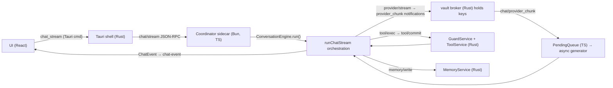
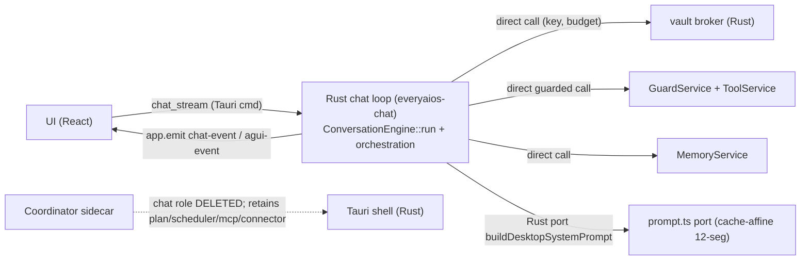

# ARCH/16 — Porting the async chat loop to Rust (ConversationEngine `run()` + `runChatStream`) — ARCHIVED

> ⛔ **ARCHIVED — no v1 scope, not current architecture.** [`ADR/0005`](../ADR/0005-external-agents-are-the-v1-engines.md)
> defers the built-in engine to post-v1, so there is **no EveryAIOS turn loop to port**: the loop belongs to the
> selected agent ([`AGENT.md`](../AGENT.md) §1). `P71.2c` removes the sidecar loop this document scoped; the
> migration/parity content is retained for the post-v1 governed-baseline return (`P71.7`).
>
> **Moved here from `ARCH/16-CHAT-LOOP-RUST-PORT.md` on 2026-09-22 (`P71.5a`).** Relative links below are
> rewritten for this directory.

> **Derived from [`CORE.md`](../CORE.md) — the root authority; this document specializes, never restates, it.**
> **SUPERSEDED IN PART — see [`AGENT.md`](../AGENT.md).** The premise of this document is that EveryAIOS owns the
> chat loop. It does not: the loop belongs to the **selected agent** (`AgentBinding`). What remains as
> EveryAIOS’s job is the environment — context projection, memory, capabilities, governance, durability.
> Keep only the parity/migration content. **Replaced `P69.A25` (done 2026-09-20).**

---

> **Status: SUPERSEDED IN PART — the 2026-09-17 architecture freeze is lifted by [`ADR/0003`](../ADR/0003-architecture-thaw-core-authority.md).** The premise that EveryAIOS owns the chat loop is retired: the loop belongs to the selected agent ([`AGENT.md`](../AGENT.md)). What survives is the parity/migration content. **Replaced `P69.A25` (done 2026-09-20).**
> Under the 8 Full-Stack Module architecture, EveryAIOS is finalized as the **Universal Agent Harness and Desktop Cowork OS**.
> The async multi-turn streaming conversation loop in `packages/coordinator/src/chat.ts` is robust, battle-tested, and fully operational.
> Heavy compute, cryptographic verification, security guardrails, SQLCipher persistence, and document calculations are already executed in pure Rust (`crates/everyaios-engine`, `crates/everyaios-guard`, `crates/everyaios-vault`, `crates/everyaios-office`).
> Rewriting the entire TypeScript chat loop in Rust (~3,400 LOC) is an unnecessary rewrite treadmill and is permanently de-prioritized.
> This document is preserved for architectural completeness and potential future sub-component optimizations.

## 0. Ownership / migration note (`P69.A25` — read this first)

> The loop belongs to the selected agent ([`AGENT.md`](../AGENT.md)): reasoning, planning, tool selection and
> retry are the bound agent's job. EveryAIOS owns the environment — context projection, memory, capability
> packs, governance, durability. There is **no planned Rust chat-loop crate**: the M0–M4 port plan in §6
> below is **historical, not pursued**, and §§1/3/4 are the estimate record for that retired plan, not a
> target. What survives from this document is the **parity contract in §5** (every model-visible block
> reconstructable from the trace; byte-stable prefix above `CACHE_BOUNDARY`, now owned by the
> `CacheBoundary` contract in [`CONTEXT.md`](../CONTEXT.md)) and the call-path record in §2.

## 1. Why this is the last meaningful port slice

> **Historical — retired by `P69.A25`.** The table below estimated a port that is not pursued: the loop
> belongs to the bound agent. Kept as the cost record.

Every correctness/safety primitive the loop touches already lives in Rust:

| Loop dep (TS) | Rust home today | Port cost |
|---|---|---|
| `streamProvider` (openai stream) | `everyaios-vault` broker + `SessionBudget` (J11) — Rust already streams tokens | **Zero new logic** — removes the TS hop |
| `executeTool` | `everyaios-core` `ToolService` + Guard ticket (`tool/exec`→`tool/commit`) | **Zero new logic** — in-process call |
| `extractMemory` / `persistTurn` | `everyaios-core` `MemoryService` (+ `extractFacts`-style deterministic extract) | **Zero new logic** |
| `gateToolCall` (Alg #17) | `everyaios-engine::gate` (already ported) | done |
| `assessHallucinationRisk` (Alg #8) | `everyaios-engine::risk` | done |
| `plan_retrieval`/`plan_tools`/`family_of` | `everyaios-engine::plan` | done |
| `default_contract` | `everyaios-engine::contract` | done |
| `extractJsonToolCalls` (B5) | `everyaios_vault::extract_json_tool_calls` (mirrored) | done |
| batching/TTFT | `StreamSession` (102 ts) | **port** (~120 rust) |
| routing + observations | `router.ts`/`observations.ts` + the Rust `RouteDecision`/`ProviderObservation` seam (P36) | **partial port** |
| semantic/result cache (A9) | Rust store (cache is Rust-side already) | **zero** |
| tool listing→OpenAI schema | Rust `ToolRegistry` + `listedToolsToOpenAI` (tools.ts, 380 ts) | **port** |
| **prompt assembly (12-seg, cache-affine)** | `buildDesktopSystemPrompt` (prompt.ts, 187 ts) | **the load-bearing new port** |

So the *state machine* is the small part; the coordinated orchestration and the
12-segment cache-affine prompt are the real work.

## 2. Verified call path today (why TS is a relay, not an owner)

> **Record, not target.** The pre-thaw wiring described below is accurate as history; under
> [`AGENT.md`](../AGENT.md) the orchestration belongs to the bound agent and the sidecar proposes to Rust.

Every hop colored real: the provider stream leaves Rust, enters a TS async queue,
feeds the engine, and tool/memory effects are already inter-process calls **back**
into Rust. Porting the loop to Rust removes three round-trips per turn and the
whole `PendingQueue`/`FrameProviderBridge` machinery.

## 3. The cut-path (target architecture after M3)

> **Not pursued (`P69.A25`).** The diagram below is the retired plan's target, kept so the decision stays
> legible. No `everyaios-chat` crate is planned.

## 4. Size (honest, code-measured)

| Source (TS) | LOC | Rust port estimate | Notes |
|---|---|---|---|
| `engine.ts` loop structure | 542 | ~700 + tests | 90% pure logic already ported; remainder is the async state machine + event yields |
| `chat.ts` `runChatStream` orchestration | ~800 | ~900 | routing, tool listing, cache, AG-UI, StreamSession, hooks, budget map |
| `prompt.ts` 12-segment cache-affine assembler | 187 | ~600 | **hardest**: CACHE_BOUNDARY, SOUL.md slot, persona overlay, J6 `<user_document>`, below-boundary `memory_warm_set`/`tool_index`, byte-stable prefix invariant, P30.8 `assertAllLogged` audit |
| `tools.ts` `listedToolsToOpenAI`/`resolveActiveTools`/`sortToolsStable` | 380 | ~450 | schema serialization off the Rust ToolRegistry |
| `router.ts` classify/select + `observations.ts` | 445 | ~350 | dues to `everyaios-engine` scoring laws; observations ride the P36 seam |
| `stream-session.ts` | 102 | ~120 | TTFT + 33ms token batch |
| `catalog.ts`/`agui.ts` (hints, AG-UI envelope) | 315 | ~250 | AG-UI line envelope = marshal only |
| **Net-new Rust** | **≈2,770 ts** | **≈3,400 + ~1,200 tests** | |

Slightly larger in Rust than TS *because of the tests* the port must carry to be
diffable against the 302 coordinator tests. **Total effort ≈ 4,500 LOC**, spanning 2
crates, and it touches the live chat path — realistically 3–5 sessions to land safely.

## 5. Blocking prerequisites (checks that gate M1)

These are the two genuinely leaky seams that decide whether the port is clean or a
`.exe` call-back:

1. **The context/audit invariant (P30.8):** `ContextTrace` + `assertAllLogged` proves
   every block injected into the prompt is reconstructable from the trace (system,
   `memory_warm_set`, `tool_index`, `<user>`, J6 docs). A Rust prompt port must carry
   the same provable-presence contract or the honesty invariant is lost. — **must be
   replicated in Rust, not skipped.**
2. **Prompt byte-stability:** the stable prefix above `CACHE_BOUNDARY` must stay
   byte-identical across turns (A9 prompt-cache value). The Rust assembler must own
   the boundary line and the below-boundary injection points exactly as `prompt.ts`
   does today.

If either is deemed "good enough to call back into TS," that's a legitimate
**non-goal** call — but it keeps a Rust↔TS prompt round-trip every turn and halves the
win. The default is: port both.

## 6. Migration phases (each lands green, nothing regresses)

> **Historical — not pursued (`P69.A25`).** M0–M4 assumed an EveryAIOS-owned loop. The loop belongs to the
> bound agent; the surviving parity requirements are §5.

- **M0 — Harness:** add `everyaios-chat` workspace crate; a `RunTurn` facade with the
  loop state machine + the existing native deps (broker/tools/memory/gate/risk/plan)
  wired in-process; emit via a tested `ChatEvent` channel (inject the Tauri emitter).

- **M1 — Loop + tools port:** port `StreamSession` batching, tool schema conversion,
  JSON tool-call extract, tool-loop re-stream + `extraFinalRound` + abort/`gateToolCall`
  wiring. Exit: a Rust unit test replays the engine.test.ts tool-loop scenarios.

- **M2 — Prompt assembler port:** `buildDesktopSystemPrompt` + cache boundary +
  below-boundary injection + context-trace parity. Exit: golden prompt-diff tests
  against `prompt.ts` output for the same opts; byte-identical stable prefix.

- **M3 — Orchestration + cut-over:** routing/scoring, semantic cache, AG-UI envelope,
  observations into the Rust loop; delete the coordinator `chat.ts` stream path and
  `FrameProviderBridge`/`PendingQueue`; issue chat directly from the Tauri `chat_stream`
  command. **Coordinator's chat role removed** (plan/scheduler/mcp/connector remain TS).
  Exit: `cargo test --workspace` + coordinator non-chat suites + UI typecheck + a live
  TTFT sanity check vs current.

- **M4 — Retire:** drop the now-unused vendored `StreamSession`, the chat imports of
  `@everyaios/core-engine`, and the loop-only helper surface from the coordinator;
  update ARCH/05/13 + §4.2.9 spec mermaid + TODO.

## 7. Risks & explicit non-goals

- **Regression surface:** the 302 coordinator tests lock the loop behavior. The port
  must preserve token ordering, tool-round semantics, `extraFinalRound`, abort-mid-stream
  cleanup, and J11 budget-kill mapping. Keep the TS path alive behind a
  `EVERYAIOS_RUST_CHAT=1` env toggle through M3, then flip default, then delete.
- **Prompt divergences:** cache-affine prefix is a hard performance promise (A9). A
  whitespace/segment reordering that breaks byte-stability silently kills prompt-cache
  hits — hence M2's golden-diff gate before any cut-over.
- **Non-goals (deliberate):** no single ts module is call-back ported (the cross-crate
  round-trip would cancel the win); the *routing* model is reused from
  `everyaios-engine`/P36, not re-derived; AG-UI stays a lightweight envelope (marshal,
  not a port of the UI's generative surface).
- **What this does NOT do:** it does not port the mobile `@everyaios/core-engine`
  package or the plan-executor / scheduler / MCP / connector loops. Those remain TS by
  design (they are not the chat hot-path and have their own delegation seams).

## 8. Outcome

> **Superseded (`P69.A25`).** "One turn becomes one process" assumed the retired Rust-loop target. The live
> end condition: the bound agent owns the turn; EveryAIOS owns context projection, governance, and
> durability around it.
>
> **Fully superseded 2026-09-21 ([`ADR/0005`](../ADR/0005-external-agents-are-the-v1-engines.md)).** v1 ships
> **no built-in engine**, so there is no EveryAIOS turn loop to port and this document has **no remaining
> action**. What survives from its analysis is the *coordination* seam — the sidecar loads state, assembles
> and projects context, relays the stream, dispatches tools, persists events and drives recovery — now stated
> in [`ROUTING.md`](../ROUTING.md) §1 and [`../DESKTOP-APP-SPEC.md`](../../DESKTOP-APP-SPEC.md) §4.2.5 (Impl B).
> The ported slices that only ever served the built-in loop are removed under `P71.2c`.

One turn becomes **one process, zero TS hops, zero IPC round-trips for provider,
tool, and memory** — and the sidecar's largest remaining TS surface is gone. That is
the concrete end condition the earlier "port the last ~1,200 LOC" framing was missing:
it was never 1,200 lines of engine; it is ~2,770 TS lines of engine + orchestration +
prompt, of which all *effects* already run in Rust today.