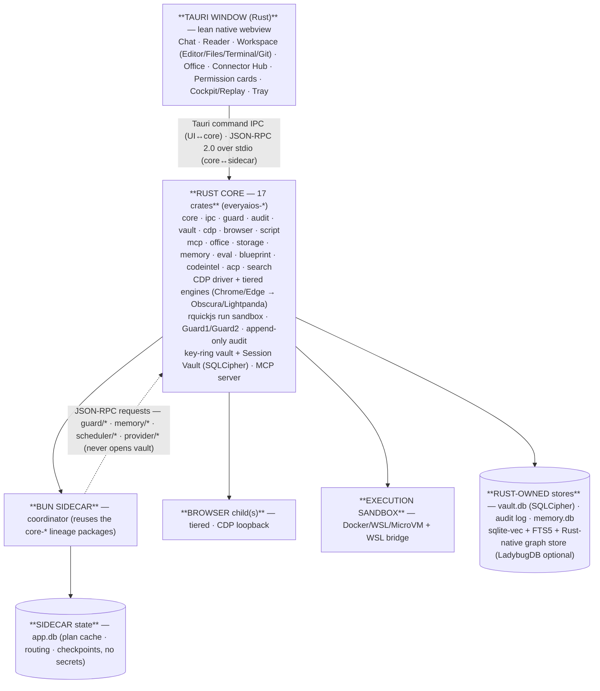
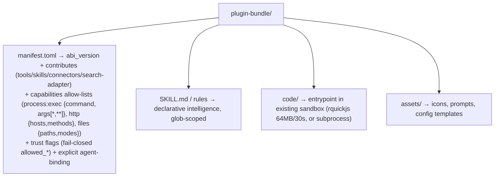
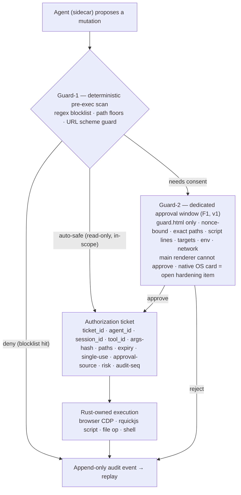
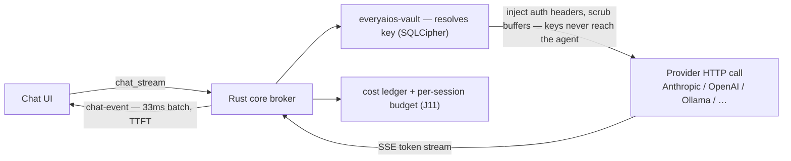
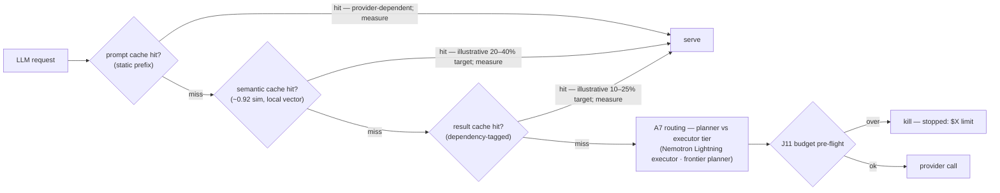
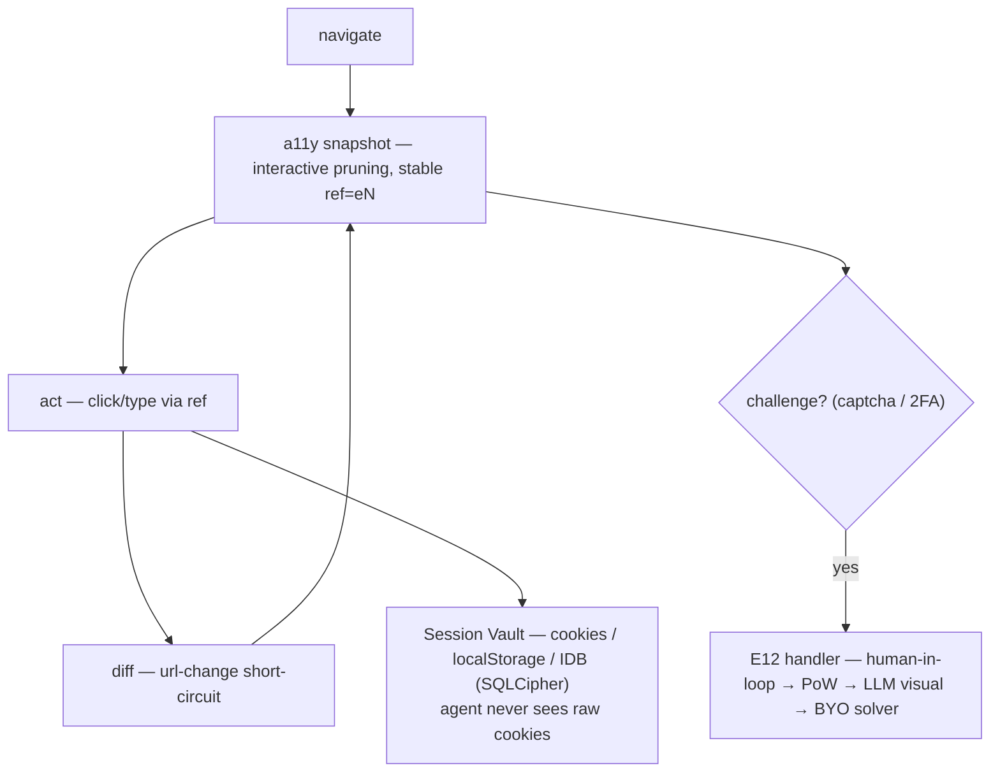
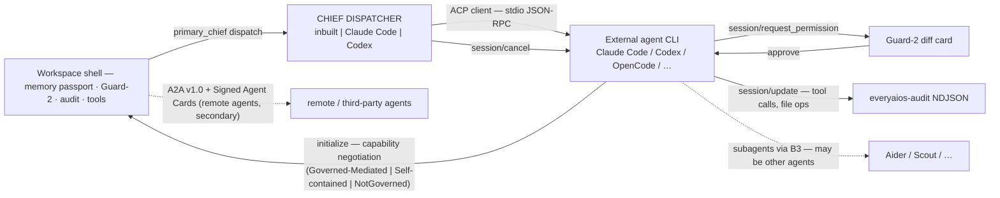
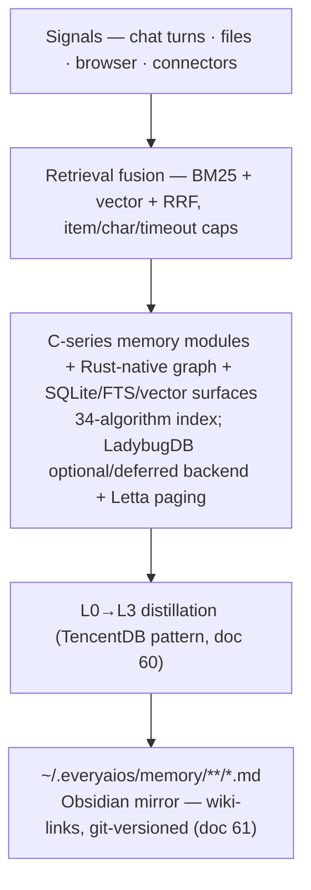
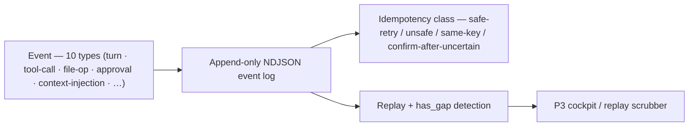

# DESKTOP-APP-SPEC.md — Complete Product Specification

## Real-World Use Cases

Every case below is the same loop: the user states the job, the system plans, every real-world effect passes the guarded gate, and the user gets the work — plus the ability to see what happened, undo it, and resume it later. The point is that the *same* mechanisms (one session, one memory, one Guard, one audit, one workspace) serve all of them.

**UC-1 — “Clean up my Downloads folder.”** A user who has never opened Settings drops a folder onto the workspace. The system walks the folder (D9), groups by type/project, spots near-duplicates (hash+semantic), and proposes a reorganized tree with new names — as a *plan*, not an action. Every move, rename, and merge awaits a Guard-2 card with the exact before→after diff; one “approve all” applies them through the ticketed executor. The user sees only what changed, and can roll the whole pass back from the audit log. Continuity: if the app closes mid-run, the plan is in the checkpoint and resumes where it stopped.

**UC-2 — “I have a job interview tomorrow. Get me ready.”** The interviewer name, role, and company land in the chat. The plan: pull calendar context, find past notes about the company or the person in memory (C6 graph), run the search cascade for fresh company news, and draft a one-page brief with cited claims. The user reviews the plan card, edits constraints (e.g. “don’t mention my current employer”), and starts it. Each source fetch, note read, and export is read-only or guarded; the final brief is written only on approval. Results are linked into memory so the next interview with a similar company warms up instantly.

**UC-3 — “Research this company and make me a presentation.”** Browse + deep research (G8 cascade with parallel fetch, BM25 rerank, cited claims), then a deck is drafted from a blueprint template. Every slide change is a surgical document mutation with a diff card before it lands. The deck opens in the office viewer for final review, and the export is signed with a provenance note listing exactly which source each claim came from. Honesty invariant applied: anything the sources don’t support is labeled, never invented.

**UC-4 — “Fix this repo.”** A power user points at a broken repository. The Chief inspects (read-only: LSP/codeintel index, tests, git history), proposes the smallest change, runs the tests to see them fail, then shows a diff card for the fix. Only that card is approved; the executor applies the write, re-runs the tests, and records the evidence (pass/fail, exact diff) in the receipt. The right rail shows Terminal / Files / Git live, so the user watches every step and can cancel at any point. Continuity: the same work can be resumed with a different Chief (see UC-14) without losing the plan or the receipts.

**UC-5 — “Refresh Q3 numbers and patch the exec summary.”** A spreadsheet lands in the workspace. The office engine reopens the workbook, recalculates the supported formulas (unsupported ones are flagged NOT_RECALCULATED, never guessed), writes the updated numbers as a surgical cell patch, and rewrites the summary paragraph in the docx. Each write is its own Guard-2 card; the user accepts one and rejects another. Both files come back byte-preserved outside the patched parts, so charts, VBA, and formatting survive. A LibreOffice round-trip check in CI proves the files still open cleanly.

**UC-6 — “What’s the actual difference between these three tools?”** A comparison chart is requested. The search cascade runs the query against cached + live tiers, fetches the candidate pages in parallel, extracts structured rows, and writes the comparison into a spreadsheet the user can keep. Sources are cited per cell, and claims the system could not verify are blanked with a reason rather than filled in.

**UC-7 — “Draft replies to these 14 emails.”** Emails arrive via the connector layer (IMAP/BYOK). The system reads each thread, drafts a reply per person, and presents them as a queue: approve, edit, or reject per message. Sending is always a separate guarded action — one card per send, with the recipient and subject verified. Everything drafted stays as drafts until approved; nothing goes out silently.

**UC-8 — “Organize the quarterly report for my team.”** Calendar + meeting notes + past reports merge into a single brief via memory (episodic recall + the personal graph). The plan is a timeline: gather → draft → review → distribute. The user runs it as one Start, but each stage is a distinct guarded step, so a user can stop after the draft, iterate, and resume.

**UC-9 — “Make me a product-comparison sheet from these five vendor sites.”** The browser session vault handles the login-gated vendor pages; the scrape runs logged-in and tiered, the read-cleaner strips ads/trackers, and the extracted tables land in the sheet with provenance per row. The user reviews the sheet and marks columns before anything writes anywhere.

**UC-10 — “Every Monday, send me a one-page digest of what our competitors shipped.”** A scheduled task (B7) that runs unassisted in quiet hours: the browser visits the tracked pages, the read-cleaner extracts, the model summarizes, and the digest lands as a draft message — sent only if the user leaves auto-approve on for exactly this task; otherwise a card is shown Monday morning with one click to send. Post-v1 the schedule can run with the lid closed via device-to-device sync (P8.9) or the **user-operated always-on node (H33)** — never via a founder cloud.

**UC-11 — “Pull Monday’s numbers from our internal dashboard and log them.”** One task that scrolls the authenticated dashboard session, reads the figures, and appends them to a run log — a fragile, boring manual habit now done by a session you own. The browser session is the user’s own login (Session Vault), never reused across users, and every scrape step is observable in the trajectory view with has_gap honesty when a step couldn’t be fully verified.

**UC-12 — “I was mid-way through this task last night; keep going.”** The app restarts, the Chief is unresponsive, or the laptop died. The event ledger replay restores the session: plan, checkpoints, receipts, and approvals, all from before the interruption. The user picks any already-licensed Chief (inbuilt, Claude Code, Codex) and the work resumes from the last completed turn — bytes, approvals and evidence intact. No “the AI forgot”, because work is not the AI’s working memory; work is the durable object.

**UC-13 — “Turn my last three working sessions into a report.”** Memory maintenance tools consolidate the sessions (spreading activation + graph), the claims conflict check runs before anything is written, and the report is produced with per-fact provenance (which session, which source). The user asks “where did that claim come from?” and the graph answers with the span, the source and the confidence — not a paraphrase.

**UC-14 — “Keep my Claude subscription as the brain, but run everything through one place.”** A user who already pays for Claude Code sets primary_chief = claude-code once. From then on, every conversation, plan, approval and receipt in EveryAIOS is driven by Claude Code behind the governed shell — same memory passport, same Guard-2 cards, same audit. When the subscription lapses or the user switches to Codex, they change one setting and the same work continues — the AI is replaceable, the Work isn’t.

---

## What EveryAIOS is

**Tell it what you want done. It figures out how. You stay in control.**

EveryAIOS is an AI coworker on *your* computer. It can use your files, apps, browser, documents, code, and other AI tools to finish real work — while you approve anything that actually changes the world. You do not pick an agent, a model, an MCP server, or a browser runtime first. You say the job.

The front door is one question: **What would you like to get done?** Chat is a piece of work, not the product. Subsystems (models, memory, Guard, MCP, ACP, tickets, Rust executor) stay behind Settings / Pro unless you ask to inspect them.

### Casual users (the default)

Drop something in → say what you want → it works → you get the result (and a chance to approve anything risky).

The default empty state shows four everyday asks — clean up my Downloads · prep me for an interview · research this company into a deck · make sense of these 400 files — each worked end-to-end in UC-1…UC-3 above, with the full power version in UC-4/UC-5/UC-14. The person never has to know about D9 storage intelligence, Guard-1, tickets, or FTS5.

### Power users (Pro / Control Center)

Same coworker. The center can expand: plan → agents → resources → tickets → evidence → result — with Terminal / Files / Browser watchable in the right rail.

Engineers still see the kernel (tickets → executor → event log → recovery). Casual users never have to.

### Continuity and trust

Most AI tools make you live in *their* world — their chat, their editor, their browser, their subscription — and every time you move between them you lose the thread: what you were doing, what you already tried, what you told the machine it must never touch on its own. Your logins, your files, your preferences, and your half-finished work end up scattered across tools that don't talk to each other, and you're never fully sure what one of them just did on your behalf, or where your data actually went.

EveryAIOS is a single desktop app — free and open source — that runs on your own machine. The point is not "everything in one window." The point is two things this category keeps getting wrong: **continuity** and **trust**.

**Continuity** means your work context — what you're building, what you prefer, what you've already decided — is owned by *you* and survives every switch. Bring your own model keys, or run a model locally; move from one assistant to another without re-explaining yourself. Nothing requires a company's server, and nothing locks you in.

**Trust** means one rule that governs everything the app does on your behalf: the AI may propose, but it never decides. Every real-world effect — a file written, a browser page changed, a shell command run, an email sent, a spreadsheet edited — passes through a single guarded gate that says exactly what will be done, asks you before the risky parts, and records what actually happened. You can see it, approve it, undo it, and replay it.

That is the whole product in one sentence: **a local, user-owned operating layer for AI-assisted work — one workspace, one memory, one safety model, one audit trail — where models, tools, browsers, documents, and agents are parts you can swap, not a service you're locked into.**

---

> **Version history, source ground-truth, and the full landing log:** `SPEC-CHANGELOG.md` — that file holds every historical fold-in, every landed-item note, and every change decision. **Ground-truth sources:** `RESEARCH/desktop_app/` (docs 01–84, **282 repos**) + `desktop_app/ARCH/` (docs 00–12). **Reference discipline:** every borrowed pattern records repo/commit/date/license/adopted-abstraction/not-copied (behavioral inspiration vs algorithm adaptation vs protocol compatibility vs direct dependency vs source reuse) — see the ledger docs. This file is the *current* product contract; nothing historical lives here.
> **This app is OPEN SOURCE, local-first, BYOK.** Nothing in the architecture requires a founder-run server — not now, not later.
> **Guard-2 approval cards are nonce-bound by design (F1 landed):** the rendered card and the approval command share a random nonce that every path (Rust, Tauri, coordinator, plan, UI) validates and rejects on mismatch. This binds approval to the rendered card. **F1 (2026-08-25): the consent surface is now a dedicated `guard` webview window** (`guard.html` — a minimal dependency-free page that only ever renders ticket payloads from Rust IPC; never browser views, generative UI, or plugin content) and `guard_respond` refuses any caller that is not that window — so a compromised main renderer can no longer draw a fake card over a real ticket. The webview is still a presentation surface, not a native OS trust boundary — native OS cards remain a hardening item.

> **"Sidecar proposes, Rust disposes" (doc 42, reference-validated):** code-verified against OpenFang `kernel.rs` (20+ subsystems, RBAC, Merkle audit) + ZeroClaw `zeroclaw-api/src/lib.rs` (kernel ABI traits). Both use a Rust kernel/trait separation with capability-based security — concrete reference patterns, not external certification of EveryAIOS correctness.

---

## ⛭ THE FINAL APP — the complete product (every capability below, all together)

> **Capstone vision.** This is what the finished EveryAIOS is — the state reached when **every row in §0 (A–J, the 151-row matrix + 34-algorithm index, plus the cross-cutting EV evidence subsystem), the 10 pillars (§3), and the post-v1 K-pillar (§10) are built, integrated, secured, and release-verified.** This section is the whole product in one view; the live build queue is `TODO.md`.

**The final app in one sentence:** a single local-first, BYOK, open-source desktop workspace where your **chat, browser, files, documents, code, automations, agents, and connected accounts** live in one safe continuity — the LLM is the CPU, every real effect (file, browser, shell, provider, connector, office, agent) crosses **one ticket model → one executor → one event log → one progress timeline**, and every capability is spec-driven from Markdown and verified by a deterministic dual-guard (Guard-1/Guard-2) + evidence evaluation (EV1 — now runtime-wired at plan completion via `eval/verify`; per-effect verified receipts remain K1 §10) — never by trust in the model.

**The whole capability surface, in one sweep — A → J → EV → K:**
- **A · Models & BYOK** — multi-provider + multi-key key-rings with auto-failover; OAuth subscriptions; local models (Ollama/llamafile/MLX, agent-native class); models.dev-backed catalog with per-task capability routing (Fast/Quality/Private/Cheap tiers); 3-layer cache stack with real per-call cost accounting.
- **B · Agent orchestration** — Markdown blueprints as live execution graphs; continuous planning loops; subagents (depth ≤2, concurrency ≤6, strict budgets); crystallization of repeated work into zero-token flows; NL scheduling; heartbeat automations; the **custom agent builder (B9)** — named agents as versioned bundles (persona · underlying engine inbuilt/ACP/model-only · model/provider that inherits the chat bar by default · per-agent MCP/connector/skill/tool scoping · attached workflows).
- **C · Memory & context** — the C-series memory/context plane and 34-algorithm index + knowledge graph (Rust-native graph store; LadybugDB optional/deferred), conflict resolution, ACT-R activation & spontaneous recall, pass-by-reference context (never serialize what you can reference), taste profile, token-economy compaction with byte-stable prefixes (>85% cache-hit target). Composition order is explicit: retrieval/fusion selects candidates → ACT-R/temporal/graph signals rank them → scope/budget gates bound injection → compaction applies only to the assembled context; FSRS schedules review separately and never changes immediate retrieval truth.
- **D · Office & files (engine-true within the engine's supported feature set — unsupported formulas/features are flagged, never silently recalculated)** — byte-preserving surgical OOXML part-patching (Word/Excel/PPT), IronCalc deterministic recalculation (300+ functions), PDF render/form-fill/redact, LibreOffice conformance oracle, .doc/.xls/.ppt convert-on-open, snapshot rollback; storage intelligence (parallel walker, arena snapshots, treemap, 7-stage dedup, FTS5 instant filename search).
- **E · Browser & computer use** — tiered engine stack over one CDP driver (Lightpanda/Obscura → system Chrome/Edge → user-gated stealth), 37 tools, a11y diff (~90% token cut), session vault with sealed cookies (agent never sees raw secrets), session inheritance through an isolated/non-default browser profile by default (explicitly paired user-launched profiles only; Chrome 136+ default-profile debugging switches are not assumed), replay with `has_gap` honesty, challenge handler; **native desktop computer-use (E9) required at ChatGPT Desktop + Claude Computer Use parity** (WGC see / UIA read / SendInput act / see-pane / Guard-2).
- **F · Connector hub & messaging** — **MCP-first (decision 2026-08-16):** MCP Servers + Native (BYO OAuth/API-key in vault) + Tool Catalog, Unified Tool Registry, MCP client + MCP server (our tools to other agents), desktop-first email/Telegram/WhatsApp bridges, Gmail/GCal OAuth or IMAP/SMTP.
- **G · Search & research** — free searxng-first cascade + circuit breaker + BM25 rerank; breadth×depth deep research with cited, confidence-scored reports; multi-channel search; REPL analysis; token economy; RTK output compression; instant local search.
- **H · UI & product** — the v2 work-cockpit (48px activity rail, 12 views, resumable streams, generative UI in sandboxed iframes, widget cards, voice memo→report, corpus-research surface, agent picker).
- **I · Forge & skills** — write→sandbox→test→persist tool generation, skill registry that grows the toolset without source changes, versioned extension ABI with capability allow-lists, registry-fed ACP agent discovery and driving.
- **J · Security (host safety firewall)** — Trust Ladder + Guard-1 regex + Guard-2 visual diff cards, authorization tickets as the only mutation path, append-only audit + replay, credential broker (keys only in Rust, zeroize), policy-driven escalation with decision packages, injection defense, egress controls.
- **EV · Evaluation & honesty** — the EV1 verification suite: golden tests, conformance evidence, anti-hallucination checks — the product refuses to claim what it cannot show. `eval/verify` runs at plan completion (empty/check-less tasks are honestly `Unverifiable`); per-effect verified-completion receipts (K1 work receipt) are §10/K-pillar work.
- **K · Post-v1 strategic pillar (§10, TODO P28)** — proof-carrying work receipts, reversible cross-app change sets, teach-once → compile → governed zero-token replay, work graph + context passports, data-release firewall (two zones) — gated on the ticketed executor + durable receipt/recovery evidence (§10).

**What the user experiences at the end state:** open the app → one workspace with four verbs (**Capture · Ask · Organise · Finish**) → drop anything (file, screenshot, spoken thought, browser page, clipboard, email) → the system makes it work — every meaningful write approved, every outcome receipted and repeatable, every data disclosure explicit and policed, every model and agent swappable without losing context, and nothing requires an account, a cloud, or a founder server. Free forever (product policy, not an architecture guarantee), owned by the user.

**Where it sits (docs 80/81/82):** not the best coding IDE, browser, cloud agent, or office suite — the **user-owned operating layer for agentic work**: the only local-first, BYOK, protocol-native control plane that composes models, agents, browser, office, memory, tools, and automation under one session, one safety, one audit, one memory, one orchestration surface. Foundational-differentiation claims ("teach once", "broadest control plane") are marketable only after Gates A/B/D (doc 82; §10).

---

## 0. MASTER CAPABILITY & ALGORITHM INDEX (the contract — exhaustive, nothing cut)

> **This index is the contract.** New capabilities are added *here first*, then to `ARCH/09`. Nothing is dropped from this list without a written decision in `ARCH/09`. This file carries the *contract* only: build/implementation status of every row lives in `TODO.md` (master queue) and the landing log lives in `SPEC-CHANGELOG.md`.
> **Scope (counted from this file's rows):** 153 rows · 34 algorithms (index gains #34 — FSRS was implemented but unnumbered; v3.51; v3.52 adds H33 always-on node + I12 Zed-class IDE; **v3.56 adds A11 Provider Record + alias layer and H34 Autonomy Level**). (ARCH/09 mirrors this index; the two are reconciled on change.)

### A. Model & BYOK layer
| ID | Capability |
|---|---|
| A1 | Multi-provider BYOK — anthropic / openai / responses / azure / bedrock / gemini / openrouter / deepseek / openai-compat / ollama / llamafile |
| A2 | **Multi-key per provider** — key rings: N keys/provider, priority + weight, per-key model filter, budgets, health |
| A3 | **Auto-failover rotation** — 429/401/5xx → cooldown → immediate next key; max-switches; all-fail backoff (**doc 59:** lkgp sticky-to-last-good + reset-aware/headroom quota-aware pick + cache-optimized prefix-pin) |
| A4 | OAuth subscriptions — ChatGPT Pro (PKCE) / Copilot·Qwen (device-code), encrypted tokens, same fallback semantics (⚠️ ChatGPT Pro uses the unofficial `chatgpt.com/backend-api` endpoint — kept user-driven (Hermes/OpenCode pattern), ToS-risk documented (doc 57 §3); the URL lives in `broker.rs DEFAULT_BASE_URLS` and is inert without an OAuth-acquired token; the flow is an explicit user opt-in) |
| A5 | Local models — Ollama managed + llamafile single-binary + **MLX (Mac, Rapid-MLX — doc 61)**; **agent-native class (doc 61): Muse Glimmer (30B dense, 120K ctx) + Nemotron 3.5 Lightning (30B MoE/3B active)** → retire the 15–20K ctx warning for this class; **doc 58:** llmfit hardware-fit picker before spawn — `recommend --json`; **Settings → Local models** = Discover (**live Hugging Face Hub GGUF search — no hardcoded model names**) + My models (installed ollama/llamafile + hwfit fits/too-big) + Hardware (RAM/cores/gpu + UI prefs); **v3.46 (P27):** **adaptive KV-cache precision** — llama.cpp `-ctk`/`-ctv` (`--cache-type-k/-v`, F32/F16/Q8_0…, verified in `llama.cpp/common/arg.cpp`) + Ollama KV options for memory-constrained local runs, chosen by the hardware-fit picker. **Never bake Hub repo ids into source.** |
| A6 | Model catalog + capability hints (tools/vision/ctx) — router picks per task (**doc 66:** baseline = models.dev catalog — MIT, vendored snapshot (186 prov / 364 models at snapshot; live count drifts), two-tier lab/provider schema + `base_model` override-only inheritance; **doc 58/59:** ingest OmniRoute's API-key/local/keyless catalog as the A6 long tail; cookie/OAuth classes = doc-57 reject list; **doc 68 §4:** agent-scoped model surface — hosted agents expose their own models via `available_commands`/config; full catalog only in the native-engine picker, never a global model grid) |
| A7 | Asymmetric tiering — planner_model / subagent_models / depth=2 / concurrency=6 / writers=3 (**doc 59:** 13-factor weighted scorer + 4 mode packs + `auto/category:tier` DSL as the dynamic selection layer; **doc 62:** LangChain×Switchyard routing — 74% cheaper / 7% frontier calls across 145 tasks (Nemotron Lightning executor + Opus planner, escalate-by-floor not default); ACRouter C-A-F = post-v1 dynamic-learning tail; **doc 68 §4:** agent-scoped routing — hosted agents route on their own model surface, the native engine routes on intent-first tiers Fast/Quality/Private/Cheap) |
| A8 | Local OpenAI-compatible server — expose engine for VS Code/Cursor reuse — post-v1 (P9.5); no standalone server is assumed in the current runtime |
| A9 | **Cache-aware costs + 3-layer cache stack (doc 62)** — cache_read/cache_write/$ per call, key-affinity (**doc 66:** per-model `input_cache_read`/`input_cache_write` pricing from the models.dev catalog feeds the cost engine + J11 budget gate); **prompt cache** (provider markers: Anthropic `cache_control:ephemeral`, OpenAI ≥1024-token prefix) + **semantic cache** (local vector, ~0.92 sim, 7d/24h TTL) + **result cache** (dependency-tagged invalidation, 3d TTL); read-only-intent only — never serves into mutation paths |
| A10 | **Image generation** — text-to-image + image-to-image (GPT-Image-1 / DALL·E 3 / Flux / Stable Diffusion / any MCP image server) as a provider endpoint; same key-ring + failover semantics (A2/A3); results as ref-handles, never raw in context (doc 50) — post-v1 |
| A11 | **Provider Record + alias layer (v3.56 — Hermes `hermes_cli/providers.py` + OpenCode provider-directory pattern, source-read 2026-08-26)** — the provider is a *first-class identity*, not a hardcoded `if provider == …` branch: a `ProviderRecord` (id · aliases · name · transport (`openai_chat`/`anthropic_messages`/`codex_responses`/`bedrock_converse` — the API-mode mapping that decides wire protocol) · auth (`api_key`/`oauth_device_code`/`oauth_external`/`external_process`/`aws_sdk`/`vertex`/`keyless`) · `api_key_env` set · `base_url` + `base_url_env` override · `is_aggregator`/`is_routing_aggregator` distinction (OpenRouter-style passthrough vs OpenCode-Zen flat-namespace resellers) · models_source · capabilities · source (`models.dev`/`hermes`-style overlay/`user-config`/`plugin-profile`) · health · config_hash) is the merged result of **models.dev catalog (the canonical live database, 109+ providers / 186 at our vendored snapshot) + provider overlays (transport/auth/base-URL/env metadata models.dev doesn't track — Hermes `HERMES_OVERLAYS` + `plugins/model-providers/<name>/` profile pattern) + user config + plugin profiles**. **Alias normalization is a real layer, not a lookup nicety:** human/legacy names map to canonical ids (`claude`/`claude-code`→`anthropic`, `kimi`/`moonshot`→`kimi-for-coding`, `glm`/`z-ai`/`zhipu`→`zai`, `nim`/`nvidia-nim`/`nemotron`→`nvidia`, `dashscope`/`aliyun`/`qwen`→`alibaba`, `hf`→`huggingface`, `aws`/`amazon-bedrock`→`bedrock`, `ai-gateway`→`vercel`, `zen`→`opencode`, `lmstudio`/`ollama`/`llamacpp`→local, …) so the user never has to know which id is canonical. **OpenAI-compatible is one transport with many profiles** (Baseten/Cerebras/DeepInfra/DeepSeek/Fireworks/Groq/OpenRouter/Together/xAI/novita/stepfun/minimax/ollama-cloud/azure-foundry + any user base-URL override — OpenCode's explicit OpenAI-compatible profile pattern); the breadth comes from catalog + one transport + small profiles, never 75 independent implementations. **Capability-probe verification (the "catalog says ≠ runtime is" rule):** advertised capabilities (`vision`/`tool_call`/`reasoning`/context) are re-verified against the live endpoint (`/v1/models` listing, tool-call round-trip, context-length probe) and written back as `capabilities_verified_at` — routing never trusts stale metadata. Same live-discovery contract as the four primary registries (§0): fetch models.dev live + cache + version-pin, never a frozen list. New named type on A6/A7/P14; no behavior change to the broker (keys still resolve in Rust only). |

### B. Agent orchestration
| ID | Capability |
|---|---|
| B1 | Agent loop (pi-style) — streaming, length-guard (fail truncated tool calls), model-swap hook, cost ledger |
| B2 | Spec-driven blueprints — .md → agent registry; continuous plan rewrite; dependency resolution; resume-after-reboot; **plan cache (doc 62):** index plans by task signature (~0.85 sim, `plans.db`, version-based invalidation) before fresh planning inference |
| B3 | Sub-agents — role isolation, own context+workspace, DELEGATE_BLOCKED_TOOLS; **v3.39:** derived child permissions (parent ∩ deny ∩ explicit grants; task/todo default-deny — Kilo pattern) + Gemini-style termination/abort events (goal / timeout / max-turns / aborted / error) on the *inbuilt* executor. ACP covers external agents (J17). **v3.40 Scout child (OpenCode, live-verified):** a built-in **read-only research** subagent — clones a dependency repo into a managed cache (path-floored, not the user workspace), inspects upstream source, returns a summary; never writes the project tree. Cheap model by default. |
| B4 | Inter-agent messaging — peer-review, cross-check, sub-routines; no recursive spawn |
| B5 | Grammar-enforced extraction — ```blocks → tool calls (weak models); **local models use GBNF grammar constraints at the logit sampling layer** (llama.cpp/Ollama) — physically impossible to output invalid tool-call JSON; automatic fallback escalation to cloud model after 2 schema parse failures; **self-healing parse repair (doc 61):** attempt malformed-JSON repair (quote/brace/trim) before escalating |
| B6 | Iteration/subagent budgets — parent 500 / subagent 50 (Hermes, iteration_budget.py); **subagent_depth=2** (OpenCode); subagent timeout 900s custom / 1800s global (DeerFlow); max_concurrent_subagents=3 / max_total_per_run=6 (DeerFlow); execute_code refunded (Hermes); loop detector: 3x repeated args → interrupt (OpenCode); **on circuit-break: freeze DAG state at task boundary → present MCQ interrupt card (skip / retry with guidance / escalate model / manual override) → resume from frozen point without re-running completed steps** |
| B7 | Scheduled tasks — cron/interval/event/webhook; nudge sentinels (suggest_schedule); **event-driven triggers (doc 62, Gartner):** CI-build-fail / test-regression / repo-change (push/PR/issue) / ticket-assign / telemetry-threshold, with scope+frequency policy controls; **heartbeat automations (doc 67 §2 — Hatchet lease pattern):** a scheduled run reawakens the **same conversation with its context intact**; worker heartbeat + missed-heartbeat → reassignment/resume from the last audit-event checkpoint; automation step binding rides a fail-closed Rust adapter (`everyaios-core::automation_runtime`); **BackgroundTaskRecord (v3.53 — the detached-work task shape; researched from OpenClaw's own task ledger, docs.openclaw.ai/automation/tasks):** every detached run — automation job, subagent spawn, ACP spawn, CLI-initiated run — is a task record with lifecycle `queued → running → terminal {succeeded, failed, timed_out, cancelled, lost}`; **completion is push-driven** (wake the calling session/heartbeat — polling loops are the wrong shape); **execution ≠ delivery** (a run can be `succeeded` while a blocked completion is being retried over a capped, fenced retry generation, then `blocked` if the deadline passes); `lost` = no live authority and no durable run evidence after the grace window (5-min class, per runtime kind — conservative offline rules never claim a live ACP turn); terminal records retained 7 days then pruned; activity rail shows `tasks list/show/cancel/retry/audit`; complements the landed heartbeat lease + missed-heartbeat reassignment; rides H19 for visibility, H33 for the 24/7 node |
| B8 | Crystallization — multi-step workflow detection/classification → deterministic skill source, skill registry, drift fallback, **0 model tokens**; crate contract is model-free and host execution remains adapter-owned |
| B9 | **Custom Agent Builder (agent-authoring; user-driven 2026-08-17)** — create/publish a named agent as a **versioned bundle** (I6 + persona-manifest): persona/system-prompt + underlying engine (**inbuilt EveryAIOS · ACP-installed agent · model-only**) + model/provider (**optional = inherit from the chat-bar selection at run time**) + **per-agent MCP server subset** (tick exact servers — no global bloat) + **per-agent connector subset** + skills + blueprints/workflows (B2/B7) + tool allow/deny (Guard capability scoping); **templates** (General · Coder · Researcher · Email-Triager · Data-Analyst · Writer · Meeting-Notes · Browser-Operator); **Default agent = inbuilt EveryAIOS**; installed agents = ACP registry (F8/F12); custom agents = user bundles in `~/.everyaios/agents/`; **v3.45 Dynamic Chief:** any registered agent (inbuilt · ACP-installed · model-only) can be the **`primary_chief`** — the session's top brain owning user intent, memory, planning and the escalation gate; subagents may be **other** agents than the Chief (B3); Default = inbuilt |

### C. Memory & context
| ID | Capability |
|---|---|
| C1 | The C-series memory/context plane and 34-algorithm index (see Algorithm Index below) |
| C2 | Multi-tier memory — sensory/working/episodic/semantic/procedural + Letta paging; **v3.39:** branch/lineage memory (session fork is not one global chronological log) + `maintain()`-class tools (analyze references / update graph / decay — not only store/retrieve) |
| C3 | Multi-signal retrieval — FTS5+vec+graph+temporal fusion + cross-encoder rerank (OpenWebUI steal); **v3.39:** retrieval work is abortable (cancel in-flight fuse when the owning turn dies) |
| C4 | Vectorless default — FTS5/BM25 without embeddings (98% savings pattern) |
| C5 | Embeddings (optional) — on-device bge-micro/gte-small, int8/vec0 |
| C6 | Knowledge graph store — Rust-native embedded graph (LadybugDB = optional/deferred Kuzu-fork backend, C++, ACID, Cypher, vector+FTS), temporal edges; **v3.39:** every edge carries EXTRACTED vs INFERRED + source span (file/line); **v3.51:** optional **lazy concept-graph mode** (LazyGraphRAG pattern — Microsoft Research, verified from the MSR blog) — build the concept graph at *query* time (NLP noun-phrase concepts + co-occurrences; iterative-deepening best-first/breadth-first search with one relevance-test budget knob), zero up-front LLM summarization → indexing cost ≈ plain vector RAG (~0.1% of full GraphRAG's LLM index cost) with global-query-quality answers at a fraction of the query cost; the load-bearing LLM refinement of #8 becomes query-scoped — a natural fit for the local-first token budget |
| C7 | Memory injection — warm set ~0ms TTFT (target), scope-leakage floors, budgets |
| C8 | Sync/export/wipe — E2E-encrypted sync (opt-in, LAN/Tailscale transport), export, per-scope wipe; **doc 61:** Obsidian-compatible `.md` memory mirror (`[[wiki-link]]`s) + 20-min auto-fetch cadence (OpenHuman pattern — a view/export surface, not a second store) |
| C9 | **Taste profile** — auto-learned coding-preference profile (style/patterns/frameworks/naming) with confidence scores 0–1; shareable markdown (`~/.everyaios/taste/` + per-repo `.everyaios-taste/`); stable-prefix symbolic prior at generation; learns from accept/reject/edit via correction-detector + audit (Command Code taste-1 pattern — proprietary, pattern only) |
| C10 | **Pass-by-reference context** — files/datasets/tool results as live handles + bounded previews; agent queries/slices via sandboxed script-eval (E4) instead of loading payloads into context (NOOA pattern, doc 39) |
| C11 | Temporal knowledge-graph semantics — Graphiti-pattern bi-temporal entity/fact tracking with validity windows over the canonical Rust-native graph store |
| C12 | Cognee-pattern full-stack memory API — KG + vectors + sessions over the canonical Rust-owned SQLite/graph surfaces; **not a second database**. **doc 61:** every memory asset also exports to `~/.everyaios/memory/**/*.md` (readable/git-versioned — OpenHuman validation; preserves doc-60 "one memory model"). **v3.51:** note-object memory (A-MEM pattern — NeurIPS 2025, 1K+ citations): agent-constructed atomic notes + typed link generation + evolution (link/merge/archive) on write — a third memory *shape* (facts/vectors + KG + evolving notes) over the same store with the same export; no second database |
| C13 | **Spaced-repetition reinforcement (FSRS)** — use the permissive `open-spaced-repetition/fsrs-rs` (NOT Anki's AGPL-3.0 `rslib/src/scheduler/fsrs` — license boundary) into `everyaios-memory`: retention-target scheduling, reschedule-on-review, simulator; user-facing "reinforce what I learned" review prompts at optimal intervals (doc 63 §2.2); numbered **Algorithm #34** in the index (v3.51); **v3.51:** FSRS-7 upstream line (2025) is *not* yet in permissive `fsrs-rs` v6.x — tracked as an adopt-when-shipped watch item, FSRS-6 lands as built (P5.11) |

### D. Office & files (user-critical) — ⏸ **ON HOLD (2026-08-22 user directive; see TODO)**
> **Office is frozen by directive.** The D1–D8 engine + D9–D12 storage intelligence are in-scope as specified below; **no further Office work** — no new Office UI, no LOKit/Google-Docs tier, no perfectness-gap follow-ups — until the hold is lifted.
| ID | Capability |
|---|---|
| D1 | **Word open+edit** — block-patch engine, byte-preserving w:t, headers/tables/sections |
| D2 | **Excel open+edit** — IronCalc recalc + calamine read + workbook DSL + deterministic planner + flash-fill/pivot (**doc 58:** Univer = the H5 *view* surface; surgical patch + IronCalc = the mutation engine — one calc engine, not both) |
| D3 | **PPT open+edit** — surgical OOXML part editing (slides), add/remove slides, text/shape ops (**doc 58:** ppt-master = the "author a new deck" path — template-clone + chart/table model, native shapes not images) |
| D4 | **PDF open+edit** — render (pdf.js), form-fill/annotate (pdf-lib), text-swap (lopdf), redact, re-author; **v3.40 persist contract:** form-fill round-trip uses pdf.js `annotationStorage` (fill → save → reopen keeps values); pdf-lib page-granular copy keeps untouched pages intact |
| D5 | Universal read/ingest — markitdown-class extraction → RAG, chat overlay; **v3.39 `DocumentAsset`:** source_uri, media_type, converter + converter_version, extraction_version, source_hash, extracted_hash (ingest ≠ mutate ≠ render) |
| D6 | Round-trip conformance — LibreOffice oracle in CI, byte-stability asserts |
| D7 | Rollback — snapshotBefore, atomic writes |
| D8 | Legacy formats — .doc/.xls/.ppt → convert-on-open, read-only |
| D9 | **Storage intelligence** — parallel work-stealing disk walker (crossbeam-deque) + immutable arena snapshots (arc_swap, ~100ms cadence, zstd save/load) + squarified treemap + per-dir aggregation; cleanup actions Guard-2-gated (eDirStat/WinDirStat patterns, doc 49) |
| D10 | **Duplicate detection by hash** — 7-stage pipeline (size → xxHash3 prefix/suffix → BLAKE3), hardlink-aware, optional reflink (btrfs/xfs/apfs), group reports (fclones + eDirStat ordering, doc 49); **v3.40:** persistent hash cache + delta re-scan (fclones `--cache` pattern — first scan hours, re-scans minutes) |
| D11 | **Large-file finder** — top-N by size/age + filters + cleanup actions |
| D12 | **Storage health & analytics** — drive-threshold monitoring (e.g., 90% full), agent-suggested cleanup plans (duplicates/large files/old caches) with Guard-2 approval, dashboard (free space, top files, duplicate counts, trends) (doc 52) |

### E. Browser & computer use
| ID | Capability |
|---|---|
| E1 | CDP child browser — system Chrome/Edge + chrome-for-testing fallback |
| E2 | **37-tool catalog** (34 core + 3 `file_ops`; ARCH/08 §8.2) — 17 core (tabs..run) + enhanced_snapshot + bookmarks×6 + tab-groups×5 + window×5; + `file_ops`×3 workspace extension (⚠️ bookmarks×6 / tab-groups×5 / window×5 require the Chrome extensions API or a session-vault surface, not raw CDP); **v3.40 diagnostics (read-only, chrome-devtools-mcp class):** console errors, network log, performance trace — same CDP session, no extra engine; **post-v1 candidates (doc 55):** `a11y_audit` (axe-core), annotated screenshots, `find` semantic locators, batch mode |
| E3 | A11y snapshot/diff — refs [eN], interactive mode, URL-change short-circuit, iframe stitching |
| E4 | Script-eval (run) — rquickjs sandbox + browser SDK + InnerCallHook |
| E5 | Session replay — injected recorder → NDJSON → SQLite; scrubber UI; has_gap; **v3.40:** optional Playwright-class HAR capture beside the event log (network ground truth for `has_gap`) |
| E6 | Tab ownership — mine/user/other-agent; claims; group-per-agent |
| E7 | Login import/sessions — capture-in-browser (vault path 1); optional Chrome profile import (path 3) |
| E8 | Authenticated scraping — logged-in sessions → tiered scrape → RAG |
| E9 | **Desktop computer-use (Windows-native + vision fallback) — required, not a cut.** Same job as ChatGPT Desktop Computer Use + Claude Computer Use: see a real app window, read its UI, click/type, show the user what the agent sees. **Union (best of each, all of them):** (1) **See** — per-HWND `Windows.Graphics.Capture` even when occluded (ChatGPT / winappCli); PrintWindow fallback; `--capture-screen` for popups; Claude-class region **zoom**. (2) **Read** — UI Automation tree + indexes/names (ChatGPT `sky` / sbroenne / CursorTouch); OCR word boxes when the tree is empty (JeenyJAI / AtomicBot). (3) **Act** — UIA **Invoke/SetValue first**, then `SendInput` click/type/scroll/drag (winappCli / deploymenttheory). (4) **Loop** — observe → one action → re-observe; assert/verify/retry (sandraschi). (5) **See-pane** — live window screenshot in the right viewport + overlay “using this window / Esc” (ChatGPT). (6) **Guard-2** — app allow-list, confirmation taxonomy (delete/money/install/CAPTCHA/transmit), hard denies (no Terminal/Run/Win-key/lock screen/UAC/password managers/EveryAIOS itself), kill switch + audit (deploymenttheory + ChatGPT `confirmations.md`). (7) **Layer-1 first** — files/shell/Office engines beat GUI when an API exists (iyulab); browsers stay CDP (E1–E17), not pixel-guess. macOS Accessibility + Screen Recording is the same surface on Mac. Patterns also: Atlas, Agent-S, trycua/cua, OSWorld (docs 48/52). |
| E10 | **Lightweight engine tier** — Lightpanda (Zig, **default**, AGPL, ~16× less memory — upstream benchmark) + **Obscura (Rust, opt-in — 21K★ source-verified doc 55: own CDP server + LP.getMarkdown, embedded MCP, scrape workers, SSRF/file:// defaults, ~30MB RSS; spawn-only child process)** via CDP; tier 0 static → 1 lightweight → 2 full escalation; **v3.39:** acquisition adapter in front of the agent (HTTP vs CDP vs stealth is the engine's choice, not the model's). Cloud browser is not bundled (§2). |
| E11 | **Session Vault** — multi-account per site, encrypted **full storage context** (cookies + localStorage + sessionStorage + IndexedDB, Chrome leveldb decode, persist/restore — doc 55) in SQLCipher, Trust-Ladder-gated access (agent never sees raw cookies), rotation, usage audit, expiry nudges |
| E12 | **Challenge handler** — PoW captchas solved locally + LLM visual-grounding + human-in-loop pass-through (default) + optional BYO solver API (user key) |
| E13 | Session inheritance — live-attach to user's own Chrome profile via CDP debug port (vault path 2, no re-login) · **⚠️ Chrome 136+ ignores remote-debugging switches on the *default* profile** — attach requires a non-default `--user-data-dir` or explicit user-launched pairing; the *isolated profile* is the default path, "My Chrome" attach is opt-in with one-time pairing, raw cookie extraction is never the default |
| E14 | Behavioral realism — humanized input events (Bézier mouse curves, typing cadence), optional per-site; **v3.39:** learned browser helpers persist as skills under `agent-workspace/` (browser-harness pattern — P24), not one-shot scripts |
| E15 | **Electron-app CDP automation** — attach to any Electron app's debug port (VS Code/Slack/Discord/Spotify/Notion...): a11y snapshot, click/fill/read, screenshot, via the existing CDP stack (agent-browser pattern, doc 63 §4.1) |
| E16 | **Slim snapshots + WebMCP** — `snapshot(slim: true)` mode (drop non-actionable nodes, collapse long text, depth cap — chrome-devtools-mcp `SlimMcpResponse` pattern) + web-native MCP handshake support (WebMCP); token-economy lever on every browser turn (doc 63 §4.2) |
| E17 | **Multi-protocol action parsing** — per-provider action-protocol adapters (native / CUA / Anthropic / UI-TARS) behind the router, so any BYOK provider's action format drives the same browser layer (skyvern `parse_actions.py` pattern, doc 63 §4.3) |

### F. Connector hub
| ID | Capability |
|---|---|
| F1 | Hub routing — **MCP-first (Connector-platform decision 2026-08-16):** MCP Servers (user-supplied, stdio/npx or user-hosted HTTP) + Native (BYO OAuth/API-key in vault) + Tool Catalog (live `everyaios-mcp` registry); **Composio/Zapier/Nango aggregator tabs removed** — no double-connect |
| F2 | Native adapters — 27+ direct |
| F3 | Browser-session connectors — drive logged-in web apps via browser layer |
| F4 | Local Auth Bridge — project PKCE client, no secret, local token manager |
| F5 | Composio/Zapier/Nango — **REMOVED by Connector-platform decision (2026-08-16)** (cloud SaaS holding OAuth tokens server-side contradicts the local-vault promise; superseded by official MCP servers + Native) |
| F6 | MCP client (consume) — connect external MCP servers, reconcile; **doc 61:** cacheable tool lists (`ttlMs`) + MRTR long-running-ops (2026-07-28 spec); **doc 62:** managed live-data MCP (MongoDB/Postgres/SQLite) = consume-path only — query/inspect/update live operational data (F15 already = Calendar, no new row); **v3.39 `MCPServerRecord`:** one canonical record (id, registry, version, transport, provenance, digest, capabilities, trust, enabled_consumers[], health, config_hash) + per-consumer enable; lifecycle rides `ManagedResource`; **v3.40 protocol primitives (MCP spec, live-verified):** consume **tools + resources + prompts**; as client offer **roots + elicitation + sampling**. Resources are the wire form of C10 (uri + mime + bounded preview, never dump the blob). Elicitation / 2026-07-28 `InputRequired` (MRTR) → Guard-2 card (accept/decline/cancel). Sampling (`sampling/createMessage`) → credential broker only, same budgets/tickets as chat. Roots = workspace path floor. **v3.46 (transport, P39):** the loopback HTTP transport carries **keep-alive + connection pooling**; MRTR (multi-round-trip continuation, 2026-07-28 spec) covers long-running ops — SSE is the alternative stream-holding transport, deliberately not primary (stateless MRTR chosen; revisit only if profiling shows a need). |
| F7 | MCP server (serve) — our tools to Claude Code/Codex/Cursor/... via one endpoint; **doc 61:** cacheable tool lists (`ttlMs`) + MRTR (2026-07-28 spec); **two-channel injection — Channel B (doc 68 §4):** serve Office surgical editor + IronCalc, browser 37-tool catalog + Session Vault, search cascade (G8), memory retrieval (C-series), storage intelligence as MCP tools — any MCP-consuming agent gets our full capability set; **v3.40:** also expose C10 handles as MCP **resources** (same catalog, resource uri) so hosted agents can pass-by-reference instead of stuffing files into prompts |
| F8 | Harness installer — plan-before-touch install into the **F12 harness set (10 named CLIs — list lives in F12; Cursor caveated as IDE, not a stdio CLI)**, ownership markers (doc 33 §8 harness-integrations pattern); **registry-fed discovery from the official ACP agent registry** (doc 57 §2 — CDN catalog + local cache + version pinning + curated allow-list); consumes the official `quarantine.json` block list alongside the catalog |
| F9 | Unified Tool Registry — one normalized ToolDefinition + permission classes; **adopts the ACP tool-kind taxonomy** (read/edit/delete/move/search/execute/think/fetch/other, doc 45 §4.3) |
| F10 | WSL/POSIX bridge — `wsl.exe` runners, `\\wsl.localhost\` paths, loopback IPC, native Linux exec |
| F11 | Port/network hooks — async loopback listeners, inbound/outbound monitor, webhook ingress — gated; **browser network containment (doc 55/06 §6.15)**: WebRTC disable + worker fail-closed under allowlist, SSRF-defaults (loopback/RFC1918 blocked), `file://` blocked |
| F12 | **Harness-driving** — drive user's existing agent CLIs (Codex/**Claude Code/Claude Agent via official ACP wrapper**/Cursor/Grok/OpenCode/**Aider**/Cline/Pi/**Copilot CLI**/**CodeWhale** — doc 56/57/58) side-by-side on the same workspace — own context each, shared files + session state, Trust-Ladder-gated (OpenWebUI Computer pattern). **External interface = ACP (Agent Client Protocol)**: our app is the Client; stdio JSON-RPC; `session/request_permission` → Guard-2 diff-cards; `session/update` → audit NDJSON; `session/cancel` → watchdog/budget kill points (doc 45); **discovery via official ACP agent registry (doc 57 §2)** — any registered agent installs through the same F8→J17 path; the official registry ships a **`quarantine.json`** (per-agent block reasons — e.g. postinstall scripts, failing initialize, missing deps) that F8 must consume alongside the catalog, and the `agent.schema.json` matches our `registry_index` types (untagged binary/npx/uvx, per-platform `BinaryTarget` archive+sha256+cmd/args/env) — installers (.dmg/.pkg/.deb/.rpm) are explicitly **not** supported by the official schema; **v3.40 honesty:** Cursor in this list is an **IDE**, not a stdio ACP CLI — drive it only via a community ACP adapter, never pretend native stdio. Google **Gemini CLI consumer/Pro/Ultra/free paths stopped 2026-06-18** (transition to Antigravity CLI); enterprise/API-key Gemini CLI remains. Do **not** hardcode `antigravity-cli` / Kilo / Trae / Auggie — if they register ACP they join through F8. A hardcoded catalog is a bug. **auth-mode badge** (subscription-backed / API-key-backed / local) on every harness (doc 57 §3 — Claude OAuth works only inside the official wrapper/CLI); **two-channel injection — Channel A (doc 68 §4):** ACP mediates I/O — `fs/read` → slim/bounded previews + pass-by-reference (C10), `terminal/output` → RTK compression, `terminal/create` → Guard-1 + audit, `fs/write` → Guard-2 ticket + diff card — token-minimizing + surgical + guards at the protocol boundary for any hosted agent; **v3.45 Dynamic Chief (re-anchor):** the surgical hierarchy's **brain tier is a swappable slot** — `primary_chief` = inbuilt **or** an ACP-installed agent (official `claude-agent-acp` / `codex-acp`); when an external agent occupies the Chief slot, EveryAIOS is the governed workspace shell (memory passport, Guard-2, audit, tool catalog) and the Chief's subagents may be **other** agents (codex-acp exposes subagent launches as standard ACP tool calls) |
| F13 | **Messaging bridges** — **desktop-first** (in-app, not a headless 24×7 daemon): email/Telegram/WhatsApp adapters to the same engine first (Hermes/OpenClaw patterns, docs 36/39 §B1); Signal/iMessage + always-on daemon deferred. Desktop-first = the agent lives in the open app, messages arrive as in-app cards; no CLI→headless→desktop migration path (we start desktop) |
| F14 | **Email connector** — Gmail API via Auth Bridge OAuth (vault-stored tokens) or IMAP/SMTP (imapflow / async-imap + lettre); read/search/send/reply/triage tools; browser-session as cost reserve (openonion/email-agent reference, doc 50); **v2 (post-v1) Microsoft Graph connector** — Outlook mail + calendar + OneDrive/SharePoint + Teams messages as data *surfaces* via the official Graph API, user-owned OAuth in vault (F4), read-first, same F-tool contract — our app accesses *their* apps above them, in sync with the §8 in-app non-goal |
| F15 | **Calendar connector** — Google Calendar API + ICS; event CRUD, availability, nudge integration with scheduled tasks (B7); **v2 (post-v1) Google Workspace connector** — Gmail + Drive + Docs/Sheets via the official APIs (same Auth Bridge / vault OAuth), parity with F14 v2, read-first |

### G. Search & research
| ID | Capability |
|---|---|
| G1 | **Free search surface (no API key)** — the user-facing layer of the G8 cascade: searxng-first with public instances (`live searx.space/data/instances.json` feed, health-gated) + circuit breaker + SQLite 5-min result cache; **not a second cascade — every engine tier lives in G8, this row is the keyless product surface** |
| G2 | Deep research — breadth×depth tree, learnings-up, gap-check, cited reports (Vane pipeline validates) |
| G3 | Multi-channel search — arXiv/GitHub/EDGAR/Reddit adapters |
| G4 | Data-analysis REPL — sandboxed pandas/numpy for CSV/Excel/SQLite |
| G5 | Repo-wide engineering — scan/dep-map/test-loop/patch in workspace |
| G6 | Site/domain search — SeekStorm-class inverted index for local corpora |
| G7 | **Instant filename/content search** — SQLite FTS5 filename index + notify-watcher incremental updates + optional OS-native hooks (Everything/MFT, mdfind, Baloo); Everything/UltraSearch UX, cross-platform (doc 49); **v3.40:** FTS5 trigram tokenizer for partial names; Windows incremental = **USN journal** (not per-folder `ReadDirectoryChangeW`); external-content FTS so the index does not duplicate path blobs |
| G8 | **Tiered search cascade & cache (the engine)** — cached instant tier (SQLite, 5-min TTL) → optional Rust metasearch (**WebSurfx**, ~20–40MB) → SearXNG (**instances from the live `searx.space/data/instances.json` feed**) → external fallback via circuit breaker; parallel fetch cascade so a 50-page baseline completes in single-page time; BM25 rerank at each tier (doc 52 §4, Algorithm #33). **G1 = the no-key user surface of this cascade; G2 (deep research) and UCs 2/3/6 consume it** |
| G9 | **Read-cleaner / content filter (doc 64 §4)** — strip ads/trackers/consent-walls before `read`/`snapshot`/markdown-export + domain/network blocklists for the F11 containment layer; **`adblock` crate (brave/adblock-rust v0.13.0, MIT) as direct dependency** — `FilterSet` (bundled + user lists), `Engine::matches` (url/hostname/initiator/request_type → BlockerResult), cosmetic selectors + CSP directives, serialized compiled-engine cache; **FiltersProvider composition** (component/custom/subscription providers → merged set, rebuild-on-change) |

### H. UI & product
| ID | Capability |
|---|---|
| H1 | Chat — streaming, token streamer, message branching, artifacts (with version-selector preview pane) |
| H2 | Cockpit dashboard — **Ambient Flight Deck pattern**: quiet mode (single-sentence tray status "EveryAIOS: Updating report...") + slide-over panel (live action cards, token counters, STOP/UNDO); **MCQ interrupt cards** on circuit-break (actionable choices: skip/retry/escalate/manual); Watch/Stop per agent |
| H3 | Audit + replay UI — searchable sessions, per-step screenshots, scrubber |
| H4 | Blueprint editor — live execution status on .md |
| H5 | Office editors — docx/xlsx/pptx/pdf views + chat overlay (**doc 58:** evaluate Univer SDK as the office surface — Sheets first, Docs next, Slides last; OSS/Pro split) — ⏸ ON HOLD (2026-08-22 user directive; see TODO) |
| H6 | Reader — PDF/EPUB/web/markdown universal |
| H7 | Math + code rendering — KaTeX, syntax highlight + run/compile |
| H8 | Permission cards — Guard-2 diff cards, trust ladder UI |
| H9 | Token/cost analytics — per-key/per-session dashboard |
| H10 | Personality — SOUL.md, user-tunable, core rules inviolable |
| H11 | Tray daemon — watchers + automations headless |
| H12 | Telemetry — opt-in, enumerated fields, no content |
| H13 | Local OpenAI-compatible server UI — deferred with A8; no standalone server is assumed in the current runtime |
| H14 | Scheduled tasks UI — nudge cards + settings |
| H15 | Voice input (VAD) — hands-free chat; offline STT options (Vosk / sherpa-onnx / whisper.cpp) + optional wake word (openWakeWord) (doc 50) — post-v1 |
| H16 | Magic-completion — AnythingLLM-style inline completion — post-v1 |
| H17 | **Widget cards** — weather/stock/math/lookup inline in chat (Vane pattern) |
| H18 | **Remote session handoff + mobile companion** — LAN/Tailscale/tunnel view; resume from phone mid-run (opt-in; extends B2 resume + C8 sync); **doc 68 §3:** Cowork/Work ship a phone *surface* (monitor/steer, not just handoff) — a mobile companion app is a distinct post-v1 item (remote control vs mobile surface) **Distinct from H33 (v3.54):** H18 = view/steer of work running on the main device; H33 = a second user-owned device that *executes* when the main device is off — complementary, no shared machinery |
| H19 | **Progress steps panel** — unified timeline of all agent actions (shell+code+browser+office), clickable entries, timestamps; **v3.53:** every row binds the B7 BackgroundTaskRecord — per-task status queued/running/lost, cancel/retry/timeout, delivery state; queued-and-waiting steps stay visible while approvals park |
| H20 | **Activity rail + multi-view viewport (work cockpit, doc 67 §6)** — 48px right rail (Folder/Shell/Browse/Code) + ONE Office button → flyout (Sheets/Word/Slides/PDF) + session views (Progress/Diff/Audit/Storage) + `+` Add view; the viewport keeps multiple open tabs, renders one active view at a time, supports close/reorder/persistence; views contract `ViewDefinition{id,icon,label,group:core|office|session|plugin,when,open}` (first-party + plugins register identically — I6 dogfood); per-session layout persistence (openViews/activeViewId/railCollapsed/splitRatio/browseMode/composerMode); chat + now-doing never unmount on collapse; **v3.53 mode switch (Cursor-class dual-mode):** a one-key Chat ⇄ Code toggle (⌘⇧E / rail icon) lifts the Code rail to the *primary* surface — file tree + multi-buffer editor + terminal + diff + LSP diagnostics + plan docked — while the composer stays pinned below and the agent/chat surface stays one keystroke away; the mode is a layout of the same workspace, never a separate product |
| H21 | **Takeover/resume flow** — pause agent → user edits → resume with mandatory change description |
| H22 | **Automation builder (NL + templates)** — event-driven workflow creation with NL input + 10+ pre-built templates; **doc 61:** visual node-graph editor surface (Flock/tinyflows pattern, ReactFlow-class) |
| H23 | **Knowledge browser (trigger+macro)** — browse/edit knowledge items with trigger recall, macros, folders, repo-pinning |
| H24 | **MCP marketplace** — browse/install/manage MCP servers with status indicators and categories |
| H25 | **Generative UI (AG-UI)** — live agent-emitted components in chat (AG-UI wire protocol, ~16 event types, single channel); sandboxed iframe + strict CSP + process isolation (Anthropic Artifacts pattern); artifact cards upgrade from static previews to live components (doc 50) |
| H26 | **Clipboard tool** — read/write/history system clipboard (arboard), guard-ticketed (read = read-only tool; write = mutation) — post-v1 |
| H27 | **Resumable streams** — coordinator-held in-flight stream state, auto-reconnect + resume from last token/id (LibreChat pattern); no lost replies on drop/refresh/suspend — post-v1 |
| H28 | **Voice output (TTS)** — offline sherpa-onnx default (Apache-2.0, active; hosts Piper VITS voices — ⚠️ rhasspy/piper archived) + optional BYOK cloud TTS (OpenAI/ElevenLabs) — post-v1 |
| H29 | **Local dashboard artifacts (the local-first "Sites", doc 67 §1)** — agent generates a mini web-app (dashboard/report/app) into a guarded workspace folder; `everyaios-script` sandbox serves it on `127.0.0.1:<port>`; previewed in the views rail with device frames (Bolt-style reference pattern — typed agent→runtime action stream, action-runner state machine, live preview; reference only, not a runtime dependency); Guard-2-ticketed serve/stop |
| H30 | **Voice memo → structured report (doc 68 §3)** — speech-to-text (H15) → transcribe → agent synthesizes into a polished document (Word block-patch D1 / markdown / email F14); the end-to-end workflow Cowork advertises ("reports from messy inputs"); I/O rides H15/H28 (STT/TTS, both deferred) — post-v1 |
| H31 | **Corpus-first research surface + audio digest (doc 68 §2.2)** — pick sources (files/folders/URLs/emails) → grounded, cited answers + mind-map/report artifacts (Gemini-Notebook-class); reuses C-series RAG + G2 deep research + EV1 citation fidelity; **audio-digest output** (podcast-style Audio Overview) rides H28 TTS — post-v1 |
| H32 | **Agent picker + agent-native command surface (doc 68 §4)** — pick an agent (F12/J17 ACP registry) → `initialize` capability card → composer renders the agent's live `available_commands` + `@` + mode indicator (one UI, per-agent vocabulary); **agent-scoped model surface**: hosted agents expose their own models via `available_commands`/config — the full models.dev catalog (A6) lives only in the native-engine picker (intent-first + power-user drawer); **v3.41 chrome (layout reference, EveryAIOS naming):** composer permission chip (Sandbox/Ask/Auto/Run everything) + Agent/Experts/Spec; grouped Settings nav; empty-chat folder chips; **v3.56: the permission chip is elevated to the first-class H34 Autonomy Level subsystem** (per-level semantics, per-task policy snapshot, escalation card, temporary elevation, live indicator — see H34) |
| H33 | **User-operated always-on executor — the optional “own-cloud” answer to closed-lid / laptop-off work (post-v1).** The desktop stays the control plane (Guard-2, audit, memory, receipts); a dedicated runtime (same binary, `--headless` profile: core + B7 scheduler + browser/script/office engines, no UI) runs on hardware the *user* owns or rents — mini-PC, old laptop, spare Raspberry Pi-class SBC, home server, or a VPS under the user's own credentials (AWS/GCP/DigitalOcean/Hetzner/Fly.io — never a founder account). Scheduled/background work executes 24/7 while the control laptop is off; the node attaches via the landed P8.9 sync transport (E2E-encrypted LAN/Tailscale/WireGuard — X25519 + ChaCha20-Poly1305, ledger reconcile + tombstones) — same Work model, same event ledger; receipts land on the control plane. Guard-2 never leaves the user's device: approval-required steps park on the node as pending approvals surfaced on the control surface. Deployment pattern researched at source: OpenClaw (openclaw/openclaw, 2026: `Dockerfile` + `docker-compose.yml` + `fly.toml` one-click + per-VPS guides; pattern only — we ship our own runtime + P8.8 updater). **Explicit boundary in the row, not a hidden fleet:** no rented fleet under our name, no founder compute (§8); parallel-heavy load rides hosted agents (F12/ACP) only when the user picks them |
| H34 | **Autonomy Level — the chatbar approval control (v3.56 — elevates the H32 chip from a layout reference to a first-class subsystem; J1/J21/J23 policy layer, source-read against Hermes/OpenCode 2026-08-26)** — one composer control answers "how much may the agent do without asking?": **🛡 Sandbox** (plan + read-only: reads/search/analysis/simulation only — every mutation denied, Plan mode + read-only execution), **👀 Ask** (default — safe reads auto-allow, meaningful mutations + external side effects ask, destructive always ask), **⚡ Auto** (low-risk mutations auto-allow: workspace-file edits, dir create/rename, local tests, format, generated artifacts — while external sends / money / destructive / new domains / credential use / high-risk shell / scope expansion still ask; the Trust-Ladder auto bands do the work), **🚀 Run Everything = Maximum autonomy within hard floors** (never bypasses: destructive ops, secret/credential access, financial actions, security changes, cross-workspace writes, irreversible external effects — "within my configured safety policy, don't interrupt me unnecessarily", never a literal YOLO). **The four levels are policy presets on the existing permission engine, not a bypass around Guard:** level → `permissions.toml` preset → Guard-1 → Guard-2 (only when the level's band says ask) → ticket → executor → audit → evidence. **Per-session + per-task policy snapshot:** the level is frozen into the task's `config_hash`/runtime manifest at task start (same principle as scheduled runs — live user changes never silently mutate an in-flight Work). **Per-task escalation instead of a scary generic prompt:** on an over-level action show the **Autonomy Limit card** (current mode · the action · why it exceeds the level · **Do Once / Allow For This Task / Change Level**). **Temporary elevation:** "Allow this task" = task-only AUTO that expires when the task completes — the global chatbar stays at its level (no permanently over-permissive drift). **Live autonomy indicator during execution** (`⚡ Auto │ ✓ 24 reads · ✓ 6 edits · ⚠ 1 external — approval required`) so the user always sees how much authority is in force. Level, risk policy, workspace scope and agent capability scope compose into the effective permission (J21 decision-package model). "Customize" on the control opens the advanced policy. This is the same answer as R1 (approval fatigue) with a single visible knob instead of telemetry-only tuning. |

### I. Forge & skills
| ID | Capability |
|---|---|
| I1 | Code synthesis loop — write→sandbox→test→iterate |
| I2 | Skill registry — `~/.everyaios/skills/` (Codex `~/.codex/skills`-style convention), manifest + ownership markers, auto-inject into planner; **SKILL.md format alignment** (name/description/allowed-tools frontmatter + references/ — agent-browser `skill-data`, doc 55) so our skills work with the ecosystem (**doc 58:** taste-skill = optional first-party *design* skill — ≠ C9, the *learned coding-pref* profile (algorithm #31); GenericAgent = self-growing skill tree — every solved task → a Skill, ~100-line loop/9 atomic tools — adapt the discipline, never the runtime) |
| I3 | WASM fuel-metered sandbox — compute budget + epoch kill — post-v1 |
| I4 | TDD loop — auto-generate tests, read stderr, rewrite |
| I5 | ECC guardrails — plan-before-build, session scanning (**doc 58:** better-harness 5-dimension loop self-audit as the post-session report — evidence-bounded, "missing evidence stays explicit") |
| I6 | **Extension/plugin ABI** — versioned bundles (`abi_version` in manifest, cumulative host adapters like Zed's WIT `since_v0_0_x`), typed manifest with `contributes` (tools/skills/connectors/search-adapter) + `capabilities` allow-lists (**per-command/arg wildcards `*`/`**` — Zed `CapabilityGranter`), per-extension trust flags fail-closed (Hermes `allowed_*`), explicit agent-binding (never global — Cherry Studio), lazy activation (VS Code), host-owned facades (`ctx.llm`/`ctx.files`/`ctx.approval`), dogfood rule (first-party features ship as plugins) (doc 44 §5); **doc 61:** DeepSeek Harness/Cordis (93K⭐ MIT) independently ships this exact model — add **loop / scheduler / sandbox / session-store** to the plugin-slot taxonomy so a future "swap the loop" isn't a core rewrite; **v3.40 executor hooks (Claude Code — distinct from J18 security profiles):** `PreToolUse` (can **deny only**, never skip Guard-2/ticket) · `PostToolUse` / `PostToolUseFailure` · `PostToolBatch` · turn/session start-end. User/plugin shell or JS, matcher on tool id, capability-scoped, Merkle-audited. Post-hooks cannot undo an already-committed ticket. |
| I7 | **RepoMap (tree-sitter + PageRank) + Warp semantic index (doc 56)** — deterministic context selection (tag extraction, graph building, personalized PageRank, binary-search budget fitting, zero embeddings) + **optional semantic layer** (Warp merkle-tree incremental embedding index — one crate, two query paths) gated behind C5 (**doc 58:** future *third* path = codebase-memory-mcp symbol-KG + crux SCIP — spawn-only, never "run all and fuse") |
| I8 | **Edit strategy pattern (per-model)** — multiple edit formats (SEARCH/REPLACE, udiff, whole, patch) with fuzzy matching, selected per model; **v3.40:** successful apply → one atomic git commit (Aider) so K2 reverse = `git revert` of that commit plus D7 snapshotBefore |
| I9 | **Architect mode (two-pass)** — reasoning model → editor model split for code changes (aider-reported 82.7% benchmark — doc 51); **composes with F12 surgical hierarchy (surgeon tier may run the two-pass); distinct from the oracle/review pass (TODO P11.5.10)** |
| I10 | **File watcher + AI comments** — watch source files for `// ai!` markers, extract context, auto-submit to agent |
| I11 | **LSP code-intel** — one LSP client (neovim `runtime/lua/vim/lsp/*` reference): hover/docs, go-to-def, references, rename-with-preview, diagnostics, code actions, inlay hints, watchfiles; guard-ticketed (read = read-only, rename/apply = mutation); makes TODO P7.1 concrete (doc 63 §2.1) |
| I12 | **Zed-class Rust IDE capability (post-v1 — one capability behind the Code rail, never the main product).** Base: tree-sitter parsing/highlight + folding, multi-buffer + splits + search, terminal + DiffView, git staging/blame — all over existing stacks, with LSP client = I11, indexing = I7 (RepoMap + optional Warp semantic) + I10 watchfiles, tasks.json-class runner. **Distinctives (why this is not “another editor”):** (1) **worktree-first parallelism** — each B3 sub-agent runs in its own `git worktree` derived from the workspace (Codex-app pattern), so N agents never share a dirty working tree; review merges per-worktree through the plan, and K2 reverse = drop the worktree + revert that I8 commit. (2) **Everything ticketed** — every buffer write flows through the I8 edit strategy + Guard-2 ticket; no silent autosaves into the workspace. (3) **Receipts-in-editor** — K1 verification (tests pass/fail, exact diff) inline in the Diff rail. (4) **Any-brain, model-agnostic** — the editor owns no model; AI surfaces compose it: inline completion (H16), agent panel, composer, and the F12/ACP harnesses. **Reuse boundary:** `gpui` is **Apache-2.0** and explicitly reusable (verified from Zed's own open-sourcing announcement: "use it to build high-performance desktop applications and distribute them under any license you choose") and `floem-editor-core` (Lapce's separately-packaged editor core) is **Apache-2.0** — both are the **documented future native-path reserves** (own editor core on gpui or floem; direct dep allowed, never a fork-in-name); the Zed *editor application* layer (languages/LSP integration) is **GPL-3.0 pattern-only** reference. **P41.1 landed 2026-08-23 — v1 editor lock = Monaco embed** (MIT — the actual editor component VS Code ships; the CodeMirror 6 lock v3.40 is superseded): `ide-workbench.tsx` (VS Code-style workbench — activity bar · Explorer over real FS · SCM over real git · Problems over real LSP diagnostics via I11 `LspRunner` · editor tabs · bottom panel · status bar), offline `?worker` bundling (all 5 workers, own cacheable chunk), `git_cmds.rs`/`lsp_cmds.rs` Tauri commands. A native core opens only if profiling demands it. Zero GPL code imported — the ledger stays honest |

### J. Cross-cutting security
| ID | Capability |
|---|---|
| J1 | Trust Ladder — 0–100 graduated permissions |
| J2 | Guard-1 regex interceptors — compiled blocklist, pre-exec scan |
| J3 | Guard-2 diff cards — human-gated approval cards with exact decision details, card-bound nonce validation, web-action confirmation, and audit receipts; **F1: consent is decided in the dedicated `guard` window only (`guard_respond` rejects the main renderer), while a native OS card remains a separate hardening item** |
| J4 | Path/scope hard-floors — canonicalization, symlink-safe boundaries |
| J5 | Audit trail — append-only, token estimates, receipts, replay; **durable event log + idempotency classes (doc 53 §4: safe-retry / unsafe / same-key / confirm-after-uncertain)**; **doc 61:** add "context injection" as a logged event type + inspect-by-source Trajectory view (DeepSeek Harness traceable-stream pattern → TODO P5.9) |
| J6 | Prompt-injection defense — `<user_document>` wrapping, context scan, tool-result sanitization |
| J7 | ProcessSupervisor — spawn/restart/backoff/circuit-breaker |
| J8 | Key vault — SQLCipher, CES executor, crash scrubbing; **named principle: "keys never reach the agent"** (broker injects auth headers, doc 53 §2; nilbox Zero-Token validation, doc 61) |
| J9 | Config-as-files — everyaios.toml + agents/*.md + providers.toml |
| J10 | Watchdog — connect/idle timeouts re-armed per byte |
| J11 | **Hard $ budget per session** — default $2.00/agent, configurable; enforce via core-providers `live-pricing` + sqlite counters; kill sidecar on exceed; surface "stopped: $X limit" to UI; reasonix token discipline as upstream brake; **doc 62:** per-task budgets are mandatory (50–150× cost variance easy→hard); add the `lower_cost` profile (cost_gate/thinking_budget 1K/context_budget 8K/max_iterations 6 — OpenCastor shape) |
| J12 | **Orphan-prevention on Rust death** — Linux `prctl(PR_SET_PDEATHSIG, SIGTERM)` (code-verified in supervisor.rs); Windows Job Object with `JOB_OBJECT_LIMIT_KILL_ON_JOB_CLOSE`; macOS process group via `posix_spawn`; belt+suspenders parent-PID polling every 5s in sidecar (Mitigates TC-1.1 landmine, doc 43) |
| J13 | **Sidecar heap safety** — 512MB heap budget with self-restart at 80% heap used (enforced by `coordinator/heap.ts`; the `--max-old-space-size=512` V8 flag is the Node-lineage default form — the shipped binary is Bun-compiled (`bun build --compile` + `--smol` in dev)); controlled by ProcessSupervisor from last Hermes checkpoint (20snap/500MB); 30min session → forced rotation (Mitigates TC-4.2 landmine, doc 43) |
| J14 | **Distributed tracing** — OpenTelemetry Rust↔Node with shared `trace_id`; audit table gains `trace_id` + `span_id` columns (Agno-validated pattern, Mitigates TC-2.3 landmine, doc 43); agent-session observability references: agentlens (local coding-agent traces), agentsight (eBPF system-level) (doc 52) |
| J15 | **Length-prefixed IPC framing** — `[u32 LE length][bytes payload]`; bounded channels (capacity=16) with backpressure; truncation tag → `ref:` handle (Mitigates TC-2.2 landmine, doc 43) |
| J16 | **Process lifecycle hardening** — UNIX-domain socket preferred over TCP for sidecar (zero port collision); pre-spawn `coordinator` at Tauri boot (hidden, ~200ms perceived cold start; the Bun-compiled sidecar binary is ~93MB); keep sidecar warm 5min idle before kill; **battery-aware scheduling**: suppress heavy background indexing/embedding on battery power (detect via OS power APIs), defer to AC power or >5min idle (Mitigates TC-1.2/1.3/1.4 landmines, doc 43) |
| J17 | **ACP harness bridge** — ACP client over stdio JSON-RPC (official `agent-client-protocol` Rust crate or `@agentclientprotocol/sdk` in coordinator) for F12; `initialize` handshake (protocolVersion + capability negotiation, optional-by-default = our ABI-versioning model); `session/request_permission` → Trust Ladder + Guard-2 cards; `session/update` (tool calls, file ops) → everyaios-audit NDJSON; `session/cancel` + stop-reasons → watchdog/budget kill points; v2-draft monitored (structured diff + `git_patch` → diff-card renderer) (doc 45 §4–6); **generalized-client reference: Hermes issue #5257** (`copilot_acp_client.py` → generic `ACPClient` + `acp_agent_registry.py` — drives Claude Code/Codex/Gemini CLI as ACP agents, doc 57 §2); **A2A = secondary interface (doc 61; v3.47, verified against the official A2A v1.0.0 spec — Apache-2.0, Linux Foundation):** ACP drives local CLIs (F12); A2A = the remote-agent **discovery** surface — Agent Card (identity/capabilities/skills/endpoint/auth) + `Get Agent Card` + Task ops (Send/Stream/Get/List/Cancel), JSON-RPC/gRPC/HTTP bindings, push notifications; **MCP=agent-to-tool, A2A=agent-to-agent — complementary (official stance); A2A is explicitly NOT a sub-agent/tool-call protocol** (our B3 subagents are internal primitives, never A2A); our `everyaios-acp::a2a` (`AgentCard`/`SignedAgentCard`/`CardTrust` + host verifier seam) matches the official card model; remote task execution stays post-v1. **v3.45 `ChiefAdapter` + `GovernedSession` (v3.46 correction):** generic adapter trait — `initialize` / `start_session` / `send_message` / `stream_events` / `cancel` / `request_permission` / `update` — with two impls (inbuilt engine + ACP client), so the dispatcher treats the inbuilt Chief and an external Chief identically; `GovernedSession` — **corrected mechanism: omitting `fs`/`terminal` does NOT force MCP Channel B** (codeg `host_tools_policy` + ACP v2 RFD verified) — it makes the agent fall back to its own in-process backends (its own sandbox governs; we claim "self-contained", never audit visibility); the governed paths are **Mediated** (advertise fs/terminal:true + service through Guard/path-floor/audit, vscode-acp/codeg pattern) or **Channel B** (our MCP tool catalog, the only path where our ticket/executor/audit fully applies); **ACP v2 removes the client fs/terminal surface entirely** (RFD), so the durable path is Channel B + per-agent sandbox config; per-agent badge = Governed-Mediated | Self-contained | NotGoverned — **no boundary/sandbox → no governance claim** (honesty invariant) |
| J18 | Profile-gated **security profiles** — minimal/standard/strict enforcement (not Claude-style executor hooks; those are I6 v3.40) |
| J19 | Merkle hash-chain audit — cryptographic tamper-evident append-only log |
| J20 | AgentShield config scanning — scan everyaios.toml/blueprints/MCP for injection |
| J21 | **Escalation rules & decision packages** — `permissions.toml` policy layer (delete=always_ask, multi_file_edit=ask_if_gt_5, external_network=ask_if_new_domain, terminal_shell=ask_if_destructive), `min_confidence_for_auto` threshold, structured **decision package** (goal + proposed diff + risk + affected paths) passed up the chain and rendered as Guard-2 cards; approvals/denials feed correction-detector + taste profile (doc 52 §2); **ticket contract formalized (doc 53 §3)** — ticket_id/agent_id/session_id/tool_id/operation/args-hash/paths/expiry/single-use/approval-source/risk/audit-seq, card-bound approval nonce, and TOCTOU bindings enforced by everyaios-guard; `tool/exec`/`tool/commit` re-verify canonical paths, resource identity, resolved network policy, executable digest, and preconditions immediately before mutation |

### ALGORITHM INDEX (all 34 algorithms — the contract)

> **Implementation homes (code-verified 2026-08-23, expanded v3.51):** the Where column is the authoritative home per algorithm. **Native in-repo Rust cores** exist for: #3 (`everyaios-memory::ghost`), #4 (`::graph` + `::actr`), #6 and #8 (entity/episodic graph store + typed edges + provenance — `::graph`; extraction/LLM-refinement/conflict = lineage, per the Where cell), #10 & #32 (`::actr`), #11 (`everyaios-core::memory_service` + `::graph`), #13 (`::embedding` — quantization int8/vec0 + NN-index math; the ONNX model is a caller-provided `Embedder`, weights never in-repo), #15 (`everyaios-core` supervisor breaker + `everyaios-blueprint::iteration` per-plan breaker), #16 (`::usage`), #18 (`::fusion`, weighted RRF), #19 (`::rerank`), #20 (`::paging`), #21 (`::compaction`), #29 (chunk-min merge inside `::fusion`), #34 FSRS (`::fsrs` + `::reinforce`). **Lineage-only (no in-repo core yet — mobile engine packages `@personal-ai/core-*` under `../APP/packages/*`, imported as workspace deps — §5 module map):** #1, #2, #5, #7, #9, #12, #14, #17, #22. #23–33 anchor to their capability-row contracts (the Where cell names the row/ID). Implementation/build status of every algorithm is tracked in `TODO.md`.

| # | Algorithm | Where |
|---|---|---|
| 1 | **Forgetting-to-Remember** — polarized retention; negative lessons suppressed in normal recall, top-ranked for defensive queries (`POLARITY_SUPPRESSION=0.6`, `POLARITY_OVERLAP_FLOOR=0.4`) | core-memory/forgetting-to-remember |
| 2 | **Hallucination Risk Compass** — empirical grounding score (retrieval confidence, coverage, hedging density); risk-band gating | core-engine/risk-compass |
| 3 | **Phantom Thread** — activity-aware memory pre-loading, warm set, ~0ms TTFT (target), leakage floors | core-memory/phantom-thread |
| 4 | **Temporal Graph Anticipation** — weekly-rhythm prediction, morning briefs, beats recency by >15pts | core-memory/temporal-anticipation |
| 5 | **Crystallization Engine** — compile non-cognitive workflow steps to deterministic 0-token loops | core-automations |
| 6 | **Spreading-Activation Retrieval** — graph proximity + per-hop decay + lateral inhibition, re-ranks FTS5/vector | core-memory/spreading-activation |
| 7 | **Trust Ladder** — 0–100 graduated permissions; destructive ops always behind manual confirmation | core-tools/trust-ladder |
| 8 | Knowledge-graph build — entity/triple extraction + LLM refinement + conflict resolution | core-memory/{knowledge-graph,kg-extraction,kg-llm-refinement,conflict} |
| 9 | Correction detector + auto-promote (frustration/retry → pattern promotion, `PROMOTION_THRESHOLD=3`) | core-memory/{correction-detector,auto-promote,correction-store} |
| 10 | Memory decay (Ebbinghaus) + familiarity/forgetting visualizers | core-memory/decay |
| 11 | Working + episodic memory layers, fact extraction, memory injection + export | core-memory/service + core-files |
| 12 | Retrieval confidence scoring + source-lineage tracking | core-files |
| 13 | On-device embeddings (bge-micro-v2 / gte-small ONNX), int8/vec0, HNSW-style index, hybrid BM25+vector | core-files |
| 14 | Adaptive query rewrite + RAG chunking + hybrid-search | core-files/indexing |
| 15 | Circuit-breaker / backoff / alarms (rate discipline) | core-automations |
| 16 | Cache-aware cost accounting (pi EMPTY_USAGE pattern) — **Rust per-call ledger + key-affinity (A9)** | core-providers/core-ai |
| 17 | 3-stage agent loop: RetrievalPlanner → ToolPlanner → PermissionGate (≤5 tool rounds + extra-final guard) | core-engine |
| 18 | Multi-signal retrieval fusion (mem0 SOTA: semantic + BM25 + entity-graph fused score; +29.6 temporal / +23.1 multi-hop claims) | C3 |
| 19 | Cross-encoder hybrid rerank (OpenWebUI chunk-merge + rerank steal) | C3 |
| 20 | Agent-managed context paging (Letta pattern: core/archival/recall) | C2 |
| 21 | Compaction pipeline — Reasonix ratio knobs (snip 0.6 → soft 0.5 → force 0.9) + byte-stable prefix, over the tiered-compaction/context-compressor base; **v3.51 REF (search-verified, not yet adopted):** Agent Context Optimization (Acon, arXiv 2510.00615) — summary-compression of long-horizon histories/observations with an optimality guarantee, the 2025–26 state of the art for agent-turn compression | 05 / core-ai/context |
| 22 | Lossless prompt compaction — multi-agent logs → dense anchors + frozen-snapshot MEMORY.md | 05 |
| 23 | Key-ring rotation/failover (cooldown ×2^failures, cap 5min; max 3 switches/call) | A2/A3 |
| 24 | Session rotation across accounts (429/blocked/expired → next authorized account) | E11 |
| 25 | PoW captcha solver (Altcha/Friendly Captcha — SHA-256 leading-zero puzzle; Turnstile is Cloudflare-managed, never locally solvable) | E12 |
| 26 | Behavioral-realism input (Bézier mouse curves, typing cadence) | E14 |
| 27 | Deterministic spreadsheet planner (regex NLP → workbook DSL, zero-LLM common ops) | D2 |
| 28 | Block-patch document editing (anchored block tree, byte-preserving round-trip) | D1 |
| 29 | RAG chunk-min-size merging (forward-only, markdown-aware) | C3/D5 |
| 30 | Temporal KG edge-versioning + recency-aware retrieval (graphiti store pattern) | C6 |
| 31 | Taste preference learning — Generate → Observe → Extract → Learn → Apply; confidence-scored symbolic rules injected as stable-prefix prior (Command Code taste-1 pattern) | C9 |
| 32 | ACT-R activation + spontaneous recall — retention decay (half-life × log1p(strength)), importance ≥8 never auto-forgotten, associative recall (semantic+keyword+recency+graph), typed relational edges (supports/contradicts/derived-from), pre-turn spontaneous context block (NOOA nooa-memory) | C10/07 |
| 33 | Search tier escalation & cache — respond from cache when fresh (5-min TTL) → escalate on miss/failure/slow (WebSurfx → SearXNG → fallback); idempotent parallel fetch (doc 52 §4) | G8 |
| 34 | **FSRS spaced-repetition scheduling (C13)** — stability/difficulty memory state, retention-target next-interval + reschedule-on-review, workload simulator; "reinforce what I learned" due-review queue at optimal intervals (permissive `open-spaced-repetition/fsrs-rs` — NOT Anki AGPL `rslib`) | everyaios-memory::fsrs + ::reinforce |

---

## 1. Product One-Liner

**EveryAIOS is the private, AI-native desktop workspace** (Tauri/Rust shell + TS engine as a supervised Bun-compiled sidecar + a Rust core owning browser/script-eval/security/audit) that brings your chat, browser, files, documents, code, automations, agents, and connected accounts into one safe, continuous workflow — one evolvable workspace where the LLM is the CPU, everything is spec-driven from Markdown files, and safety comes from a deterministic dual-guard, not from artificial limits. **Not the only program installed on a computer; the only workspace most people need open to get their work done.**

**Positioning:** the **control plane above the fragmented workflow layer** — it unifies the work people currently scatter among chat applications, browsers, editors, office suites, coding tools, file utilities, automation products, and agent CLIs, rather than reimplementing any of them. It wins by becoming the shared intelligence, automation, safety, and context layer through which the user uses those underlying systems (Chrome, Office, Git, Gmail, Claude Code — not by replacing them). No founder-run proxy — data never transits our servers (provider calls go direct from the user's machine). **No account, no cloud, no server tax — free forever (product policy, not an architecture guarantee), owned by the user.**

**2026 competitive stance (doc 68 — verified):** the field is Claude Desktop (Chat/Cowork/Code), ChatGPT Desktop (Chat/Work/Codex), Microsoft **Copilot Cowork** (in-app M365 agent, Mar 2026), Google **Gemini Notebook** (corpus-first research + Audio Overview) + Gemini-in-Workspace, Cursor, Devin Desktop, **Skales** (closed-source local desktop agent — the casual-user benchmark: /goal background goals, AIPointer, migration importer; doc 83), and the local/BYOK chat apps (Jan/Cherry/AnythingLLM). Finished EveryAIOS is the **only** one that is local-first + BYOK + engine-true Office (IronCalc/OOXML — within its supported formula set; unsupported features flagged, not silently recalculated) + verified-completion (EV1) + an ACP cockpit hosting any of their CLIs. It loses on default brain (frontier model baked in), habit/brand, and cloud-continue-when-lid-closed (post-v1 — the optional user-owned answer is the always-on node, H33; the phone for view/steer while running is H18) — the honest, non-negotiable trade of the local-first invariant.

**Product invariants (non-negotiable, apply to every phase):**
- **One project** = one folder + one session tree (a session is a node in that tree; takeover/resume navigates it).
- **One ticket model** — the authorization ticket (ARCH/06 §6.10) is the *only* way any real mutation executes; exactly one approval surface.
- **One event log** — a single append-only audit timeline (doc 53's 10 event types) records every browser action, tool call, file diff, approval, and cost row; every capability attaches to it, not beside it.
- **One Progress timeline** — the unified right-hand view of a session; tabs and panels are disclosure *on top of* that timeline, never separate states.
- **A live-registry hit is not a capability.** It becomes a durable, versioned, health-aware **resource record** (validate → install → capability inventory → enable → start → health → use → observe → update/rollback/remove). Effects still cross one ticket → one executor → one event log. Install state, enable state, and runtime health are distinct. The `ManagedResource` type (processes only: model runner, MCP server, ACP agent, browser child, sandbox, worker) is this record — not Office (ticketed mutation engine), not Providers (vault credential lifecycle), not deployments.

---

## 2. Dependency & Sovereignty Model (the open-source promise)

> Everything below is **user-side** — EveryAIOS never proxies user data through a founder-controlled backend (provider calls go direct from the user's machine). There is no founder-run server in the architecture — not even "later". Free chat is local (bundled models / Ollama) or BYOK. Free search is local searxng + public instances (discovered live from `searx.space/data/instances.json`; public instances are third-party, not founder-controlled).

| Layer | Runs where | Founder dependency |
|---|---|---|
| App (Tauri shell + Rust core + Bun-compiled sidecar + all core packages) | User's machine | None |
| LLM calls | User's BYOK key (direct to OpenAI/Anthropic/DeepSeek/OpenRouter) **or** local Ollama/llamafile **or** OAuth subscriptions (ChatGPT Pro/Copilot) | None |
| Free web search | Local searxng-first cascade + public instances (live `searx.space` feed) + optional user-installed searxng | None |
| RAG / memory / embeddings / KG | Local SQLite + sqlite-vec + FTS5 + Rust-native graph store (LadybugDB optional/deferred) + local ONNX models (bundled) | None |
| Browser | System Chrome/Edge via CDP → lightweight engines (**Lightpanda** default / **Obscura** opt-in) for scrape/RAG → optional user-gated stealth engines (Camoufox/Fortress; ⚠️ CloakBrowser binary is proprietary — use with caution) | None |
| Automations / workflows / crystallization | Local engine | None |
| Connectors | **MCP-first (decision 2026-08-16):** user-supplied MCP servers (local stdio/npx or user-hosted HTTP) + Native BYO OAuth/API-key in the vault + Tool Catalog (live `everyaios-mcp` registry) | None |
| Messaging bridges (F13) | User's own WhatsApp/Telegram accounts (in-app cards); **Signal/iMessage deferred to post-v1** | None |
| Forge / skills / sandbox | Local Docker / locked WSL / process sandbox | None |
| Office/PDF/EPUB parsing | Local renderers + Rust-sidecar | None |
| Updates + distribution | GitHub Releases + optional auto-update channel | Signing cert (one-time per release) |
| Model catalog | Shipped in the binary; updatable via app updates | None |

Open-source licenses: app MIT/Apache-2.0; bundled engines keep their own licenses (Camoufox user-gated open-source, ⚠️ CloakBrowser binary is **proprietary/closed-source** (Python wrapper MIT but Chromium binary is a black box — document risk to users), Fortress (stealth Chromium, more transparent), **Lightpanda AGPL → spawn-only (default, never linked)**, Obscura Apache-2.0). Mobile-app concepts — hosted free-model pool, hosted searxng pool, cloud relay — belong to the mobile product and are explicitly **not** part of this project.

---

## 3. The 10 Pillars

### P1 · Advanced Chat, Universal Rendering & the Workspace
- AI chat as the primary surface: streaming, hierarchical token streamer (tokens/sec, context %, active routing key), multi-turn history, message branching, pinning. Artifacts with a **version-selector preview pane** (OpenWebUI steal).
- **Workspace tabs beside chat** (Open WebUI Computer validation): **Editor** (**Monaco** over real disk — P41.1 landed 2026-08-23: VS Code-style workbench `ide-workbench.tsx` (activity bar · Explorer · SCM · Problems · editor tabs · status bar) with Monaco (MIT — VS Code's own editor component); the CodeMirror 6 lock (2026-08-21) is superseded) · **Files** (browse/upload/preview) · **Terminal** (run/stream/send-input/return-later) · **Git** (review diffs, stage, commit; one verified surgical edit = one atomic commit — the concrete reversible unit, Aider pattern) — the whole machine, real files, real shell, real processes, no sandbox fakes.
- Flawless math (KaTeX/MathML), syntax-highlighted code with Copy/Edit/Run/Compile, render-anything (PDF/EPUB/tables/JSON/markdown/Mermaid/research graphs/KG views).
- **Widget cards** (Vane steal): weather, stock, math, lookups inline in chat (H17).
- **Generative UI (H25, AG-UI — doc 50):** live agent-emitted components in chat — tool calls + UI updates over one JSON channel (AG-UI wire protocol), rendered in **EveryAIOS's own sandboxed iframes with strict CSP + process isolation** (Anthropic Artifacts pattern — the sandbox is our security layer; AG-UI is only the event/transport contract, A2UI is a separate generative-UI spec); artifact cards upgrade from static previews to live components on demand; **resumable streams (H27)** — interrupted responses auto-reconnect and resume from the last token (LibreChat pattern), no lost replies.
- Block-patch office engine (see P4). Chat overlay on any open document/tab.
- Personality system (SOUL-style persona file, user-tunable, core rules inviolable).

### P2 · Spec-Driven & Natural-Language Orchestration
- Markdown blueprints (.md) drive the workspace: headers, agent-roster tables, targets, bulleted execution lists → live async execution graphs.
- Continuous planning loops (agents rewrite their own .md status blocks); declarative dependency resolution; dynamic target injection; blueprint editor UI with live status; stateful resume-after-reboot (session checkpointing).
- **Harness-driving (F12)**: the same workspace also hosts the user's *existing* agent CLIs — Codex, Claude Code, Cursor, Grok, OpenCode, **Aider**, Cline, Pi — side-by-side as workers (each its own context, shared files + session state, Trust-Ladder-gated + audited). We serve them (F7 MCP) *and* drive them. **The drive interface is ACP (Agent Client Protocol, doc 45)** — the open standard (Zed-originated; adopted by Claude Code, opencode, BrowserOS) for connecting any client to any agent: our app is the Client, agents run as supervised subprocesses over stdio JSON-RPC, every permission request lands in our Guard-2 diff-card flow, every tool call/file op lands in the audit trail, and the same `initialize` capability-negotiation model doubles as our own ABI-versioning reference. **Discovery is registry-fed (doc 57 §2):** the official ACP agent registry (`agentclientprotocol/registry`, CDN `registry.json`) replaces any hardcoded catalog — any agent that registers (registry-fed; entries discovered dynamically — e.g. `claude-acp` (Claude Agent)/Codex/Gemini CLI/Qwen Code/OpenCode/Goose/…) installs and joins through the same F8→J17 path. ⚠️ **Subscription auth is precise (doc 57 §3):** driving Claude Code/Claude Agent via the official ACP wrapper with the user's own login is first-party-supported (Anthropic co-authors `@agentclientprotocol/claude-agent-acp` — Zed/Hermes precedent); what's blocked is harvesting subscription OAuth to power other engines' direct calls — we never feed it into our own broker path; every harness carries an auth-mode badge (subscription-backed / API-key-backed / local).
- **The surgical hierarchy (doc 52 §1):** the harnesses compose as **brain → core → surgeon** — the top tier owns user intent, memory, planning and the escalation gate (Hermes-class); the middle tier owns multi-agent orchestration, subagents (B3/B4), task decomposition and codebase understanding (OpenCode-class); the precision tier owns git-native edits, diff-based patching, auto-commit and lint/test repair (Aider-class, I7–I10). All three are ACP-wired workers of the same harness model (F12/J17); the "hierarchy" is routing + escalation policy, not a new subsystem.
- **Shortest-path routing (doc 53 §5):** the hierarchy is **not a mandatory pipeline** — every task takes the minimal tier chain that completes it reliably (simple edit → brain → editor direct; broad refactor → full brain→core→surgeon chain; code question → RepoMap/retrieval only; browser research → planner → browser worker; known skill → direct). Latency, cost and failure surface shrink with chain length; B6 iteration budgets bound each chain.

### P3 · Asymmetric Multi-Agent & Heterogeneous Model Tiering
- BYOK proxy gateway with **multi-key key-rings per provider** (A2/A3): priority + weight, per-key budgets, health, 429/401/5xx → cooldown → immediate next key, max 3 switches/call. OAuth subscriptions with encrypted tokens, same failover semantics.
- **Credential broker (doc 53 §2):** the gateway is a Rust-side broker — the coordinator sends `{provider, model, body, opaque_key_handle}`; Rust resolves the key (SQLCipher), injects auth headers, performs the HTTP call, and scrubs temp buffers (zeroize). The TS sidecar **never holds raw credentials** at any point — the "keys live only in Rust" promise is enforced by construction, not by convention. **Credential classes (honest, 2026-08-18):** *brokerable* = model API keys (Rust resolves + injects headers, child never sees the secret); *process-bound* = MCP/ACP integrations that require their own key material receive only explicitly-approved, scoped credentials, disclosed as visible to that integration — the absolute "keys never reach the agent" claim applies to the broker path only.
- Per-agent model assignment (`planner_model`, `subagent_models`, `max_subagent_depth=2`, `max_subagent_concurrency=6`, `writers=3`).
- Grammar-enforced structural extraction (``` blocks → tool calls — any model that can write code can use every tool).
- Role-isolated sub-agents (Architect/Code Interpreter/Data Analyst/Log Parser/Security Researcher), inter-agent messaging (peer-review, cross-check; kids can't recurse), asymmetric pipelining (frontier plans, cheap grinds).
- pi-style loop: streaming events, `stopReason=="length"` guard, mid-session model swap, per-call token/cache/cost accounting. **Post-v1:** optional local OpenAI-compatible server for VS Code/Cursor reuse (A8); the UI does not imply that server exists in the current runtime.
- **Image generation (A10, doc 50):** text-to-image + image-to-image as a first-class provider endpoint (GPT-Image-1 / DALL·E 3 / Flux / Stable Diffusion / any MCP image server) — same key-ring + failover semantics (A2/A3); results as ref-handles, never raw in context.

### P4 · On-Device RAG, Office & Cognitive Memory Topologies
- The **C-series memory/context plane and 34-algorithm index** + KG, conflict resolution, correction detector, decay. Composition order: retrieval/fusion selects candidates → ACT-R/temporal/graph signals rank them → scope/budget gates bound injection → compaction applies only to assembled context; FSRS schedules review separately and never changes immediate retrieval truth.
- Multi-signal retrieval fusion (C3): FTS5+vec+graph+temporal with cross-encoder rerank and RAG chunk-min-size merging.
- Rust-native embedded graph store (C6); LadybugDB (Kuzu community fork — Kuzu abandoned Oct 2025) is an optional/deferred swap-in backend with temporal edge-versioning (graphiti pattern). Letta-style agent-managed context paging.
- **ACT-R activation + spontaneous recall (#32, NOOA doc 39):** memory activation upgraded over spreading-activation — retention/importance math + typed relational edges (supports/contradicts/derived-from); **pass-by-reference context (C10)** — live refs + bounded previews, never serialize what you can reference.
- **Taste profile (C9, Command Code taste-1 pattern):** auto-learned coding-preference profile — style/patterns/frameworks/naming with confidence scores 0–1, extracted from accept/reject/edit signals (reuses correction-detector + audit), stored as user-editable shareable markdown (`~/.everyaios/taste/` + per-repo `.everyaios-taste/`), injected as a **stable-prefix symbolic prior** at generation (compatible with 05 cache discipline). Proprietary engine rejected — pattern only.
- **Office open+edit (D1–D8, user-critical) — ⏸ ON HOLD (2026-08-22 user directive; see TODO):** no further Office work until the hold is lifted. OOXML = ZIP + XML parts; **byte-preserving surgical part-patching** (GenOffice block-patch — "byte-preserving" = untouched XML parts stay byte-identical; whole-container ZIP byte identity is not guaranteed). Word: block tree + w:t prefix/suffix patch. Excel: IronCalc recalc (300+ functions) + calamine read + **deterministic planner** (regex NLP → workbook DSL, zero-LLM common ops; deterministic recalc for supported formulas — unsupported flagged + cached values preserved, never LLM-invented). PPT: surgical slide-part editing + slide add/remove. PDF: render + form-fill/annotate + text-swap + redact. LibreOffice conformance oracle in CI. Legacy .doc/.xls/.ppt convert-on-open.
- **Storage intelligence (D9–D11, G7 — doc 49):** parallel work-stealing disk walker (crossbeam-deque) + immutable arena snapshots (arc_swap, ~100ms cadence, zstd save/load) + squarified treemap + per-dir aggregation; **7-stage hash duplicate detection** (size → xxHash3 candidate-filter → BLAKE3 identity, hardlink-aware, optional reflink); large-file finder; **cleanup actions are Guard-2-ticketed** (never bypass the dual-guard); **SQLite FTS5 instant filename search** with notify-watcher incremental updates + optional OS-native hooks (Everything/MFT, mdfind, Baloo) — new `everyaios-storage` crate.

### P5 · Browser, Session Vault & Computer Use — the agent's real browser
- **Tiered engine stack, one CDP driver (E1/E10):** tier 0 static extraction → tier 1 lightweight engines (**Lightpanda** default ~16× less memory (upstream benchmark); **Obscura** opt-in ~30MB RSS (upstream benchmark)) → tier 2 system Chrome/Edge (interactive/authenticated/WebGL) → tier 3 optional stealth engines (Camoufox via Playwright, CloakBrowser via CDP) for hard anti-bot sites. Escalation on failure or explicit need. chrome-for-testing fallback ships day one.
- **37-tool catalog (E2)** — 34 core + 3 `file_ops` — incl. `run` script-eval (rquickjs, 64MB/512KB/30s, InnerCallHook audit, ownership `mine|user|other-agent`). A11y snapshot/diff with stable refs (~90% token cut). Session replay (NDJSON → SQLite, `has_gap` honesty, scrubber UI).
- **Session Vault (E11):** multi-account per site, encrypted cookies/localStorage in SQLCipher, Trust-Ladder-gated access — agent never sees raw cookies; capture via sign-in-in-browser, **session inheritance** (isolated/non-default profile by default; explicit user-launched pairing for an allowed profile — no assumption that Chrome 136+ will attach to the default profile), or import; rotation across accounts; usage audit; expiry nudges.
- **Challenge handler (E12):** prevention (real sessions, behavioral realism, rate discipline) → human-in-loop pass-through (default, universal) → local solvers (PoW captchas, LLM visual grounding) → optional BYO solver APIs (user's own keys).
- Computer-use of native desktop apps is **required (E9)** — ChatGPT + Claude parity, Guard-2 gated. Browser CDP is the web path (E1–E17); E9 is the native-desktop driver.

### P6 · Connector Hub, Messaging & Universal Access
- One hub, **MCP-first (Connector-platform decision 2026-08-16):** **MCP Servers** (user-supplied, stdio/npx or user-hosted HTTP) + **Native** (BYO OAuth/API-key in the vault) + **Tool Catalog** (live `everyaios-mcp` registry) + **Local Auth Bridge** (zero-registration OAuth). **Composio/Zapier/Nango aggregator tabs removed** (cloud SaaS holding OAuth tokens server-side contradicts the local-vault promise; superseded by official MCP servers — Gmail/Slack/GitHub/Linear). No-double-connect routing; Unified Tool Registry; MCP client + MCP server (our tools to other agents, one endpoint).
- **Messaging bridges (F13):** **desktop-first** — email/Telegram/WhatsApp adapters to the same engine first (Hermes/OpenClaw patterns), messages arrive as in-app cards while the desktop app is open; no headless 24×7 daemon (we start desktop, not CLI→headless). Signal/iMessage + always-on daemon deferred to post-v1. Scheduled reminders + memory reuse ride on the same in-app channel.
- **Email & calendar connectors (F14/F15, doc 50):** Gmail + Google Calendar via Auth Bridge OAuth (tokens in the vault) or provider-agnostic IMAP/SMTP (imapflow / async-imap + lettre) — read/search/send/reply/triage + event CRUD/availability with nudge integration (B7). Local-first, no cloud proxy.
- Full OS integration: filesystems, clipboard, loopback sockets, env vault; **WSL/POSIX bridge**; async port/network hooks (gated); event-driven triggers (file/port watchers, log parsers, webhooks); tray daemon.
- Tiered local scraping (static → crawl4ai/Chromium on demand → optional stealth daemon → optional BYOK boost) → RAG. Authenticated scraping via Session Vault.

### P7 · Search, Deep Research & Data Analysis
- Free searxng-first cascade + circuit breaker + BM25 rerank. Deep research: breadth×depth tree, learnings-up, gap-check, cited reports with confidence metrics (Vane's classifier→researcher→scrapeURL pipeline validates the shape). Multi-channel search (arXiv/GitHub/EDGAR/Reddit). Autonomous data-analysis REPL (sandboxed pandas/numpy). Repo-wide engineering loops. SeekStorm-class local site search. **Instant filename/content search (G7, doc 49):** FTS5 filename index + incremental watcher + optional OS-native hooks — the Everything/UltraSearch UX, cross-platform.
- **Token economy (05):** snip (0.6) → soft (0.5) → force (0.9) compaction with byte-stable prefix (Reasonix, 99.82% cache-hit reality); lossless compaction via dense anchors + frozen-snapshot MEMORY.md; per-model cache/cost accounting; key affinity; target >85% cache hit on long sessions.
- **RTK output compression (doc 46):** command-specific shell output filtering (60-90% reduction) before LLM ingestion — per-command parsers extract only failures/changes/relevant output.
- Zero-token crystallization. NL scheduling ("every Monday 9AM scrape competitors"). HTML→video reports (post-v1, optional — §8/P10).

### P8 · The Forge: Sandbox Tool Generation & Evolvability
- Write→sandbox→test→persist loop; ephemeral sandboxes (Docker / locked WSL / MicroVM / process); automated TDD loop; **skill registry** (`~/.everyaios/skills/`, Codex-style convention, ownership markers, auto-inject into planner) — the system permanently grows its own toolset without source changes. ECC guardrails (plan-before-build, session scanning). Future: WASM fuel-metered sandbox. No hardcoded toolset — ceilings = sandbox + permissions.
- **Extension/plugin ABI (I6, doc 44)** — the seam that makes the whole product future-expandable. Every plugin/skill/connector is a **versioned bundle**: typed `manifest.toml` with `abi_version` + declared `contributes` + **`capabilities` allow-lists** (per-command/arg wildcards `*`/`**`, Zed `CapabilityGranter` semantics, enforced by `everyaios-guard`), per-extension **fail-closed trust flags** (Hermes `allowed_models`/`allowed_providers` pattern), **explicit agent-binding** (no global grants — Cherry Studio), **lazy activation** (register now, load code on first use — VS Code activation events), and **host-owned facades** (`ctx.llm`, `ctx.files` scoped to capability paths, `ctx.approval()` → Guard-2 card — AnythingLLM pattern). First-party features (office engine, connectors, search adapters) ship through the same registry (dogfood rule) so the ABI stays honest. New capability = new bundle, never a core edit.

### P9 · Sovereign Security & Host Safety Firewall
- **Trust Ladder** (0–100) + **Guard 1** deterministic regex interceptors (compiled blocklist, pre-exec scan — a fast deny-filter, not the primary security boundary) + **Guard 2** visual diff-confirmation cards (human-gated, card-bound by a cryptographic nonce, with exact decision details, sensitive web-action confirmation, and audit receipts). F1 (2026-08-25) moved the consent surface out of the main renderer: the approval decision happens in a dedicated `guard` webview window that only ever renders ticket payloads from Rust IPC (never browser/generative-UI/plugin content), and `guard_respond` accepts calls only from that window — nonce validation prevents forgery, the window check prevents deception-by-renderer. It is still a webview, not a native OS trust boundary; native OS card work remains open. Capability-gated state-mutation (read-only default, structured diff before external writes). Isolated file-access hard-floors. Secure env vault (SQLCipher, CES executor — keys never enter the LLM context). Prompt-injection defense (`<user_document>` wrapping, context scan, tool-result sanitization — probabilistic, not absolute; the hard invariant is injection never *suffices* for a privileged side effect, enforced by ticket + guard). Append-only audit + replay. Device-local guarantee; E2E-encrypted sync opt-in.
- **Escalation rules & decision packages (J21, doc 52 §2):** the Trust-Ladder bands are policy-driven via `~/.everyaios/permissions.toml` (delete=always_ask, multi_file_edit=ask_if_gt_5, external_network=ask_if_new_domain, terminal_shell=ask_if_destructive; `min_confidence_for_auto` threshold). Escalation passes a structured **decision package** (goal + proposed diff + risk + affected paths) that renders as the existing Guard-2 card; approvals/denials feed the correction-detector (#9) and taste profile (C9) so autonomy grows from user behavior, never from the model's own judgment.

### P10 · Remote & Cross-Device (post-v1, opt-in)
- **Remote session handoff (H18, post-v1):** LAN/Tailscale/tunnel view of running sessions — start at your desk, pick up from your phone mid-run (extends session checkpointing + E2E sync). **Always-on when the main device is off (H33, post-v1):** an optional second user-owned device (mini-PC / old laptop / VPS under the user's own credentials) executes scheduled/background work 24/7 and syncs back over P8.9 — never a founder fleet.

---

## 4. Architecture (Frozen — hybrid, from ARCH/01–02/08)



**Division of trust (the core safety axiom): the sidecar proposes, Rust disposes.** Every mutating call from the TS sidecar requires a `everyaios-guard` authorization ticket; browser/script/audit/keys live only in Rust. **External-agent containment:** ACP/MCP agents must run *brokered* (their file/terminal ops are EveryAIOS-implemented, so every mutation consumes a Rust ticket) or *sandboxed* (isolated worktree/container, host changes imported via a reviewed change set); *uncontrolled* mode is explicitly labeled as outside the ticket guarantee and never marketed as verified. Key decisions (code-verified in research): Tauri not Electron (lean native webview vs 500MB+ Electron — real RSS measured at P8, see J16/P8); single-window SPA, not multi-tab webviews; supervised child processes with reconnect/resume; Markdown specs not config UIs; cache-first token discipline; dual-guard security; tiered browser engines; zero founder servers; **live-discovery over hardcoded catalogs (future-proofing):** every external surface — MCP servers (`registry.modelcontextprotocol.io/v0/servers`) · ACP agents (`cdn.agentclientprotocol.com/registry/v1/latest/registry.json`) · models (`models.dev` `models.json`) · search instances (`searx.space/data/instances.json`) · skills/plugins/extensions — is discovered from its official live registry/API and cached + version-pinned, never a hand-maintained list (a hardcoded catalog is a bug, not a feature). Discovery is not installation: the hit must materialize as the resource record above before it can be enabled or started. **The four primary endpoints and their contracts:** MCP returns `servers[]` with `_meta.io.modelcontextprotocol.registry/official` `isLatest` versioning; ACP returns `agents[]` (`version: 1.0.0`) with per-agent `distribution` (npx/binary + sha256) — matching `registry_client::REGISTRY_URL` exactly; `models.dev/models.json` returns per-model `reasoning`/`tool_call`/`modalities`/`limit`/`benchmarks` (the A6 capability-hint fields); `searx.space/data/instances.json` returns instances + health. All are consumed from their official endpoints via the TODO queues (P22/P14/G8).

**Design axiom — no unreconstructable sidecar state:** The sidecar must never hold mutable state that isn't also in a checkpoint. Every agent turn boundary is a checkpoint write. On crash recovery (ProcessSupervisor: exponential backoff 1s→2s→4s→60s cap, circuit breaker after 5 crashes/10min), the sidecar cold-starts in 50–150ms and resumes from the last checkpoint. This is the Hermes 20-snapshot/500MB pattern (doc 38).

**IPC payload budget (max per message):**
| Message type | Max size | Oversized → strategy |
|---|---|---|
| Tool result | 50KB | Truncate + `ref:` handle to full result in Rust |
| A11y snapshot | ref only | Never serialize; `ref:snapshot#N` + diff on demand |
| Office file | ref + metadata (2KB) | Full file stays in Rust/VFS; ref passed |
| Scraped page | ref + extract (first 2KB) | Full text in Rust; sidecar requests chunks |
| Memory batch | 100KB | Batched writes capped; overflow queued |

**Hot-path IPC discipline:** No more than 1 IPC crossing per tool dispatch. The sidecar batches permission checks. The hot paths — script eval (rquickjs), browser snapshot (CDP), Guard-1 regex scan — all execute inside Rust without crossing IPC. This keeps per-turn IPC overhead at ~0.1–2ms (target — measure per-OS at P8).

**Shared-state concurrency model (memory writes from parallel sub-agents):** SQLite WAL mode (reads never block). Single-writer at the DB level. Per-agent write queues drain into a FIFO merge queue at `everyaios-core`. DeerFlow's `(sandbox_id, path)` str_replace serial lock pattern prevents concurrent file corruption. ZeroClaw's `tokio::task_local!` per-sender rate limiting prevents one agent starving others.

**OpenFang kernel reference (everyaios-core assembly):** Our `everyaios-core` follows `OpenFangKernel`'s subsystem assembly: registry + capabilities + event_bus + scheduler + supervisor + triggers + workflows + metering + sandbox + audit_log + auth + running_tasks (DashMap<AgentId, AbortHandle>). **ZeroClaw ABI reference (kernel traits):** Our kernel traits follow ZeroClaw's `model_provider / channel / tool / observability_traits / memory_traits / peripherals_traits / runtime_traits / session_keys` pattern.

**Extension ABI (the six layers, doc 44 §5.1):**

1. **Manifest schema** — typed, schema-validated at load, `abi_version` mandatory (Zed `schema_version` pattern; cumulative host adapters like WIT `since_v0_0_x`). 2. **Registry + lazy activation** — scan `~/.everyaios/plugins/` at boot → validate → register contribution points → load code only on first use. 3. **Capability granter** — port Zed's `CapabilityGranter` into `everyaios-guard`: double-check (manifest allow-list ∧ host grant) before any exec/FS/network/shell; copy Zed's unit-tested `*`/`**` argument matcher. 4. **Host-owned facades** — `ctx.llm` (Hermes), `ctx.files` (capability-scoped), `ctx.web`, `ctx.approval()` (AnythingLLM requestToolApproval → Guard-2). Plugin never touches vault/browser-session/audit. 5. **Versioned ABI** — `abi_version` + cumulative host adapters; host vN serves plugin v1..vN. 6. **Explicit binding** — capabilities bound to specific agents/workspaces only, never global.

**ACP harness interface (J17/F12, doc 45):** our app is the **ACP Client** for external agent CLIs; internal coordinator stays on our own richer IPC (pass-by-reference C10, typed events) — the same split BrowserOS makes (internal agents vs hosted ACP agents). The `everyaios-ipc` **handshake mirrors ACP `initialize`**: negotiate `protocolVersion` (integer, bumped only on breaking changes) + capabilities that **default to unsupported when omitted** — the production-proven versioning model that keeps us expandable forever (doc 44 patch 1 gets a reference implementation from doc 45 §4.2).

**Key technical locks (from ARCH/02 + research spec §3):** SQLite + **sqlite-vec** (`vec0`, pre-v1 — pin version + migration tests + fallback if unavailable) + **FTS5** + **Rust-native graph store** (**LadybugDB** optional/deferred — Kuzu community fork, Kuzu abandoned Oct 2025) + **SQLCipher** (tokens) · **rquickjs/QuickJS-NG** script eval (~300µs instantiation upstream benchmark; ES2020 per rquickjs docs — QuickJS-NG aims at latest ECMAScript) · **MCP transport adapter owned by `everyaios-mcp`** (newline-delimited stdio + authenticated loopback HTTP are implemented and tested; transport/version negotiation remains explicit; the optional `modelcontextprotocol/rust-sdk` is not a runtime dependency) · **ACP keeps `initialize`/session lifecycle — do not conflate the two protocols** · **CDP over system Chrome/Edge** (only WebView2 exposes CDP; macOS/Linux webviews don't — hence child-process browser) · 64MB/512KB/30s run limits · watchdog re-armed per byte.

---

## 4.0 Subsystem Map — modules, responsibilities & interfaces

The runtime is exactly **three processes** — the Tauri window (UI), the Rust core (17 crates, one orchestrator binary), and the Bun-compiled coordinator sidecar — plus spawned children (browser, ACP agents, MCP servers, sandbox). Every crate is a library; `everyaios-core` is the only binary-plus-library. The table is the complete module contract: what each module owns, its public interface, and its boundaries. (Section 5 gives implementation homes per capability row; this section is the reverse map — per module.)

### The wire (who talks to whom)

- **UI ↔ core:** Tauri command IPC. Commands: vault gate, config, guard cards, browsing, execution control. The UI never talks to the coordinator.
- **core ↔ coordinator:** JSON-RPC 2.0 over stdio, framed by `everyaios-ipc` (`PROTOCOL_VERSION = 1`, `MAX_FRAME_LEN = 16MiB`, MessagePack-capable). The sidecar proposes; Rust disposes — every mutating call arrives as a request that `everyaios-guard` must ticket.
- **core ↔ children:** CDP loopback to spawned browsers; stdio JSON-RPC to ACP agents (as ACP *client*) and to external MCP servers (as MCP client); stdio/spawn for sandbox children.
- **Coordinator ↔ app.db:** sidecar state — plan cache, routing, checkpoints, no secrets. Reconstructible from checkpoints (never-silent-recoverable rule).

### The 17 crates

| Crate | Owns | Public contract (interfaces) | Boundaries |
|---|---|---|---|
| **everyaios-core** | Orchestrator binary + kernel assembly. Boot, config, supervisor, sidecar link, execution kernel, chat relay, plan/scheduler/memory/guard/eval service facades, provider & local-model managers, connector hub, automation runtime, sync transport, telemetry, widgets | `boot()`; `ProcessSupervisor` (exponential backoff, circuit breaker); `SidecarLink`/`Inbound`/`WriterHandle`; `ExecutionKernel`, `Execution`, `ExecutionPhase`, `ExecutionTrigger`, `PendingApproval`, `RepairClassification`, `ForkLineage`, `PlanItem`, `PlanService`; `ChatRelay`, `ChatWireEvent`; `GuardService`, `GuardDecision`, `PendingGuardCard`; `ToolRegistry`/`ToolService`, `canonical_args_hash`; `ProviderConfig`/`KeyPool`/`ProvidersFile`; `LocalManager`, `LocalModelInfo`, `ModelFit`/`GpuClass`; `MemoryService`, `FactStatus`; `SchedulerService`; `EvalService`; `sync` (`export_bundle`/`import_bundle`/`open`/`reconcile`/`seal`, `KeyExchange`, `SyncScope`, `SyncEnvelope`, AEAD box); `export` (markdown/JSON); `connector_hub` + `connectors`; `automation_runtime`; `wsl` runner; `orphan`; `self_audit`; `rss_measure`; `challenge` | The only crate that sees both sides of the wire. Owns no secrets (asks vault); performs no mutation without a guard ticket.
| **everyaios-ipc** | The transport layer: framing, channels, sockets, handles, capability negotiation | `frame` (16MiB cap), `channel`, `socket`, `handle`, `message`, `Capabilities`, `PROTOCOL_VERSION` | Used by core↔coordinator, core↔ACP child, core↔MCP child. No policy.
| **everyaios-guard** | Guard-1 (deterministic deny) + Guard-2 (human consent) + ticket/lease + sandbox enforcement | `AuthorizationDecision`/`GuardDecision`; `CapabilityGranter` (manifest allow-list ∧ host grant, Zed-style `*`/`**` matcher); `blocklist`, `pathfloor`, `egress`, `ecc` (Guard-1); `diffcard`, `granter`, `permissions`/`profiles` (Trust Ladder, Guard-2); `prescan`, `injection` (prompt-injection); `sandbox`/`seccomp` (Linux enforcement), `path_seal`; `loopguard` (loop detection + circuit-break); `redteam`; `manifest`, `configscan` | The only crate that issues tickets. No UI, no state; every rule in-process, no IPC for Guard-1.
| **everyaios-vault** | Credentials, bearer of key material | `Vault::open`; `broker` (inject auth headers behind opaque handle); `keyring`; `oauth` (subscription flows); `auth_bridge` (local PKCE); `local` (Ollama/llamafile/LM Studio discovery); `session` + `session_budget` (per-session spend); `tier` (provider tier); `ledger` (token_usage rows — `UsageRow`/`RecentUsage`, `record_usage`/`recent_usage`/`session_totals`) | Keys never cross to the sidecar by construction. Broker-protected vs process-bound classes exist.
| **everyaios-audit** | The canonical record — append-only NDJSON + hash chain | `AuditEvent`, `AuditWriter`, `merkle` (link-hash), `cockpit` (view projection), `session_log`, `replay`, `repair`, `retention` (age-based compaction: `compact` → `{rolled_up, payload_sha256}` rollup keeping seq/ts/kind/trace + Merkle verifiability; the daily sweep is the desktop `maintenance_cmds::run_audit_sweep_if_due`) | Write-only from executors; UI reads via projection. No mutation of history, ever — compaction is a rolling-up of older payloads to digests, not an edit.
| **everyaios-eval** | Evidence model (EV1) | `Evidence` lifecycle INTENT→ATTEMPT→…→VERIFIED/UNCERTAIN→RECONCILED; `suite`/`runner`/`manifest`; `corpus`; `retrieval`; `report`; `status`; `batch` | Judgment lives here precisely because the rest of the system must not claim what evidence can’t support.
| **everyaios-acp** | The protocol adapter layer — harness-drive of external agents | `client` (initialize/capability negotiation, session lifecycle, streams); `messages`; `frame`; `installer` (agent install); `registry`/`registry_client`/`registry_index` (official registry schema + quarantine); `a2a` (`AgentCard`, `SignedAgentCard`, `CardTrust`) | Client only (we are never an ACP server). Capability negotiation is bidirectional; omitted ⇒ UNSUPPORTED for the agent; govern the mediated surface explicitly.
| **everyaios-mcp** | Our tool surface (Channel B) — MCP server + client attach | `server` (JSON-RPC server: tools/resources/prompts; `ToolDef`, `ToolKind`, `ToolProfile`, `ArgDef`, `ArgKind`, `tools_for_profile`, `paginate`; `BROWSER_TOOLS` (37), `STORAGE_TOOLS`); `attach` (consume external servers) | The only path where an external agent’s tool use gets our full ticket → executor → audit. Never opens the vault.
| **everyaios-cdp** | Chrome DevTools Protocol driver | `transport`, `browser` (spawn/reuse), `pairing`, `discovery` (`TargetInfo`, `TargetType`, `BrowserEndpoint`, `Session`, `CdpError`) | Restricted to the browser child; no policy.
| **everyaios-browser** | The browser capability layer — snapshots, actions, sessions, read-cleaner | `session` (Session Vault), `snapshot`/`diff` (a11y refs `[eN]`), `tree`, `locator`, `actions` (act), `ownership` (tab claims), `replay` (E5), `capture`, `content` (adblock read-cleaner — brave/adblock-rust), `protocol` (Web MCP), `webmcp` (Web MCP server), `electron` (launch), `tiers`, `read`, `ax`, `humanize` | Everything on top of `everyaios-cdp`; never touches the vault.
| **everyaios-script** | The script-eval sandbox (rquickjs) | `ScriptSandbox` trait, `SandboxLimits` (64MB/30s), `PrimitiveCall`, `BrowserHost`/`DataHost` traits, `PageInfo`, `PageOwnership` | Sandboxed eval only; no host API without going through the facade traits.
| **everyaios-office** | Document engine — byte-preserving OOXML surgical mutation | `docx`/`xlsx`/`pptx`/`pdf`+`legacy` mutators; `xml`/`zip` (part-patching core); `xlsx` recalc via IronCalc (unsupported ⇒ flagged NOT_RECALCULATED); `atomic` write+rollback; `conformance` (LibreOffice oracle in CI) | OFF-HOLD per user directive (compile-safe, not shipping); mutatators are the “ticketed mutation engine” kind, never a spawned process.
| **everyaios-storage** | File intelligence (D9–D12) | `walk`, `finder` (dupe/name), `dedup` (hash), `cleanup`, `health`, `events` (FS watcher), `snapshot`, `treemap`, `search` | Read-only insight; every move/delete goes through the executor like any other mutation.
| **everyaios-memory** | The memory engine (C-series + 7 resident algorithms) | `embedding` (sqlite-vec vec0), `bm25`, `rerank`, `fusion` (RRF), `cache`, `paging` (tiered), `graph` (typed edges + provenance), `classify`, `compaction` (ratio-driven), `ghost`, `fsrs` (C13 reinforcement), `reinforce`, `actr` (spreading activation), `planner`, `reference` (C10 pass-by-ref), `repair` | No secrets; writes only through callers that hold tickets; zero-token loops (crystallization) are standalone read-side.
| **everyaios-codeintel** | Code intelligence (I11/I7) | `lsp` (manager), `lsp_runner` (spawn), `lsp_config`, `repomap` (tree-sitter), `scip` (SCIP index), `semantic`, `session` | Read-only; no mutation.
| **everyaios-search** | G8 cascade + deep research | `SearchTransport` trait; `G8Cascade`; `DeepResearch` (`ResearchNode`, `CitedClaim`, `CitedReport`), `ParallelFetchCascade` (`FETCH_TIERS`), `SiteIndex`, `DepEdge` | Live registries/sources only; results are evidence inputs, never claims.
| **everyaios-blueprint** | The Forge + B2/B6 (agents as versioned bundles) | `blueprint`/`spec`/`md`/`frontmatter`/`persona`; `subagent` (B3: depth, per-parent budget), `topology` (B4), `surgical` (Aider-style SEARCH/REPLACE), `iteration`; `checkpoint`/`plan_cache`; `plugin`/`skill_store` (I6/I2); `automation` (B7), `crystallize` | Blueprints are data + JS-in-sandbox; nothing here can mutate the host without a ticket.

### The two companion processes

| Process | Responsibility | Public contract | Boundaries |
|---|---|---|---|
| **Coordinator sidecar** (Bun-compiled, `packages/coordinator`) | Chat loop, plan draft<>execution, routing/caching, guard-tool flows, scheduler, MCP bridge, connector bridge | `chat`, `plan`, `router`, `guard`, `tools`, `catalog`, `scheduler`, `mcp-bridge`, `connector-bridge`, `frame`, `heap` (payload budgets), `orphan`, `index` | Proposes only. Every mutation request goes to core as a proposal; never opens the vault; state = checkpoints + app.db.
| **UI** (Tauri v2 + React, `ui/`) | The cockpit: one surface for work, ties shell around all subsystems | `lib/bridge`+`tauri` (IPC), `lib/store` (state/defaults), `lib/guard`, `lib/acp`, `lib/mcp`, `lib/oauth`, `lib/office`, `lib/spreadsheet`, `lib/scheduler`, `lib/spend`, `lib/audit`, `lib/trajectory`; shell: `vault-gate`, `command-palette`, `title-bar`, `left-sidebar`, `right-rail`, `status-bar`, `notifications`, `cockpit-slideover`; views: chat, browse, code, office (docx/xlsx/pptx/pdf + ribbon), plan/progress, trajectory, audit, storage, shell (terminal), diff | Presentation + gestures only; a compromise here cannot mint tickets, read keys, or change the ledger.

**Cross-cutting contracts (referenced by every module):** `Execution` (one ticket → one executor → one event), `AuditEvent` (append-only), and the IPC frame (16MiB cap + ref: handles). Everything else on the wire is proposal/evidence traffic.

---

## 4.1 UI/UX Layout (ARCH/12 v3.1 — work cockpit, doc 67 §6; multi-view tabbed panel §4.1b + full-fidelity tool surfaces §4.1c)

> Derived from the 2026 work-cockpit pattern (Claude Views / Cursor activity bar / ChatGPT Work / Devin Desktop — doc 67 §6) + Devin Cloud UI analysis (doc 46) for viewers + EveryAIOS office engine requirements. **v2.0 replaced the 9-tab strip with a 48px activity rail; v3.0/v3.1 (ARCH/12, user-driven 2026-08-17) upgraded the right panel to a VS Code-style multi-view tabbed panel with one active view rendered at a time and full-fidelity tool surfaces (complete ribbons / Chrome-style chrome / Gemini sidebar — §4.1b/§4.1c). Positioning note: these are *interop + takeover* surfaces — the agent drives the real tool's surface and the user can take over — not a rebuild of Office/Chrome as a replacement product; the control-plane thesis (orchestrate, don't replace) still holds.**

**Layout:** Left sessions (240px ↔ 48px icon-only) | Center chat + now-doing + tickets | 48px right rail + persistent multi-view viewport (0px ↔ ~50–60%, one active view rendered at a time).

**Sidebar navigation:** New Session, Automations, Guard, Connectors, Memory, Spend + Recent sessions with status badges (running/paused/completed/action-required) + child session indentation.

**Chat panel:** Messages + Artifact cards (rendered file previews with code/copy/download actions) + Progress steps (clickable timeline) + MCQ interrupt (orange "Action required" with Approve/Edit/Reject) + Input bar (attach, mode selector, voice, send, slash commands, !macros, @mentions) + a 2-line now-doing strip that never unmounts on rail collapse.

**Chat modes:** Normal (full agent) | Plan (read-only) | Research (deep web) | Quick (retrieval only) | Code (RepoMap context).

**Right activity rail (v2.0) — 48px icons, one open surface:**
1. Folder · Shell · Browse · Code — the four core verbs
2. Office — **ONE button → flyout** (Sheets/Word/Slides/PDF + "Open another…"; `.xlsx` → auto-selects Excel; never 4 peer tabs)
3. Progress (full timeline) · Diff · Audit/Replay · Storage — session views under ▢/+
4. + Add view — plugin views register through the same slot (I6 dogfood; no 10th header tab)

**Views contract:** `ViewDefinition { id, icon, label, group: core|office|session|plugin, when?, open: replace|split }` — first-party + plugin views register identically. **Per-session layout persistence:** `activeViewId` / `officeDocId` / `railCollapsed` / `splitRatio` / `browseMode` / `composerMode` saved per sessionId (the Cursor reset bug we do not copy). First-run never shows 9 empty tabs.

**Takeover/Resume flow:** Pause → the open view becomes editable → user makes changes → Resume with mandatory change description → agent continues with context.

**New steals from Aider (doc 46, re-verified doc 51):** RepoMap (tree-sitter + PageRank context), Edit Strategy Pattern (~9 formats per model with fuzzy SEARCH/REPLACE — doc 51 corrected the count), Architect Mode (reasoning→editing two-pass), File Watcher + AI comments (`// ai!` markers), Lint/Test reflection loop, MODEL_ALIASES.

**New steals from Devin (doc 46):** Knowledge with trigger-based recall + macros + repo-pinning, Progress Steps Panel, Automation Templates (25+ pre-built), NL automation creation, MCP Marketplace UI, ACU/Budget T-shirt indicators, AGENTS.md instruction files, Smart diff grouping, Network policy per sandbox.

**New steals from doc 47 (terminal agents/IDE extensions):** Plan/Act dual-mode loop (Cline), Core-as-binary typed protocol (Continue — validates our Rust+TS IPC), Context Provider plugins (@Codebase/@Docs/@URL), ACP subscription linking (Goose), Custom Distributions (Goose), Kanban+worktrees for parallel agents (Cline), Oracle/reviewer model (Amp), Multi-backend agent switching (OpenHands).

**New steals from VS Code Copilot Chat (MIT, production-proven):** Intent classification before tool dispatch (route to Agent/Edit/Ask/Terminal handlers before the loop starts), Autopilot nudge mechanism (inject continuation prompt when model stops prematurely), ApplyPatch edit format (`*** Add/Delete/Update File` — fourth edit strategy, simpler than udiff), Prompt TSX (JSX-like declarative prompt composition with automatic context window budget management).
**New steals from Warp + cowork-forge (doc 56):** **LSP-backed diagnostics** (Copilot CLI's `lsp-config.json` pattern, open-sourced in Warp's `lsp` crate — rust/typescript/pyright/clangd/go servers; context-light errors in the coding loop); **merkle-tree incremental codebase-embedding index** (I7/C5 — the open Rust DeepWiki); **ONNX input intent classification** (Warp `input_classifier`, candle+ort); **config-driven stage/hook/artifact pipeline + ACP external-coding-agent adapter** (cowork-forge — F12/J17 reference implementation); **Copilot CLI added to the F12 harness list**; Oz spec-driven workflow (specs → triage/implement/review) for the OSS-maintenance loop (W8).

---

## 4.2 End-to-End System Flows (Mermaid)

> The complete data paths — every flow below traces to §0 rows + ARCH/01–12. The one invariant across all of them: **the sidecar proposes, Rust disposes** (every mutating call passes Guard-1 → optional Guard-2 → authorization ticket → Rust-owned execution → append-only audit).

### 4.2.1 Trust & execution (dual-guard) — the core axiom (J1/J2/J3/J21)


### 4.2.2 Chat & streaming + credential broker (A1–A4, B1, A9, J8)


### 4.2.3 Cost, cache & routing (A9 3-layer stack · A7 · J11)


### 4.2.4 Browser loop (E1–E17)


### 4.2.5 ACP harness-driving (F12/J17) + A2A secondary (doc 61)


### 4.2.5a Dynamic Chief — the agent-native top brain

**The one-sentence contract:** the top of the surgical hierarchy (doc 52 §1) is a **configurable slot**, not a fixed inbuilt engine. `primary_chief` = `inbuilt | claude-code | codex | …` (any ACP-registered agent); EveryAIOS remains the governed workspace shell — memory passport (C10), taste profile (C9), Guard-2, audit, tool catalog — whichever agent occupies the slot. Subagents (B3) may be **other** agents than the Chief.

**1. The `primary_chief` setting (session-level, B9/H32).**
- Schema: `primary_chief: "inbuilt" | <ACP-agent-id>` — read at session start, per-session override allowed (a session's Chief can differ from the default). Resolution: explicit session value → user default → `inbuilt`. Unknown/unauthorized ids refuse to start (fail-closed) — never a silent fallback to inbuilt.
- Auth-mode badge (subscription-backed / API-key-backed / local) + governed-badge (boundary established?) shown on the H32 picker and the composer chip, per F12 doc 57 §3.
- Relationship to B9: B9 already models engine choice per *agent*; `primary_chief` lifts it to the *session*. `primary_chief` selects which agent's engine is the top brain; B9 bundles (persona, per-agent MCP/tool scoping) still apply to whichever agent is Chief.

**2. The `ChiefAdapter` trait (J17) — the dispatcher treats both Chief kinds identically.**
```
trait ChiefAdapter {
    fn initialize(&mut self, session: &SessionId) -> Result<Capabilities, ChiefError>;  // ACP initialize / inbuilt init
    fn start_session(&mut self, opts: SessionOptions) -> Result<SessionHandle, ChiefError>;
    fn send_message(&mut self, h: &SessionHandle, msg: UserMessage) -> Result<(), ChiefError>;
    fn stream_events(&mut self, h: &SessionHandle) -> EventStream<ChiefEvent>;         // tokens · tool calls · permission requests · done
    fn request_permission(&mut self, req: PermissionRequest) -> Result<Approval, ChiefError>; // → Guard-2 ticket flow
    fn cancel(&mut self, h: &SessionHandle) -> Result<(), ChiefError>;                 // → watchdog / budget kill points
    fn update(&mut self, h: &SessionHandle) -> Result<SessionState, ChiefError>;       // → audit NDJSON
}
```
- **Impl A — Inbuilt:** the inbuilt engine behind the same interface (no ACP hop; direct in-process calls). Default.
- **Impl B — ACP Chief:** the existing J17 stdio JSON-RPC client (`everyaios-acp` frame/messages/client) over official adapters (`@agentclientprotocol/claude-agent-acp`, `@agentclientprotocol/codex-acp`).
- The coordinator dispatcher reads `primary_chief`, builds the matching impl, and routes `send_message`/`stream_events`/`cancel` uniformly. Memory passport + taste profile are injected into the Chief's initial prompt in **both** paths (the two paths differ only in transport, never in governance).

**3. The `GovernedSession` boundary — corrected mechanism.**
- ACP `initialize` capability negotiation is **bidirectional** (verified in `agent-client-protocol` `docs/protocol/v1/initialization.mdx`): the client sends `clientCapabilities` (`fs.readTextFile`/`writeTextFile`, `terminal`, `elicitation`, session `configOptions`); the agent answers `agentCapabilities` (`loadSession`, `promptCapabilities`, `mcpCapabilities`, `auth`).
- **An earlier claim — "omit fs/terminal → native tools UNSUPPORTED → all mutations flow through MCP Channel B" — is wrong and is corrected here** (recorded in SPEC-CHANGELOG). Verified against codeg (`host_tools_policy.rs`, issue #436) and the ACP v2 RFD (`docs/rfds/v2/client-filesystem-terminal-capabilities.mdx`): omitting `fs`/`terminal` does **not** force the agent into MCP Channel B. The agent simply falls back to its **own in-process file/shell backends**, where its own sandbox + permission rules apply — and those operations never cross the ACP wire, so our guard/audit cannot see them. Conversely, **advertising** `fs`/`terminal: true makes sandbox-aware agents (e.g. Grok) *delegate* their file/shell ops to the client (codeg: "grok switches from its local file reader to `fs/read_text_file`"). There are therefore **two real governance modes**, chosen per agent:
  - **Mediated (advertise + service):** client advertises `fs`/`terminal: true` and services them through Guard/path-floor/audit (vscode-acp does exactly this with the workspace API). Best observability; every file/shell op crosses our boundary.
  - **Self-contained (withhold):** client omits `fs`/`terminal`; the agent's own sandbox governs (codeg `HostToolsPolicy::Agent` — the OS-level sandbox the agent applies to ITSELF, e.g. Grok seatbelt/landlock). We must **not claim audit visibility** over those internal ops — the honest claim is "agent self-contained under its own sandbox", not "EveryAIOS-governed".
  - **Neither mode forces MCP.** Channel B (F7) is how we *offer* our tool catalog (Office/browser/search/memory); an agent that is MCP-aware may choose it, and it is the only path where our ticket/executor/audit fully applies to the agent's tool use.
- **ACP v2 removes the client fs/terminal surface entirely** (RFD: "v2 will remove the standard Client filesystem and terminal execution surface... not widely adopted"). The RFD's own guidance for offering specialized tooling: "expose a special MCP server to the agent" (i.e. Channel B), and "we will look at exploring configuration for Agent sandboxing and filesystem access in the future". → The durable governance path is **Channel B + per-agent sandbox config**, not v1 capability advertising; v2-draft is monitored (J17) and our adapter must not depend on the v1-only mediated mode long-term.
- Honesty invariant (fail-open on claims, fail-closed on effects): per-agent we declare one of **Governed-Mediated** (we service fs/terminal through guard), **Self-contained** (agent's own sandbox; we claim only that), or **NotGoverned** (no boundary, no sandbox — no governance claim at all, UI badge "not governed"), per §9 principle 8.
- Subagent chains under an external Chief inherit the same boundary: a Chief cannot delegate a mutation that its own boundary forbids (derived child permissions, parent ∩ deny ∩ explicit grants, B3 v3.39).

**4. Work survives Chief death (B2/J5 — the "AI is replaceable, the Work isn't" invariant).**
- The session is event-sourced (append-only log is the source of truth; model history is a projection; `fork_at_turn` lineage). The run carries an immutable `config_hash`/`RuntimeManifest`.
- On Chief death/abort/swap: `primary_chief` is changed, a **new** ChiefAdapter is built, and the new Chief resumes the **same** intent → plan → checkpoints → receipts chain from the last completed turn. No re-explanation, no lost approvals, no replayed non-idempotent effects.
- Governance continuity: the ticket/audit trail is Chief-independent — it lives in the Rust executor + event log, never in the Chief's context.

**5. Delegation to other agents (B3).** The Chief's subagents may be different agents than the Chief (codex-acp exposes subagent launches as **standard ACP tool calls** — verified in the `codex-acp` README). Depth ≤2, concurrency ≤6, strict budgets (B6) and derived child permissions apply uniformly, whether the subagent chain runs under an inbuilt or an external Chief.

**6. What does NOT change.** The inbuilt engine stays the default (`inbuilt`); the safety core (guard/vault/audit/executor) is never Chief-addressable; Office/providers are unaffected; A2A stays secondary (remote agents). P38 (TODO) is the implementation queue.

### 4.2.6 Memory pipeline (C1–C12)


### 4.2.7 Durable event log & replay (J5, P3)


### 4.3 Final architecture — the frozen agent control plane

> The architecture is **frozen** after the 8-repo deep-dive + ACP/A2A spec verification (recorded in SPEC-CHANGELOG). This section is the single consolidated contract for the agent control plane; every row/detail it references is authoritative, and any future change lands here first (per §0 "the index is the contract").

**The three-protocol stance (verified against the official specs, not assumed):**
- **ACP (Agent Client Protocol, v1 stable) = the local harness-drive interface.** We are the Client; external agents (Claude Code/Claude Agent via `claude-agent-acp`, Codex via `codex-acp`, registry-fed F8) are supervised subprocesses over stdio JSON-RPC (J17). Capability negotiation is bidirectional (`initialize`); **omitted capabilities are UNSUPPORTED** — but per the corrected contract (codeg + ACP v2 RFD) omission means the agent falls back to its own backends, it does **not** force MCP. **ACP v2 draft removes the client fs/terminal surface** — monitored (J17), the adapter must not depend on the v1 mediated surface long-term.
- **MCP = the tool surface (agent-to-tool).** We are both client (F6, consume external servers) and server (F7, Channel B — our Office/browser/search/memory as MCP tools). **Channel B is the only path where our ticket → executor → audit fully applies to an external agent's tool use.**
- **A2A (v1.0.0, Apache-2.0, Linux Foundation) = the remote-agent discovery surface (secondary).** Verified against the official spec: Agent Card (JSON metadata — identity, capabilities, skills, endpoint, auth), `Get Agent Card` + Send/Stream Message + Get/List/Cancel Task operations, JSON-RPC/gRPC/HTTP bindings, push notifications for long-running tasks. **MCP and A2A are complementary, not competitors** (official stance). **A2A is explicitly NOT a sub-agent or tool-call protocol** — our B3 subagents are internal primitives, never A2A. Our `everyaios-acp::a2a` (`AgentCard`/`SignedAgentCard`/`CardTrust` + host-owned verifier seam) matches the official card model; remote task execution stays post-v1 (J17 note).

**The Chief model (P38 — §4.2.5a):** `primary_chief` = inbuilt | ACP-installed agent; `ChiefAdapter` trait (inbuilt + ACP impls, uniform dispatch); **per-agent governance mode = Governed-Mediated | Self-contained | NotGoverned**; Work survives Chief death via the event-sourced session + `config_hash`; subagents may be other agents (B3).

**The performance & footprint queue (P39 — §9.3):** IPC payload budgets · semantic distillation tier (LLMLingua-2, MIT) · MCP loopback pooling · KV-cache type knob · lazy-load enforcement — all measurement-gated; P29 (native Rust sidecar) + R4 (MessagePack "measure first") + MRTR (SSE-equivalent) confirmed already-covered.

**The invariants (unchanged, re-affirmed):** one ticket → one executor → one event log; "sidecar proposes, Rust disposes"; honesty (no governance claim without a boundary/sandbox); the capability index is the contract. **Architecture boundaries (v3.55):** the control plane orchestrates and governs; capability surfaces may be rich views only when they call the same native engines/ticket path; a view is never a second mutation engine, ledger, or source of truth. D-series Office remains engine-true and hold-controlled; I12 is a capability behind the Code rail, not a replacement IDE; E9 is optional computer-use composition behind the same effect funnel. Memory composition is retrieval → ranking → budget/scope → compaction, with FSRS as a separate review scheduler. H33 sync is a per-node single-writer plus cross-node version-vector/tombstone reconcile regime — not one global causal SQLite writer.

---

## 5. Engine Module Map (implementation homes)

| Area | Implementation home |
|---|---|
| Memory algos | `core-memory/`: spreading-activation, phantom-thread, forgetting-to-remember, temporal-anticipation, knowledge-graph, conflict, correction-detector, auto-promote, decay |
| RAG | `core-files/indexing/`: chunking, vector-store, hybrid-search, int8/vec0, embeddings, retrieve; renderers (pdf-text, ocr-cascade, ooxml-extractors) |
| Chat/rendering | `app-mobile/`: KatexText, RichText, reader, ReaderChatOverlay, artifacts, morning brief |
| Chat engine internals | `core-ai/`: chat/ (system-prompt 12-segment cache-affine, persona, agents, output-normalizer), **streaming/stream-session** (33ms batch, TTFT, checkpoints), router/ (SmartRouter, affinity) |
| Context/compression | `core-ai/context/`: context-compressor, **tiered-compaction** (the compaction base; Reasonix ratio pipeline — algo 21) |
| Providers/BYOK | `core-providers/` (clients, vault, live-pricing, catalog) + `core-ai/` router |
| Connectors | `core-connectors/`: orchestrator, connection-manager (⚠️ the composio-adapter + aggregator catalog is dropped per the 2026-08-16 Connector-platform decision — MCP-first: MCP Servers + Native BYO-vault + Tool Catalog) |
| Search | `core-search/`: cascades, searxng-pool, bm25-rerank, query-rewrite, fan-out, research-tiers, mcp-client |
| Automation | `core-automations/`: workflow engine (alarms/backoff/circuit-breaker), crystallization |
| Engine | `core-engine/`: stages (tool-planner, permission-gate, retrieval-planner), trajectory, risk-compass |
| Security | `core-tools/`: trust-ladder, permission-gate, tool-runtime; `core-security/`: crypto, seal |
| Sessions/data | `core-sync/` (E2E), `core-projects/`, `core-artifacts/` |
| Agents | `core-agents/` registry (spec-file loader on top) |

> The 151-row matrix (§0) is the exact build contract; every row traces to a module home here or a new-build item in §6. The desktop engine builds on a tested mobile-engine lineage — this is a packaging + orchestration + Rust-layer + UI project, not a rewrite.

---

## 6. The New-Build Surface (complete list)

> The landing log for every item below lives in `SPEC-CHANGELOG.md`; the live build/status queue is `TODO.md`. This list is the complete new-build surface (scope), sequenced in §7. **Current architecture note (2026-08-25):** the durable routing feed is vault `token_usage` → core `usage/recent` → coordinator `hydrateObservations()` → `RouteDecision`; audit retention is `everyaios-audit::retention::compact` with the Tauri daily sweep in `maintenance_cmds.rs`. The authoritative current counts are the TODO.md header/TOTAL (`1120 = 1012 done + 108 open`); older changelog entries preserve historical counts and are not current status. Named-type contracts that land on existing rows (no new matrix IDs): `ManagedResource` (process managers), `RouteDecision`/`ProviderObservation` (A7/H9), `MCPServerRecord` (F6/F8), ExecutionKernel fields (immutable `config_hash`/runtime manifest per run, pending Guard-2 inside the checkpoint, never-started vs started-unknown repair, event-sourced session as source of truth), `DocumentAsset` provenance, C6 edge confidence/source-span, B3 derived child permissions + abort/termination events, C2/C7 branch memory + `maintain()` tools, C3 abortable retrieval, E14 learned helpers, E10 acquisition adapter — each specified in its row above.

1. Tauri v2 shell + workspace UI (Editor·Files·Terminal·Git tabs, chat, reader, office, blueprint editor, permission cards, analytics, tray)
2. **Rust core (17 crates)** — everyaios-core · ipc · guard · audit · vault · cdp · browser · script · mcp · office (D1–D8 OOXML/IronCalc/lopdf) · storage (D9–D12) · memory (C-series + 7 algos) · eval (EV1) · blueprint (B2/B6) · codeintel (I7 LSP/SCIP) · acp (F8/F12/J17) · search (G1–G6/G8)
3. Coordinator sidecar (blueprint loader, agent loops, events) + ProcessSupervisor
4. Key-ring vault (A2/A3) + OAuth subscription flows (A4) + Session Vault (E11) + session inheritance (E13)
5. Browser tiers: **Lightpanda integration (default — `lightpanda serve` spawn, SSRF/file:// defaults, doc 55), Obscura opt-in (`obscura serve` spawn)**, Camoufox/Fortress user-gated (E10); ⚠️ CloakBrowser deprecated (proprietary binary); challenge handler (E12); behavioral realism (E14); **browser network containment (06 §6.15 — WebRTC disable + worker fail-closed + SSRF-defaults)**; Session Vault full storage context (doc 55)
6. Office engine (D1–D8): docx block-patch, IronCalc xlsx sidecar + deterministic planner, pptx part-editor, pdf suite, LibreOffice conformance oracle — **⏸ ON HOLD (2026-08-22 user directive)**
7. Token economy (05): compaction pipeline with Reasonix ratios, snip rules, prefix-stability, cache-cost dashboard
8. Memory fusion (C3) + Rust-native graph store (C6) + Letta paging (C2) — on top of the C-series memory/context plane and 34-algorithm index
9. Harness-driving (F12) via **ACP client bridge (J17)** + messaging bridges (F13) + harness installer (F8)
10. **Extension ABI (I6)** — manifest schema + schema validation, plugin registry + lazy activation, capability granter in everyaios-guard, host facades (ctx.llm/ctx.approval), dogfood first-party plugins
11. Connector hub core (registry, routing, usage metering) + Auth Bridge (F4) + **MCP-first connectors surface (F1/F5 per Connector-platform decision 2026-08-16 — aggregator tabs removed)**
12. Forge runtime (sandbox exec, TDD loop, skill registry with Codex-style convention)
13. WSL bridge + port/network hooks + tray daemon
14. Widget cards (H17) · **desktop computer-use E9 (required)** · remote handoff (H18) · WASM sandbox (I3) · HTML→video
15. Multi-channel deep-research adapters + AutomationBench eval harness (post-v1, P10)
16. **Storage intelligence (D9–D11, G7)** — `everyaios-storage` crate: parallel work-stealing walker, immutable zstd snapshots, squarified treemap, 7-stage hash dedup, large-file finder, Guard-2-gated cleanup, FTS5 instant filename search (doc 49)
17. **Generative UI (H25)** — AG-UI channel + sandboxed live components · **clipboard tool (H26)** · **resumable streams (H27)** · **voice output TTS (H28)** + offline STT/wake-word (H15 ext) · **image generation (A10)** · **email/calendar connectors (F14/F15)** (doc 50)
18. **Tiered search cascade & cache (G8 + Algorithm #33)** — SQLite cache, WebSurfx Rust tier, parallel fetch cascade · **storage health & analytics (D12)** — thresholds, cleanup plans, dashboard · **escalation rules & decision packages (J21)** — permissions.toml + decision-package contract; **Aider in the F12 harness set** + surgical-hierarchy framing (P2)
19. **Custom Agent Builder (B9) + progressive-disclosure UI (TODO P31)** — named agents as versioned bundles (persona/system-prompt + underlying engine inbuilt/ACP/model-only + model/provider inherit-from-chat-bar + per-agent MCP/connector/skill/tool scoping + attached workflows); casual⇄power sidebar (advanced panels hidden behind a Power toggle, B9); agent-creation wizard with 8 templates

---

## 7. Build Order (from ARCH/10 — each phase ships working value with a verifiable exit test)

| Phase | Deliverable | Exit criterion (testable) |
|---|---|---|
| **P0** (~2wk) | Rust workspace + sidecar + IPC echo + supervisor skeleton | cargo test green; sidecar E2E echo green; vault opens SQLCipher db |
| **P1** (~4wk) | Chat + BYOK key-rings (A1–A3, A9) | 2 keys auto-failover under simulated 429 (test); streaming chat round-trip; ledger correct |
| **P2** (~6wk) | Browser layer — tiered engines (E10), Session Vault (E11/E13), challenge handler (E12/E14), script-eval (E4), session replay (E5), 37-tool catalog + **browser extensions (E15 Electron-app automation / E16 slim snapshots + WebMCP / E17 multi-protocol action parsing, doc 63)** | navigate→snapshot→act→diff E2E; ownership test; Obscura scrape + escalate test; session-vault round-trip (agent never sees cookies); PoW auto-solved; run audited script; replay with has_gap; **Electron-app snapshot→click→read E2E; slim snapshot ≤40% of full-snapshot tokens; CUA action parse → same browser op** |
| **P3** (~4wk) | Cockpit + replay/audit UI (H2/H3) | replay & audit UI round-trip; Watch/Stop works; cockpit shows live agent cards |
| **P4** (~5wk) ⏸ ON HOLD (2026-08-22 user directive) | Office engine (D1–D8) + **storage intelligence (D9–D12, G7 — docs 49/52)** | round-trip byte-stable via LibreOffice oracle; IronCalc recalc golden cases; pptx add/remove; pdf form-fill; snapshotBefore rollback; **scan fixture tree → treemap data + dedup report; zstd snapshot round-trip; FTS5 filename query <50ms; storage-health threshold test (D12)** |
| **P5** (~5wk) | Memory fusion (C3/C6/C2) + token economy (05) + **FSRS reinforcement (C13, doc 63)** | retrieval benchmark beats plain BM25; compaction triggers at ratios (incl. compaction-as-lifecycle hooks, doc 63); prefix-dirty handled; $/token dashboard; FSRS intervals respect retention target |
| **P6** (~5wk) | Orchestration + connectors — blueprints (B2), sub-agents (B3/B4), scheduling (B7), harness installer (F8) + **harness-driving (F12) via ACP bridge (J17)** + **messaging bridges (F13)** + **email/calendar connectors (F14/F15)**, hub (F1/F3/F4/F5/F6) | two spec-driven agents run a plan; scheduled task fires; harness entry managed; **two external agent CLIs driven via ACP side-by-side (test: initialize handshake, session/update → audit, request_permission → diff-card, cancel kills)**; **messaging round-trip via stub (test)**; Gmail-via-browser flow; email read→summarize→reply round-trip via stub (F14) |
| **P7** (~4wk) | Forge (I1/I2/I4/I5) + **code-intel (I11 LSP / SCIP / repo-map, doc 63 §2.1)** + **Extension ABI (I6)** + guardrails hardening (J2/J3/J6/**J21**) + retest suite | agent-writes-a-skill-survives-restart; **plugin manifest schema rejects bad bundles; capability allow-list blocks unlisted exec (Zed test vectors); lazy activation = registered-but-not-loaded until first use**; **LSP hover/references/rename-with-preview round-trip; SCIP symbol query on a fixture repo**; 100% red-team corpus blocked (deny-filter; hard floors are structural, not regex); path-floor fuzz = 0 |
| **P8** (~3wk) | Product polish — **verified-completion eval subsystem (EV1, doc 63 §2.3)**, widget cards (H17), workspace UI, tray, telemetry, packaging, idle-RSS perf, **tiered search cascade (G8)** | Windows beta installs; **eval: 30-task adversarial suite — verifier rejects a plausible-but-unsupported completion (the anti-"sounds finished" regression)**; **measure & publish real idle/warm RSS with the coordinator running** (<30MB idle / <80MB warm are targets to *verify*, not promises — the Bun-compiled sidecar alone is ~93MB, J16); telemetry off-by-default; **G8: cached query <10ms, 50-page parallel fetch completes** |
| **P9** | **E9 desktop computer-use (required ChatGPT+Claude parity)** + WASM sandbox (I3), connector sync→RAG, HTML→video, remote handoff (H18), local OpenAI server (A8), AutomationBench, CLI, **image generation (A10)**, **clipboard (H26)**, **voice TTS (H28)** | — |
| **Stage 0** (landed 2026-08-20) | Ticketed tool executor — S0.1–S0.7 (guard surface split, executor seams, idempotency, Stage-0 adapter contract) | every real mutation mints/consumes a single-use authorization ticket; E2E Stage-0 suite green; the marketing gate for the "trusted action loop" claim |
| **P10** (~4wk, parallel) | End-to-end testing & QA across P0–P9 (doc 26 red-team for P10.2) | full workspace test gates green (Rust suite + coordinator + TS); red-team suite blocked |
| **P11** (~3wk, parallel) | UI/UX design & optimization (ARCH/12 + UI-DESIGN-PROMPT) | UI audit pass vs ARCH/12; tsc clean |
| **P12** (~4wk, parallel) | Market research & go-to-market (live research) | GTM doc produced; every marketing claim gated on its §8/§10 Gate evidence |


---

## 8. Explicit Non-Goals & Corrections (accumulated)

- ❌ **Founder servers of any kind** — no hosted model pool, no hosted searxng pool, no cloud relay (mobile-only concepts; explicitly out).
- ❌ **Electron** — dead for the lightweight positioning (Jan/OpenFang evidence).
- ❌ **Ambient screen recording / always-on OCR** (Screenpipe/Rewind/Atlas pattern) — the product observes only what the user explicitly drops, opens, or asks it to scrape; continuous background capture of every monitor is a privacy non-goal (the "visibly governed, not covertly autonomous" invariant — §9.1; revisit only as an explicit opt-in, post-v1 surface).
- **Real-time full-duplex voice in v1** (ChatGPT Voice-Mode class) — H15/H28 offline STT/TTS are already post-v1; a low-latency WebRTC conversational-voice loop is a further deferral (the casual-user voice surface rides Iris-style ambient + STT first, not a v1 full-duplex channel).
- ❌ **Multi-tab webview browser** — single SPA workspace + background scrape engine.
- ❌ **Rebuilding AnythingLLM/Hermes/Claude Code engines** — take patterns (plugin registry, skill self-creation, cache ratios), not code. Never copy from AGPL/ELv2/NOASSERTION sources (Lightpanda, context-mode, Open WebUI) — spawn/learn only.
- ❌ **Rust rewrite of the TS engine now** — sidecar gives 95% of the benefit at 10% of the risk; revisit only if profiling demands.
- ❌ **Fable / Sol APIs** — verified misrepresentations; dropped.
- ❌ **undetected-chromedriver / playwright-stealth / puppeteer-extra-stealth** — stale & ineffective in 2026; native-patched binaries instead.
- ❌ **Ambient always-on screen recording of every monitor** — still a privacy non-goal (Screenpipe/Rewind). **Governed per-window computer-use is in-scope (E9)** — ChatGPT Desktop + Claude Computer Use parity: see / read / click native apps, overlay + Esc, Guard-2. Browser stays CDP (E1–E17); native HWND is the E9 driver. Not a scope cut.
- ❌ **`cptr`/BrowserOS/Steel/agent-browser as dependencies** — they are design references (doc 55: agent-browser's snapshot-ref/find/read-llms.txt/batch/a11y/MCP-profiles + WebRTC-containment; Steel's full-storage-context sessions; Obscura is a **spawn-only child process** like Chrome — never linked, never a library dependency); we implement the same surfaces natively (harness-driving, workspace, session persistence) with our own dual-guard.
- ❌ **Mobile's billing/credits/quotas** — desktop is BYOK + local + OAuth-subscriptions; token/cost tracking is analytics, not gating.
- ❌ **In-app M365/Gemini presence** — Copilot Cowork (inside Outlook/Teams/Excel/Word) and Gemini-in-Workspace (inside Gmail/Docs/Sheets) win where an agent is already *inside* the tenant's tools; we are the control plane *above* those apps (F14/F15 connectors + Office engine + browser-session connectors cover the capability, not the in-app chrome). Recorded in doc 68 §2.
- ❌ **"Teach once" marketed as a novel capability** — OpenAI Record & Replay (2026-06-18) and Claude watch→skill (2026) already ship demonstration→reusable-skill flows; our differentiated claim is the **zero-token, local, governed deterministic replay with halt-over-guess** (OpenAdapt-proven pattern; doc 81 §3.1), never "we invented teach-once".
- ❌ **Marketing the benchmark's "broadest control plane" claim before the ticketed executor is live** — doc-80 §8 conditions 1–5 = doc-82 Gate A = roadmap Stage 0; no campaign or fact-sheet may state the full trust claim until the ticketed tool-executor seam is wired **and receipt/recovery evidence exists** (ExecutionKernel disk persistence + per-effect receipts, §10).

---

## 9. Non-negotiable Product Principles

1. **No artificial upper limit** — evolve = write → verify (sandbox) → persist (skill registry). Ceilings = sandbox + user permissions only.
2. **Ultra-agentic by default, safe by construction** — every execution path passes the dual-guard; safety is deterministic, never left to the LLM.
3. **Works with ANY model** — weak tool-calling is fine; grammar extraction + code-as-action.
4. **Free & powerful by default** — searxng-first search, local models, BYOK as boost; zero server tax.
5. **Cache-first money discipline** — compaction + prefix-cache optimization are core (the 92–99% DeepSeek and 77–87% Claude figures are provider-specific reference ranges, not EveryAIOS measurements; actual rates must be reported by the live usage ledger; see ARCH/05).
6. **Everything is a file** — agents, skills, memory, orchestration, personality live in user-editable Markdown under `~/.everyaios/`.
7. **Local-first & sovereign** — data/memory/keys on-device; connectors + messaging via the user's own accounts; open-source.
8. **Honesty in verification** — claims are evidenced, not presumed; corpus claims are flagged with depth tags (⬛/🟦/🟩/⚪), not dressed up.
9. **The capability index (section 0) is the contract** — additions land there first; nothing is cut without a written decision in `ARCH/09`.
10. **Expandable by design (not by rebuild)** — most new capability surfaces (model, connector, file format, browser engine, agent, workflow) land as a **versioned extension bundle** (I6) or an **ACP-wired harness** (J17) — a registry entry + manifest, never a core edit. **Trust primitives (guard/vault/audit) and the executor root remain core, never plugins** (a plugin ABI can't host its own guard). The capability index is the contract; the Extension ABI is the delivery mechanism.

### 9.1 Known Risks & Mitigations (third-party audit, 2026-08-17)

> An external review (another AI) audited the design for adoption bottlenecks and risks. Verdict per claim vs the repo, with the concrete mitigation path. **The unifying truth: every risk below is designed-for; the gap is implementation + measurement (Stage 0, real RSS numbers, doc-42 budget enforcement), not architecture.**

**R1 · Approval fatigue (Guard-2 prompts on everything).** ⚠️ Partially true — the design already prevents it: Trust Ladder tiers (ARCH/06 §6.2) = reads never prompt, local-write-in-workspace auto ≥25, external writes ≥75 + diff-card, destructive **always** diff-card; Guard-1 blocks deterministic-bad patterns without a card; `permissions.toml` `min_confidence_for_auto`; ticket `approval_source` = `auto_ladder | guard1_pass | guard2_human | policy` (only `guard2_human` shows a card). *Fix:* the ticketed executor runs the policy live (`tool/exec` → evaluate → ticket → `tool/commit`); ship tuned defaults; add **card-frequency telemetry** (reject-rate → auto-downgrade autonomy); "Do-It-With-Me"/quiet-mode (P28 ADD-3) is the same answer. Never auto-approve destructive (invariant).

**R2 · System footprint on consumer hardware ("needs >16GB").** ❌ False as stated — the spec never requires 16GB; local models are **optional** (A5, user-installed Ollama/llamafile/MLX); the app is designed for consumer hardware via tiered engines (Lightpanda ~16× less RAM (upstream benchmark), Obscura ~30MB RSS (upstream benchmark)); SQLite + the Rust-native graph store are embedded + memory-mapped (LadybugDB optional). 8GB runs the full product with BYOK/cloud models; 16GB is the recommendation for the optional local-model path, not a gate. *Fix:* publish **real combined RSS** (P8 exit test) and rebase marketing on it.

**R3 · Ecosystem maintenance (OOXML edge cases, CDP selectors, MCP/ACP evolution).** ✅ True, structurally mitigated — byte-preserving **surgical part-patching** (not re-render) preserves unknown parts/charts; LibreOffice conformance oracle gates every office change in CI; browser automation uses **stable a11y refs + semantic anchors** (not brittle selectors) + replay self-healing (P24); MCP's 2026-07-28 stateless behavior is supported only as a **transport/version-specific mode**, while stdio and legacy stateful HTTP remain behind adapters; ACP discovery is **registry-fed with version pinning** (F8/RegistryPolicy); Extension ABI is versioned (`abi_version`). *Fix:* grow a **real-world golden-file corpus** (dynamic arrays + charts round-trips) as the CI gate; keep spec-version pinning.

**R4 · Multi-process & IPC overhead.** ✅ True, already validated + mitigated (doc 42) — the 4 honest weaknesses (IPC latency on hot path, JSON-RPC serialization of large payloads, sidecar restart latency, shared-state concurrency) each have mitigations + action items (IPC payload budget table §1.4; ref-only defaults; "hot paths stay in Rust" §2.3; J15 framing, J16 UNIX socket + pre-spawn + warm pool; split code-verified against OpenFang/ZeroClaw). *Fix (queued):* **enforce the doc-42 payload budget table** — per-message-type max sizes (tool result 50KB → truncate + ref handle; scraped page → ref + first-2KB extract; the 16MiB `MAX_FRAME_LEN` hard cap already exists in `frame.ts`) — **TODO P39.1**; verify the Windows **named-pipe** path (UNIX socket is Linux/macOS); measure per-OS IPC latency. **Binary serialization (MessagePack-class):** explicitly NOT adopted pre-measurement — R4's "binary only if profiling shows JSON matters" stands; both this spec and the external perf review conclude the same (measure first, then decide).

**R5 · OOXML/VBA/dynamic-array/chart visual regressions.** ⚠️ Partially true, smaller than claimed — VBA is **not executed** (honest scope; surgical edits preserve macro parts byte-for-byte); charts are preserved (untouched XML), not re-rendered → *lower* regression risk than a full re-render. Genuine edges: dynamic-array formulas beyond IronCalc coverage, recalc-vs-cached differences. *Fix:* document honest scope (`.xlsm` = read-only macros); for recalc-unsupported formulas **flag + keep cached value** (never let the LLM invent a number — the xlsx recalc UI already flashes engine-computed diffs); golden tests through the LibreOffice oracle.

**R7 · Vault key derivation is still the dev placeholder (review C2).** ✅ True and was already labeled in code (`default_vault_key()` → `"everyaios-core-dev-key-do-not-use"` when `EVERYAIOS_VAULT_KEY` is unset, marked "Not for production — replaced by the P1.1 key-management design"). **The key derivation is `everyaios-core::vault_key`** — order env → passphrase+Argon2id keyfile → wrap legacy generated; **no silent first-boot key** (`NeedsSetup` unless `EVERYAIOS_ALLOW_GENERATED_KEY=1` for CI), blocking `VaultGate` modal (`vault_setup`/`vault_unlock`). *Remaining:* key rotation/escrow UX; keep the first-boot gate as the release gate; the broker/vault isolation is unaffected (this was a key-derivation gap, not a keys-leak-to-TS gap).

**R6 · Memory footprint vs "lightweight" promise (<30MB idle / <80MB warm).** ✅ True, already conceded — those targets are the **Rust core only** and are "targets to *verify*, not promises" (P8 exit test); the Bun-compiled sidecar alone is **~93MB** (measured 2026-08-13, J16). Real combined warm RSS ≈ 150–250MB (sidecar + webview + core). *Fix / footprint roadmap:* (1) keep the Tauri native webview — it is the OS's shared engine, **not** the hog (Electron is; already a non-goal); (2) **lazy-load** heavy subsystems (IronCalc, LSP, graph store) until first use — **(P39.5):** an enforcement pass that verifies first-use-only mount + measures the startup/RSS delta; (3) process lifecycle: pre-spawn warm pool, kill after 5min idle, battery-aware scheduling (J16, specced); (4) tiered browser engines already default to the lightweight tier for scrape/RAG and the **user's own Chrome/Edge via CDP** for interactive work (Session Inheritance — no re-login); (5) **post-v1 footprint play: a native Rust sidecar** replacing the Bun process (~93MB → ~15MB) — explicitly deferred (spec §8 non-goal "Rust rewrite of the TS engine now"); revisit only if profiling demands. **The tiered migration plan is tracked at TODO P29**: Tier 1 = collapse IPC + native guard + Rust-owned provider streaming (frame/message/index/guard/chat + core-providers/core-tools — *note: the "keys never touch TS" half is enforced by the Rust credential broker*); Tier 2 = core-memory/core-search/core-files/core-automations/core-engine as pure-Rust math/parsing over the `everyaios-*` crates; Tier 3 = prompt/router/catalog → templates + core-ai/core-agents/core-connectors stay in the rquickjs sandbox (fast-evolving glue). Gated on measured RSS (P8 exit test). **Tauri-ecosystem validation (sift-core, 2026-05-09):** a native-Rust context-distillation sidecar is <20MB with zero Python deps — the P29 ~15MB target is realistic, not aspirational.

**R8 · "Engine exists" must never be confused with "universal runtime path exists" (final-architecture verdict 2026-08-26).** ✅ True and tracked — the codebase has real browser/office/search/storage/desktop-control engines, but a shipped product claim requires every important effect to reach them through the **universal ticketed execution path** (`tool/exec` → evaluate → ticket → `tool/commit` → Merkle audit), not merely Tauri commands or isolated crate tests. The spec already enforces the honesty annotation wherever a surface is engine-but-unattached ("browser session not attached" / "office engine not attached" — honest failures, never fake successes), and the Stage-0 executor (S0.1–S0.7) is the universal path. *Fix (queued):* finish/widen executor attachment coverage per surface and keep E2E evidence per surface (TODO P10.1–P10.3 suites + the per-surface attachment rows). **R8b · P44 (A11/H34) is strategically important — implement before expanding provider lists or adding new agent surfaces (verdict priority #4).** Not cosmetic follow-ons: they complete two control-plane gaps — provider/model identity + runtime truth (A11) and user-visible, task-snapshotted autonomy (H34). *Fix (queued):* TODO P44 is the next implementation queue after the current open product queues (P42 connectors wiring / P43 UI rail), before any provider-list expansion.

**Consolidated review conclusions (full detail in `SPEC-CHANGELOG.md`):** the external reviews converge on the same engineering gaps — sandbox kernel `apply` (platform-gated), browser/office/search engine attachment, ExecutionKernel disk persistence, K1 receipts — all tracked in TODO. The invariant (one ticket → one executor → one event log) is enforced at every call site (ticket `Approved` state, `Allow`-carries-ticket, guard surface split, mandatory Excel/ACP tickets, CSP, WebMCP auth, fail-closed topo sort); the execution-kernel seams (unified `Execution` record · lease fencing · per-run context snapshot · data-egress engine · idempotency keys · R0–R4 tiers · Stage-0 adapter contract) are part of that contract. Named types/fields land on existing rows (`ManagedResource`, `RouteDecision`, `MCPServerRecord`, `DocumentAsset`, ExecutionKernel config/repair/session-SoT) — not new matrix IDs.

### 9.2 Edge cases & failure modes (the hard cases the design must survive)

The invariants in §9 only count if the system behaves correctly at the edges. These are the explicit edge cases every executor and adapter is built against (each is part of the ticketed-executor contract, or tracked in the section noted):

- **Exactly-once is not guaranteed for external effects** (email/calendar/payment/HTTP). Use provider idempotency keys where available; otherwise enter an explicit `uncertain` state and reconcile before retrying — never blindly replay a non-idempotent effect (H3 idempotency keys).
- **TOCTOU races** — a file can change between check and use; a symlink/reparse-point can swap mid-flight. Bind every ticket to the canonical path + file identity (hash/inode) + workspace/session/run, and re-check the precondition immediately before the write (H3 adapter contract).
- **Lease fencing** — a stale worker must not commit after its lease expires or is reassigned; `lease_finish`/`checkpoint` reject a non-current fencing token (H3).
- **Crash between intent → effect → outcome** — the event log distinguishes *intent / attempt / provider-accepted / effect-observed / reconciled*; recovery resumes from a checkpoint and never replays a non-idempotent effect (§4.2.7).
- **A scheduled run is not a live conversation** — each run snapshots its context + permission policy at start, so a user's live edits, a simultaneous run, or a policy change cannot silently alter an in-flight automation (H3 context snapshot).
- **Time edge cases** — DST gaps/folds, timezone changes, clock rollback, sleep/wake, offline mode, and missed occurrences are explicit scheduler states; a local tray process is best-effort (it cannot run while the machine is off — that is a deliberate local-first trade, §9.1 ②).
- **Memory staleness / scope leak / poisoning** — references are content-addressed + immutable-or-versioned + scope-bound + expiry-aware; untrusted sources (pages, emails, MCP results) never auto-promote to durable memory; `forget` propagates to every derived surface (P5, H2).
- **Cache never serves a mutation path** — the read-only semantic/result cache is never consulted when the intent is a write; if intent is uncertain, do not serve from cache (A9).
- **Chrome 136+ default-profile CDP is refused** — browser inheritance uses an isolated profile by default; "My Chrome" attach is opt-in with a one-time pairing, never raw-cookie extraction (E13).
- **Unsupported Office features are flagged, never guessed** — formulas/charts/dynamic-arrays beyond IronCalc's set stay `not_recalculated` with the cached value preserved; the LLM never invents a number (D, R5).
- **Prompt injection in tool output** — untrusted tool output is labeled and isolated from control instructions; estop is always available (J6/P7.6).
- **Secret exfiltration** — no secret-bearing content in screenshots, logs, error messages, memory mirrors, or model prompts; the credential broker injects tokens only at the execution boundary (R7, §4.2.2).
- **Cancellation propagates through the whole tree** — Stop cancels the parent execution, its children, the in-flight tool, and the underlying process; "Stop" is never a no-op (H3, J17).
- **Restart / crash / network-loss recovery** — sidecar death, Rust death, UI restart, sleep/wake, and provider loss resume from the last checkpoint without replaying a non-idempotent effect (P6.4 lease + checkpoint, §4.2.7).

### 9.3 Performance & Footprint Queue (measurement-gated — queue: TODO P39)

> From the perf-review priority table (P0/P1/P2) + live source verification (2026-08-23). **Method:** every item below is either (a) a genuinely-missing small contract with an acceptance test, or (b) explicitly declared already-covered so it is never re-queued. The governing rule stays R4: **measure before optimizing** — nothing below ships on speculation; each item carries its measurement gate.

**1. IPC payload-budget enforcement (P39.1 — the doc-42 §1.4 open action item).**
- **Baseline:** a single 16MiB hard cap (`MAX_FRAME_LEN`, `frame.ts` + Rust mirror) rejects oversized frames; C10 pass-by-reference gives `ref:` handles for large tool results.
- **What's missing:** per-message-type budgets. The doc-42 §1.4 table: tool result ≤50KB → truncate + ref handle; scraped page → ref + first-2KB extract; a11y snapshot → ref + slim summary; full text stays in Rust, the sidecar requests chunks on demand.
- **Acceptance:** a 60KB tool result arrives as a ≤50KB payload + ref (never a 60KB frame); scraped-page responses never embed full text; no message type can exceed its budget without a ref. Windows named-pipe path verified (UNIX socket is Linux/macOS); per-OS IPC latency measured and recorded.
- **Measurement gate:** a benchmark that feeds 1MB of mixed tool/scrape/page payloads and asserts every frame is within budget.

**2. Semantic context-distillation tier (P39.2 — optional, behind the ratio-based compaction).**
- **Baseline:** `everyaios-memory::compaction` (Algorithm #21) — ratio-based: stale tool results snipped to head/tail anchors, soft-compact notice at 0.5, force-summarize at 0.9, PRUNE_PROTECT token cap. Deterministic, model-free, byte-stable prefixes.
- **What's missing (optional tier):** token-level semantic pruning. LLMLingua-2 (microsoft/LLMLingua, **MIT** — verified) compresses prompts token-wise with a small classifier: up to 20× compression, 3–6× inference speedup. A native-Rust class implementation (`semantic-sift`-style, <20MB, sub-100ms on CPU — Tauri-ecosystem precedent verified) avoids a Python runtime.
- **Placement:** a **third, optional stage** after snip/soft/force, invoked only when profiling shows the ratio-based pipeline is losing useful tokens. Never serves into mutation paths; pruned content is never silently dropped from receipts (honesty, EV1).
- **Acceptance:** an eval set where the distilled prompt answers the same QA set within a bounded score delta while cutting tokens ≥2×; receipts still list what was pruned.
- **Measurement gate:** profiling data (token counts, TTFT, eval score) from the live runtime before enabling by default.

**3. MCP loopback keep-alive + connection pooling (P39.3).**
- **Baseline:** `everyaios-mcp::server` — stdio transport + `serve_http_once` (a fresh `TcpStream` per request); MRTR (multi-round-trip continuation, 2026-07-28 spec) covers long-running ops without holding a stream.
- **What's missing:** keep-alive + a small pool on the loopback HTTP transport so repeated tool calls from one agent don't pay TCP handshake per call.
- **Acceptance:** N sequential calls over one pooled connection complete without a new socket; connection count visible in a debug counter; MRTR behavior unchanged.
- **Measurement gate:** loopback RPC latency before/after (target: no regression; expectation: handshake cost removed from the hot path).

**4. Local-model KV-cache type knob (P39.4 — A5/P27 delta).**
- **Baseline:** llama.cpp exposes `-ctk`/`-ctv` (`--cache-type-k/-v`, F32/F16/Q8_0… — verified in `common/arg.cpp`); Ollama has KV options; the P27 GGUF runtime bind + hwfit picker carry the knob.
- **What's missing:** the knob on the runtime bind — the hardware-fit picker chooses the KV-cache type for memory-constrained local runs (e.g. Q8_0 KV on a 8GB machine) and the launch command carries it.
- **Acceptance:** `local://`-launched models pass the chosen cache type through; a memory-constrained profile produces a measurable KV-memory saving with bounded quality impact.
- **Measurement gate:** KV memory delta + perplexity/eval delta at each cache type, published with the hwfit profile.

**5. Lazy-load enforcement pass (P39.5 — R6 fix #2 made verifiable).**
- **Baseline:** R6 requires lazy-loading IronCalc, LSP, graph store until first use; I6 plugins lazy-activate (`Registered → Activated`).
- **What's missing:** the enforcement pass — prove each heavy subsystem mounts only on first use and measure the startup + warm-RSS delta with the `rss_measure` harness (`measure_idle_and_warm`).
- **Acceptance:** cold start does not initialize IronCalc/LSP/graph; RSS published per subsystem mounted; a regression test asserts no heavy module initializes at boot.

**Explicitly already-covered (never re-queue):** native-Rust sidecar = TODO P29 (sift-core <20MB precedent validates the ~15MB target); binary serialization (MessagePack-class) = R4 "measure first" — this spec and the perf review conclude identically; SSE for long-running tasks = MRTR (server.rs); ACP-default for agent communication = Dynamic Chief (P38, §4.2.5a).

---

## 10. Post-v1 Strategic Pillar — the K-Pillar (docs 80–82 — queue: TODO P28)

> Adopted from the external benchmark review (doc 80), the non-model moat roadmap (doc 81), and the innovation-priority decisions (doc 82). **The gate for the K-pillar is receipt/recovery evidence** (ExecutionKernel disk persistence + per-effect verified receipts, TODO P28/H4), standing on the ticketed executor. No new capability-matrix rows until implemented (K rows compose existing rows: J5/EV1/C6/C10/F8/I6/B7/E5/P7.7/D-series).

**The six must-win bets (the K-pillar under product-funnel names):**
1. **Capture → finish** — "Anything I drop here becomes organised, understood, completed." (ADD-1/2/4 + existing engines)
2. **Trusted action loop** — "Nothing meaningful happens without scope, proof, and an approve/undo path." (K1 receipts + K2 change sets, after Stage 0; the reversible unit for code is one verified I8 edit = one git commit)
3. **Teach once → governed zero-token replay** — "Teach once; I do the repetitive work forever, locally, verified; repair is governed, never guessed." (K3 — reframed per §8: the moat is the OpenAdapt-proven deterministic replay, not the teaching)
4. **Portable personal work context** — passports over C10/C6 (K4-slim) that move with the user across models and agents.
5. **Private intelligence loop** — the data-release firewall with two enforcement zones (K5; broker-mediated + OS-egress for ACP/MCP/browser, doc 81 §3.2).
6. **Verified ecosystem loop** — signed/pinned/fixture-tested/revocable skills & plugins before any large marketplace (K6 = doc-82 Gate E; pre-req for P22/P23/P26).

**Ship order (docs 81/82):** Stage 0 → ADD-1..4 (One-Gesture Capture · Intelligent Inbox · Do-It-With-Me · Deliverable Studio — all composition of existing engines) → K1+K2+K5 foundations → K3 flagship (recording starts early; compile after Gate D / Automation Simulator) → K4 passports → K6 supply chain → **H33 user-operated always-on executor** (the optional “own-cloud” node; never a hidden or rented founder service; rides the landed P8.9 sync).
