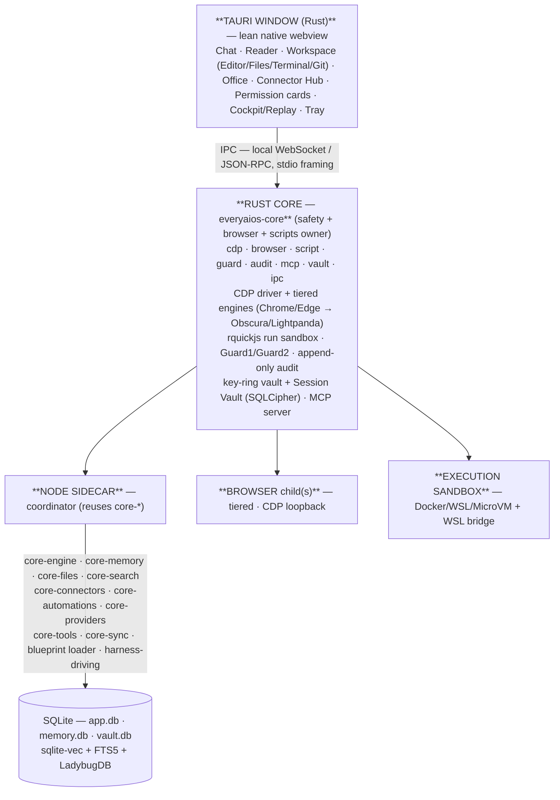
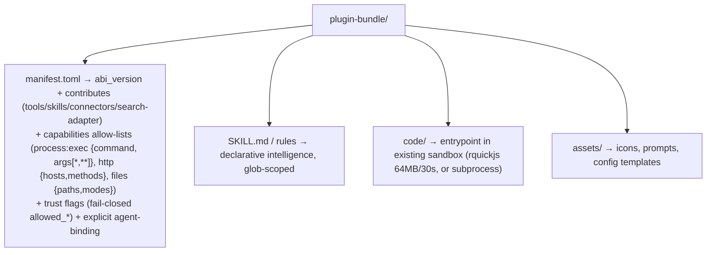
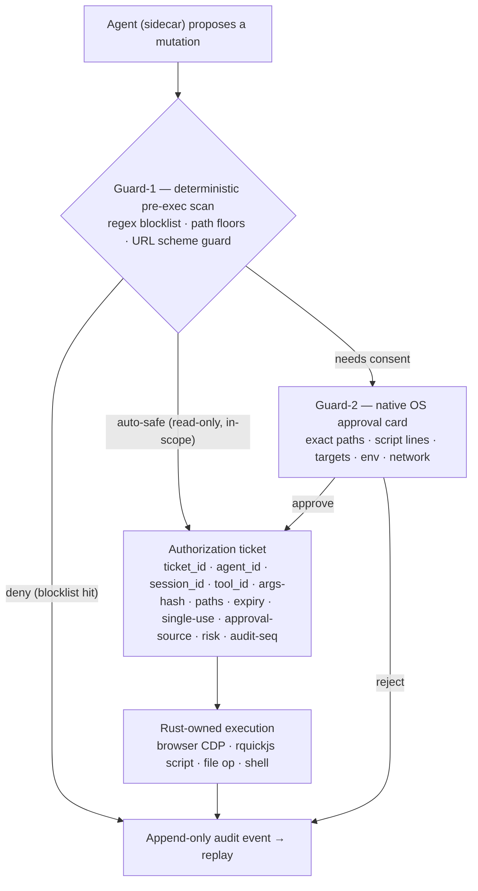
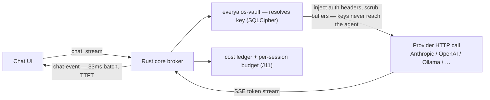
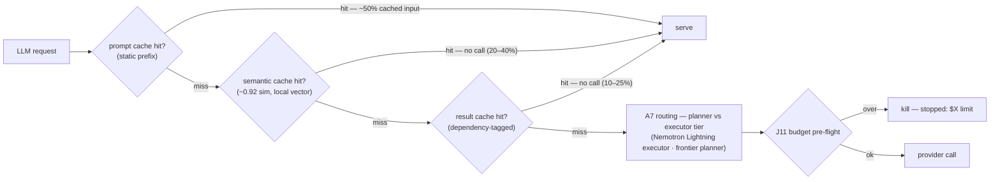
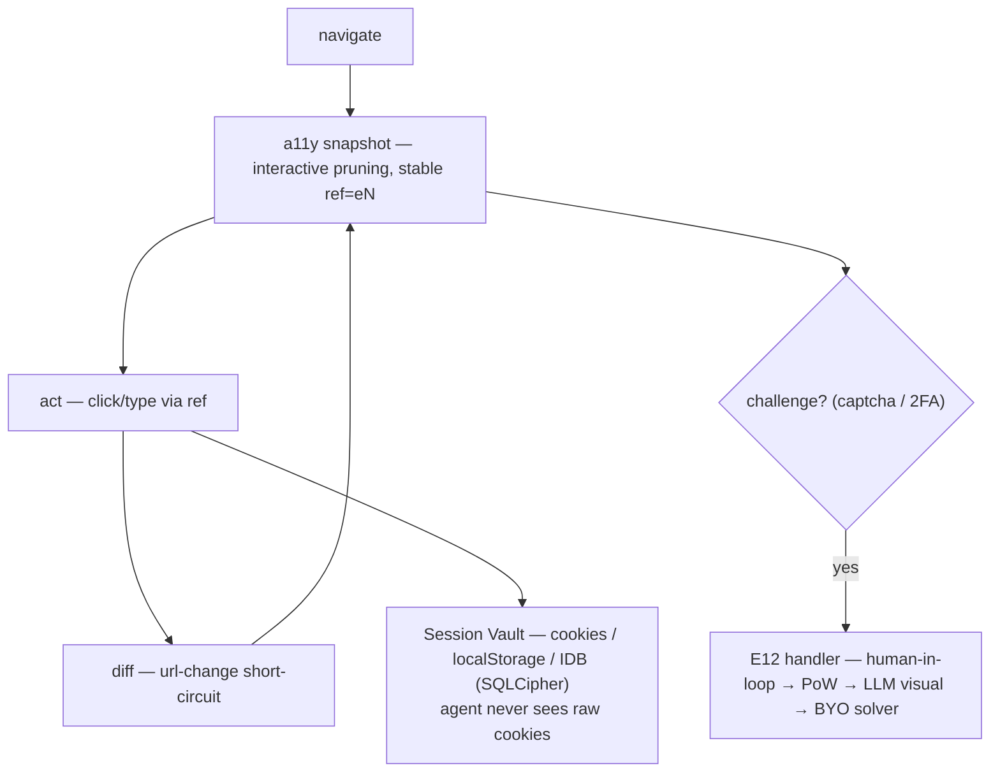
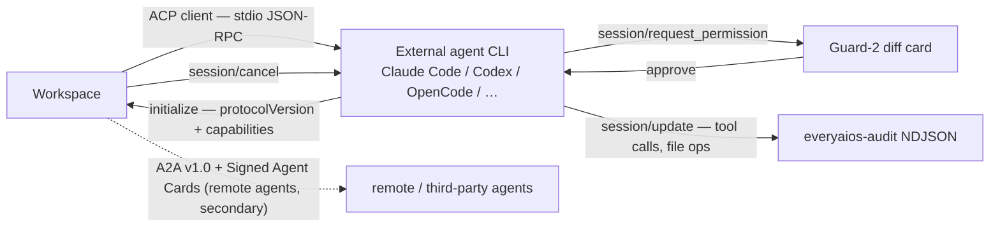
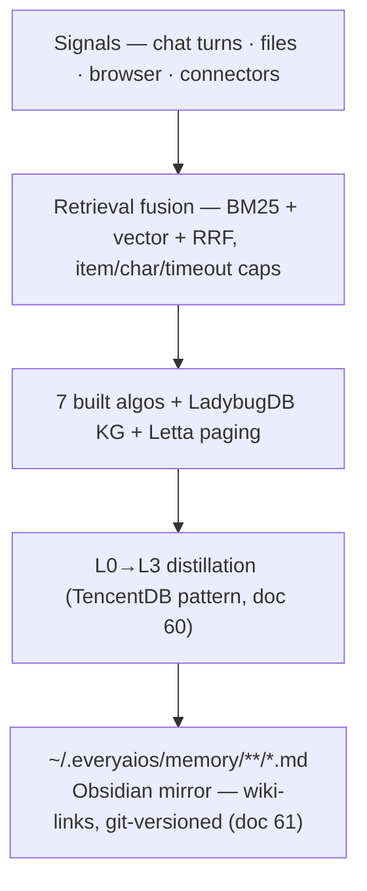
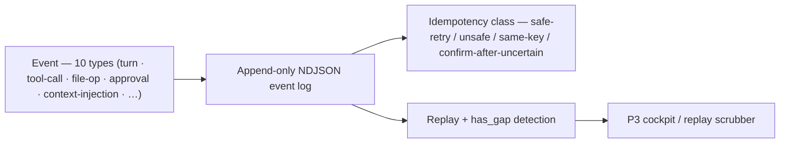

# DESKTOP-APP-SPEC.md — Complete Product Specification

> **Version:** v3.21 · **Date:** 2026-08-16 · **Supersedes:** v3.20
> **Version history:** see `SPEC-CHANGELOG.md` (archived 2026-08-10 — this file is a clean build document).
> **Source ground-truth:** `RESEARCH/desktop_app/` (docs 01–74, **281 repos**, ledger docs 27+46+47+48+49+50+52+54+55+56+57+58+60+61+62+63+64+65+66+67; doc 68 = final all-rounder market research + doc 69 = ACP ecosystem/harness deep-dive + doc 70 = MCP-directory inbuilt analysis + doc 71 = batch-4 coding agents/skills/harnesses + doc 72 = batch-5 code-intel/parallel/search + doc 73 = batch-6 computer-use/full-control + doc 74 = built-in MCP Server Manager, each **0 new repos**) + `desktop_app/ARCH/` (docs 00–12). Everything below traces to those; nothing is invented here.
> **This app is OPEN SOURCE, local-first, BYOK.** Nothing in the architecture requires a founder-run server — not now, not later.
> **IPC Architecture validated (doc 42):** code-verified against OpenFang `crates/openfang-kernel/src/kernel.rs` (20+ subsystems, RBAC, Merkle audit, DashMap abort handles) + ZeroClaw `crates/zeroclaw-api/src/lib.rs` (kernel ABI traits: ModelProvider/Channel/Tool/Memory/Observer/RuntimeAdapter). The "sidecar proposes, Rust disposes" axiom is production-proven — both systems use the identical kernel-with-syscalls model with capability-based security.

---

## 0. MASTER CAPABILITY & ALGORITHM INDEX (the contract — exhaustive, nothing cut)

> **Status legend:** 🟢 = exists & tested in `APP/packages/` (port/wire into desktop) · 🟡 = new to build · 🔵 = new-in-Rust (`crates/everyaios-*`) · ⚪ = later/optional · 🔁 = **TO BE RETESTED on desktop** (shipped on mobile, must re-run its test suite in the desktop runtime).
> **This index is the contract.** New capabilities are added *here first*, then to `ARCH/09`. Nothing is dropped from this list without a written decision in `ARCH/09`.
> **Totals (mirrors ARCH/09):** 148 rows · 🟢 27 · 🟡 67 · 🔵 60 · ⚪ 10 (multi-status rows counted in every bucket). 33 algorithms: 17 built (🔁 retest) + 16 new.

### A. Model & BYOK layer
| ID | Capability | Status |
|---|---|---|
| A1 | Multi-provider BYOK — anthropic / openai / responses / azure / bedrock / gemini / openrouter / deepseek / openai-compat / ollama / llamafile | 🟢+🔵 |
| A2 | **Multi-key per provider** — key rings: N keys/provider, priority + weight, per-key model filter, budgets, health | 🔵 |
| A3 | **Auto-failover rotation** — 429/401/5xx → cooldown → immediate next key; max-switches; all-fail backoff (**doc 59 upgrade:** lkgp sticky-to-last-good + reset-aware/headroom quota-aware pick + cache-optimized prefix-pin) | 🔵 |
| A4 | OAuth subscriptions — ChatGPT Pro (PKCE) / Copilot·Qwen (device-code), encrypted tokens, same fallback semantics | 🔵 (⚠️ ChatGPT Pro calls the unofficial `chatgpt.com/backend-api` endpoint — kept user-driven (Hermes/OpenCode pattern), ToS-risk documented (doc 57 §3), flag-gated) |
| A5 | Local models — Ollama managed + llamafile single-binary + **MLX (Mac, Rapid-MLX — doc 61)**; **agent-native class (doc 61): Muse Glimmer (30B dense, 120K ctx) + Nemotron 3.5 Lightning (30B MoE/3B active)** → retire the 15–20K ctx warning for this class; **doc 58:** llmfit hardware-fit picker before spawn — `recommend --json` | 🟢+🔵 |
| A6 | Model catalog + capability hints (tools/vision/ctx) — router picks per task (**doc 66:** baseline = models.dev catalog — MIT, 186 prov / 364 models, two-tier lab/provider schema + `base_model` override-only inheritance; **doc 58/59:** ingest OmniRoute's API-key/local/keyless catalog as the A6 long tail; cookie/OAuth classes = doc-57 reject list; **doc 68 §4:** agent-scoped model surface — hosted agents expose their own models via `available_commands`/config; full catalog only in the native-engine picker, never a global 364-model grid) | 🟢+🟡 |
| A7 | Asymmetric tiering — planner_model / subagent_models / depth=2 / concurrency=6 / writers=3 (**doc 59:** 13-factor weighted scorer + 4 mode packs + `auto/category:tier` DSL as the dynamic selection layer; **doc 62:** LangChain×Switchyard proof — 74% cheaper / 7% frontier calls across 145 tasks (Nemotron Lightning executor + Opus planner, escalate-by-floor not default); ACRouter C-A-F = post-v1 dynamic-learning tail; **doc 68 §4:** agent-scoped routing — hosted agents route on their own model surface, the native engine routes on intent-first tiers Fast/Quality/Private/Cheap) | 🟡 |
| A8 | Local OpenAI-compatible server — expose engine for VS Code/Cursor reuse | 🟡 |
| A9 | **Cache-aware costs + 3-layer cache stack (doc 62)** — cache_read/cache_write/$ per call, key-affinity (**doc 66:** per-model `input_cache_read`/`input_cache_write` pricing from the models.dev catalog feeds the cost engine + J11 budget gate); **prompt cache** (provider markers: Anthropic `cache_control:ephemeral`, OpenAI ≥1024-token prefix) + **semantic cache** (local vector, ~0.92 sim, 7d/24h TTL) + **result cache** (dependency-tagged invalidation, 3d TTL); read-only-intent only — never serves into mutation paths | 🔵 |
| A10 | **Image generation** — text-to-image + image-to-image (GPT-Image-1 / DALL·E 3 / Flux / Stable Diffusion / any MCP image server) as a provider endpoint; same key-ring + failover semantics (A2/A3); results as ref-handles, never raw in context (doc 50) | ⚪ |

### B. Agent orchestration
| ID | Capability | Status |
|---|---|---|
| B1 | Agent loop (pi-style) — streaming, length-guard (fail truncated tool calls), model-swap hook, cost ledger | 🟡 |
| B2 | Spec-driven blueprints — .md → agent registry; continuous plan rewrite; dependency resolution; resume-after-reboot; **plan cache (doc 62):** index plans by task signature (~0.85 sim, `plans.db`, version-based invalidation) before fresh planning inference | 🟡 |
| B3 | Sub-agents — role isolation, own context+workspace, DELEGATE_BLOCKED_TOOLS | 🟢+🟡 |
| B4 | Inter-agent messaging — peer-review, cross-check, sub-routines; no recursive spawn | 🟡 |
| B5 | Grammar-enforced extraction — ```blocks → tool calls (weak models); **local models use GBNF grammar constraints at the logit sampling layer** (llama.cpp/Ollama) — physically impossible to output invalid tool-call JSON; automatic fallback escalation to cloud model after 2 schema parse failures; **self-healing parse repair (doc 61):** attempt malformed-JSON repair (quote/brace/trim) before escalating | 🟢 |
| B6 | Iteration/subagent budgets — parent 500 / subagent 50 (Hermes, iteration_budget.py); **subagent_depth=2** (OpenCode); subagent timeout 900s custom / 1800s global (DeerFlow); max_concurrent_subagents=3 / max_total_per_run=6 (DeerFlow); execute_code refunded (Hermes); loop detector: 3x repeated args → interrupt (OpenCode); **on circuit-break: freeze DAG state at task boundary → present MCQ interrupt card (skip / retry with guidance / escalate model / manual override) → resume from frozen point without re-running completed steps** | 🟡 |
| B7 | Scheduled tasks — cron/interval/event/webhook; nudge sentinels (suggest_schedule); **event-driven triggers (doc 62, Gartner):** CI build-fail / test-regression / repo-change (push/PR/issue) / ticket-assign / telemetry-threshold, with scope+frequency policy controls; **heartbeat automations (doc 67 §2 — Hatchet lease pattern):** a scheduled run reawakens the **same conversation with its context intact**; worker heartbeat + missed-heartbeat → reassignment/resume from the last audit-event checkpoint | 🟢+🟡 |
| B8 | Crystallization — multi-step workflows → deterministic loops, **0 tokens** | 🟢 🔁 |

### C. Memory & context
| ID | Capability | Status |
|---|---|---|
| C1 | The 7 memory algorithms (see Algorithm Index below) | 🟢 🔁 |
| C2 | Multi-tier memory — sensory/working/episodic/semantic/procedural + Letta paging | 🟢+🟡 |
| C3 | Multi-signal retrieval — FTS5+vec+graph+temporal fusion + cross-encoder rerank (OpenWebUI steal) | 🟡 |
| C4 | Vectorless default — FTS5/BM25 without embeddings (98% savings pattern) | 🟢 |
| C5 | Embeddings (optional) — on-device bge-micro/gte-small, int8/vec0 | 🟢 |
| C6 | Knowledge graph store — LadybugDB embedded graph (Kuzu community fork, C++, ACID, Cypher, vector+FTS built-in), temporal edges | 🟡 (P5.2 ✅ — Rust-native graph store + schema + spreading activation + depth-cap; LadybugDB C++ FFI deferred) |
| C7 | Memory injection — warm set 0ms TTFT, scope-leakage floors, budgets | 🟢+🟡 |
| C8 | Sync/export/wipe — E2E-encrypted sync (opt-in), export, per-scope wipe; **doc 61:** Obsidian-compatible `.md` memory mirror (`[[wiki-link]]`s) + 20-min auto-fetch cadence (OpenHuman pattern — a view/export surface, not a second store) | 🟢 |
| C9 | **Taste profile** — auto-learned coding-preference profile (style/patterns/frameworks/naming) with confidence scores 0–1; shareable markdown (`~/.everyaios/taste/` + per-repo `.everyaios-taste/`); stable-prefix symbolic prior at generation; learns from accept/reject/edit via correction-detector + audit (Command Code taste-1 pattern — proprietary, pattern only) | 🟡 (P5.6 ✅) |
| C10 | **Pass-by-reference context** — files/datasets/tool results as live handles + bounded previews; agent queries/slices via sandboxed script-eval (E4) instead of loading payloads into context (NOOA pattern, doc 39) | 🟡 (P5.8 ✅ — ref handles + ≤2K previews; E4 script-eval query path = follow-up) |
| C11 | Temporal knowledge graph — Graphiti-pattern bi-temporal entity/fact tracking with validity windows | 🔵 |
| C12 | Cognee-pattern full-stack memory — KG + vectors + sessions on single Postgres/SQLite; **doc 61:** every memory asset also exports to `~/.everyaios/memory/**/*.md` (readable/git-versioned — OpenHuman validation; preserves doc-60 "one memory model") | 🔵 |
| C13 | **Spaced-repetition reinforcement (FSRS)** — port anki's Rust FSRS scheduler (`rslib/src/scheduler/fsrs`) into `everyaios-memory`: retention-target scheduling, reschedule-on-review, simulator; user-facing "reinforce what I learned" review prompts at optimal intervals (doc 63 §2.2) | 🔵 |

### D. Office & files (user-critical)
| ID | Capability | Status |
|---|---|---|
| D1 | **Word open+edit** — block-patch engine, byte-preserving w:t, headers/tables/sections | 🟡 (P4.1 ✅) |
| D2 | **Excel open+edit** — IronCalc recalc + calamine read + workbook DSL + deterministic planner + flash-fill/pivot (**doc 58:** Univer = the H5 *view* surface; surgical patch + IronCalc = the mutation engine — one calc engine, not both) | 🟡 (P4.2 ✅) |
| D3 | **PPT open+edit** — surgical OOXML part editing (slides), add/remove slides, text/shape ops (**doc 58:** ppt-master = the "author a new deck" path — template-clone + chart/table model, native shapes not images) | 🟡 (P4.3 ✅) |
| D4 | **PDF open+edit** — render (pdf.js), form-fill/annotate (pdf-lib), text-swap (lopdf), redact, re-author | 🟡 (P4.4 ✅; pdf.js renderer → P4.7) |
| D5 | Universal read/ingest — markitdown-class extraction → RAG, chat overlay | 🟢 |
| D6 | Round-trip conformance — LibreOffice oracle in CI, byte-stability asserts | 🟡 (P4.5 ✅) |
| D7 | Rollback — snapshotBefore, atomic writes | 🟡 (P4.5 ✅) |
| D8 | Legacy formats — .doc/.xls/.ppt → convert-on-open, read-only | 🟡 (P4.6 ✅) |
| D9 | **Storage intelligence** — parallel work-stealing disk walker (crossbeam-deque) + immutable arena snapshots (arc_swap, ~100ms cadence, zstd save/load) + squarified treemap + per-dir aggregation; cleanup actions Guard-2-gated (eDirStat/WinDirStat patterns, doc 49) | 🟡 (P4.8 ✅) |
| D10 | **Duplicate detection by hash** — 7-stage pipeline (size → xxHash3 prefix/suffix → BLAKE3), hardlink-aware, optional reflink (btrfs/xfs/apfs), group reports (fclones + eDirStat ordering, doc 49) | 🟡 (P4.8 ✅) |
| D11 | **Large-file finder** — top-N by size/age + filters + cleanup actions | 🟡 (P4.8 ✅) |
| D12 | **Storage health & analytics** — drive-threshold monitoring (e.g., 90% full), agent-suggested cleanup plans (duplicates/large files/old caches) with Guard-2 approval, dashboard (free space, top files, duplicate counts, trends) (doc 52) | 🟡 (P4.8 ✅) |

### E. Browser & computer use
| ID | Capability | Status |
|---|---|---|
| E1 | CDP child browser — system Chrome/Edge + chrome-for-testing fallback | 🔵 |
| E2 | **37-tool catalog** (34 core + 3 `file_ops`; ARCH/08 §8.2) — 17 core (tabs..run) + enhanced_snapshot + bookmarks×6 + tab-groups×5 + window×5; + `file_ops`×3 workspace extension (→ 37 total); **post-v1 candidates (doc 55):** `a11y_audit` (axe-core), annotated screenshots, `find` semantic locators, batch mode | 🔵 |
| E3 | A11y snapshot/diff — refs [eN], interactive mode, URL-change short-circuit, iframe stitching (P2.2 ✅) | 🔵 |
| E4 | Script-eval (run) — rquickjs sandbox + browser SDK + InnerCallHook | 🔵 (P2.5 ✅) |
| E5 | Session replay — injected recorder → NDJSON → SQLite; scrubber UI; has_gap | 🔵 (P2.10 ✅) |
| E6 | Tab ownership — mine/user/other-agent; claims; group-per-agent | 🔵 (P2.6 ✅) |
| E7 | Login import/sessions — capture-in-browser (vault path 1); optional Chrome profile import (path 3) | 🔵 |
| E8 | Authenticated scraping — logged-in sessions → tiered scrape → RAG | 🟡 |
| E9 | Computer-use (pixels) — GUI control (post-v1, gated; patterns: Atlas, **Agent-S** GUI grounding, **trycua/cua** sandboxed desktops, **OSWorld** harness for continuous eval — docs 48/52; pixel-based stays post-v1 per §8 non-goal) | ⚪ |
| E10 | **Lightweight engine tier** — Lightpanda (Zig, **default**, AGPL, ~16× less memory) + **Obscura (Rust, opt-in — 21K★ source-verified doc 55: own CDP server + LP.getMarkdown, embedded MCP, scrape workers, SSRF/file:// defaults, ~30MB RSS; spawn-only child process)** via CDP; tier 0 static → 1 lightweight → 2 full escalation | 🔵 |
| E11 | **Session Vault** — multi-account per site, encrypted **full storage context** (cookies + localStorage + sessionStorage + IndexedDB, Chrome leveldb decode, persist/restore — doc 55) in SQLCipher, Trust-Ladder-gated access (agent never sees raw cookies), rotation, usage audit, expiry nudges | 🔵 (P2.7 ✅) |
| E12 | **Challenge handler** — PoW captchas solved locally + LLM visual-grounding + human-in-loop pass-through (default) + optional BYO solver API (user key) | 🔵+🟡 (P2.8 ✅) |
| E13 | Session inheritance — live-attach to user's own Chrome profile via CDP debug port (vault path 2, no re-login) | 🔵 (P2.7 ✅) |
| E14 | Behavioral realism — humanized input events (Bézier mouse curves, typing cadence), optional per-site | 🔵 (P2.9 ✅) |
| E15 | **Electron-app CDP automation** — attach to any Electron app's debug port (VS Code/Slack/Discord/Spotify/Notion...): a11y snapshot, click/fill/read, screenshot, via the existing CDP stack (agent-browser pattern, doc 63 §4.1) | 🔵 |
| E16 | **Slim snapshots + WebMCP** — `snapshot(slim: true)` mode (drop non-actionable nodes, collapse long text, depth cap — chrome-devtools-mcp `SlimMcpResponse` pattern) + web-native MCP handshake support (WebMCP); token-economy lever on every browser turn (doc 63 §4.2) | 🔵 |
| E17 | **Multi-protocol action parsing** — per-provider action-protocol adapters (native / CUA / Anthropic / UI-TARS) behind the router, so any BYOK provider's action format drives the same browser layer (skyvern `parse_actions.py` pattern, doc 63 §4.3) | 🟡 |

### F. Connector hub
| ID | Capability | Status |
|---|---|---|
| F1 | Hub routing — native → Composio → Zapier → Nango → Auth Bridge; no double-connect | 🟢+🟡 |
| F2 | Native adapters — 27+ direct | 🟢 |
| F3 | Browser-session connectors — drive logged-in web apps via browser layer | 🔵+🟡 |
| F4 | Local Auth Bridge — project PKCE client, no secret, local token manager | 🔵 |
| F5 | Composio/Zapier/Nango — user-key, self-hosted/optional (never required) | 🟢 |
| F6 | MCP client (consume) — connect external MCP servers, reconcile; **doc 61:** cacheable tool lists (`ttlMs`) + MRTR long-running-ops (2026-07-28 spec); **doc 62:** managed live-data MCP (MongoDB/Postgres/SQLite) = consume-path only — query/inspect/update live operational data (F15 already = Calendar, no new row) | 🟢 |
| F7 | MCP server (serve) — our tools to Claude Code/Codex/Cursor/... via one endpoint; **doc 61:** cacheable tool lists (`ttlMs`) + MRTR (2026-07-28 spec); **two-channel injection — Channel B (doc 68 §4):** serve Office surgical editor + IronCalc, browser 37-tool catalog + Session Vault, search cascade (G8), memory retrieval (C-series), storage intelligence as MCP tools — any MCP-consuming agent gets our full capability set | 🔵 |
| F8 | Harness installer — plan-before-touch install into the **F12 harness set (9 CLIs — list lives in F12)**, ownership markers (doc 33 §8 harness-integrations pattern); **registry-fed discovery from the official ACP agent registry** (doc 57 §2 — CDN catalog + local cache + version pinning + curated allow-list) | 🔵 |
| F9 | Unified Tool Registry — one normalized ToolDefinition + permission classes; **adopts the ACP tool-kind taxonomy** (read/edit/delete/move/search/execute/think/fetch/other, doc 45 §4.3) | 🟢 |
| F10 | WSL/POSIX bridge — `wsl.exe` runners, `\\wsl.localhost\` paths, loopback IPC, native Linux exec | 🟡 |
| F11 | Port/network hooks — async loopback listeners, inbound/outbound monitor, webhook ingress — gated; **browser network containment (doc 55/06 §6.15)**: WebRTC disable + worker fail-closed under allowlist, SSRF-defaults (loopback/RFC1918 blocked), `file://` blocked | 🔵 |
| F12 | **Harness-driving** — drive user's existing agent CLIs (Codex/**Claude Code/Claude Agent via official ACP wrapper**/Cursor/Grok/OpenCode/**Aider**/Cline/Pi/**Copilot CLI**/**CodeWhale** — doc 56/57/58) side-by-side on the same workspace — own context each, shared files + session state, Trust-Ladder-gated (OpenWebUI Computer pattern). **External interface = ACP (Agent Client Protocol)**: our app is the Client; stdio JSON-RPC; `session/request_permission` → Guard-2 diff-cards; `session/update` → audit NDJSON; `session/cancel` → watchdog/budget kill points (doc 45); **discovery via official ACP agent registry (doc 57 §2)** — any registered agent installs through the same F8→J17 path; **auth-mode badge** (subscription-backed / API-key-backed / local) on every harness (doc 57 §3 — Claude OAuth works only inside the official wrapper/CLI); **two-channel injection — Channel A (doc 68 §4):** ACP mediates I/O — `fs/read` → slim/bounded previews + pass-by-reference (C10), `terminal/output` → RTK compression, `terminal/create` → Guard-1 + audit, `fs/write` → Guard-2 ticket + diff card — token-minimizing + surgical + guards at the protocol boundary for any hosted agent | 🟡 |
| F13 | **Messaging bridges** — **desktop-first** (in-app, not a headless 24×7 daemon): email/Telegram/WhatsApp adapters to the same engine first (Hermes/OpenClaw patterns, docs 36/39 §B1); Signal/iMessage + always-on daemon deferred. Desktop-first = the agent lives in the open app, messages arrive as in-app cards; no CLI→headless→desktop migration path (we start desktop) | 🟡 |
| F14 | **Email connector** — Gmail API via Auth Bridge OAuth (vault-stored tokens) or IMAP/SMTP (imapflow / async-imap + lettre); read/search/send/reply/triage tools; browser-session as last resort (openonion/email-agent reference, doc 50) | 🟡 |
| F15 | **Calendar connector** — Google Calendar API + ICS; event CRUD, availability, nudge integration with scheduled tasks (B7) | 🟡 |

### G. Search & research
| ID | Capability | Status |
|---|---|---|
| G1 | Free search cascade — searxng-first + public instances + circuit breaker + BM25 rerank; **SQLite result cache (5-min TTL) + parallel top-N fetch cascade** (searxng-mcp 4-tier pattern, doc 52 §4) | 🟢 |
| G2 | Deep research — breadth×depth tree, learnings-up, gap-check, cited reports (Vane pipeline validates) | 🟢+🟡 |
| G3 | Multi-channel search — arXiv/GitHub/EDGAR/Reddit adapters | 🟡 |
| G4 | Data-analysis REPL — sandboxed pandas/numpy for CSV/Excel/SQLite | 🟡 |
| G5 | Repo-wide engineering — scan/dep-map/test-loop/patch in workspace | 🟡 |
| G6 | Site/domain search — SeekStorm-class inverted index for local corpora | 🟡 |
| G7 | **Instant filename/content search** — SQLite FTS5 filename index + notify-watcher incremental updates + optional OS-native hooks (Everything/MFT, mdfind, Baloo); Everything/UltraSearch UX, cross-platform (doc 49) | 🟡 (P4.8 ✅) |
| G8 | **Tiered search cascade & cache** — cached instant tier (SQLite, 5-min TTL) → optional Rust metasearch (**WebSurfx**, ~20–40MB) → SearXNG → external fallback via circuit breaker; parallel fetch cascade so a 50-page baseline completes in ~single-page time; BM25 rerank at each tier (doc 52 §4, Algorithm #33) | 🟡 |

### H. UI & product
| ID | Capability | Status |
|---|---|---|
| H1 | Chat — streaming, token streamer, message branching, artifacts (with version-selector preview pane) | 🟢 |
| H2 | Cockpit dashboard — **Ambient Flight Deck pattern**: quiet mode (single-sentence tray status "EveryAIOS: Updating report...") + slide-over panel (live action cards, token counters, STOP/UNDO); **MCQ interrupt cards** on circuit-break (actionable choices: skip/retry/escalate/manual); Watch/Stop per agent | 🟡 (P3.2 ✅) |
| H3 | Audit + replay UI — searchable sessions, per-step screenshots, scrubber | 🟡 (P3.1 ✅) |
| H4 | Blueprint editor — live execution status on .md | 🟡 |
| H5 | Office editors — docx/xlsx/pptx/pdf views + chat overlay (**doc 58:** evaluate Univer SDK as the office surface — Sheets first, Docs next, Slides last; OSS/Pro split) | 🟡 (P4.7 ✅; pdf.js canvas + notes panel → follow-up) |
| H6 | Reader — PDF/EPUB/web/markdown universal | 🟢 |
| H7 | Math + code rendering — KaTeX, syntax highlight + run/compile | 🟢 |
| H8 | Permission cards — Guard-2 diff cards, trust ladder UI | 🔵+🟡 |
| H9 | Token/cost analytics — per-key/per-session dashboard | 🔵+🟡 |
| H10 | Personality — SOUL.md, user-tunable, core rules inviolable | 🟡 |
| H11 | Tray daemon — watchers + automations headless | 🔵 |
| H12 | Telemetry — opt-in, enumerated fields, no content | 🔵 |
| H13 | Local OpenAI-compatible server UI | 🟡 |
| H14 | Scheduled tasks UI — nudge cards + settings | 🟡 |
| H15 | Voice input (VAD) — hands-free chat; offline STT options (Vosk / sherpa-onnx / whisper.cpp) + optional wake word (openWakeWord) (doc 50) | ⚪ |
| H16 | Magic-completion — AnythingLLM-style inline completion | ⚪ |
| H17 | **Widget cards** — weather/stock/math/lookup inline in chat (Vane pattern) | 🟡 |
| H18 | **Remote session handoff + mobile companion** — LAN/Tailscale/tunnel view; resume from phone mid-run (opt-in; extends B2 resume + C8 sync); **doc 68 §3:** Cowork/Work ship a phone *surface* (monitor/steer, not just handoff) — a mobile companion app is a distinct post-v1 item (remote control vs mobile surface) | ⚪ |
| H19 | **Progress steps panel** — unified timeline of all agent actions (shell+code+browser+office), clickable entries, timestamps | 🔵 |
| H20 | **Activity rail + one-surface views (work cockpit, doc 67 §6)** — 48px right rail (Folder/Shell/Browse/Code) + ONE Office button → flyout (Sheets/Word/Slides/PDF, never 4 peer tabs; .xlsx → auto-selects Office→Excel) + session views (Progress/Diff/Audit/Storage) + `+` Add view; views contract `ViewDefinition{id,icon,label,group:core|office|session|plugin,when,open}` (first-party + plugins register identically — I6 dogfood); per-session layout persistence (activeViewId/railCollapsed/splitRatio/browseMode/composerMode); chat + now-doing never unmount on collapse | 🔵 |
| H21 | **Takeover/resume flow** — pause agent → user edits → resume with mandatory change description | 🔵 |
| H22 | **Automation builder (NL + templates)** — event-driven workflow creation with NL input + 10+ pre-built templates; **doc 61:** visual node-graph editor surface (Flock/tinyflows pattern, ReactFlow-class) | 🔵 |
| H23 | **Knowledge browser (trigger+macro)** — browse/edit knowledge items with trigger recall, macros, folders, repo-pinning | 🔵 |
| H24 | **MCP marketplace** — browse/install/manage MCP servers with status indicators and categories | 🔵 |
| H25 | **Generative UI (AG-UI)** — live agent-emitted components in chat (AG-UI wire protocol, ~16 event types, single channel); sandboxed iframe + strict CSP + process isolation (Anthropic Artifacts pattern); artifact cards upgrade from static previews to live components (doc 50) | 🔵 |
| H26 | **Clipboard tool** — read/write/history system clipboard (arboard), guard-ticketed (read = read-only tool; write = mutation) | ⚪ |
| H27 | **Resumable streams** — coordinator-held in-flight stream state, auto-reconnect + resume from last token/id (LibreChat pattern); no lost replies on drop/refresh/suspend | ⚪ |
| H28 | **Voice output (TTS)** — offline sherpa-onnx default (Apache-2.0, active; hosts Piper VITS voices — ⚠️ rhasspy/piper archived) + optional BYOK cloud TTS (OpenAI/ElevenLabs) | ⚪ |
| H29 | **Local dashboard artifacts (the local-first "Sites", doc 67 §1)** — agent generates a mini web-app (dashboard/report/app) into a guarded workspace folder; `everyaios-script` sandbox serves it on `127.0.0.1:<port>`; previewed in the views rail with device frames (bolt.diy pattern — typed agent→runtime action stream `BoltAction`, `ActionRunner` state machine, live preview); Guard-2-ticketed serve/stop | 🟡 |

| H30 | **Voice memo → structured report (doc 68 §3)** — speech-to-text (H15) → transcribe → agent synthesizes into a polished document (Word block-patch D1 / markdown / email F14); the end-to-end workflow Cowork advertises ("reports from messy inputs"); I/O rides H15/H28 (STT/TTS, both deferred) | ⚪ |
| H31 | **Corpus-first research surface + audio digest (doc 68 §2.2)** — pick sources (files/folders/URLs/emails) → grounded, cited answers + mind-map/report artifacts (Gemini-Notebook-class); reuses C-series RAG + G2 deep research + EV1 citation fidelity; **audio-digest output** (podcast-style Audio Overview) rides H28 TTS — post-v1 | 🟡 |
| H32 | **Agent picker + agent-native command surface (doc 68 §4)** — pick an agent (F12/J17 ACP registry) → `initialize` capability card → composer renders the agent's live `available_commands` + `@` + mode indicator (one UI, per-agent vocabulary); **agent-scoped model surface**: hosted agents expose their own models via `available_commands`/config — the full models.dev catalog (A6) lives only in the native-engine picker (intent-first + power-user drawer) | 🟡 |

### I. Forge & skills
| ID | Capability | Status |
|---|---|---|
| I1 | Code synthesis loop — write→sandbox→test→iterate | 🟡 |
| I2 | Skill registry — `~/.everyaios/skills/` (Codex `~/.codex/skills`-style convention), manifest + ownership markers, auto-inject into planner; **SKILL.md format alignment** (name/description/allowed-tools frontmatter + references/ — agent-browser `skill-data`, doc 55) so our skills work with the ecosystem (**doc 58:** taste-skill = optional first-party *design* skill — ≠ C9, the *learned coding-pref* profile (algorithm #31); GenericAgent = self-growing skill tree — every solved task → a Skill, ~100-line loop/9 atomic tools — adapt the discipline, never the runtime) | 🟡 |
| I3 | WASM fuel-metered sandbox — compute budget + epoch kill | ⚪ |
| I4 | TDD loop — auto-generate tests, read stderr, rewrite | 🟡 |
| I5 | ECC guardrails — plan-before-build, session scanning (**doc 58:** better-harness 5-dimension loop self-audit as the post-session report — evidence-bounded, "missing evidence stays explicit") | 🟡 |
| I6 | **Extension/plugin ABI** — versioned bundles (`abi_version` in manifest, cumulative host adapters like Zed's WIT `since_v0_0_x`), typed manifest with `contributes` (tools/skills/connectors/search-adapter) + `capabilities` allow-lists (**per-command/arg wildcards `*`/`**` — Zed `CapabilityGranter`), per-extension trust flags fail-closed (Hermes `allowed_*`), explicit agent-binding (never global — Cherry Studio), lazy activation (VS Code), host-owned facades (`ctx.llm`/`ctx.files`/`ctx.approval`), dogfood rule (first-party features ship as plugins — bootstrap caveat: P4–P6 features are built directly into crates and migrated to bundles once the ABI lands in P7) (doc 44 §5); **doc 61:** DeepSeek Harness/Cordis (93K⭐ MIT) independently ships this exact model — add **loop / scheduler / sandbox / session-store** to the plugin-slot taxonomy so a future "swap the loop" isn't a core rewrite | 🟡 |
| I7 | **RepoMap (tree-sitter + PageRank) + Warp semantic index (doc 56)** — deterministic context selection (tag extraction, graph building, personalized PageRank, binary-search budget fitting, zero embeddings) + **optional semantic layer** (Warp merkle-tree incremental embedding index — one crate, two query paths) gated behind C5 (**doc 58:** future *third* path = codebase-memory-mcp symbol-KG + crux SCIP — spawn-only, never "run all and fuse") | 🔵 |
| I8 | **Edit strategy pattern (per-model)** — multiple edit formats (SEARCH/REPLACE, udiff, whole, patch) with fuzzy matching, selected per model | 🔵 |
| I9 | **Architect mode (two-pass)** — reasoning model → editor model split for code changes (aider-reported 82.7% benchmark — doc 51); **composes with F12 surgical hierarchy (surgeon tier may run the two-pass); distinct from the oracle/review pass (TODO P11.5.10)** | 🔵 |
| I10 | **File watcher + AI comments** — watch source files for `// ai!` markers, extract context, auto-submit to agent | 🔵 |
| I11 | **LSP code-intel** — one LSP client (neovim `runtime/lua/vim/lsp/*` reference): hover/docs, go-to-def, references, rename-with-preview, diagnostics, code actions, inlay hints, watchfiles; guard-ticketed (read = read-only, rename/apply = mutation); makes TODO P7.1 concrete (doc 63 §2.1) | 🔵 |

### J. Cross-cutting security
| ID | Capability | Status |
|---|---|---|
| J1 | Trust Ladder — 0–100 graduated permissions | 🟢 🔁 |
| J2 | Guard-1 regex interceptors — compiled blocklist, pre-exec scan | 🔵 |
| J3 | Guard-2 diff cards — native click-to-approve, non-bypassable (web sensitive-action confirm dialogs included) | 🔵 |
| J4 | Path/scope hard-floors — canonicalization, symlink-safe boundaries | 🔵 |
| J5 | Audit trail — append-only, token estimates, receipts, replay; **durable event log + idempotency classes (doc 53 §4: safe-retry / unsafe / same-key / confirm-after-uncertain)**; **doc 61:** add "context injection" as a logged event type + inspect-by-source Trajectory view (DeepSeek Harness traceable-stream pattern → TODO P5.9) | 🔵 |
| J6 | Prompt-injection defense — `<user_document>` wrapping, context scan, tool-result sanitization | 🟡 |
| J7 | ProcessSupervisor — spawn/restart/backoff/circuit-breaker | 🔵 |
| J8 | Key vault — SQLCipher, CES executor, crash scrubbing; **named principle: "keys never reach the agent"** (broker injects auth headers, doc 53 §2; nilbox Zero-Token validation, doc 61) | 🔵 |
| J9 | Config-as-files — everyaios.toml + agents/*.md + providers.toml | 🟡 |
| J10 | Watchdog — connect/idle timeouts re-armed per byte | 🔵+🟢 |
| J11 | **Hard $ budget per session** — default $2.00/agent, configurable; enforce via core-providers `live-pricing` + sqlite counters; kill sidecar on exceed; surface "stopped: $X limit" to UI; reasonix token discipline as upstream brake; **doc 62:** per-task budgets are mandatory (50–150× cost variance easy→hard); add the `lower_cost` profile (cost_gate/thinking_budget 1K/context_budget 8K/max_iterations 6 — OpenCastor shape) | 🟡 |
| J12 | **Orphan-prevention on Rust death** — Linux `prctl(PR_SET_PDEATHSIG, SIGTERM)` (code-verified in supervisor.rs); Windows Job Object with `JOB_OBJECT_LIMIT_KILL_ON_JOB_CLOSE`; macOS process group via `posix_spawn`; belt+suspenders parent-PID polling every 5s in sidecar (Mitigates TC-1.1 landmine, doc 43) | 🔵 |
| J13 | **Sidecar heap safety** — `--max-old-space-size=512`; self-restart at 80% heap used; controlled by ProcessSupervisor from last Hermes checkpoint (20snap/500MB); 30min session → forced rotation (Mitigates TC-4.2 landmine, doc 43) | 🔵+🟢 |
| J14 | **Distributed tracing** — OpenTelemetry Rust↔Node with shared `trace_id`; audit table gains `trace_id` + `span_id` columns (Agno-validated pattern, Mitigates TC-2.3 landmine, doc 43); agent-session observability references: agentlens (local coding-agent traces), agentsight (eBPF system-level) (doc 52) | 🟡 (P3.3 ✅) |
| J15 | **Length-prefixed IPC framing** — `[u32 LE length][bytes payload]`; bounded channels (capacity=16) with backpressure; truncation tag → `ref:` handle (Mitigates TC-2.2 landmine, doc 43) | 🔵 |
| J16 | **Process lifecycle hardening** — UNIX-domain socket preferred over TCP for sidecar (zero port collision); pre-spawn `coordinator` at Tauri boot (hidden, 200ms perceived cold start, Bun-compiled binary — measured 2026-08-13: `~/.bun/bin/bun` = 92.7MB); keep sidecar warm 5min idle before kill; **battery-aware scheduling**: suppress heavy background indexing/embedding on battery power (detect via OS power APIs), defer to AC power or >5min idle (Mitigates TC-1.2/1.3/1.4 landmines, doc 43) | 🔵 |
| J17 | **ACP harness bridge** — ACP client over stdio JSON-RPC (official `agent-client-protocol` Rust crate or `@agentclientprotocol/sdk` in coordinator) for F12; `initialize` handshake (protocolVersion + capability negotiation, optional-by-default = our ABI-versioning model); `session/request_permission` → Trust Ladder + Guard-2 cards; `session/update` (tool calls, file ops) → everyaios-audit NDJSON; `session/cancel` + stop-reasons → watchdog/budget kill points; v2-draft monitored (structured diff + `git_patch` → diff-card renderer) (doc 45 §4–6); **generalized-client reference: Hermes issue #5257** (`copilot_acp_client.py` → generic `ACPClient` + `acp_agent_registry.py` — drives Claude Code/Codex/Gemini CLI as ACP agents, doc 57 §2); **A2A = secondary interface (doc 61):** ACP drives local CLIs (F12); A2A v1.0 + Signed Agent Cards for remote/third-party agent discovery & identity (J21); AP2 noted post-v1 | 🟡+🔵 |
| J18 | Profile-gated hooks — minimal/standard/strict security enforcement profiles | 🔵 |
| J19 | Merkle hash-chain audit — cryptographic tamper-evident append-only log | 🔵 |
| J20 | AgentShield config scanning — scan everyaios.toml/blueprints/MCP for injection | 🔵 |
| J21 | **Escalation rules & decision packages** — `permissions.toml` policy layer (delete=always_ask, multi_file_edit=ask_if_gt_5, external_network=ask_if_new_domain, terminal_shell=ask_if_destructive), `min_confidence_for_auto` threshold, structured **decision package** (goal + proposed diff + risk + affected paths) passed up the chain and rendered as Guard-2 cards; approvals/denials feed correction-detector + taste profile (doc 52 §2); **ticket contract formalized (doc 53 §3)** — ticket_id/agent_id/session_id/tool_id/operation/args-hash/paths/expiry/single-use/approval-source/risk/audit-seq, enforced by everyaios-guard | 🟡 |

### ALGORITHM INDEX (all algorithms in the product — status + retest flag)

> **🔁 TO BE RETESTED** = shipped as tested TypeScript in `APP/packages/` (mobile-verified) — **must re-run its test suite + re-benchmark on the desktop runtime before it counts as done here.** The desktop target changes I/O (webview IPC, sidecar process model, Rust browser layer), so "shipped" ≠ "verified here".

**Built algorithms (shipped, tested in `APP/packages/`) — 🔁 TO BE RETESTED:**
| # | Algorithm | Where | Tests | Retest |
|---|---|---|---|---|
| 1 | **Forgetting-to-Remember** — polarized retention; negative lessons suppressed in normal recall, top-ranked for defensive queries (`POLARITY_SUPPRESSION=0.6`, `POLARITY_OVERLAP_FLOOR=0.4`) | core-memory/forgetting-to-remember | 17 | 🔁 |
| 2 | **Hallucination Risk Compass** — empirical grounding score (retrieval confidence, coverage, hedging density); risk-band gating | core-engine/risk-compass | ✓ | 🔁 |
| 3 | **Phantom Thread** — activity-aware memory pre-loading, warm set, 0ms TTFT, leakage floors | core-memory/phantom-thread | 9 | 🔁 |
| 4 | **Temporal Graph Anticipation** — weekly-rhythm prediction, morning briefs, beats recency by >15pts | core-memory/temporal-anticipation | ✓ | 🔁 |
| 5 | **Crystallization Engine** — compile non-cognitive workflow steps to deterministic 0-token loops | core-automations | ✓ | 🔁 |
| 6 | **Spreading-Activation Retrieval** — graph proximity + per-hop decay + lateral inhibition, re-ranks FTS5/vector | core-memory/spreading-activation | 11 | 🔁 |
| 7 | **Trust Ladder** — 0–100 graduated permissions; destructive ops always behind manual confirmation | core-tools/trust-ladder | 15 | 🔁 |
| 8 | Knowledge-graph build — entity/triple extraction + LLM refinement + conflict resolution | core-memory/{knowledge-graph,kg-extraction,kg-llm-refinement,conflict} | ✓ | 🔁 |
| 9 | Correction detector + auto-promote (frustration/retry → pattern promotion, `PROMOTION_THRESHOLD=3`) | core-memory/{correction-detector,auto-promote,correction-store} | ✓ | 🔁 |
| 10 | Memory decay (Ebbinghaus) + familiarity/forgetting visualizers | core-memory/decay | ✓ | 🔁 |
| 11 | Working + episodic memory layers, fact extraction, memory injection + export | core-memory/service + core-files | ✓ | 🔁 |
| 12 | Retrieval confidence scoring + source-lineage tracking | core-files | ✓ | 🔁 |
| 13 | On-device embeddings (bge-micro-v2 / gte-small ONNX), int8/vec0, HNSW-style index, hybrid BM25+vector | core-files | ✓ | 🔁 |
| 14 | Adaptive query rewrite + RAG chunking + hybrid-search | core-files/indexing | ✓ | 🔁 |
| 15 | Circuit-breaker / backoff / alarms (rate discipline) | core-automations | ✓ | 🔁 |
| 16 | Cache-aware cost accounting (base: cost tracking shipped, pi EMPTY_USAGE pattern) — **Rust per-call ledger + key-affinity = new (A9)** | core-providers/core-ai | ✓ | 🔁 (base) / 🟡 (A9) |
| 17 | 3-stage agent loop: RetrievalPlanner → ToolPlanner → PermissionGate (≤5 tool rounds + extra-final guard) | core-engine | ✓ | 🔁 |

**New algorithms (to build for desktop — no retest flag, marked by pillar):**
| # | Algorithm | Where | Status |
|---|---|---|---|
| 18 | Multi-signal retrieval fusion (mem0 SOTA: semantic + BM25 + entity-graph fused score; +29.6 temporal / +23.1 multi-hop claims) | C3 | 🟡 (P5.1 ✅) |
| 19 | Cross-encoder hybrid rerank (OpenWebUI chunk-merge + rerank steal) | C3 | 🟡 |
| 20 | Agent-managed context paging (Letta pattern: core/archival/recall) | C2 | 🟡 (P5.3 ✅) |
| 21 | Compaction pipeline — **base tiered-compaction/context-compressor shipped** (🔁); Reasonix ratio knobs (snip 0.6 → soft 0.5 → force 0.9) + byte-stable prefix = new | 05 / core-ai/context | 🔁 + 🟡 (P5.7 ✅) |
| 22 | Lossless prompt compaction — multi-agent logs → dense anchors + frozen-snapshot MEMORY.md | 05 | 🟡 |
| 23 | Key-ring rotation/failover (cooldown ×2^failures, cap 5min; max 3 switches/call) | A2/A3 | 🔵 |
| 24 | Session rotation across accounts (429/blocked/expired → next authorized account) | E11 | 🔵 |
| 25 | PoW captcha solver (Altcha/Friendly Captcha — SHA-256 leading-zero puzzle; Turnstile is Cloudflare-managed, never locally solvable) | E12 | 🔵 |
| 26 | Behavioral-realism input (Bézier mouse curves, typing cadence) | E14 | 🔵 |
| 27 | Deterministic spreadsheet planner (regex NLP → workbook DSL, zero-LLM common ops) | D2 | 🟡 |
| 28 | Block-patch document editing (anchored block tree, byte-preserving round-trip) | D1 | 🟡 |
| 29 | RAG chunk-min-size merging (forward-only, markdown-aware) | C3/D5 | 🟡 (P5.1 ✅) |
| 30 | Temporal KG edge-versioning + recency-aware retrieval (graphiti store pattern) | C6 | 🟡 (P5.2 ✅) |
| 31 | Taste preference learning — Generate → Observe → Extract → Learn → Apply; confidence-scored symbolic rules injected as stable-prefix prior (Command Code taste-1 pattern) | C9 | 🟡 (P5.6 ✅) |
| 32 | ACT-R activation + spontaneous recall — retention decay (half-life × log1p(strength)), importance ≥8 never auto-forgotten, associative recall (semantic+keyword+recency+graph), typed relational edges (supports/contradicts/derived-from), pre-turn spontaneous context block (NOOA nooa-memory) | C10/07 | 🟡 (P5.5 ✅ — typed edges = P5.2 LadybugDB) |
| 33 | Search tier escalation & cache — respond from cache when fresh (5-min TTL) → escalate on miss/failure/slow (WebSurfx → SearXNG → fallback); idempotent parallel fetch (doc 52 §4) | G8 | 🟡 |

---

## 1. Product One-Liner

**EveryAIOS is the private, AI-native desktop workspace** (Tauri/Rust shell + TS engine as a supervised Bun-compiled sidecar + a Rust core owning browser/script-eval/security/audit) that brings your chat, browser, files, documents, code, automations, agents, and connected accounts into one safe, continuous workflow — one evolvable workspace where the LLM is the CPU, everything is spec-driven from Markdown files, and safety comes from a deterministic dual-guard, not from artificial limits. **Not the only program installed on a computer; the only workspace most people need open to get their work done.**

**Positioning:** the **control plane above the fragmented workflow layer** — it unifies the work people currently scatter among chat applications, browsers, editors, office suites, coding tools, file utilities, automation products, and agent CLIs, rather than reimplementing any of them. It wins by becoming the shared intelligence, automation, safety, and context layer through which the user uses those underlying systems (Chrome, Office, Git, Gmail, Claude Code — not by replacing them). 100% user-side data, and memory algorithms already built and tested in this repo. **No account, no cloud, no server tax — free forever, owned by the user.**

**2026 competitive stance (doc 68 — verified):** the field is Claude Desktop (Chat/Cowork/Code), ChatGPT Desktop (Chat/Work/Codex), Microsoft **Copilot Cowork** (in-app M365 agent, Mar 2026), Google **Gemini Notebook** (corpus-first research + Audio Overview) + Gemini-in-Workspace, Cursor, Devin Desktop, and the local/BYOK chat apps (Jan/Cherry/AnythingLLM). Finished EveryAIOS is the **only** one that is local-first + BYOK + engine-true Office (IronCalc/OOXML) + verified-completion (EV1) + an ACP cockpit hosting any of their CLIs. It loses on default brain (frontier model baked in), habit/brand, and cloud-continue-when-lid-closed (H18 ⚪) — the honest, non-negotiable trade of the local-first invariant.

**Product invariants (non-negotiable, apply to every phase):**
- **One project** = one folder + one session tree (a session is a node in that tree; takeover/resume navigates it).
- **One ticket model** — the authorization ticket (ARCH/06 §6.10) is the *only* way any real mutation executes; exactly one approval surface.
- **One event log** — a single append-only audit timeline (doc 53's 10 event types) records every browser action, tool call, file diff, approval, and cost row; every capability attaches to it, not beside it.
- **One Progress timeline** — the unified right-hand view of a session; tabs and panels are disclosure *on top of* that timeline, never separate states.

---

## 2. Dependency & Sovereignty Model (the open-source promise)

> Everything below is **user-side**. There is no founder-run server in the architecture — not even "later". Free chat is local (bundled models / Ollama) or BYOK. Free search is local searxng + public instances.

| Layer | Runs where | Founder dependency |
|---|---|---|
| App (Tauri shell + Rust core + Bun-compiled sidecar + all core packages) | User's machine | None |
| LLM calls | User's BYOK key (direct to OpenAI/Anthropic/DeepSeek/OpenRouter) **or** local Ollama/llamafile **or** OAuth subscriptions (ChatGPT Pro/Copilot) | None |
| Free web search | Local searxng-first cascade + public instances + optional user-installed searxng | None |
| RAG / memory / embeddings / KG | Local SQLite + sqlite-vec + FTS5 + LadybugDB (embedded graph, Kuzu fork) + local ONNX models (bundled) | None |
| Browser | System Chrome/Edge via CDP → lightweight engines (**Lightpanda** default / **Obscura** opt-in) for scrape/RAG → optional user-gated stealth engines (Camoufox/Fortress; ⚠️ CloakBrowser binary is proprietary — use with caution) | None |
| Automations / workflows / crystallization | Local engine | None |
| Connectors | User's own Composio / Zapier / Nango accounts (their keys, their OAuth) or native direct adapters or Local Auth Bridge | None |
| Messaging bridges (F13) | User's own WhatsApp/Telegram/Signal/iMessage accounts | None |
| Forge / skills / sandbox | Local Docker / locked WSL / process sandbox | None |
| Office/PDF/EPUB parsing | Local renderers + Rust-sidecar | None |
| Updates + distribution | GitHub Releases + optional auto-update channel | Signing cert (one-time per release) |
| Model catalog | Shipped in the binary; updatable via app updates | None |

Open-source licenses: app MIT/Apache-2.0; bundled engines keep their own licenses (Composio SDK MIT, Nango/Zapier ELv2, Camoufox user-gated open-source, ⚠️ CloakBrowser binary is **proprietary/closed-source** (Python wrapper MIT but Chromium binary is a black box — document risk to users), Fortress (stealth Chromium, more transparent), **Lightpanda AGPL → spawn-only (default, never linked)**, Obscura Apache-2.0). Mobile-app concepts — hosted free-model pool, hosted searxng pool, cloud relay — belong to the mobile product and are explicitly **not** part of this project.

---

## 3. The 10 Pillars

### P1 · Advanced Chat, Universal Rendering & the Workspace
- AI chat as the primary surface: streaming, hierarchical token streamer (tokens/sec, context %, active routing key), multi-turn history, message branching, pinning. Artifacts with a **version-selector preview pane** (OpenWebUI steal).
- **Workspace tabs beside chat** (Open WebUI Computer validation): **Editor** (real code editor over real disk) · **Files** (browse/upload/preview) · **Terminal** (run/stream/send-input/return-later) · **Git** (review diffs, stage, commit) — the whole machine, real files, real shell, real processes, no sandbox fakes.
- Flawless math (KaTeX/MathML), syntax-highlighted code with Copy/Edit/Run/Compile, render-anything (PDF/EPUB/tables/JSON/markdown/Mermaid/research graphs/KG views).
- **Widget cards** (Vane steal): weather, stock, math, lookups inline in chat (H17).
- **Generative UI (H25, AG-UI — doc 50):** live agent-emitted components in chat — tool calls + UI updates over one JSON channel (AG-UI wire protocol), rendered in **sandboxed iframes with strict CSP + process isolation** (Anthropic Artifacts pattern); artifact cards upgrade from static previews to live components on demand; **resumable streams (H27)** — interrupted responses auto-reconnect and resume from the last token (LibreChat pattern), no lost replies.
- Block-patch office engine (see P4). Chat overlay on any open document/tab.
- Personality system (SOUL-style persona file, user-tunable, core rules inviolable).

### P2 · Spec-Driven & Natural-Language Orchestration
- Markdown blueprints (.md) drive the workspace: headers, agent-roster tables, targets, bulleted execution lists → live async execution graphs.
- Continuous planning loops (agents rewrite their own .md status blocks); declarative dependency resolution; dynamic target injection; blueprint editor UI with live status; stateful resume-after-reboot (session checkpointing).
- **Harness-driving (F12)**: the same workspace also hosts the user's *existing* agent CLIs — Codex, Claude Code, Cursor, Grok, OpenCode, **Aider**, Cline, Pi — side-by-side as workers (each its own context, shared files + session state, Trust-Ladder-gated + audited). We serve them (F7 MCP) *and* drive them. **The drive interface is ACP (Agent Client Protocol, doc 45)** — the open standard (Zed-originated; adopted by Claude Code, opencode, BrowserOS) for connecting any client to any agent: our app is the Client, agents run as supervised subprocesses over stdio JSON-RPC, every permission request lands in our Guard-2 diff-card flow, every tool call/file op lands in the audit trail, and the same `initialize` capability-negotiation model doubles as our own ABI-versioning reference. **Discovery is registry-fed (doc 57 §2):** the official ACP agent registry (`agentclientprotocol/registry`, CDN `registry.json`) replaces any hardcoded catalog — any agent that registers (38 live today: `claude-acp` (Claude Agent)/Codex/Gemini CLI/Qwen Code/OpenCode/Goose/…) installs and joins through the same F8→J17 path. ⚠️ **Subscription auth is precise (doc 57 §3):** driving Claude Code/Claude Agent via the official ACP wrapper with the user's own login is first-party-supported (Anthropic co-authors `@agentclientprotocol/claude-agent-acp` — Zed/Hermes precedent); what's blocked is harvesting subscription OAuth to power other engines' direct calls — we never feed it into our own broker path; every harness carries an auth-mode badge (subscription-backed / API-key-backed / local).
- **The surgical hierarchy (doc 52 §1):** the harnesses compose as **brain → core → surgeon** — the top tier owns user intent, memory, planning and the escalation gate (Hermes-class); the middle tier owns multi-agent orchestration, subagents (B3/B4), task decomposition and codebase understanding (OpenCode-class); the precision tier owns git-native edits, diff-based patching, auto-commit and lint/test repair (Aider-class, I7–I10). All three are ACP-wired workers of the same harness model (F12/J17); the "hierarchy" is routing + escalation policy, not a new subsystem.
- **Shortest-path routing (doc 53 §5):** the hierarchy is **not a mandatory pipeline** — every task takes the minimal tier chain that completes it reliably (simple edit → brain → editor direct; broad refactor → full brain→core→surgeon chain; code question → RepoMap/retrieval only; browser research → planner → browser worker; known skill → direct). Latency, cost and failure surface shrink with chain length; B6 iteration budgets bound each chain.

### P3 · Asymmetric Multi-Agent & Heterogeneous Model Tiering
- BYOK proxy gateway with **multi-key key-rings per provider** (A2/A3): priority + weight, per-key budgets, health, 429/401/5xx → cooldown → immediate next key, max 3 switches/call. OAuth subscriptions with encrypted tokens, same failover semantics.
- **Credential broker (doc 53 §2):** the gateway is a Rust-side broker — the coordinator sends `{provider, model, body, opaque_key_handle}`; Rust resolves the key (SQLCipher), injects auth headers, performs the HTTP call, and scrubs temp buffers (zeroize). The TS sidecar **never holds raw credentials** at any point — the "keys live only in Rust" promise is enforced by construction, not by convention.
- Per-agent model assignment (`planner_model`, `subagent_models`, `max_subagent_depth=2`, `max_subagent_concurrency=6`, `writers=3`).
- Grammar-enforced structural extraction (``` blocks → tool calls — any model that can write code can use every tool).
- Role-isolated sub-agents (Architect/Code Interpreter/Data Analyst/Log Parser/Security Researcher), inter-agent messaging (peer-review, cross-check; kids can't recurse), asymmetric pipelining (frontier plans, cheap grinds).
- pi-style loop: streaming events, `stopReason=="length"` guard, mid-session model swap, per-call token/cache/cost accounting. Local OpenAI-compatible server for VS Code/Cursor reuse.
- **Image generation (A10, doc 50):** text-to-image + image-to-image as a first-class provider endpoint (GPT-Image-1 / DALL·E 3 / Flux / Stable Diffusion / any MCP image server) — same key-ring + failover semantics (A2/A3); results as ref-handles, never raw in context.

### P4 · On-Device RAG, Office & Cognitive Memory Topologies
- The **7 memory algorithms** (see Algorithm Index 1–7) + KG, conflict resolution, correction detector, decay — all built, all **🔁 to be retested** on desktop.
- Multi-signal retrieval fusion (C3): FTS5+vec+graph+temporal with cross-encoder rerank and RAG chunk-min-size merging.
- LadybugDB embedded graph store (Kuzu community fork — Kuzu itself was abandoned Oct 2025) with temporal edge-versioning (graphiti pattern). Letta-style agent-managed context paging.
- **ACT-R activation + spontaneous recall (#32, NOOA doc 39):** memory activation upgraded over spreading-activation — retention/importance math + typed relational edges (supports/contradicts/derived-from); **pass-by-reference context (C10)** — live refs + bounded previews, never serialize what you can reference.
- **Taste profile (C9, Command Code taste-1 pattern):** auto-learned coding-preference profile — style/patterns/frameworks/naming with confidence scores 0–1, extracted from accept/reject/edit signals (reuses correction-detector + audit), stored as user-editable shareable markdown (`~/.everyaios/taste/` + per-repo `.everyaios-taste/`), injected as a **stable-prefix symbolic prior** at generation (compatible with 05 cache discipline). Proprietary engine rejected — pattern only.
- **Office open+edit (D1–D8, user-critical):** OOXML = ZIP + XML parts; **byte-preserving surgical part-patching** (GenOffice block-patch). Word: block tree + w:t prefix/suffix patch. Excel: IronCalc recalc (300+ functions) + calamine read + **deterministic planner** (regex NLP → workbook DSL, zero-LLM common ops, 100% math integrity). PPT: surgical slide-part editing + slide add/remove. PDF: render + form-fill/annotate + text-swap + redact. LibreOffice conformance oracle in CI. Legacy .doc/.xls/.ppt convert-on-open.
- **Storage intelligence (D9–D11, G7 — doc 49):** parallel work-stealing disk walker (crossbeam-deque) + immutable arena snapshots (arc_swap, ~100ms cadence, zstd save/load) + squarified treemap + per-dir aggregation; **7-stage hash duplicate detection** (size → xxHash3 → BLAKE3, hardlink-aware, optional reflink); large-file finder; **cleanup actions are Guard-2-ticketed** (never bypass the dual-guard); **SQLite FTS5 instant filename search** with notify-watcher incremental updates + optional OS-native hooks (Everything/MFT, mdfind, Baloo) — new `everyaios-storage` crate.

### P5 · Browser, Session Vault & Computer Use — the agent's real browser
- **Tiered engine stack, one CDP driver (E1/E10):** tier 0 static extraction → tier 1 lightweight engines (**Lightpanda** default ~16× less memory; **Obscura** opt-in ~30MB RSS) → tier 2 system Chrome/Edge (interactive/authenticated/WebGL) → tier 3 optional stealth engines (Camoufox via Playwright, CloakBrowser via CDP) for hard anti-bot sites. Escalation on failure or explicit need. chrome-for-testing fallback ships day one.
- **37-tool catalog (E2)** — 34 core + 3 `file_ops` — incl. `run` script-eval (rquickjs, 64MB/512KB/30s, InnerCallHook audit, ownership `mine|user|other-agent`). A11y snapshot/diff with stable refs (~90% token cut). Session replay (NDJSON → SQLite, `has_gap` honesty, scrubber UI).
- **Session Vault (E11):** multi-account per site, encrypted cookies/localStorage in SQLCipher, Trust-Ladder-gated access — agent never sees raw cookies; capture via sign-in-in-browser, **session inheritance** (attach to the user's own Chrome profile via debug port — no re-login), or import; rotation across accounts; usage audit; expiry nudges.
- **Challenge handler (E12):** prevention (real sessions, behavioral realism, rate discipline) → human-in-loop pass-through (default, universal) → local solvers (PoW captchas, LLM visual grounding) → optional BYO solver APIs (user's own keys).
- Computer-use (pixels) post-v1, dual-guard gated (E9, ⚪).

### P6 · Connector Hub, Messaging & Universal Access
- One hub, five engines + registry: native adapters (27+), Composio (user key), Zapier (9,000+ apps), Nango (self-hosted OAuth + sync→RAG), **Local Auth Bridge** (zero-registration OAuth). No-double-connect routing; Unified Tool Registry; MCP client + MCP server (our tools to other agents, one endpoint).
- **Messaging bridges (F13):** **desktop-first** — email/Telegram/WhatsApp adapters to the same engine first (Hermes/OpenClaw patterns), messages arrive as in-app cards while the desktop app is open; no headless 24×7 daemon (we start desktop, not CLI→headless). Signal/iMessage + always-on daemon deferred to post-v1. Scheduled reminders + memory reuse ride on the same in-app channel.
- **Email & calendar connectors (F14/F15, doc 50):** Gmail + Google Calendar via Auth Bridge OAuth (tokens in the vault) or provider-agnostic IMAP/SMTP (imapflow / async-imap + lettre) — read/search/send/reply/triage + event CRUD/availability with nudge integration (B7). Local-first, no cloud proxy.
- Full OS integration: filesystems, clipboard, loopback sockets, env vault; **WSL/POSIX bridge**; async port/network hooks (gated); event-driven triggers (file/port watchers, log parsers, webhooks); tray daemon.
- Tiered local scraping (static → crawl4ai/Chromium on demand → optional stealth daemon → optional BYOK boost) → RAG. Authenticated scraping via Session Vault.

### P7 · Search, Deep Research & Data Analysis
- Free searxng-first cascade + circuit breaker + BM25 rerank (built). Deep research: breadth×depth tree, learnings-up, gap-check, cited reports with confidence metrics (Vane's classifier→researcher→scrapeURL pipeline validates the shape). Multi-channel search (arXiv/GitHub/EDGAR/Reddit). Autonomous data-analysis REPL (sandboxed pandas/numpy). Repo-wide engineering loops. SeekStorm-class local site search. **Instant filename/content search (G7, doc 49):** FTS5 filename index + incremental watcher + optional OS-native hooks — the Everything/UltraSearch UX, cross-platform.
- **Token economy (05):** snip (0.6) → soft (0.5) → force (0.9) compaction with byte-stable prefix (Reasonix, 99.82% cache-hit reality); lossless compaction via dense anchors + frozen-snapshot MEMORY.md; per-model cache/cost accounting; key affinity; target >85% cache hit on long sessions.
- **RTK output compression (doc 46):** command-specific shell output filtering (60-90% reduction) before LLM ingestion — per-command parsers extract only failures/changes/relevant output.
- Zero-token crystallization (built). NL scheduling ("every Monday 9AM scrape competitors"). HTML→video reports (later, optional).

### P8 · The Forge: Sandbox Tool Generation & Evolvability
- Write→sandbox→test→persist loop; ephemeral sandboxes (Docker / locked WSL / MicroVM / process); automated TDD loop; **skill registry** (`~/.everyaios/skills/`, Codex-style convention, ownership markers, auto-inject into planner) — the system permanently grows its own toolset without source changes. ECC guardrails (plan-before-build, session scanning). Future: WASM fuel-metered sandbox. No hardcoded toolset — ceilings = sandbox + permissions.
- **Extension/plugin ABI (I6, doc 44)** — the seam that makes the whole product future-expandable. Every plugin/skill/connector is a **versioned bundle**: typed `manifest.toml` with `abi_version` + declared `contributes` + **`capabilities` allow-lists** (per-command/arg wildcards `*`/`**`, Zed `CapabilityGranter` semantics, enforced by `everyaios-guard`), per-extension **fail-closed trust flags** (Hermes `allowed_models`/`allowed_providers` pattern), **explicit agent-binding** (no global grants — Cherry Studio), **lazy activation** (register now, load code on first use — VS Code activation events), and **host-owned facades** (`ctx.llm`, `ctx.files` scoped to capability paths, `ctx.approval()` → Guard-2 card — AnythingLLM pattern). First-party features (office engine, connectors, search adapters) ship through the same registry (dogfood rule) so the ABI stays honest. New capability = new bundle, never a core edit.

### P9 · Sovereign Security & Host Safety Firewall
- **Trust Ladder** (0–100, built, 🔁) + **Guard 1** deterministic regex interceptors (compiled blocklist, pre-exec scan) + **Guard 2** visual diff-confirmation cards (native click-to-approve, non-bypassable; covers sensitive web actions like checkout). Capability-gated state-mutation (read-only default, structured diff before external writes). Isolated file-access hard-floors. Secure env vault (SQLCipher, CES executor — keys never enter the LLM context). Prompt-injection defense (`<user_document>` wrapping, context scan, tool-result sanitization). Append-only audit + replay. Device-local guarantee; E2E-encrypted sync opt-in.
- **Escalation rules & decision packages (J21, doc 52 §2):** the Trust-Ladder bands are policy-driven via `~/.everyaios/permissions.toml` (delete=always_ask, multi_file_edit=ask_if_gt_5, external_network=ask_if_new_domain, terminal_shell=ask_if_destructive; `min_confidence_for_auto` threshold). Escalation passes a structured **decision package** (goal + proposed diff + risk + affected paths) that renders as the existing Guard-2 card; approvals/denials feed the correction-detector (#9) and taste profile (C9) so autonomy grows from user behavior, never from the model's own judgment.

### P10 · Remote & Cross-Device (later, opt-in)
- **Remote session handoff (H18, ⚪):** LAN/Tailscale/tunnel view of running sessions — start at your desk, pick up from your phone mid-run (extends session checkpointing + E2E sync). Post-v1.

---

## 4. Architecture (Frozen — hybrid, from ARCH/01–02/08)



**Division of trust (the core safety axiom): the sidecar proposes, Rust disposes.** Every mutating call from the TS sidecar requires a `everyaios-guard` authorization ticket; browser/script/audit/keys live only in Rust. Key decisions (code-verified in research): Tauri not Electron (lean native webview vs 500MB+ Electron — real RSS measured at P8, see J16/P8); single-window SPA, not multi-tab webviews; supervised child processes with reconnect/resume; Markdown specs not config UIs; cache-first token discipline; dual-guard security; tiered browser engines; zero founder servers.

**Design axiom — no unreconstructable sidecar state:** The sidecar must never hold mutable state that isn't also in a checkpoint. Every agent turn boundary is a checkpoint write. On crash recovery (ProcessSupervisor: exponential backoff 1s→2s→4s→60s cap, circuit breaker after 5 crashes/10min), the sidecar cold-starts in 50–150ms and resumes from the last checkpoint. This is the Hermes 20-snapshot/500MB pattern (doc 38).

**IPC payload budget (max per message):**
| Message type | Max size | Oversized → strategy |
|---|---|---|
| Tool result | 50KB | Truncate + `ref:` handle to full result in Rust |
| A11y snapshot | ref only | Never serialize; `ref:snapshot#N` + diff on demand |
| Office file | ref + metadata (2KB) | Full file stays in Rust/VFS; ref passed |
| Scraped page | ref + extract (first 2KB) | Full text in Rust; sidecar requests chunks |
| Memory batch | 100KB | Batched writes capped; overflow queued |

**Hot-path IPC discipline:** No more than 1 IPC crossing per tool dispatch. The sidecar batches permission checks. The hot paths — script eval (rquickjs), browser snapshot (CDP), Guard-1 regex scan — all execute inside Rust without crossing IPC. This keeps per-turn IPC overhead at ~0.1–2ms.

**Shared-state concurrency model (memory writes from parallel sub-agents):** SQLite WAL mode (reads never block). Single-writer at the DB level. Per-agent write queues drain into a FIFO merge queue at `everyaios-core`. DeerFlow's `(sandbox_id, path)` str_replace serial lock pattern prevents concurrent file corruption. ZeroClaw's `tokio::task_local!` per-sender rate limiting prevents one agent starving others.

**OpenFang kernel reference (everyaios-core assembly):** Our `everyaios-core` follows `OpenFangKernel`'s subsystem assembly: registry + capabilities + event_bus + scheduler + supervisor + triggers + workflows + metering + sandbox + audit_log + auth + running_tasks (DashMap<AgentId, AbortHandle>). **ZeroClaw ABI reference (kernel traits):** Our kernel traits follow ZeroClaw's `model_provider / channel / tool / observability_traits / memory_traits / peripherals_traits / runtime_traits / session_keys` pattern.

**Extension ABI (the six layers, doc 44 §5.1):**

1. **Manifest schema** — typed, schema-validated at load, `abi_version` mandatory (Zed `schema_version` pattern; cumulative host adapters like WIT `since_v0_0_x`). 2. **Registry + lazy activation** — scan `~/.everyaios/plugins/` at boot → validate → register contribution points → load code only on first use. 3. **Capability granter** — port Zed's `CapabilityGranter` into `everyaios-guard`: double-check (manifest allow-list ∧ host grant) before any exec/FS/network/shell; copy Zed's unit-tested `*`/`**` argument matcher. 4. **Host-owned facades** — `ctx.llm` (Hermes), `ctx.files` (capability-scoped), `ctx.web`, `ctx.approval()` (AnythingLLM requestToolApproval → Guard-2). Plugin never touches vault/browser-session/audit. 5. **Versioned ABI** — `abi_version` + cumulative host adapters; host vN serves plugin v1..vN. 6. **Explicit binding** — capabilities bound to specific agents/workspaces only, never global.

**ACP harness interface (J17/F12, doc 45):** our app is the **ACP Client** for external agent CLIs; internal coordinator stays on our own richer IPC (pass-by-reference C10, typed events) — the same split BrowserOS makes (internal agents vs hosted ACP agents). The `everyaios-ipc` **handshake mirrors ACP `initialize`**: negotiate `protocolVersion` (integer, bumped only on breaking changes) + capabilities that **default to unsupported when omitted** — the production-proven versioning model that keeps us expandable forever (doc 44 patch 1 gets a reference implementation from doc 45 §4.2).

**Key technical locks (from ARCH/02 + research spec §3):** SQLite + **sqlite-vec** (`vec0`) + **FTS5** + **LadybugDB** (embedded graph, Kuzu community fork — Kuzu abandoned Oct 2025) + **SQLCipher** (tokens) · **rquickjs/QuickJS-NG** script eval (~300µs instantiation, ES2025) · **`modelcontextprotocol/rust-sdk`** MCP server (Streamable HTTP, 2026-07-28 stateless spec — no sessions/initialize, every request self-contained via `_meta`, one endpoint) · **CDP over system Chrome/Edge** (only WebView2 exposes CDP; macOS/Linux webviews don't — hence child-process browser) · 64MB/512KB/30s run limits · watchdog re-armed per byte.

---

## 4.1 UI/UX Layout (ARCH/12 v2.0 — work cockpit, doc 67 §6)

> Derived from the 2026 work-cockpit pattern (Claude Views / Cursor activity bar / ChatGPT Work / Devin Desktop — doc 67 §6) + Devin Cloud UI analysis (doc 46) for viewers + EveryAIOS office engine requirements. **v2.0 replaces the 9-tab strip with a 48px activity rail — one surface at a time; never 9 peer tabs, never a Chat/Cowork/Code product split.**

**Layout:** Left sessions (240px ↔ 48px icon-only) | Center chat + now-doing + tickets | 48px right rail + right viewport (0px ↔ ~50–60%, one surface at a time).

**Sidebar navigation:** New Session, Automations, Guard, Connectors, Memory, Spend + Recent sessions with status badges (running/paused/completed/action-required) + child session indentation.

**Chat panel:** Messages + Artifact cards (rendered file previews with code/copy/download actions) + Progress steps (clickable timeline) + MCQ interrupt (orange "Action required" with Approve/Edit/Reject) + Input bar (attach, mode selector, voice, send, slash commands, !macros, @mentions) + a 2-line now-doing strip that never unmounts on rail collapse.

**Chat modes:** Normal (full agent) | Plan (read-only) | Research (deep web) | Quick (retrieval only) | Code (RepoMap context).

**Right activity rail (v2.0) — 48px icons, one open surface:**
1. Folder · Shell · Browse · Code — the four core verbs
2. Office — **ONE button → flyout** (Sheets/Word/Slides/PDF + "Open another…"; `.xlsx` → auto-selects Excel; never 4 peer tabs)
3. Progress (full timeline) · Diff · Audit/Replay · Storage — session views under ▢/+
4. + Add view — plugin views register through the same slot (I6 dogfood; no 10th header tab)

**Views contract:** `ViewDefinition { id, icon, label, group: core|office|session|plugin, when?, open: replace|split }` — first-party + plugin views register identically. **Per-session layout persistence:** `activeViewId` / `officeDocId` / `railCollapsed` / `splitRatio` / `browseMode` / `composerMode` saved per sessionId (the Cursor reset bug we do not copy). First-run never shows 9 empty tabs.

**Takeover/Resume flow:** Pause → the open view becomes editable → user makes changes → Resume with mandatory change description → agent continues with context.

**New steals from Aider (doc 46, re-verified doc 51):** RepoMap (tree-sitter + PageRank context), Edit Strategy Pattern (~9 formats per model with fuzzy SEARCH/REPLACE — doc 51 corrected the count), Architect Mode (reasoning→editing two-pass), File Watcher + AI comments (`// ai!` markers), Lint/Test reflection loop, MODEL_ALIASES.

**New steals from Devin (doc 46):** Knowledge with trigger-based recall + macros + repo-pinning, Progress Steps Panel, Automation Templates (25+ pre-built), NL automation creation, MCP Marketplace UI, ACU/Budget T-shirt indicators, AGENTS.md instruction files, Smart diff grouping, Network policy per sandbox.

**New steals from doc 47 (terminal agents/IDE extensions):** Plan/Act dual-mode loop (Cline), Core-as-binary typed protocol (Continue — validates our Rust+TS IPC), Context Provider plugins (@Codebase/@Docs/@URL), ACP subscription linking (Goose), Custom Distributions (Goose), Kanban+worktrees for parallel agents (Cline), Oracle/reviewer model (Amp), Multi-backend agent switching (OpenHands).

**New steals from VS Code Copilot Chat (MIT, production-proven):** Intent classification before tool dispatch (route to Agent/Edit/Ask/Terminal handlers before the loop starts), Autopilot nudge mechanism (inject continuation prompt when model stops prematurely), ApplyPatch edit format (`*** Add/Delete/Update File` — fourth edit strategy, simpler than udiff), Prompt TSX (JSX-like declarative prompt composition with automatic context window budget management).
**New steals from Warp + cowork-forge (doc 56):** **LSP-backed diagnostics** (Copilot CLI's `lsp-config.json` pattern, open-sourced in Warp's `lsp` crate — rust/typescript/pyright/clangd/go servers; context-light errors in the coding loop); **merkle-tree incremental codebase-embedding index** (I7/C5 — the open Rust DeepWiki); **ONNX input intent classification** (Warp `input_classifier`, candle+ort); **config-driven stage/hook/artifact pipeline + ACP external-coding-agent adapter** (cowork-forge — F12/J17 reference implementation); **Copilot CLI added to the F12 harness list**; Oz spec-driven workflow (specs → triage/implement/review) for the OSS-maintenance loop (W8).

---

## 4.2 End-to-End System Flows (Mermaid)

> The complete data paths — every flow below traces to §0 rows + ARCH/01–12. The one invariant across all of them: **the sidecar proposes, Rust disposes** (every mutating call passes Guard-1 → optional Guard-2 → authorization ticket → Rust-owned execution → append-only audit).

### 4.2.1 Trust & execution (dual-guard) — the core axiom (J1/J2/J3/J21)


### 4.2.2 Chat & streaming + credential broker (A1–A4, B1, A9, J8)


### 4.2.3 Cost, cache & routing (A9 3-layer stack · A7 · J11)


### 4.2.4 Browser loop (E1–E14)


### 4.2.5 ACP harness-driving (F12/J17) + A2A secondary (doc 61)


### 4.2.6 Memory pipeline (C1–C12)


### 4.2.7 Durable event log & replay (J5, P3)


---

## 5. What's ALREADY BUILT (map to `APP/packages/`) — with retest flags

| Area | Shipped | Desktop status |
|---|---|---|
| Memory algos | `core-memory/`: spreading-activation (11 tests), phantom-thread (9), forgetting-to-remember (17), temporal-anticipation, knowledge-graph, conflict, correction-detector, auto-promote, decay | **🔁 retest** |
| RAG | `core-files/indexing/`: chunking, vector-store, hybrid-search, int8/vec0, embeddings, retrieve; renderers (pdf-text, ocr-cascade, ooxml-extractors) | **🔁 retest** |
| Chat/rendering | `app-mobile/`: KatexText, RichText, reader, ReaderChatOverlay, artifacts, morning brief | port |
| Chat engine internals | `core-ai/`: chat/ (system-prompt 12-segment cache-affine, persona, agents, output-normalizer), **streaming/stream-session** (33ms batch, TTFT, checkpoints), router/ (SmartRouter, affinity) | **🔁 retest** |
| Context/compression | `core-ai/context/`: context-compressor, **tiered-compaction** (the compaction base; Reasonix ratio pipeline new — algo 21) | **🔁 retest** |
| Providers/BYOK | `core-providers/` (clients, vault, live-pricing, catalog) + `core-ai/` router | **🔁 retest** |
| Connectors | `core-connectors/`: orchestrator, connection-manager, composio-adapter + 32-toolkit catalog, 27+ adapters | port + wire |
| Search | `core-search/`: cascades, searxng-pool, bm25-rerank, query-rewrite, fan-out, research-tiers, mcp-client | **🔁 retest** |
| Automation | `core-automations/`: workflow engine (alarms/backoff/circuit-breaker), crystallization | **🔁 retest** |
| Engine | `core-engine/`: stages (tool-planner, permission-gate, retrieval-planner), trajectory, risk-compass | **🔁 retest** |
| Security | `core-tools/`: trust-ladder (15 tests), permission-gate, tool-runtime; `core-security/`: crypto, seal | **🔁 retest** |
| Sessions/data | `core-sync/` (E2E), `core-projects/`, `core-artifacts/` | port |
| Agents | `core-agents/` registry (needs spec-file loader on top) | new surface |

**≈60–70% of the capability matrix exists as tested TypeScript. This is a packaging + orchestration + Rust-layer + UI project, not a rewrite.** The 148-row matrix (section 0) is the exact build contract.

---

## 6. What's NEW to build (the gap — complete list)

> **Progress (2026-08-16):** this list is the *total* build gap vs the pre-existing TypeScript engine — it is **not** all outstanding. Landed so far: **P0–P4.8** (Rust workspace + sidecar, key-rings/OAuth, browser snapshot/act/diff + tiers + ownership, script-eval, **Session Vault + inheritance + cookie glue (E11/E13)**, **challenge handler (E12)**, **behavioral realism (E14)**, **session replay (E5)**, 37-tool catalog, **replay & audit UI (H3)**, **distributed tracing (J14)**, **cockpit / ambient flight deck (H2)**, **Word block-patch engine (D1)**, **Excel engine (D2 — calamine read + IronCalc truth recalc + workbook DSL + deterministic planner + surgical part-patch + virtualized grid)**, **PowerPoint part-editor (D3 — slide shapes + minimal `<a:t>` patch + add/remove slide)**, **conformance + rollback (D6/D7 — `parts_diff` + atomic write + `Snapshot` + LibreOffice oracle)**, **legacy formats (D8 — .doc/.xls/.ppt → convert-on-open)**, **PDF engine (D4 — form-fill + text-swap + redact + re-author via lopdf)**, **office UI (P4.7 — docx/pptx viewers + chat overlay + pdf.js canvas renderer (P4.4))**, **storage intelligence (P4.8 — `everyaios-storage`: work-stealing walker, zstd snapshots, squarified treemap, 7-stage dedup, large-file finder, Guard-2-ticketed cleanup proposals, FTS5 filename search + debounced watcher, storage health)**). **P3 + P4 are complete.** P5 — **`everyaios-memory` landed: weighted RRF fusion (#18/#29), ACT-R (#32), taste profile (#31), compaction (#21) + compaction-as-lifecycle + fallback chain + turn-loop coordinator, graph store (#6/#30), Letta paging (#20), ghost-context index, pass-by-reference (C10), FSRS scheduler + simulator (C13), intent classifier + parallel execution plan (Vane pattern), hierarchical repo summarization (deepwiki-open pattern), reinforce queue + candidate extraction, BM25 signal, context planner (C7), Janus structural passes, RTK output compression, Cognee graph API, usage ledger (P8)**. P6 — **`everyaios-blueprint` landed (spec-per-task, verify-gated tasks, agent-frontmatter, multi-agent topologies, automation tool shapes, `.md` blueprint parser + `BlueprintRegistry`, DAG state machine + `topological_order`, checkpoint/resume + circuit-break freeze, plan cache, sub-agent runtime `SubAgentRuntime` — fresh-context spawn, DELEGATE_BLOCKED_TOOLS, summary-only results, depth/concurrent/total guards, batch + messaging, iteration budgets + loop detector — `IterationBudget` 500/50 + execute-code refund, `LoopDetector` 3× repeat, `TimeoutPolicy` 900/1800, `CircuitBreak`/`McqOption` card model)**. P7 — **`everyaios-guard` fully landed: P7.4 blocklist + pre-exec scan + URL floors + red-team gate (35/35) + authorization tickets + **Guard-2 full card + J21 escalation (`TicketStore::pending`/`approve`/`reject` + `GuardReceipt` self-hashed audit receipts, `PermissionsPolicy` (`~/.everyaios/permissions.toml` rules → Allow/Ask/Block + `min_confidence_for_auto`), `DecisionPackage` (goal/diff/risk/paths/script-lines/env/network/`WebActionKind`), `everyaios-core::GuardService` (estop→policy→profile→ticket, `evaluate` + `use_ticket` executor call-site, `guard/*` JSON-RPC wired into `ChatRelay::spawn`), Tauri `guard_tickets`/`guard_respond`/`guard_receipts`/`guard_policy`/`guard_estop`, Cockpit diff-card + web-action confirm dialog + receipts + estop strip, coordinator `guard.ts` (`evaluateGuard`/`useTicket`/`setEstop`/`guardGate`))**; P7.6 injection defense (`<user_document>` wrap, sanitize, estop); P7.7 path floor + fuzz, profile-gated hooks, loop guard, AgentShield config scan, Ed25519 manifests; `everyaios-audit` Merkle chain + 7-phase session repair**. P7.1 — **`everyaios-codeintel` landed (LSP framing + session spawn/keep-alive, SCIP reader, repo-map, semantic queries)**. P8 — **`everyaios-eval` landed (task manifests, deterministic verifier SDK, evidence bundles + persistent store, sandbox runner, 30-task adversarial suite, retrieval corpus + 7-metric scoring, batch reports, anti-"sounds finished" regression)**. E15–E17 — **Electron CDP attach, slim snapshots + WebMCP (HTTP transport), multi-protocol action parsing — all landed**. **F12/J17 (ACP harness bridge) landed — `everyaios-acp` crate: ACP v1 wire types + newline-delimited JSON-RPC framing + `AcpSession` client lifecycle (`initialize` protocolVersion/capability negotiation → `session/new` → `session/prompt` → `session/cancel`) over a trait transport (mock + real `ProcessTransport` stdio spawn); `session/request_permission` routed through the shared `GuardService` (estop→policy→profile→ticket, never auto-allows an `Ask`); `session/update` collected into the turn outcome for audit; `LaunchRegistry` (`ollama launch` pattern) with auth-mode badge + binary/npx/uvx distribution + `HarnessProtocol::{Inbuilt,Acp,ModelBackend}` and **default = inbuilt `everyaios`**; Tauri `acp_agents`/`acp_launch`/`acp_prompt`/`acp_cancel`/`acp_shutdown`/`acp_sessions` + `chat_stream` `agentId` threading + `ui/` agent picker (`acp.ts` + Chat.tsx — same chat bar, agent differs; per-agent model surface: inbuilt shows the model picker, ACP agents hide it and show their auth badge)**. **F8 registry-fed install landed — `everyaios-acp::registry_index` (typed `registry.json` parse + per-platform `BinaryTarget` archive/sha256 + `install_plan` + `merge_into` version-pinning + `RegistryPolicy` allow-list) + `registry_client` (ureq fetch + disk cache + offline fallback) + `installer` (download→sha256→`.tar.gz`/`.zip` extract→install-state; npx/uvx record the pin) + Tauri `acp_registry_refresh`/`status`/`install_plan`/`acp_install` (one-click; `acp_launch` launches the installed binary)** + **the Guard-2-ticketed install split (`acp_install_request` → decision package → `GuardService::evaluate` mints the ticket/auto-allows; `acp_install_commit` consumes it via `use_ticket` + args-hash then executes; `acp_install_status` per-agent state) + **the ACP auth surface (`AcpSession::authenticate` — agent-type drives its own login, url-type returns the browser URL for re-call; `logout`; `auth_required` (-32000 + message fallback) detection; `acp_launch` reports `authRequired` + `authMethods` instead of failing; `acp_authenticate` retries `session/new` after login; picker **Install button** with progress → Launch, inline **Guard-2 install card** (same ticket as Cockpit), **sign-in surface** — an already-authenticated agent launches with no sign-in step)**. **1052 workspace tests, clippy 0.** **P5 memory dispatch + dashboard landed — `everyaios-core::MemoryService` (`memory/write`/`read`/`plan`/`forget`/`ghost`/`usage/snapshot` over JSON-RPC, wired into `ChatRelay::spawn`) + coordinator `extractMemory`→`memory/write` + `GhostIndex::apply_fs_event` + `query_ref` + P5.9 Spend dashboard (`ui/` Spend.tsx + Tauri `usage_snapshot`) + **P5.9 Trajectory (J5) inspect-by-source view (`everyaios-audit::session_log` `ContextInjection` event + `context_injections`/`list_session_ids`, Tauri `trajectory_sessions`/`trajectory_snapshot`, `ui/` Trajectory.tsx)** + P5.10 benchmark/smoke suites.** Remaining: the **live tool-executor loop** (the `GuardService::use_ticket`/`evaluate` executor call-sites are built + tested + wired over `guard/*`, but no tool executor in the coordinator actually invokes them yet — that is the harness/tool-runtime seam, not a guard gap), the **ACP live-two-CLI side-by-side run (the mock-transport handshake/permission/cancel/auth paths are tested; running two real agent CLIs needs their binaries + logins) — the `Install from Registry` button, Guard-2 ticket around the F8 download, and `authMethods` surfacing are all landed (see the F8/F12 landing above)**, the **doc-65 steal queue (TODO P13 — 8 steals → 11 tasks: A9 usage-parser registry + J11 efficiency metrics (codeburn), G8 selector resolver + E14 fingerprint profile (Scrapling), I11 symbol-editing safe-delete/replace-body (serena), I7 persistent graph + git-diff rebuild (code-review-graph), P5 saved-vs-discovered (claude-mem), P6 loop-pattern registry (loop-engineering), I2 SKILL.md anatomy (awesome-claude-skills), F8 skills_index.json manifest (agentic-awesome-skills)**, the **doc-66 catalog queue (TODO P14 — `everyaios-catalog` with vendored models.json + two-tier schema)**, and the **doc-67 deltas (TODO — H29 local dashboard artifacts via bolt.diy action-stream pattern; B7 heartbeat automations via the Hatchet lease pattern; session-open proactivity suggestion hook; views-rail implementation of H20/ARCH/12 v2.0 — **landed: the UI v2 port IS the views-rail (see below)**)**, and the **doc-68 deltas (TODO — H30 voice-memo→report, H31 corpus-research surface + audio digest, H32 agent picker + agent-scoped model surface — **landed in UI v2** — two-channel capability injection F12/J17/F7, mobile-companion note H18)**, the **doc-69 ACP steal queue (TODO P17 — per-agent metrics / MoA presets / Kanban-of-agents / worktree isolation / FS checkpoints / learning-journey / egress firewall / parallel-agent multiplexing / registry adapters)**, and the **doc-70 MCP-directory inbuilt queue (TODO P18 — PDF page ops (split/merge/rotate via lopdf), content search + OCR, Gmail/IMAP read-first connector; connector catalog seed)**, and the **doc-71 batch-4 queue (TODO P19 — Kilo Gateway routing seam, ruflo swarm+federation deltas, system-prompt structure → agent-frontmatter, ui-ux-pro-max design-intelligence skill)**, and the **doc-72 batch-5 queue (TODO P20 — SeekStorm embedded hybrid index → P5.1/P5.7, Superset worktree-per-agent orchestration → P17/H2)**, and the **doc-73 batch-6 queue (TODO P21 — OpenAdapt demonstration compiler → B8 crystallization + E9 computer-use (record → deterministic replay → zero-model healthy path → governed repair → halt-instead-of-guess); ShowUI-Aloha human-taught computer-use → the learning/generalization half of crystallization; auggie → F12/ACP harness catalog)**, and the **doc-74 MCP-server-manager queue (TODO P22 — built-in MCP Server Manager: mirror the ACP registry/installer/transport machinery to consume third-party MCP servers (curated allow-list → one-click install → managed stdio child → tool surfacing → vault tokens → read-first + approve-before-send); postgres-mcp-hardened refuse-twice write template for Native connectors)**. **UI v2 port landed (UI-DESIGN-PROMPT + doc 67 views-rail, 2026-08-16) — `ui/` rebuilt from the three design implementations: warm-cream light-first cockpit (`#F7F7F4` canvas + `#F54E00` brand, dark as toggle), one-project/one-session/one-ticket layout (left sessions+nav · center chat+now-doing+approve · right 48px rail + one viewport — never 9 peer tabs), 108 files (shell/chat/panels/views + full radix/Tailwind v4 primitive set + zustand store + framer-motion), `src/lib/bridge.ts` live-data bridge (real ACP agents + install states merged into the H32 picker with per-agent model surface, spend snapshot → composer budget strip, `chat_stream`+`chat-event` relay → live transcript streaming, all with demo fallback); tsc strict clean, vite build green (396KB gzip); `tauri.conf.json` unchanged (`../ui/dist`, dev 1420).** **UI v2 live wiring landed (2026-08-16) — Guard-2 tickets polled from `guard_tickets` into the transcript as live permission cards (`bridge.ts` → `store.pushMcq`/`respondMcq` → `guard_respond`, same ticket id as the Cockpit card); GuardPanel gained the live section (pending tickets + approve/reject, policy profile + estop toggle from `guard_policy`/`guard_estop`); the H32 picker gained the F8 install button (plan-before-touch request → Guard-2 card in chat or auto-allow → commit, progress state); status bar shows the live cache-hit rate from `usage_snapshot`; bundle split via `manualChunks` (app chunk 396KB → 158KB gzip + cacheable charts/motion/radix/markdown chunks).** **UI v2 polish + spec reconciliation (2026-08-16) — chat realism: message entrance animations (framer-motion stagger), three-dot typing indicator while a turn streams, auto-scroll that sticks to the bottom (released on scroll-up, re-sticks on session switch — `ScrollArea` gained a `viewportRef` seam); NowDoingStrip: live elapsed ticker + slide-down entrance; viewport view-switch crossfade in the rail; Excel view: staggered animated chart bars. P1.6 parity restored: the composer gained the context-% gauge (model-window based, amber ≥75% / red ≥90% — the v1 ≤15–20K warning, previously lost in the port). TODO gained the UI v2 migration note (v1 `pages/*` → v2 component map + honest seams: Trajectory J5 not yet ported, office/connectors wiring, ACP authMethods surface); `UI-DESIGN-PROMPT.md` is now tracked as the canonical UI spec, ARCH/12 superseded on pixels.** **UI v2 closing-the-loop pass (2026-08-16) — (1) ACP sign-in surface in the H32 picker: `connectAgent` → `acp_launch` → if `authRequired` render the agent's `authMethods` (url-type opens the system browser, then `acp_authenticate` retry → `connected`; agent-type completes inline) — the full click→install→sign-in→use flow; (2) Trajectory (J5) ported as `views/trajectory-view` (source-grouped context-injection inspector over `trajectory_sessions`/`trajectory_snapshot`, rail icon ⌘⇧T + palette entry + keyboard handler); (3) office viewers live-wired — shared `OfficeOpenBar` (path → `docx_open`/`pptx_open`/`pdf_open`) with demo fallback; docx renders real paragraphs + block count, pptx renders real slide parts with filmstrip, pdf renders per-page text extraction (the pdf.js canvas renderer stays a follow-up).** **UI v2 office/connector closure (2026-08-16) — xlsx windowed read wired (`xlsx_open` → real cells + sheet/row meta via `spreadsheet.ts`, demo grid fallback); pdf.js canvas renderer landed as a lazy `pdf-canvas` (code-split, `pdf_bytes` base64 → canvas, text-extraction fallback); Connectors panel gained a Rust `mcp_catalog` command (`src-tauri/src/mcp_cmds.rs` → the real `everyaios-mcp` 42-tool registry: 37 browser + 5 storage, kind/read_only/open_world/profile/args) + a **Tool Catalog** tab with live counts; external connectors stay a config-surface placeholder.** **Connector-platform decision (2026-08-16):** MCP is the platform, not a third-party aggregator. Composio/Zapier/Nango are cloud SaaS that hold OAuth tokens server-side — against the local-vault promise — and are redundant now that Gmail/Slack/GitHub/Linear/etc. all ship official MCP servers. Connectors surface collapses to **MCP Servers** (user-supplied, local stdio/npx or user-hosted HTTP, tools from the live catalog) + **Native** (BYO OAuth/API-key in the vault) + **Tool Catalog** (live registry); the aggregator tabs are removed.** **xlsx formula bar + recalc UI (2026-08-16): `xlsx_recalc` Tauri command (reads file bytes → `everyaios-office::xlsx::recalc` → IronCalc `RecalcResult`); the Excel view gained cell selection (click → formula bar shows ref + value), a Recalc button (`formula_cells` verified badge), and engine-computed cells flash emerald where they differ from the cached read — the "LLM never invents a number" surface is now interactive. Cell-edit/write landed (2026-08-16): `xlsx_edit_request` (Guard-2 plan-before-touch → `allow`/`ask` + ticket) / `xlsx_edit_commit` (`use_ticket` single-use + args-hash match → `apply_batch` byte-preserving patch → re-read + recalc); the Excel view gained an editable formula bar (select → type → Enter/Save), an inline Guard-2 approval card (Approve & run / Reject, same ticket as Cockpit), and re-verifies the write via the IronCalc diff flash.** **xlsx bulk edit + pivot (2026-08-16): the Excel view gained a **Bulk** toolbar — range **fill** + **sort** (`xlsx_batch_request`/`xlsx_batch_commit` → `WorkbookCommandBatch` `FillRange`/`SortRange` ops through the same Guard-2 split, `batch_args_hash` sheet-scoped single-use ticket, `read::read_range` + `apply_batch` surgical write → re-read + recalc) and a read-only **pivot** (`xlsx_pivot` → `pivot_result` in-memory group/aggregate, no ticket). **Structural `Shift` landed (2026-08-16): the `Shift` op is now a *physical* row/col move, not formula-only — `shift_structure` dispatches to `shift_rows`/`shift_cols` (rebuild `<sheetData>` + rewrite row/cell `r` refs, drop deleted-band cells), then `shift_dimension` (start/end recompute) and `shift_merge_cells` (range shift + count decrement); formula refs are rewritten by `shift_formula` first. 5 new patch tests (insert/delete row, insert/delete col, dimension+merge) pass — the Excel editor surface (read · recalc · cell edit · bulk fill/sort · structural shift · pivot) is complete.** See §7 + `TODO.md` for the live phase state.

1. Tauri v2 shell + workspace UI (Editor·Files·Terminal·Git tabs, chat, reader, office, blueprint editor, permission cards, analytics, tray)
2. **Rust core** — everyaios-cdp (tiered engines), everyaios-browser (snapshot/diff/ownership + session-vault cookie glue), everyaios-script (run/evaluate + InnerCallHook), everyaios-guard (Guard1+Guard2), everyaios-audit (replay), everyaios-mcp (server), everyaios-vault (key-rings + sessions), everyaios-ipc
3. Coordinator sidecar (blueprint loader, agent loops, events) + ProcessSupervisor
4. Key-ring vault (A2/A3) + OAuth subscription flows (A4) + Session Vault (E11) + session inheritance (E13) — **✅ landed (P1.1–P1.7, P2.7)**
5. Browser tiers: **Lightpanda integration (default — `lightpanda serve` spawn, SSRF/file:// defaults, doc 55), Obscura opt-in (`obscura serve` spawn)**, Camoufox/Fortress user-gated (E10); ⚠️ CloakBrowser deprecated (proprietary binary); challenge handler (E12) — **✅ landed (P2.8)**; behavioral realism (E14) — **✅ landed (P2.9)**; **browser network containment (06 §6.15 — WebRTC disable + worker fail-closed + SSRF-defaults)**; Session Vault full storage context (doc 55) — **✅ landed (P2.7)**
6. Office engine (D1–D8): docx block-patch, IronCalc xlsx sidecar + deterministic planner, pptx part-editor, pdf suite, LibreOffice conformance oracle
7. Token economy (05): compaction pipeline with Reasonix ratios, snip rules, prefix-stability, cache-cost dashboard — **`everyaios-memory::compaction` ✅ (P5.7)**
8. Memory fusion (C3) + LadybugDB KG (C6) + Letta paging (C2) — on top of the retested 7 algorithms — **`everyaios-memory` ✅ (P5.1–P5.8: fusion/actr/taste/compaction/graph/paging/ghost/reference)**
9. Harness-driving (F12) via **ACP client bridge (J17)** + messaging bridges (F13) + harness installer (F8)
10. **Extension ABI (I6)** — manifest schema + schema validation, plugin registry + lazy activation, capability granter in everyaios-guard, host facades (ctx.llm/ctx.approval), dogfood first-party plugins
11. Connector hub core (registry, routing, usage metering) + Auth Bridge (F4) + Composio/Zapier/Nango attach (F5)
12. Forge runtime (sandbox exec, TDD loop, skill registry with Codex-style convention)
13. WSL bridge + port/network hooks + tray daemon
14. Widget cards (H17) · remote handoff (H18, later) · computer-use (E9, later) · WASM sandbox (I3, later) · HTML→video (later)
15. Multi-channel deep-research adapters + AutomationBench eval harness (later)
16. **Storage intelligence (D9–D11, G7)** — `everyaios-storage` crate: parallel work-stealing walker, immutable zstd snapshots, squarified treemap, 7-stage hash dedup, large-file finder, Guard-2-gated cleanup, FTS5 instant filename search (doc 49)
17. **Generative UI (H25)** — AG-UI channel + sandboxed live components · **clipboard tool (H26)** · **resumable streams (H27)** · **voice output TTS (H28)** + offline STT/wake-word (H15 ext) · **image generation (A10)** · **email/calendar connectors (F14/F15)** (doc 50)
18. **Tiered search cascade & cache (G8 + Algorithm #33)** — SQLite cache, WebSurfx Rust tier, parallel fetch cascade · **storage health & analytics (D12)** — thresholds, cleanup plans, dashboard · **escalation rules & decision packages (J21)** — permissions.toml + decision-package contract; **Aider in the F12 harness set** + surgical-hierarchy framing (P2)

---

## 7. Build Order (from ARCH/10 — each phase ships working value with a verifiable exit test)

| Phase | Deliverable | Exit criterion (testable) |
|---|---|---|
| **P0** (~2wk) | Rust workspace + sidecar + IPC echo + supervisor skeleton | cargo test green; sidecar E2E echo green; vault opens SQLCipher db |
| **P1** (~4wk) | Chat + BYOK key-rings (A1–A3, A9) | 2 keys auto-failover under simulated 429 (test); streaming chat round-trip; ledger correct |
| **P2** (~6wk) | Browser layer — tiered engines (E10), Session Vault (E11/E13), challenge handler (E12/E14), script-eval (E4), session replay (E5), 37-tool catalog + **browser extensions (E15 Electron-app automation / E16 slim snapshots + WebMCP / E17 multi-protocol action parsing, doc 63)** | navigate→snapshot→act→diff E2E; ownership test; Obscura scrape + escalate test; session-vault round-trip (agent never sees cookies); PoW auto-solved; run audited script; replay with has_gap; **Electron-app snapshot→click→read E2E; slim snapshot ≤40% of full-snapshot tokens; CUA action parse → same browser op** |
| **P3** (~4wk) | Cockpit + replay/audit UI (H2/H3) | replay & audit UI round-trip; Watch/Stop works; cockpit shows live agent cards |
| **P4** (~5wk) | Office engine (D1–D8) + **storage intelligence (D9–D12, G7 — docs 49/52)** | round-trip byte-stable via LibreOffice oracle; IronCalc recalc golden cases; pptx add/remove; pdf form-fill; snapshotBefore rollback; **scan fixture tree → treemap data + dedup report; zstd snapshot round-trip; FTS5 filename query <50ms; storage-health threshold test (D12)** |
| **P5** (~5wk) | Memory fusion (C3/C6/C2) + token economy (05) + **FSRS reinforcement (C13, doc 63)** | retrieval benchmark beats plain BM25; compaction triggers at ratios (incl. compaction-as-lifecycle hooks, doc 63); prefix-dirty handled; $/token dashboard; FSRS intervals respect retention target |
| **P6** (~5wk) | Orchestration + connectors — blueprints (B2), sub-agents (B3/B4), scheduling (B7), harness installer (F8) + **harness-driving (F12) via ACP bridge (J17)** + **messaging bridges (F13)** + **email/calendar connectors (F14/F15)**, hub (F1/F3/F4/F5/F6) | two spec-driven agents run a plan; scheduled task fires; harness entry managed; **two external agent CLIs driven via ACP side-by-side (test: initialize handshake, session/update → audit, request_permission → diff-card, cancel kills)**; **messaging round-trip via stub (test)**; Gmail-via-browser flow; email read→summarize→reply round-trip via stub (F14) |
| **P7** (~4wk) | Forge (I1/I2/I4/I5) + **code-intel (I11 LSP / SCIP / repo-map, doc 63 §2.1)** + **Extension ABI (I6)** + guardrails hardening (J2/J3/J6/**J21**) + retest suite | agent-writes-a-skill-survives-restart; **plugin manifest schema rejects bad bundles; capability allow-list blocks unlisted exec (Zed test vectors); lazy activation = registered-but-not-loaded until first use**; **LSP hover/references/rename-with-preview round-trip; SCIP symbol query on a fixture repo**; 100% red-team list blocked; path-floor fuzz = 0 |
| **P8** (~3wk) | Product polish — **verified-completion eval subsystem (EV1, doc 63 §2.3)**, widget cards (H17), workspace UI, tray, telemetry, packaging, idle-RSS perf, **tiered search cascade (G8)** | Windows beta installs; **eval: 30-task adversarial suite — verifier rejects a plausible-but-unsupported completion (the anti-"sounds finished" regression)**; **measure & publish real idle/warm RSS with the coordinator running** (<30MB idle / <80MB warm are targets to *verify*, not promises — the Bun-compiled sidecar alone is ~93MB, J16); telemetry off-by-default; **G8: cached query <10ms, 50-page parallel fetch completes** |
| **P9+** | Computer-use (E9), WASM sandbox (I3), Nango sync→RAG, HTML→video, remote handoff (H18), local OpenAI server (A8), AutomationBench, CLI, **image generation (A10)**, **clipboard tool (H26)**, **voice output TTS (H28)** | — |

**Retest gate:** the Algorithm Index 🔁 items are re-verified (test suite + benchmark) as part of P5 (memory) and P7 (security); a 🔁 item is only "done on desktop" when its tests run green in the sidecar/runtime.

---

## 8. Explicit Non-Goals & Corrections (accumulated)

- ❌ **Founder servers of any kind** — no hosted model pool, no hosted searxng pool, no cloud relay (mobile-only concepts; explicitly out).
- ❌ **Electron** — dead for the lightweight positioning (Jan/OpenFang evidence).
- ❌ **Multi-tab webview browser** — single SPA workspace + background scrape engine.
- ❌ **Rebuilding AnythingLLM/Hermes/Claude Code engines** — take patterns (plugin registry, skill self-creation, cache ratios), not code. Never copy from AGPL/ELv2/NOASSERTION sources (Lightpanda, context-mode, Open WebUI) — spawn/learn only.
- ❌ **Rust rewrite of the TS engine now** — sidecar gives 95% of the benefit at 10% of the risk; revisit only if profiling demands.
- ❌ **Fable / Sol APIs** — verified misrepresentations; dropped.
- ❌ **undetected-chromedriver / playwright-stealth / puppeteer-extra-stealth** — stale & ineffective in 2026; native-patched binaries instead.
- ❌ **Pixel-based computer-use in v1** — DOM-snapshot browsing is cheaper/more reliable; GUI-clicking is post-v1, dual-guard gated.
- ❌ **`cptr`/BrowserOS/Steel/agent-browser as dependencies** — they are design references (doc 55: agent-browser's snapshot-ref/find/read-llms.txt/batch/a11y/MCP-profiles + WebRTC-containment; Steel's full-storage-context sessions; Obscura is a **spawn-only child process** like Chrome — never linked, never a library dependency); we implement the same surfaces natively (harness-driving, workspace, session persistence) with our own dual-guard.
- ❌ **Mobile's billing/credits/quotas** — desktop is BYOK + local + OAuth-subscriptions; token/cost tracking is analytics, not gating.
- ❌ **In-app M365/Gemini presence** — Copilot Cowork (inside Outlook/Teams/Excel/Word) and Gemini-in-Workspace (inside Gmail/Docs/Sheets) win where an agent is already *inside* the tenant's tools; we are the control plane *above* those apps (F14/F15 connectors + Office engine + browser-session connectors cover the capability, not the in-app chrome). Recorded in doc 68 §2.

---

## 9. Non-negotiable Product Principles

1. **No artificial upper limit** — evolve = write → verify (sandbox) → persist (skill registry). Ceilings = sandbox + user permissions only.
2. **Ultra-agentic by default, safe by construction** — every execution path passes the dual-guard; safety is deterministic, never left to the LLM.
3. **Works with ANY model** — weak tool-calling is fine; grammar extraction + code-as-action.
4. **Free & powerful by default** — searxng-first search, local models, BYOK as boost; zero server tax.
5. **Cache-first money discipline** — compaction + prefix-cache optimization are core (92–99% hit achievable on DeepSeek with stable prefixes; 77–87% on Claude with 5-min TTL awareness; provider-specific strategies in ARCH/05).
6. **Everything is a file** — agents, skills, memory, orchestration, personality live in user-editable Markdown under `~/.everyaios/`.
7. **Local-first & sovereign** — data/memory/keys on-device; connectors + messaging via the user's own accounts; open-source.
8. **Honesty in verification** — 🔁 items are retested, not presumed; corpus claims are flagged with depth tags (⬛/🟦/🟩/⚪), not dressed up.
9. **The capability index (section 0) is the contract** — additions land there first; nothing is cut without a written decision in `ARCH/09`.
10. **Expandable by design (not by rebuild)** — everything new (model, connector, file format, browser engine, agent, workflow) lands as a **versioned extension bundle** (I6) or an **ACP-wired harness** (J17) — a registry entry + manifest, never a core edit. The capability index is the contract; the Extension ABI is the delivery mechanism.
