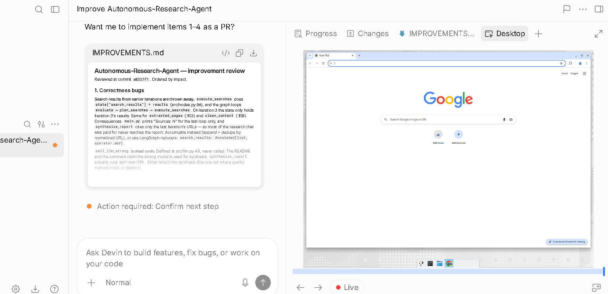

> Building in public. This README describes the finished product.

<p align="center">
  
</p>

<h1 align="center">EveryAIOS</h1>

<p align="center"><strong>Tell it what you want done. It figures out how. You stay in control.</strong></p>

<p align="center">
  An AI coworker on your machine — files, office, browser, code, mail, calendar, other agents.<br/>
  Local-first. Your keys. No account. Nothing runs through a founder server.
</p>

<p align="center">
  
  
  
  
</p>

<p align="center">
  
</p>

You open the app. It asks **What would you like to get done?** You drop a folder, a spreadsheet, a repo, an email thread, a browser tab. It plans, does the work, and asks before anything that actually changes the world. Close the laptop, swap the model, come back tomorrow — the work is still there.

That is the product: one workspace, one memory, one safety model, one audit trail. Models, browsers, office engines, and other agents are parts you swap. They are not a service you rent.

---

## Install

```bash
git clone <this-repo>
cd desktop_app
```

Needs Rust (stable), [Bun](https://bun.sh), Node 20+, and a C toolchain.

```bash
cd packages/coordinator && bun install && bun run build && cd ../..
cd ui && bun install
cd ../src-tauri && cargo tauri dev
```

Keys go in Settings (OpenAI, Anthropic, Gemini, OpenRouter, Groq, xAI, Azure, Bedrock, DeepSeek, …) or you point at Ollama / llamafile / MLX / llama.cpp on this machine.

---

## What you can actually do

Same loop every time: say the job → plan → guarded execution → receipt. Examples from the spec:

- Clean up Downloads (plan first, approve the exact move list, roll the whole pass back).
- Prep for an interview tomorrow (calendar + notes + cited brief).
- Research a company into a deck (search cascade → surgical slides → sources on the claims).
- Fix a repo (LSP + tests + smallest diff + evidence the tests passed).
- Refresh Q3 numbers and patch the exec summary (IronCalc, not “guess the formula”).
- Draft 14 email replies (queue: edit / approve / send — send is always its own card).
- Monday competitor digest (schedule; send only if you said so).
- Pick up last night’s work after the laptop died (ledger replay, any Chief).

---

## Models

Paste keys. Ring several keys per provider. Fail over on 429/401/5xx. OAuth for ChatGPT / Copilot if you already pay them. Local models with a hardware-fit picker and live Hugging Face GGUF search — no hardcoded model names.

Catalog comes from [models.dev](https://models.dev), refreshed and pinned. Router scores Fast / Quality / Private / Cheap plus live health, cost, and latency. Planner can be a frontier model while workers stay cheap. Cache accounting is real (prompt cache, semantic cache, result cache). Image gen is a provider endpoint like anything else.

You can expose the local engine as an OpenAI-compatible server for other apps. You can also run a headless node on a mini-PC you own so work continues when this laptop is closed.

---

## Agents and automations

The composer has three controls:

| | |
|---|---|
| **Agent** | Who. Built-in coworker, a custom bundle, or an ACP harness (Claude Code, Codex, OpenCode, Aider, Copilot CLI, …). Any of those can be the Chief. |
| **Work mode** | What. Auto · Plan · Build · Research. |
| **Autonomy** | How much without asking. Sandbox (read-only) · Ask · Auto · Maximum. Maximum still cannot send money, dump secrets, or smash the disk. |

Custom agents are versioned bundles: persona, engine, model, which MCP servers, which connectors, which skills. Templates for coder, researcher, writer, email triage, analyst, browser operator.

The loop streams, budgets subagents (depth 2, concurrency capped), repairs bad tool JSON, and freezes the DAG on a loop instead of spinning. Repeated work **crystallizes** into a deterministic skill so the next Monday digest does not spend tokens re-planning.

Schedules: cron, interval, git/CI events, heartbeats that wake the *same* conversation. Detached work is a task you can list, cancel, retry, audit.

Teach it once: record a path → compile → replay with zero model tokens; halt if the world drifted.

---

## Memory

It remembers. Not as a chat log you scroll.

Sensory / working / episodic / semantic / procedural memory, FTS5 by default (embeddings optional), a knowledge graph with provenance on every edge, a taste profile of how you like code written, pass-by-reference so a 400-page PDF is a handle not a dumped prompt. Spaced repetition for things you asked it to keep. Export as markdown (`[[wiki-links]]`), wipe a scope, optional E2E sync over LAN/Tailscale.

Work is a durable object. The model is not.

---

## Office and files

Word, Excel, PowerPoint, PDF — surgical edits on the bytes you already have. Unsupported Excel formulas are flagged `NOT_RECALCULATED`, never invented. IronCalc for recalc. Snapshot-before so you can roll back. Legacy `.doc` / `.xls` / `.ppt` convert on open.

Storage intelligence: walk a disk, treemap, 7-stage duplicate detection, large-file finder, “you are at 90% full” cleanup plans. Instant filename search (FTS5). Drop a folder; it proposes the tree; you approve the exact change set.

Google Docs/Sheets, when you want them, are connectors. They are not the source of truth.

---

## Browser and the rest of the desktop

CDP into Chrome, Edge, Brave, Arc, Chromium, or an Electron app (VS Code, Slack, Notion, …). Lightweight engines first (Lightpanda / Obscura), full browser when the page needs it.

Tabs, snapshots (a11y refs, not a pixel dump), act, screenshot, HAR, console/network diagnostics. Session vault holds cookies and storage encrypted; the agent never sees the raw secret. Attach to a paired profile so you do not re-login. Replay a session with an honest `has_gap` when a step could not be verified. Captchas go human-in-the-loop unless you brought a solver.

**Computer use:** see a real window, read the UI tree (OCR if the tree is empty), click/type, show the see-pane so you know what it clicked. Files, shell, and office engines beat GUI when an API exists. Browsers stay CDP, not screenshot-guessing.

---

## Connectors, mail, chat

MCP-first. You install servers. We also *serve* our tools (office, browser, search, memory, storage) to Claude Code / Codex / Cursor so they work inside this workspace.

Native OAuth/API-key adapters in the vault. Gmail or IMAP/SMTP. Calendar. Telegram / WhatsApp as in-app cards. Outlook / Graph as the same pattern. WSL path if that is where the repo lives.

One tool registry. One permission class. We are an ACP **client** (drive local harnesses) and an A2A **discovery** surface for remote agent cards. We are not an ACP server.

---

## Search and research

No key required: SearXNG instances, health-gated, circuit-breaker, then optional metasearch, then paid fallback if you configured one. BM25 rerank. Parallel fetch.

Deep research: breadth × depth, cited reports, confidence on claims. Extra channels: arXiv, GitHub, EDGAR, Reddit. Sandboxed pandas REPL for the spreadsheet you just pulled. Read-cleaner strips ads and consent walls before the model sees the page.

---

## The workspace

Activity rail. Chat. Right viewport (diff, document, browser, terminal, computer-use, receipts). Chat ⇄ Code is a layout of the same session, not a second app.

Streaming, branches, artifacts. Permission cards in a dedicated Guard window (not a fake overlay in chat). Cost dashboard. Progress timeline. Blueprint editor. Reader (PDF/EPUB/web/md). KaTeX and code. Widgets in chat. Generative UI in a sandboxed iframe. Local mini-dashboards served on `127.0.0.1`. Tray for watchers.

Voice in and TTS out. Clipboard as a tool. Voice memo → structured report. Corpus research with cited answers and an audio digest. Doctor CLI when something is red.

SOUL.md is yours. Core safety rules are not.

---

## Code, skills, forge

RepoMap (tree-sitter + PageRank), SCIP, LSP (hover, def, rename, diagnostics). Edit formats picked per model; a successful apply is one git commit. Architect mode: reasoner plans, editor writes. `// ai!` markers in files. Subagents get their own worktrees.

Skills live in `~/.everyaios/skills/` (SKILL.md). Forge: write → sandbox → test → persist. Plugins are versioned bundles with allow-lists, never a core fork. `/learn` turns a URL, PDF, repo, or thread into a tested skill.

The Code rail is a real workbench (explorer, SCM, problems, editor, terminal). It is a surface on this workspace, not a VS Code clone you are supposed to live in.

---

## Safety

Sidecar proposes. Rust disposes.

Every mutation (file, office, shell, browser, send, connector write) needs a **ticket**. Guard-1 is the fast deny. Guard-2 is the card you see — nonce-bound, in its own webview, so a compromised chat window cannot fake yes. Path floor. Egress policy. Injection defense. Keys only in the SQLCipher vault; they are zeroized in memory; child processes do not inherit them.

Trust ladder 0–100. Autonomy level is a preset on that engine, not a YOLO switch. External agents in self-contained mode are honest about what we cannot see.

Append-only audit. Replay. Undo. Eval suite at plan completion: if we cannot verify a claim, we say unverifiable instead of dressing it up.

---

## How it is put together

Three processes: Tauri UI, Rust core, Bun coordinator. Children for browsers, ACP agents, MCP servers, sandboxes.

```
UI (React / Tauri 2)
        │
Rust core — guard, vault, office, CDP, memory, audit, MCP, ACP, catalog
        │
Bun coordinator — the agent loop (proposes; cannot mutate without a ticket)
```

One ticket → one executor → one event log → one timeline. Model calls are data-plane (budget and egress), not a confirm-card per token.

---

## Docs

| | |
|---|---|
| [`DESKTOP-APP-SPEC.md`](DESKTOP-APP-SPEC.md) | Product contract |
| [`ARCH/`](ARCH/) | Architecture |
| [`ui/DESIGN-SYSTEM.md`](ui/DESIGN-SYSTEM.md) | UI |
| [`SPEC-CHANGELOG.md`](SPEC-CHANGELOG.md) | Why the spec moved |
