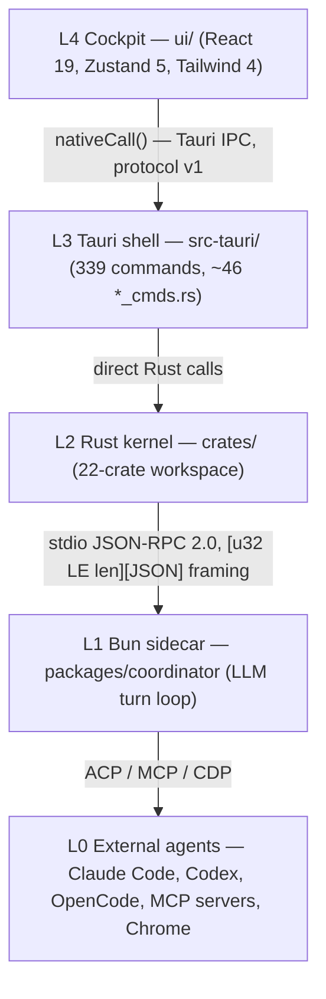

# Architecture

## Layer diagram

Framing and the process contract live in `crates/everyaios-ipc` (module doc:
"the EveryAIOS process contract"); `PROTOCOL_VERSION: u32 = 1` is declared at
`crates/everyaios-ipc/src/lib.rs:40`.

## The one invariant

**The sidecar proposes; the Rust core disposes.** Every mutating effect requires
an authorization ticket minted in Rust (`crates/everyaios-guard/src/ticket.rs`,
`AuthorizationTicket`); provider API keys never leave the vault
(`crates/everyaios-vault`, SQLCipher key-ring per its module doc). This is
enforced structurally — the sidecar has no IPC surface for effects and no
credential storage — not by convention. See [invariants.md](invariants.md).

## Subsystems and boundaries

| Subsystem | Path | Responsibility (from its own module docs) |
|---|---|---|
| Cockpit UI | `ui/` | Single-window cockpit: TitleBar, LeftSidebar, CenterColumn, ActivityRail/RightViewport, StatusBar |
| Tauri shell | `src-tauri/` | Thin command layer; registers 339 commands, delegates to crates |
| Orchestrator | `crates/everyaios-core` | "the EveryAIOS orchestrator binary" — supervisor, sidecar link, chat |
| Guard | `crates/everyaios-guard` | "Guard-1: deterministic pre-exec scanning of every…" effect |
| Audit | `crates/everyaios-audit` | "append-only NDJSON event log (ARCH/06 §6.5, J5)" |
| Vault | `crates/everyaios-vault` | "SQLCipher-encrypted key-ring store (ARCH/03, J8)" |
| IPC | `crates/everyaios-ipc` | Framing, channels, budget; `PROTOCOL_VERSION = 1` |
| Blueprint | `crates/everyaios-blueprint` | "orchestration core (P6)" |
| Memory | `crates/everyaios-memory` | "memory fusion + token economy (P5, C1–C10)" |
| Office | `crates/everyaios-office` | "surgical OOXML editing (P4, D1–D8)" |
| Browser | `crates/everyaios-browser` | "accessibility-tree snapshot engine + action layer" |
| CDP | `crates/everyaios-cdp` | "Chrome DevTools Protocol client (ARCH/08, E1)" |
| Computer use | `crates/everyaios-desktop` | "E9 desktop computer-use" — **package name `everyaios-computeruse`** (renamed to avoid collision with the src-tauri shell crate, per `crates/Cargo.toml` comment) |
| Sidecar | `packages/coordinator` | LLM turn loop over stdio JSON-RPC |
| Core-* libs | `packages/core-*` (10) | Domain, engine, AI runtime, providers, memory, tools, search, connectors, security, agents |

## Observed boundary discipline (graph evidence)

The codegraph file-level import graph (commit `f99a5d9`, 2,203 edges) shows
**zero import edges crossing the `ui/`, `packages/`, and `crates/` boundaries**:
every edge is intra-layer. The layers communicate only over the IPC seams
named above. This matches the architecture claim in `AGENTS.md` §10 and is the
graph-level signature of "IPC-decoupled, not import-coupled".

## Architectural boundaries to respect when changing code

1. **No new cross-layer imports.** If L4 needs L2 data, it goes through a
   `#[tauri::command]`; if L1 needs an effect, it proposes and L2 disposes.
2. **Keys touch only the vault.** Provider streams are brokered; the sidecar
   receives tokens/frames, never key material (see [flows.md](flows.md) F3).
3. **Every mutation is ticketed and audited.** New effect paths must mint a
   ticket (`everyaios-guard`) and append an `AuditEvent` (`everyaios-audit`).
4. **Outbound network goes through Guard-2 netfloor; filesystem writes through
   pathfloor** (`AGENTS.md` §15, `crates/everyaios-guard`).

Evidence tier: layer/edge claims are file-level graph facts (confidence B);
component responsibilities are quoted from each crate's own `//!` module doc.
