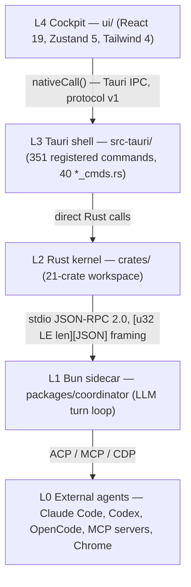

# Architecture

> **Post-thaw authority: [`../../ARCH/CORE.md`](../../ARCH/CORE.md)** (27 invariants I1–I27) **+ the subsystem contracts** (`WORK` · `SESSION` · `AGENT` · `EXTERNAL-AGENTS` · `CONTEXT` · `CAPABILITIES` · `MEMORY` · `SECURITY` · `RECOVERY` · `ROUTING` · `UI` · `DESKTOP`). Refreshed post-thaw (TODO **P69.A35**). This artifact remains what it was built to be: accurate about the **code and tests** it indexes — that is its value. Where quoted code wording predates the thaw (legacy `Chief` identifiers, "token economy" module docs), quotations are verbatim and marked as such.

---

## Layer diagram

Framing and the process contract live in `crates/everyaios-ipc` (module doc:
"the EveryAIOS process contract"); `PROTOCOL_VERSION: u32 = 1` is declared at
`crates/everyaios-ipc/src/lib.rs:40`.

## The one invariant

**Work proposes, the kernel disposes (`ARCH/CORE.md` I1).** The sidecar has no effect-execution
surface. What the code enforces is **authorization provenance** (`ARCH/CORE.md` §5.1), not
"every mutation is ticketed" (never the invariant): agent/automation mutations consume a single-use,
args-bound `AuthorizationTicket` (`crates/everyaios-guard/src/ticket.rs`, struct at `:102`, mint at
`:59`, consume at `:162`); human UI mutations carry trusted user-gesture provenance stamped by Rust
call sites only. Provider API keys never leave the vault (`crates/everyaios-vault`, SQLCipher
key-ring per its module doc). The former TS-side custody (`packages/core-providers/src/vault.ts`) was the
confirmed V4 defect — repaired in code 2026-09-21 (`P69.C4`, handle-only façade, custody Rust-side;
implemented, not verified), with CRED-1/2/3 in `scripts/check-arch-invariants.mjs` preventing its return.
See [invariants.md](invariants.md).

## Subsystems and boundaries

| Subsystem | Path | Responsibility (from its own module docs) |
|---|---|---|
| Cockpit UI | `ui/` | Single-window cockpit: TitleBar, LeftSidebar, CenterColumn, ActivityRail/RightViewport, StatusBar |
| Tauri shell | `src-tauri/` | Thin command layer; registers **351** commands (`scripts/ipc-parity.mjs`, the parity authority), delegates to crates. The map generator counts **341** for the same list — the two tools count different things, and the parity tool is the one that also tracks UI call sites, so its number is the one to quote. |
| Orchestrator | `crates/everyaios-core` | "the EveryAIOS orchestrator binary" — supervisor, sidecar link, chat |
| Guard | `crates/everyaios-guard` | "Guard-1: deterministic pre-exec scanning of every…" effect |
| Audit | `crates/everyaios-audit` | "append-only NDJSON event log (ARCH/06 §6.5, J5)" |
| Vault | `crates/everyaios-vault` | "SQLCipher-encrypted key-ring store (ARCH/03, J8)" |
| IPC | `crates/everyaios-ipc` | Framing, channels, budget; `PROTOCOL_VERSION = 1` |
| Blueprint | `crates/everyaios-blueprint` | "orchestration core (P6)" |
| Memory | `crates/everyaios-memory` | "memory fusion + token economy (P5, C1–C10)" — *verbatim module doc; pre-thaw wording. The area is now **context engineering** (`ARCH/CONTEXT.md`) with four memory classes — Context / Episodic (derived from the event log) / Knowledge / Procedural (`ARCH/MEMORY.md`). The rename is a code-side `P69.D` item.* |
| Office | `crates/everyaios-office` | "surgical OOXML editing (P4, D1–D8)" |
| Browser | `crates/everyaios-browser` | "accessibility-tree snapshot engine + action layer" |
| CDP | `crates/everyaios-cdp` | "Chrome DevTools Protocol client (ARCH/08, E1)" |
| Computer use | `crates/everyaios-desktop` | "E9 desktop computer-use" — **package name `everyaios-computeruse`** (renamed to avoid collision with the src-tauri shell crate, per `crates/Cargo.toml` comment) |
| Sidecar | `packages/coordinator` | LLM turn loop over stdio JSON-RPC |
| Core-* libs | `packages/core-*` (10) | Domain, engine, AI runtime, providers, memory, tools, search, connectors, security, agents — consolidation targets in `TODO.md` P69.D (one registry / one vault / one context manager each) |

## Post-thaw mapping (authority: `ARCH/CORE.md` §§3–10, 13–14)

- **Durable unit:** Work → Run → Step → Effect → Observation → Verification → Receipt → Event (`ARCH/WORK.md`).
  Memory, UI, recovery and analytics are projections of the Event log — never parallel truths (I3).
- **Chat vs Session:** the user-facing object is a **Chat**; the technical unit behind it is a **Session**
  (`ARCH/SESSION.md`). A Chat may be standalone or attached to a Project.
- **Agent model:** the loop owner is the selected agent's **AgentBinding** (with `provider_session_id`
  deliberately distinct from the EveryAIOS session id); turn coordination — load state, build context,
  project tools, emit events, drive recovery — is the coordinator and is not reasoning (`ARCH/AGENT.md`,
  CORE §7). "Chief" survives only as legacy identifiers (e.g. `crates/everyaios-acp/src/chief.rs`) —
  never as a concept. Behavioural policy is one agent-agnostic `AgentBehaviorProfile` compiled per
  adapter; a clause an adapter cannot compile is reported `unenforceable`, never silently dropped (I27,
  `ARCH/AGENT.md` §5.2).
- **Context:** history ≠ context. Model-facing state is a derived `ContextSurface` reduced in the
  normative 7-step optimization order (cheap deterministic reducers with re-measure before any model
  summarization); capacity comes from the resolved route, never a global registry (`ARCH/CONTEXT.md`,
  `ARCH/ROUTING.md`; I16–I22).
- **Memory:** four classes — Context (this turn only) / Episodic (derived from Work/Run/Event history,
  not a parallel timeline) / Knowledge / Procedural — with progressive disclosure bounded by a budget
  maximum (`ARCH/MEMORY.md`). The former five-tier algorithms (ACT-R, FSRS, temporal KG) are strategies,
  never kernel (CORE §12).
- **Effects:** the Work Gateway is the only path to an effect; external agents see task-shaped façades
  via the `AgentBridge`, never the internal tool catalogue (`ARCH/EXTERNAL-AGENTS.md`). Governance is
  stated per mode — governed-mediated / self-contained / not-governed — and audit coverage must be
  stated per mode (I14, I15).
- **Capability identity:** `capabilities.yaml` == `ARCH/09` == spec §0 (**166** ids, CI-enforced).

## Observed boundary discipline (graph evidence)

The codegraph file-level import graph (commit `c574ea4`, 2,203 edges) shows
**zero import edges crossing between the `ui/`, `packages/`, and `crates/`
trees**. The only edges that leave their own tree are the 63 `src-tauri/` →
`crates/` edges — the designed L3 shell → L2 kernel seam, where the Tauri layer
delegates by direct Rust call. Nothing imports from `ui/` into `packages/` or
`crates/`, or the reverse; those two seams are IPC-only. This matches the
architecture claim in `AGENTS.md` §10 and is the graph-level signature of
"IPC-decoupled, not import-coupled".

## Architectural boundaries to respect when changing code

1. **No new cross-layer imports.** If L4 needs L2 data, it goes through a
   `#[tauri::command]`; if L1 needs an effect, it proposes and L2 disposes.
2. **Keys touch only the vault.** Provider streams are brokered; the sidecar
   receives tokens/frames, never key material (see [flows.md](flows.md) F3).
3. **Every effect carries authorization provenance and is audited.** Agent and
   automation mutations consume an `AuthorizationTicket` (`everyaios-guard`);
   human UI mutations carry trusted user-gesture provenance. Both append an
   `AuditEvent` (`everyaios-audit`). **“Every mutation is ticketed” is not the
   invariant** — it was never accurate; see `ARCH/CORE.md` §5.1.
4. **Outbound network goes through Guard-2 netfloor; filesystem writes through
   pathfloor** (`AGENTS.md` §15, `crates/everyaios-guard`).

Evidence tier: layer/edge claims are file-level graph facts (confidence B);
component responsibilities are quoted from each crate's own `//!` module doc.
